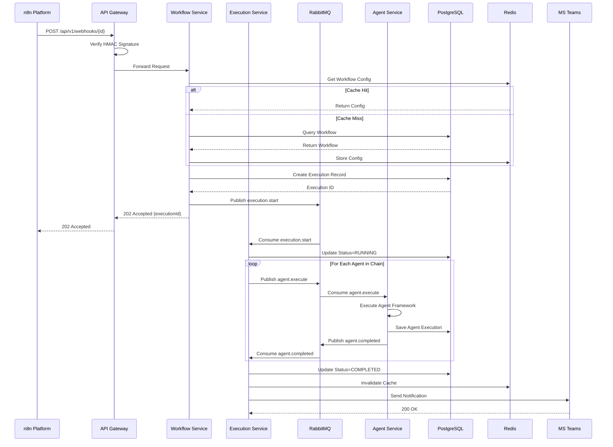

# Technical Architecture Design
# IPA Platform - Intelligent Process Automation

**版本**: 3.0
**日期**: 2025-12-18
**狀態**: Phase 6 完成 - 架構最終化與 UAT 準備
**負責人**: Architecture Team

> **Phase 6 更新 (Sprint 31-33)**: 完成架構最終化、驗證腳本準備、UAT 場景設計。
> - **Sprint 31**: GroupChat + Memory 適配器完成
> - **Sprint 32**: 完整端到端測試
> - **Sprint 33**: 文檔整理與 UAT 準備
>
> **累計完成**: 1190 Story Points, 33 Sprints, 3198 Tests, 297 API Routes
>
> **適配器架構位置**: `backend/src/integrations/agent_framework/`
> - `builders/`: 官方 API 適配器 (GroupChat, Handoff, Concurrent, Planning, Magentic)
> - `core/`: 核心功能適配器 (Workflow, StateMachine, Approval, Execution)
> - `memory/`: 記憶體存儲適配器
> - `multiturn/`: 多輪對話適配器

---

## 📑 文檔導航

- **[Technical Architecture](./technical-architecture.md)** ← 您在這裡
- [PRD 文檔](../01-planning/prd/prd-main.md)
- [UI/UX 設計](../01-planning/ui-ux/ui-ux-design-spec.md)
- [UAT 驗證計畫](../../claudedocs/uat/UAT-SCENARIO-VALIDATION-PLAN.md) ⭐ **NEW**
- [系統架構圖](#system-architecture)
- [功能架構 (四層模型)](#feature-architecture)
- [核心模塊設計](#core-modules)
- [數據架構](#data-architecture)

---

## 📋 目錄

1. [架構概覽](#architecture-overview)
2. [設計原則](#design-principles)
3. [技術棧選擇](#technology-stack)
4. [系統架構](#system-architecture)
5. [功能架構 (四層模型)](#feature-architecture) ⭐ **NEW**
6. [核心模塊設計](#core-modules)
7. [數據架構設計](#data-architecture)
8. [集成架構](#integration-architecture)
9. [安全架構](#security-architecture)
10. [監控與日誌](#monitoring-logging)
11. [部署架構](#deployment-architecture)
12. [性能優化策略](#performance-optimization)
13. [災難恢復](#disaster-recovery)

---

## <a id="architecture-overview"></a>1. 架構概覽

### 1.1 系統定位

IPA Platform 是一個基於 **事件驅動** 和 **微服務架構** 的智能流程自動化平台,專注於:

- **靈活編排**: 通過 n8n 觸發和 Agent Framework 執行複雜業務流程
- **智能決策**: 利用 AI Agent 處理非結構化數據和複雜邏輯
- **高可靠性**: 內置重試、DLQ、審計追蹤等企業級特性
- **可觀測性**: 全鏈路監控、日誌追蹤、性能分析

### 1.2 部署策略

**MVP 階段（當前）**:
- **部署平台**: Azure App Service（簡化運維，快速上線）
- **服務架構**: 單體後端應用（Workflow/Execution/Agent 合併）
- **消息隊列**: Azure Service Bus（托管服務）
- **監控方案**: Azure Monitor + Application Insights + Prometheus（混合模式）
- **成本**: 約 $113/月

**生產擴展（MVP 後）**:
- **部署平台**: Azure Kubernetes Service (AKS)（彈性擴展，高可用）
- **服務架構**: 微服務拆分（獨立擴展，故障隔離）
- **消息隊列**: 可選 RabbitMQ（更靈活的路由）
- **監控方案**: 完整 Prometheus + Grafana + ELK Stack

> **設計原則**: MVP 階段優先速度和成本，後期根據業務需求逐步演進到完整微服務架構。

### 1.3 架構視圖

#### MVP 階段架構（Azure App Service）

```
┌─────────────────────────────────────────────────────────────────┐
│                         Client Layer                            │
│  ┌───────────────────────────────────────────────────────────┐ │
│  │  Web UI (React + TypeScript)                              │ │
│  │  Hosted on: Azure Static Web Apps or App Service         │ │
│  └───────────────────────────────────────────────────────────┘ │
└──────────────────────────┬──────────────────────────────────────┘
                           │ HTTPS
                           ▼
┌─────────────────────────────────────────────────────────────────┐
│              Azure App Service (Standard S1 Plan)               │
│  ┌──────────────────────────────────────────────────────────┐  │
│  │  Backend Application (Python FastAPI)                    │  │
│  │  ┌────────────────┐  ┌────────────────┐  ┌────────────┐ │  │
│  │  │ Workflow       │  │ Execution      │  │ Agent      │ │  │
│  │  │ Module         │  │ Module         │  │ Module     │ │  │
│  │  │ - CRUD APIs    │  │ - Scheduler    │  │ - SK       │ │  │
│  │  │ - Validation   │  │ - State Mgmt   │  │ - Tools    │ │  │
│  │  └────────────────┘  └────────────────┘  └────────────┘ │  │
│  │                                                          │  │
│  │  Built-in Features:                                     │  │
│  │  ✅ OAuth 2.0 Authentication                            │  │
│  │  ✅ Auto-scaling (CPU/Memory based)                     │  │
│  │  ✅ Health checks & Auto-restart                        │  │
│  │  ✅ Application Insights integration                    │  │
│  └──────────────────────────────────────────────────────────┘  │
└──────────────────────────┬──────────────────────────────────────┘
                           │
                           ▼
┌─────────────────────────────────────────────────────────────────┐
│                     Azure Managed Services                      │
│  ┌─────────────────┐  ┌─────────────────┐  ┌───────────────┐  │
│  │ PostgreSQL 16   │  │ Redis Cache     │  │ Service Bus   │  │
│  │ Flexible Server │  │ (Basic C0)      │  │ (Basic)       │  │
│  │ - Burstable B1  │  │ - 250MB         │  │ - Queues      │  │
│  │ - 2 vCore/4GB   │  │ - Session store │  │ - Topics      │  │
│  └─────────────────┘  └─────────────────┘  └───────────────┘  │
│                                                                  │
│  ┌─────────────────┐  ┌─────────────────┐  ┌───────────────┐  │
│  │ Blob Storage    │  │ Key Vault       │  │ Monitor +     │  │
│  │ - Artifacts     │  │ - Secrets       │  │ App Insights  │  │
│  │ - Logs archive  │  │ - Certificates  │  │ - Telemetry   │  │
│  └─────────────────┘  └─────────────────┘  └───────────────┘  │
└──────────────────────────┬──────────────────────────────────────┘
                           │
                           ▼
┌─────────────────────────────────────────────────────────────────┐
│                   External Integrations                         │
│  ┌─────────────┐  ┌─────────────┐  ┌─────────────┐            │
│  │  n8n        │  │  MS Teams   │  │  Azure      │            │
│  │  Webhooks   │  │  Adaptive   │  │  OpenAI     │            │
│  │             │  │  Cards      │  │  GPT-4o     │            │
│  └─────────────┘  └─────────────┘  └─────────────┘            │
└─────────────────────────────────────────────────────────────────┘

成本估算 (MVP 階段):
- App Service Standard S1: $75/月
- PostgreSQL Burstable B1ms: $12/月
- Redis Basic C0: $16/月
- Service Bus Basic: $10/月
- App Insights: ~$10-30/月 (基於使用量)
總計: ~$123-143/月
```

#### 生產擴展架構（Kubernetes - 後期選項）

```
┌─────────────────────────────────────────────────────────────────┐
│                    Azure Kubernetes Service (AKS)               │
│  ┌──────────────────────────────────────────────────────────┐  │
│  │  Ingress Controller (Nginx/Kong)                         │  │
│  │  - SSL Termination                                       │  │
│  │  - Load Balancing                                        │  │
│  └────────────────────────┬─────────────────────────────────┘  │
│                           │                                     │
│  ┌────────────────────────┼─────────────────────────────────┐  │
│  │  Microservices (獨立擴展)                                │  │
│  │                        │                                  │  │
│  │  ┌─────────────┐  ┌────┴──────┐  ┌─────────────┐       │  │
│  │  │ Workflow    │  │ Execution │  │ Agent       │       │  │
│  │  │ Service     │  │ Service   │  │ Service     │       │  │
│  │  │ (3 Pods)    │  │ (5 Pods)  │  │ (3 Pods)    │       │  │
│  │  └─────────────┘  └───────────┘  └─────────────┘       │  │
│  │                                                          │  │
│  │  ┌─────────────────────────────────────────────────┐   │  │
│  │  │ RabbitMQ Cluster (3 Nodes)                      │   │  │
│  │  │ - High Availability                             │   │  │
│  │  │ - Message Persistence                           │   │  │
│  │  └─────────────────────────────────────────────────┘   │  │
│  └──────────────────────────────────────────────────────────┘  │
│                                                                  │
│  監控 Stack:                                                    │
│  ┌─────────────┐  ┌─────────────┐  ┌─────────────┐           │
│  │ Prometheus  │  │ Grafana     │  │ ELK Stack   │           │
│  │ (Metrics)   │  │ (Dashboard) │  │ (Logs)      │           │
│  └─────────────┘  └─────────────┘  └─────────────┘           │
└─────────────────────────────────────────────────────────────────┘

優勢:
✅ 獨立擴展每個微服務
✅ 藍綠部署/金絲雀發布
✅ 完整的容器編排能力
✅ 多環境隔離 (dev/staging/prod)

時機: 當 MVP 驗證成功，需要支持更大規模流量時遷移
```

### 1.4 關鍵特性映射

#### MVP 階段實現

| 特性需求 | 架構實現 |
|---------|------|
| **n8n 觸發** | App Service 接收 n8n webhook → FastAPI 路由到 Execution Module |
| **Agent 執行** | Agent Framework Runtime + Tool Integration |
| **重試機制** | Execution Module 內置指數退避重試 + Service Bus DLQ |
| **審計追蹤** | PostgreSQL append-only audit log + Application Insights |
| **實時監控** | Azure Monitor (基礎) + Prometheus (自定義) + Application Insights |
| **緩存優化** | Redis multi-layer caching (workflow/execution/result) |
| **高可用性** | App Service Auto-scaling + Health checks |

#### 生產擴展增強（K8s）

| 特性需求 | 增強實現 |
|---------|------|
| **獨立擴展** | 每個微服務獨立 HPA (Horizontal Pod Autoscaler) |
| **故障隔離** | 服務間故障不會級聯（Circuit Breaker） |
| **藍綠部署** | K8s Deployment 策略（零停機部署） |
| **多區域** | 跨可用區部署（高可用性） |

---

## <a id="design-principles"></a>2. 設計原則

### 2.1 架構原則

#### SOLID 原則

**Single Responsibility (單一職責)**
- 每個服務專注於單一業務領域
- Workflow Service: 工作流管理
- Execution Service: 執行調度
- Agent Service: Agent 運行時

**Open/Closed (開放封閉)**
- 通過插件機制擴展 Agent 能力
- 自定義 Tool Integration
- 可插拔的存儲後端

**Liskov Substitution (里氏替換)**
- 統一的 Agent 接口(IAgent)
- 可替換的 Tool 實現(ITool)

**Interface Segregation (接口隔離)**
- 細粒度的服務接口
- GraphQL Schema 分層設計

**Dependency Inversion (依賴倒置)**
- 依賴抽象接口而非具體實現
- Dependency Injection 容器

#### 12-Factor App

1. **Codebase**: Git monorepo with clear module boundaries
2. **Dependencies**: Package.json / .csproj explicit dependencies
3. **Config**: Environment variables for all configurations
4. **Backing Services**: Treat DB/Cache/Queue as attached resources
5. **Build, Release, Run**: CI/CD pipeline separation
6. **Processes**: Stateless services (state in Redis/DB)
7. **Port Binding**: Services export HTTP/gRPC endpoints
8. **Concurrency**: Horizontal scaling via Kubernetes
9. **Disposability**: Fast startup, graceful shutdown
10. **Dev/Prod Parity**: Docker ensures environment consistency
11. **Logs**: Structured logging to stdout (collected by FluentBit)
12. **Admin Processes**: Separate CLI tools for admin tasks

### 2.2 質量屬性

| 質量屬性 | 目標值 | 實現策略 |
|---------|-------|---------|
| **可用性** | 99.9% (月停機 < 43 分鐘) | 多副本部署 + 健康檢查 + 自動故障轉移 |
| **性能** | API P95 < 500ms | Redis 緩存 + 數據庫索引 + 異步處理 |
| **可擴展性** | 支持 1000+ 並發執行 | Kubernetes HPA + Message Queue |
| **可維護性** | 新功能開發 < 2 週 | 模塊化設計 + 清晰文檔 + 自動化測試 |
| **安全性** | OWASP Top 10 防護 | OAuth 2.0 + HTTPS + 輸入驗證 + 審計日誌 |
| **可觀測性** | 全鏈路追蹤覆蓋率 100% | OpenTelemetry + Distributed Tracing |

---

## <a id="technology-stack"></a>3. 技術棧選擇

### 3.1 後端技術

#### 編程語言與框架

**MVP 階段: Python + FastAPI（單體應用）**
- **用途**: 統一後端服務（Workflow/Execution/Agent 模塊）
- **選擇理由**:
  - Agent Framework Python SDK 支持完整
  - FastAPI 高性能異步框架（與 Node.js 性能相當）
  - Python 生態豐富（數據處理、AI/ML）
  - 開發速度快，適合 MVP 快速迭代
  - 類型提示（Type Hints）提供類型安全
- **框架**: 
  - FastAPI 0.100+（Web 框架）
  - Agent Framework SDK（Agent 框架）
  - SQLAlchemy 2.0+（ORM）
  - Pydantic 2.0+（數據驗證）
  - Celery（異步任務，可選）
- **版本**: Python 3.11+

**生產擴展: 可選技術棧**
- **選項 A**: 保持 Python（適合團隊 Python 背景強）
- **選項 B**: 拆分關鍵服務為 C# .NET（適合需要極致性能場景）
  - Execution Service 可用 .NET（更好的並發性能）
  - Agent Service 保持 Python（Agent Framework 兩者都支持）

#### API 設計

**REST API**
- **標準**: OpenAPI 3.0 規範
- **認證**: OAuth 2.0 + JWT
- **版本控制**: URL path versioning (`/api/v1/`)

**GraphQL API**
- **框架**: Apollo Server (Node.js), HotChocolate (.NET)
- **用途**: 複雜查詢、前端靈活數據獲取
- **訂閱**: GraphQL Subscriptions (WebSocket)

**gRPC**
- **用途**: 內部服務間通信(高性能)
- **Protocol**: Protocol Buffers 3

### 3.2 數據存儲

#### 主數據庫: PostgreSQL 15

**選擇理由**:
- ACID 事務保證數據一致性
- JSON/JSONB 支持半結構化數據
- 強大的索引能力(B-Tree, GIN, BRIN)
- 成熟的複製和備份方案

**Schema 設計**:
```sql
-- Workflows 表
CREATE TABLE workflows (
  id UUID PRIMARY KEY DEFAULT gen_random_uuid(),
  name VARCHAR(255) NOT NULL,
  description TEXT,
  category VARCHAR(100),
  trigger_config JSONB NOT NULL,
  agent_chain JSONB NOT NULL,
  retry_config JSONB,
  notification_config JSONB,
  status VARCHAR(50) DEFAULT 'active',
  created_at TIMESTAMPTZ DEFAULT NOW(),
  updated_at TIMESTAMPTZ DEFAULT NOW(),
  created_by UUID REFERENCES users(id),
  version INTEGER DEFAULT 1
);

-- Executions 表
CREATE TABLE executions (
  id UUID PRIMARY KEY DEFAULT gen_random_uuid(),
  workflow_id UUID REFERENCES workflows(id),
  status VARCHAR(50) NOT NULL,
  triggered_by VARCHAR(100),
  triggered_at TIMESTAMPTZ DEFAULT NOW(),
  started_at TIMESTAMPTZ,
  completed_at TIMESTAMPTZ,
  duration_ms INTEGER,
  input_data JSONB,
  output_data JSONB,
  error_details JSONB,
  retry_count INTEGER DEFAULT 0,
  parent_execution_id UUID REFERENCES executions(id)
);

-- Agent Executions 表
CREATE TABLE agent_executions (
  id UUID PRIMARY KEY DEFAULT gen_random_uuid(),
  execution_id UUID REFERENCES executions(id),
  agent_id UUID REFERENCES agents(id),
  sequence_order INTEGER NOT NULL,
  status VARCHAR(50) NOT NULL,
  started_at TIMESTAMPTZ,
  completed_at TIMESTAMPTZ,
  duration_ms INTEGER,
  input_data JSONB,
  output_data JSONB,
  error_details JSONB,
  tokens_used INTEGER,
  cost_usd DECIMAL(10,6)
);

-- Audit Log 表 (append-only)
CREATE TABLE audit_logs (
  id BIGSERIAL PRIMARY KEY,
  timestamp TIMESTAMPTZ DEFAULT NOW(),
  user_id UUID REFERENCES users(id),
  action VARCHAR(100) NOT NULL,
  resource_type VARCHAR(100) NOT NULL,
  resource_id UUID,
  details JSONB,
  ip_address INET,
  user_agent TEXT,
  signature VARCHAR(64) NOT NULL -- SHA-256
);

-- 索引
CREATE INDEX idx_workflows_status ON workflows(status);
CREATE INDEX idx_workflows_created_at ON workflows(created_at DESC);
CREATE INDEX idx_executions_workflow_id ON executions(workflow_id);
CREATE INDEX idx_executions_status ON executions(status);
CREATE INDEX idx_executions_triggered_at ON executions(triggered_at DESC);
CREATE INDEX idx_agent_executions_execution_id ON agent_executions(execution_id);
CREATE INDEX idx_audit_logs_timestamp ON audit_logs(timestamp DESC);
CREATE INDEX idx_audit_logs_user_id ON audit_logs(user_id);
CREATE INDEX idx_audit_logs_resource ON audit_logs(resource_type, resource_id);
```

#### 緩存: Redis 7

**緩存層級**:

```
L1: Workflow Configuration Cache
  - Key: workflow:{id}
  - TTL: 1 hour
  - Invalidation: On workflow update

L2: Execution Status Cache
  - Key: execution:{id}:status
  - TTL: 5 minutes
  - Invalidation: On status change

L3: Agent Result Cache
  - Key: agent:{agent_id}:result:{input_hash}
  - TTL: 24 hours
  - Use Case: 相同輸入避免重複執行

L4: API Response Cache
  - Key: api:v1:{endpoint}:{query_hash}
  - TTL: 1 minute
  - Use Case: 高頻查詢接口
```

**數據結構使用**:

- **String**: 簡單 key-value 緩存
- **Hash**: Workflow/Execution 對象緩存
- **List**: 執行隊列
- **Sorted Set**: 優先級隊列,延遲任務
- **Pub/Sub**: 實時通知推送
- **Stream**: 事件溯源日誌

#### 對象存儲: S3 / Azure Blob

**存儲內容**:
- 大型執行結果(> 1MB)
- 文件類型的 Agent 輸出
- 審計日誌歸檔(> 90 天)
- 備份文件

**命名規範**:
```
executions/{year}/{month}/{day}/{execution_id}/output.json
audit-logs/archive/{year}/{month}/logs.tar.gz
backups/{timestamp}/postgresql-dump.sql.gz
```

### 3.3 消息隊列

#### RabbitMQ 3.12

**選擇理由**:
- 支持多種消息模式(Direct, Topic, Fanout)
- 消息持久化和確認機制
- 死信隊列(DLQ)原生支持
- 管理界面友好

**隊列設計**:

```
Exchange: ipa.executions.topic (Type: Topic)
├── Queue: executions.pending
│   ├── Binding: execution.start
│   └── Consumer: Execution Service
├── Queue: executions.retry
│   ├── Binding: execution.retry
│   ├── TTL: Based on backoff strategy
│   └── Consumer: Execution Service
├── Queue: executions.dlq
│   ├── Binding: execution.dlq
│   └── Consumer: DLQ Handler Service
└── Queue: notifications.teams
    ├── Binding: notification.*
    └── Consumer: Notification Service

Exchange: ipa.agents.direct (Type: Direct)
├── Queue: agents.react
├── Queue: agents.plan-execute
└── Queue: agents.custom
```

**消息格式**:
```json
{
  "messageId": "uuid",
  "timestamp": "2025-11-19T12:34:56Z",
  "type": "execution.start",
  "payload": {
    "executionId": "uuid",
    "workflowId": "uuid",
    "inputData": {}
  },
  "metadata": {
    "correlationId": "trace-id",
    "retryCount": 0,
    "priority": 1
  }
}
```

### 3.4 前端技術

#### React 18 + TypeScript

**狀態管理**: Zustand (輕量級) or Redux Toolkit
**路由**: React Router v6
**UI 組件**: 
- Ant Design 5 (企業級 UI 庫)
- TailwindCSS (utility-first CSS)
**圖表**: ECharts / Recharts
**表單**: React Hook Form + Zod validation
**HTTP 客戶端**: Axios / TanStack Query (React Query)
**WebSocket**: Socket.io-client
**構建工具**: Vite 5

#### 代碼組織

```
src/
├── components/           # 可復用組件
│   ├── Button/
│   ├── Input/
│   ├── Card/
│   └── ...
├── features/             # 功能模塊
│   ├── workflows/
│   │   ├── components/
│   │   ├── hooks/
│   │   ├── api/
│   │   └── types/
│   ├── executions/
│   └── agents/
├── layouts/              # 頁面佈局
├── pages/                # 路由頁面
├── services/             # API 服務
├── stores/               # 狀態管理
├── utils/                # 工具函數
└── types/                # TypeScript 類型
```

### 3.5 DevOps 技術

#### 容器化: Docker

**MVP 階段 Docker Images**:
- `ipa-backend`: Python 3.11 + FastAPI + Agent Framework
- `ipa-frontend`: Nginx + React static files
- `prometheus`: Prometheus Server (可選，用於自定義指標)

**Dockerfile 示例**:
```dockerfile
# Backend
FROM python:3.11-slim
WORKDIR /app
COPY requirements.txt .
RUN pip install --no-cache-dir -r requirements.txt
COPY . .
CMD ["uvicorn", "main:app", "--host", "0.0.0.0", "--port", "8000"]
```

**生產擴展（Kubernetes）**:
- Deployment: 服務部署配置
- Service: 內部服務發現
- Ingress: 外部流量路由
- ConfigMap: 配置管理
- Secret: 敏感信息
- HPA: 自動擴展
- PVC: 持久化存儲

#### CI/CD: GitHub Actions

**MVP 階段 Pipeline**:
```yaml
1. Build:
   - Docker image build
   - Push to Azure Container Registry

2. Test:
   - Unit tests (pytest)
   - Integration tests
   - Code coverage (> 80%)

3. Security Scan:
   - Trivy (container vulnerabilities)
   - Bandit (Python security issues)
   - Safety (dependency vulnerabilities)

4. Deploy to App Service:
   - Azure CLI deployment
   - Database migrations (Alembic)
   - Health check verification

5. Smoke Test:
   - API endpoint validation
   - Basic workflow execution test
```

**生產擴展 Pipeline（K8s）**:
```yaml
4. Deploy to AKS:
   - Helm chart deployment
   - Rolling update strategy
   - Canary deployment (optional)
```

#### 監控與日誌

**MVP 階段: 混合監控方案**

**Azure Monitor + Application Insights**（基礎監控，內建）:
- ✅ 應用性能監控（APM）
- ✅ 請求/響應時間
- ✅ HTTP 狀態碼分佈
- ✅ 依賴追蹤（資料庫、外部 API）
- ✅ 異常和錯誤追蹤
- ✅ 實時告警（CPU/Memory/錯誤率）
- ✅ 分布式追蹤（跨服務請求）
- **成本**: 前 5GB/月免費，MVP 階段預計 $10-30/月

**Prometheus + Grafana**（自定義業務指標）:
- 📊 Workflow 執行成功率
- 📊 Agent 執行耗時分佈
- 📊 LLM API 調用次數和成本
- 📊 業務指標（工單處理數量、SLA 達成率）
- **部署**: Azure Container Instance（~$20/月）
- **優勢**: 靈活的 PromQL 查詢，豐富的社區 Dashboard

**為什麼混合方案**:
- Azure Monitor 已提供基礎監控（免費），無需重複建設
- Prometheus 專注業務指標和自定義需求
- 降低運維成本（不需要維護 ELK Stack）

**生產擴展（K8s 後）**:

**ELK Stack (Elasticsearch + Logstash + Kibana)**:
- 集中式日誌管理（K8s 多 Pod 日誌聚合）
- 複雜日誌查詢和分析
- 長期日誌存檔

**Jaeger**:
- 完整分布式追蹤（微服務間調用鏈）
- 性能瓶頸可視化

---

## <a id="system-architecture"></a>4. 系統架構

### 4.1 分層架構

```
┌─────────────────────────────────────────────────────────────────┐
│                      Presentation Layer                         │
│  - Web UI (React)                                               │
│  - API Documentation (Swagger/GraphQL Playground)               │
└───────────────────────────────┬─────────────────────────────────┘
                                │
┌───────────────────────────────┴─────────────────────────────────┐
│                      Application Layer                          │
│  ┌───────────────────────────────────────────────────────────┐ │
│  │  API Gateway (Kong / Nginx)                               │ │
│  │  - Rate Limiting                                          │ │
│  │  - Authentication & Authorization                         │ │
│  │  - Request Routing                                        │ │
│  └───────────────────────────────────────────────────────────┘ │
│                                                                  │
│  ┌─────────────────┐  ┌─────────────────┐  ┌────────────────┐ │
│  │  Workflow       │  │  Execution      │  │  Agent         │ │
│  │  Service        │  │  Service        │  │  Service       │ │
│  │                 │  │                 │  │                │ │
│  │  - CRUD Ops     │  │  - Scheduling   │  │  - SK Runtime  │ │
│  │  - Validation   │  │  - Retry Logic  │  │  - Tool Mgmt   │ │
│  │  - Versioning   │  │  - DLQ Handler  │  │  - Prompt Exec │ │
│  └─────────────────┘  └─────────────────┘  └────────────────┘ │
└───────────────────────────────┬─────────────────────────────────┘
                                │
┌───────────────────────────────┴─────────────────────────────────┐
│                      Domain Layer                               │
│  ┌─────────────────┐  ┌─────────────────┐  ┌────────────────┐ │
│  │  Workflow       │  │  Execution      │  │  Agent         │ │
│  │  Domain         │  │  Domain         │  │  Domain        │ │
│  │                 │  │                 │  │                │ │
│  │  - Entities     │  │  - Entities     │  │  - Entities    │ │
│  │  - Aggregates   │  │  - Value Objs   │  │  - Interfaces  │ │
│  │  - Domain Rules │  │  - State Machine│  │  - Strategies  │ │
│  └─────────────────┘  └─────────────────┘  └────────────────┘ │
└───────────────────────────────┬─────────────────────────────────┘
                                │
┌───────────────────────────────┴─────────────────────────────────┐
│                   Infrastructure Layer                          │
│  ┌─────────────────┐  ┌─────────────────┐  ┌────────────────┐ │
│  │  PostgreSQL     │  │  Redis          │  │  RabbitMQ      │ │
│  │  Repository     │  │  Cache          │  │  Queue         │ │
│  └─────────────────┘  └─────────────────┘  └────────────────┘ │
│                                                                  │
│  ┌─────────────────┐  ┌─────────────────┐  ┌────────────────┐ │
│  │  External APIs  │  │  n8n Platform   │  │  MS Teams      │ │
│  │  Integration    │  │  Integration    │  │  Webhooks      │ │
│  └─────────────────┘  └─────────────────┘  └────────────────┘ │
└─────────────────────────────────────────────────────────────────┘
```

### 4.2 執行流程架構


```mermaid
sequenceDiagram
    participant N8N as n8n Platform
    participant GW as API Gateway
    participant WS as Workflow Service
    participant ES as Execution Service
    participant MQ as RabbitMQ
    participant AS as Agent Service
    participant DB as PostgreSQL
    participant Cache as Redis
    participant Teams as MS Teams

    N8N->>GW: POST /api/v1/webhooks/{id}
    GW->>GW: Verify HMAC Signature
    GW->>WS: Forward Request
    WS->>Cache: Get Workflow Config
    alt Cache Hit
        Cache-->>WS: Return Config
    else Cache Miss
        WS->>DB: Query Workflow
        DB-->>WS: Return Workflow
        WS->>Cache: Store Config
    end
    
    WS->>DB: Create Execution Record
    DB-->>WS: Execution ID
    WS->>MQ: Publish execution.start
    WS-->>GW: 202 Accepted {executionId}
    GW-->>N8N: 202 Accepted
    
    MQ->>ES: Consume execution.start
    ES->>DB: Update Status=RUNNING
    
    loop For Each Agent in Chain
        ES->>MQ: Publish agent.execute
        MQ->>AS: Consume agent.execute
        AS->>AS: Execute Agent Framework
        AS->>DB: Save Agent Execution
        AS->>MQ: Publish agent.completed
        MQ->>ES: Consume agent.completed
    end
    
    ES->>DB: Update Status=COMPLETED
    ES->>Cache: Invalidate Cache
    ES->>Teams: Send Notification
    Teams-->>ES: 200 OK
```

---

## <a id="feature-architecture"></a>5. 功能架構 (四層模型)

### 5.1 架構概覽

IPA Platform 採用四層功能架構，從基礎設施到業務場景逐層建構：

```
┌─────────────────────────────────────────────────────────────────────────────┐
│  Layer 4: Business Scenarios (業務場景層)                                    │
│  ┌────────────────┐ ┌────────────────┐ ┌────────────────┐ ┌──────────────┐ │
│  │ IT 工單分派    │ │ 多 Agent 協作  │ │ 自動化報表    │ │ 自主規劃     │ │
│  │ Scenario 001   │ │ Scenario 002   │ │ Scenario 003   │ │ Scenario 004 │ │
│  └────────────────┘ └────────────────┘ └────────────────┘ └──────────────┘ │
├─────────────────────────────────────────────────────────────────────────────┤
│  Layer 3: Orchestration Patterns (編排模式層)                                │
│  ┌──────────────┐ ┌──────────────┐ ┌──────────────┐ ┌──────────────┐       │
│  │ Sequential   │ │ Parallel     │ │ GroupChat    │ │ Nested       │       │
│  │ 順序執行     │ │ 並行執行     │ │ 群組對話     │ │ 嵌套工作流   │       │
│  ├──────────────┤ ├──────────────┤ ├──────────────┤ ├──────────────┤       │
│  │ Handoff      │ │ Planning     │ │ Fork-Join    │ │ Magentic     │       │
│  │ Agent 交接   │ │ 任務規劃     │ │ 分叉合併     │ │ 磁性編排     │       │
│  └──────────────┘ └──────────────┘ └──────────────┘ └──────────────┘       │
├─────────────────────────────────────────────────────────────────────────────┤
│  Layer 2: Core Capabilities (核心能力層)                                     │
│  ┌──────────────┐ ┌──────────────┐ ┌──────────────┐ ┌──────────────┐       │
│  │ Checkpoint   │ │ Memory       │ │ Routing      │ │ Speaker      │       │
│  │ 檢查點審批   │ │ 記憶存儲     │ │ 智能路由     │ │ 發言選擇     │       │
│  ├──────────────┤ ├──────────────┤ ├──────────────┤ ├──────────────┤       │
│  │ Capability   │ │ Voting       │ │ Termination  │ │ Retry        │       │
│  │ 能力匹配     │ │ 投票機制     │ │ 終止條件     │ │ 重試機制     │       │
│  └──────────────┘ └──────────────┘ └──────────────┘ └──────────────┘       │
├─────────────────────────────────────────────────────────────────────────────┤
│  Layer 1: Infrastructure (基礎設施層)                                        │
│  ┌──────────────┐ ┌──────────────┐ ┌──────────────┐ ┌──────────────┐       │
│  │ Agent        │ │ Workflow     │ │ Execution    │ │ Connector    │       │
│  │ Agent 管理   │ │ 工作流引擎   │ │ 執行管理     │ │ 外部連接器   │       │
│  ├──────────────┤ ├──────────────┤ ├──────────────┤ ├──────────────┤       │
│  │ Trigger      │ │ Template     │ │ StateMachine │ │ Event        │       │
│  │ 觸發器       │ │ 模板管理     │ │ 狀態機       │ │ 事件系統     │       │
│  └──────────────┘ └──────────────┘ └──────────────┘ └──────────────┘       │
└─────────────────────────────────────────────────────────────────────────────┘
```

### 5.2 Layer 1: 基礎設施層

提供平台運行的基本能力：

| 模組 | 功能 | API 路由 |
|------|------|----------|
| **Agent** | Agent CRUD、配置、能力定義 | `/api/v1/agents` |
| **Workflow** | 工作流定義、版本管理 | `/api/v1/workflows` |
| **Execution** | 執行生命週期管理 | `/api/v1/executions` |
| **Connector** | 外部系統整合 (ServiceNow, D365) | `/api/v1/connectors` |
| **Trigger** | 觸發器配置 (Webhook, Schedule) | `/api/v1/triggers` |
| **Template** | 場景模板管理 | `/api/v1/templates` |

### 5.3 Layer 2: 核心能力層

提供進階功能支援：

| 模組 | 功能 | 使用場景 |
|------|------|----------|
| **Checkpoint** | 人工審批、關鍵節點確認 | 高風險操作前的確認 |
| **Memory** | 對話記憶、上下文管理、三層記憶系統 | 多輪對話、長期學習、知識累積 |
| **Routing** | 智能路由、條件分派 | 工單分類、動態分配 |
| **Speaker** | 發言選擇、輪流機制 | GroupChat 協調 |
| **Capability** | Agent 能力匹配 | 任務到 Agent 的最佳配對 |
| **Voting** | 共識機制、投票決策 | 多 Agent 協作決策 |

### 5.4 Layer 3: 編排模式層

提供複雜工作流編排能力：

| 模式 | 適配器 | 官方 API |
|------|--------|----------|
| **Sequential** | `SequentialAdapter` | Agent Framework Core |
| **Parallel** | `ConcurrentBuilderAdapter` | `ConcurrentBuilder` |
| **GroupChat** | `GroupChatBuilderAdapter` | `GroupChatBuilder` |
| **Nested** | `NestedWorkflowAdapter` | `WorkflowExecutor` |
| **Handoff** | `HandoffBuilderAdapter` | `HandoffBuilder` |
| **Planning** | `PlanningAdapter` | `MagenticBuilder` |

### 5.5 Layer 4: 業務場景層

四個核心驗證場景展示平台能力：

#### Scenario 001: IT 工單智能分派

```
輸入: ServiceNow 工單 → 分類判斷 → 路由分派 → [審批] → 分配執行
涉及: Sequential, Handoff, Checkpoint, Routing
測試: 6 個測試案例 (TC-001-01 ~ TC-001-06)
```

#### Scenario 002: 多 Agent 協作分析

```
輸入: 分析任務 → GroupChat 討論 → 投票共識 → 綜合結論
涉及: GroupChat, Voting, Memory, Speaker Selection
測試: 7 個測試案例 (TC-002-01 ~ TC-002-07)
```

#### Scenario 003: 自動化報表生成

```
輸入: 報表請求 → 並行數據採集 → Fork-Join 合併 → 格式輸出
涉及: Parallel, Fork-Join, Connector, Cache
測試: 8 個測試案例 (TC-003-01 ~ TC-003-08)
```

#### Scenario 004: 複雜任務自主規劃

```
輸入: 高層目標 → 任務分解 → 嵌套執行 → 動態調整 → 完成回報
涉及: Planning, Nested Workflow, Capability Matcher, Trial-and-Error
測試: 9 個測試案例 (TC-004-01 ~ TC-004-09)
```

### 5.6 UAT 驗證架構

```
┌────────────────────────────────────────────────────────────────────────┐
│                      UAT Validation Framework                           │
├────────────────────────────────────────────────────────────────────────┤
│  Test Runner: scripts/uat/run_all_scenarios.py                         │
│  ┌──────────────────────────────────────────────────────────────────┐ │
│  │ Base Class: ScenarioTestBase                                      │ │
│  │ - async setup() / teardown()                                      │ │
│  │ - async get_test_cases() → List[TestCase]                         │ │
│  │ - async run_test_case(TestCase) → TestResult                      │ │
│  └──────────────────────────────────────────────────────────────────┘ │
│                                                                         │
│  ┌────────────────┐ ┌────────────────┐ ┌────────────────┐ ┌──────────┐│
│  │ Scenario 001   │ │ Scenario 002   │ │ Scenario 003   │ │ Scenario ││
│  │ IT Triage Test │ │ Collaboration  │ │ Reporting Test │ │ 004 Plan ││
│  │ 6 Test Cases   │ │ 7 Test Cases   │ │ 8 Test Cases   │ │ 9 Cases  ││
│  └────────────────┘ └────────────────┘ └────────────────┘ └──────────┘│
├────────────────────────────────────────────────────────────────────────┤
│  Output: JSON Report (claudedocs/uat/sessions/)                        │
│  - Scenario results with pass/fail status                              │
│  - Individual test case results                                        │
│  - Duration and performance metrics                                    │
└────────────────────────────────────────────────────────────────────────┘
```

**執行指令**:
```bash
# 執行所有場景
python -m scripts.uat.run_all_scenarios

# 執行特定場景
python -m scripts.uat.run_all_scenarios --scenario 1

# 儲存報告
python -m scripts.uat.run_all_scenarios --save-report
```

**詳細驗證計畫**: 參見 `claudedocs/uat/UAT-SCENARIO-VALIDATION-PLAN.md`

---

**待續**: 下一部分將包含核心模塊詳細設計、數據架構、集成架構等內容。

**文檔狀態**: 第 1 部分完成 (架構概覽、設計原則、技術棧、系統架構、功能架構) ✅

---

## <a id="llm-service-layer"></a>6. LLM 服務層架構 (Phase 7)

### 6.1 架構概覽

Phase 7 引入了統一的 LLM 服務抽象層，為所有 AI 自主決策能力提供支援：

```
┌─────────────────────────────────────────────────────────────────────────────┐
│                          LLM Service Layer                                   │
├─────────────────────────────────────────────────────────────────────────────┤
│  Application Layer (Consumers)                                               │
│  ┌──────────────┐ ┌──────────────┐ ┌──────────────┐ ┌──────────────┐       │
│  │ TaskDecom-   │ │ Decision-    │ │ TrialError-  │ │ Planning-    │       │
│  │ poser        │ │ Engine       │ │ Engine       │ │ Adapter      │       │
│  │ 任務分解     │ │ 決策引擎     │ │ 試錯引擎     │ │ 規劃適配器   │       │
│  └──────┬───────┘ └──────┬───────┘ └──────┬───────┘ └──────┬───────┘       │
│         │                │                │                │                │
│         └────────────────┼────────────────┼────────────────┘                │
│                          ▼                                                   │
├─────────────────────────────────────────────────────────────────────────────┤
│  LLM Service Abstraction                                                     │
│  ┌──────────────────────────────────────────────────────────────────────┐  │
│  │  LLMServiceProtocol (Protocol Interface)                              │  │
│  │  - generate(prompt: str) → str                                        │  │
│  │  - generate_structured(prompt, schema) → Dict                         │  │
│  │  - is_available() → bool                                              │  │
│  └──────────────────────────────────────────────────────────────────────┘  │
│                          │                                                   │
│         ┌────────────────┼────────────────┐                                 │
│         ▼                ▼                ▼                                 │
│  ┌──────────────┐ ┌──────────────┐ ┌──────────────┐                        │
│  │ AzureOpenAI- │ │ MockLLM-     │ │ CachedLLM-   │                        │
│  │ LLMService   │ │ Service      │ │ Service      │                        │
│  │ 生產環境     │ │ 測試用       │ │ Redis 緩存   │                        │
│  └──────────────┘ └──────────────┘ └──────────────┘                        │
├─────────────────────────────────────────────────────────────────────────────┤
│  Factory & Configuration                                                     │
│  ┌──────────────────────────────────────────────────────────────────────┐  │
│  │  LLMServiceFactory                                                    │  │
│  │  - create(provider, singleton) → LLMServiceProtocol                   │  │
│  │  - create_for_testing() → MockLLMService                              │  │
│  │  - Singleton pattern for shared instances                             │  │
│  └──────────────────────────────────────────────────────────────────────┘  │
└─────────────────────────────────────────────────────────────────────────────┘
```

### 6.2 核心組件

#### LLMServiceProtocol

定義 LLM 服務的標準接口：

```python
class LLMServiceProtocol(Protocol):
    """LLM 服務協議 - 所有 LLM 實現必須遵循此接口。"""

    async def generate(self, prompt: str, **kwargs) -> str:
        """生成文本回應。"""
        ...

    async def generate_structured(
        self,
        prompt: str,
        output_schema: Dict[str, Any],
        **kwargs
    ) -> Dict[str, Any]:
        """生成結構化 JSON 回應。"""
        ...

    def is_available(self) -> bool:
        """檢查服務是否可用。"""
        ...
```

#### LLM 服務實現

| 實現類別 | 用途 | 特性 |
|---------|------|------|
| **AzureOpenAILLMService** | 生產環境 | Azure OpenAI GPT-4o 整合 |
| **MockLLMService** | 測試環境 | 可配置回應、延遲模擬、錯誤注入 |
| **CachedLLMService** | 效能優化 | Redis 緩存、hit/miss 統計 |

### 6.3 與 Phase 2 組件整合

所有 Phase 2 擴展組件都支援 LLM 服務注入：

| 組件 | LLM 用途 | 回退策略 |
|------|----------|----------|
| **TaskDecomposer** | AI 任務分解 | 規則式分解 |
| **DecisionEngine** | 智能決策 | 預設決策邏輯 |
| **TrialAndErrorEngine** | 錯誤學習 | 簡單重試策略 |
| **DynamicPlanner** | 動態規劃 | 靜態計畫 |

### 6.4 配置方式

環境變數配置：

```bash
# Azure OpenAI 設定
AZURE_OPENAI_ENDPOINT=https://<resource>.openai.azure.com/
AZURE_OPENAI_API_KEY=<key>
AZURE_OPENAI_DEPLOYMENT_NAME=gpt-4o

# LLM 服務設定
LLM_PROVIDER=azure_openai  # 或 mock
LLM_TIMEOUT=30             # 秒
LLM_CACHE_ENABLED=true
LLM_CACHE_TTL=3600         # 秒
```

### 6.5 效能指標

Phase 7 測試驗證的性能基準：

| 指標 | 目標 | 實際結果 |
|------|------|----------|
| **P95 延遲** | < 5s | ✅ 通過 |
| **並發成功率** | > 80% | ✅ 通過 |
| **緩存延遲** | < 100ms | ✅ 通過 |
| **工廠創建速度** | < 10ms | ✅ 通過 |

### 6.6 降級策略

當 LLM 服務不可用時，系統自動降級到規則式處理：

```
LLM 可用 → AI 智能處理
    │
    ↓ LLM 失敗/超時
    │
規則式回退 → 基本功能維持
```

詳細說明請參閱：`backend/src/integrations/llm/README.md`

---

## <a id="memory-system"></a>7. 三層記憶系統架構 (Phase 27)

### 7.1 架構概覽

Phase 27 引入了基於 mem0 的三層記憶系統，提供從短期到長期的完整記憶管理：

```
┌─────────────────────────────────────────────────────────────────────────────┐
│                       Three-Layer Memory System                              │
├─────────────────────────────────────────────────────────────────────────────┤
│                                                                              │
│  ┌──────────────────┐   ┌──────────────────┐   ┌──────────────────┐        │
│  │   Working Layer  │   │   Session Layer  │   │  Long-term Layer │        │
│  │                  │   │                  │   │                  │        │
│  │  ┌────────────┐  │   │  ┌────────────┐  │   │  ┌────────────┐  │        │
│  │  │   Redis    │  │──▶│  │ PostgreSQL │  │──▶│  │  mem0 +    │  │        │
│  │  │            │  │   │  │            │  │   │  │  Qdrant    │  │        │
│  │  └────────────┘  │   │  └────────────┘  │   │  └────────────┘  │        │
│  │                  │   │                  │   │                  │        │
│  │   TTL: 30 min    │   │   TTL: 7 days    │   │    Permanent     │        │
│  └──────────────────┘   └──────────────────┘   └──────────────────┘        │
│                                                                              │
│  Unified Memory Manager                                                      │
│  ┌──────────────────────────────────────────────────────────────────────┐  │
│  │  - Automatic layer selection based on importance                      │  │
│  │  - Memory promotion between layers                                    │  │
│  │  - Semantic search across all layers                                  │  │
│  │  - Context-aware memory retrieval                                     │  │
│  └──────────────────────────────────────────────────────────────────────┘  │
└─────────────────────────────────────────────────────────────────────────────┘
```

### 7.2 記憶層說明

| 層級 | 存儲技術 | TTL | 用途 |
|------|----------|-----|------|
| **Working** | Redis | 30 分鐘 | 當前對話上下文、臨時工作狀態 |
| **Session** | PostgreSQL | 7 天 | 會話歷史、中期任務記憶 |
| **Long-term** | mem0 + Qdrant | 永久 | 用戶偏好、系統知識、最佳實踐 |

### 7.3 記憶類型

系統支援六種記憶類型：

| 類型 | 說明 | 典型場景 |
|------|------|----------|
| `event_resolution` | 事件解決方案 | IT 工單處理經驗 |
| `user_preference` | 用戶偏好設置 | UI 配置、通知設定 |
| `system_knowledge` | 系統基礎設施知識 | 服務配置、架構信息 |
| `best_practice` | 最佳實踐和模式 | 代碼風格、設計模式 |
| `conversation` | 對話片段 | 短期對話歷史 |
| `feedback` | 用戶回饋和修正 | 改進建議、錯誤修正 |

### 7.4 核心組件

```
backend/src/integrations/memory/
├── __init__.py           # Public API exports
├── mem0_client.py        # mem0 SDK wrapper
├── unified_manager.py    # UnifiedMemoryManager
├── embedding_service.py  # OpenAI embeddings
└── types.py              # MemoryRecord, MemoryConfig, etc.
```

### 7.5 API 端點

| 方法 | 端點 | 說明 |
|------|------|------|
| POST | `/api/v1/memory/add` | 添加記憶 |
| POST | `/api/v1/memory/search` | 語義搜索記憶 |
| GET | `/api/v1/memory/user/{id}` | 獲取用戶記憶 |
| DELETE | `/api/v1/memory/{id}` | 刪除記憶 |
| POST | `/api/v1/memory/promote` | 提升記憶層級 |
| POST | `/api/v1/memory/context` | 獲取上下文記憶 |
| GET | `/api/v1/memory/health` | 健康檢查 |

### 7.6 配置選項

環境變數配置：

```bash
# 功能開關
MEM0_ENABLED=true

# Qdrant 向量存儲
QDRANT_PATH=/data/mem0/qdrant
QDRANT_COLLECTION=ipa_memories

# 嵌入模型
EMBEDDING_MODEL=text-embedding-3-small

# LLM 記憶提取
MEMORY_LLM_PROVIDER=anthropic
MEMORY_LLM_MODEL=claude-sonnet-4-20250514

# TTL 設定
WORKING_MEMORY_TTL=1800
SESSION_MEMORY_TTL=604800
```

### 7.7 與其他系統整合

```
┌──────────────────┐     ┌──────────────────┐     ┌──────────────────┐
│   Agent System   │────▶│   Memory API     │────▶│  Context-Aware   │
│                  │     │                  │     │    Responses     │
└──────────────────┘     └──────────────────┘     └──────────────────┘
         │                       │                        ▲
         │                       ▼                        │
         │              ┌──────────────────┐              │
         └─────────────▶│ UnifiedMemory-   │──────────────┘
                        │ Manager          │
                        └──────────────────┘
```

**詳細配置指南**: 參見 `archived/docs-v1/04-usage/memory-configuration.md`
