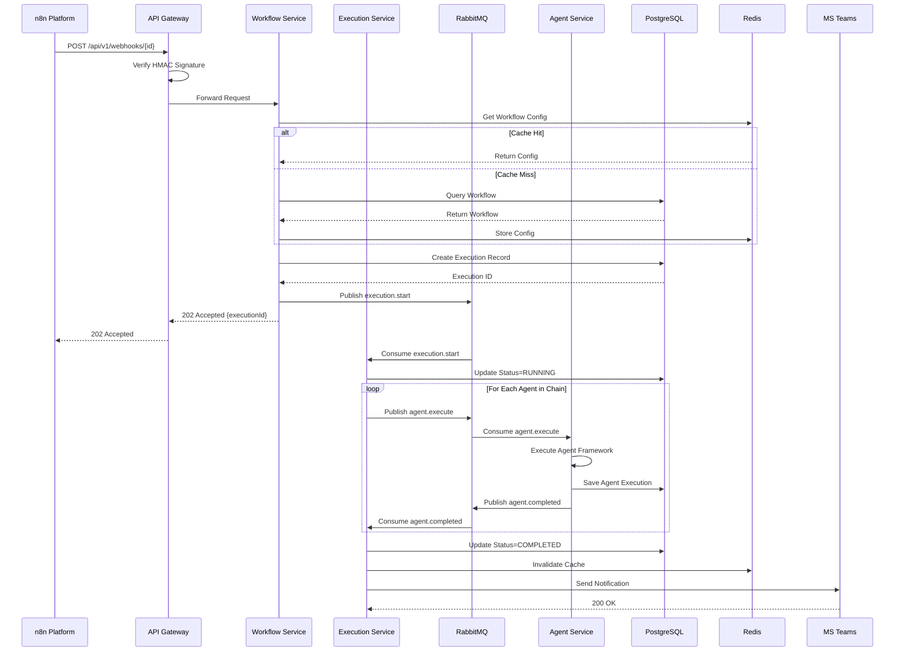

# Technical Architecture Design
# IPA Platform - Intelligent Process Automation

**版本**: 2.5
**日期**: 2025-12-07
**狀態**: Phase 5 完成 - 完整 API 整合與 MVP 驗收
**負責人**: Architecture Team

> **Phase 5 更新 (Sprint 26-30)**: 完成 MVP 核心功能與官方 Agent Framework API 的完整整合。
> - **Sprint 26**: WorkflowDefinitionAdapter 遷移完成
> - **Sprint 27**: ExecutionAdapter + EnhancedExecutionStateMachine 遷移
> - **Sprint 28**: HumanApprovalExecutor + ApprovalWorkflowManager 整合
> - **Sprint 29**: 所有 API Routes 遷移到適配器層
> - **Sprint 30**: E2E 測試、效能測試、文檔更新
>
> **適配器架構位置**: `backend/src/integrations/agent_framework/`
> - `builders/`: 官方 API 適配器 (GroupChat, Handoff, Concurrent, Planning)
> - `core/`: 核心功能適配器 (Workflow, StateMachine, Approval)
> - `memory/`: 記憶體存儲適配器
> - `multiturn/`: 多輪對話適配器

---

## 📑 文檔導航

- **[Technical Architecture](./technical-architecture.md)** ← 您在這裡
- [PRD 文檔](../01-planning/prd/prd-main.md)
- [UI/UX 設計](../01-planning/ui-ux/ui-ux-design-spec.md)
- [系統架構圖](#system-architecture)
- [核心模塊設計](#core-modules)
- [數據架構](#data-architecture)

---

## 📋 目錄

1. [架構概覽](#architecture-overview)
2. [設計原則](#design-principles)
3. [技術棧選擇](#technology-stack)
4. [系統架構](#system-architecture)
5. [核心模塊設計](#core-modules)
6. [數據架構設計](#data-architecture)
7. [集成架構](#integration-architecture)
8. [安全架構](#security-architecture)
9. [監控與日誌](#monitoring-logging)
10. [部署架構](#deployment-architecture)
11. [性能優化策略](#performance-optimization)
12. [災難恢復](#disaster-recovery)

---

## <a id="architecture-overview"></a>1. 架構概覽

### 1.1 系統定位

IPA Platform 是一個基於 **事件驅動** 和 **微服務架構** 的智能流程自動化平台,專注於:

- **靈活編排**: 通過 n8n 觸發和 Agent Framework 執行複雜業務流程
- **智能決策**: 利用 AI Agent 處理非結構化數據和複雜邏輯
- **高可靠性**: 內置重試、DLQ、審計追蹤等企業級特性
- **可觀測性**: 全鏈路監控、日誌追蹤、性能分析

### 1.2 部署策略

**MVP 階段（當前）**:
- **部署平台**: Azure App Service（簡化運維，快速上線）
- **服務架構**: 單體後端應用（Workflow/Execution/Agent 合併）
- **消息隊列**: Azure Service Bus（托管服務）
- **監控方案**: Azure Monitor + Application Insights + Prometheus（混合模式）
- **成本**: 約 $113/月

**生產擴展（MVP 後）**:
- **部署平台**: Azure Kubernetes Service (AKS)（彈性擴展，高可用）
- **服務架構**: 微服務拆分（獨立擴展，故障隔離）
- **消息隊列**: 可選 RabbitMQ（更靈活的路由）
- **監控方案**: 完整 Prometheus + Grafana + ELK Stack

> **設計原則**: MVP 階段優先速度和成本，後期根據業務需求逐步演進到完整微服務架構。

### 1.3 架構視圖

#### MVP 階段架構（Azure App Service）

```
┌─────────────────────────────────────────────────────────────────┐
│                         Client Layer                            │
│  ┌───────────────────────────────────────────────────────────┐ │
│  │  Web UI (React + TypeScript)                              │ │
│  │  Hosted on: Azure Static Web Apps or App Service         │ │
│  └───────────────────────────────────────────────────────────┘ │
└──────────────────────────┬──────────────────────────────────────┘
                           │ HTTPS
                           ▼
┌─────────────────────────────────────────────────────────────────┐
│              Azure App Service (Standard S1 Plan)               │
│  ┌──────────────────────────────────────────────────────────┐  │
│  │  Backend Application (Python FastAPI)                    │  │
│  │  ┌────────────────┐  ┌────────────────┐  ┌────────────┐ │  │
│  │  │ Workflow       │  │ Execution      │  │ Agent      │ │  │
│  │  │ Module         │  │ Module         │  │ Module     │ │  │
│  │  │ - CRUD APIs    │  │ - Scheduler    │  │ - SK       │ │  │
│  │  │ - Validation   │  │ - State Mgmt   │  │ - Tools    │ │  │
│  │  └────────────────┘  └────────────────┘  └────────────┘ │  │
│  │                                                          │  │
│  │  Built-in Features:                                     │  │
│  │  ✅ OAuth 2.0 Authentication                            │  │
│  │  ✅ Auto-scaling (CPU/Memory based)                     │  │
│  │  ✅ Health checks & Auto-restart                        │  │
│  │  ✅ Application Insights integration                    │  │
│  └──────────────────────────────────────────────────────────┘  │
└──────────────────────────┬──────────────────────────────────────┘
                           │
                           ▼
┌─────────────────────────────────────────────────────────────────┐
│                     Azure Managed Services                      │
│  ┌─────────────────┐  ┌─────────────────┐  ┌───────────────┐  │
│  │ PostgreSQL 16   │  │ Redis Cache     │  │ Service Bus   │  │
│  │ Flexible Server │  │ (Basic C0)      │  │ (Basic)       │  │
│  │ - Burstable B1  │  │ - 250MB         │  │ - Queues      │  │
│  │ - 2 vCore/4GB   │  │ - Session store │  │ - Topics      │  │
│  └─────────────────┘  └─────────────────┘  └───────────────┘  │
│                                                                  │
│  ┌─────────────────┐  ┌─────────────────┐  ┌───────────────┐  │
│  │ Blob Storage    │  │ Key Vault       │  │ Monitor +     │  │
│  │ - Artifacts     │  │ - Secrets       │  │ App Insights  │  │
│  │ - Logs archive  │  │ - Certificates  │  │ - Telemetry   │  │
│  └─────────────────┘  └─────────────────┘  └───────────────┘  │
└──────────────────────────┬──────────────────────────────────────┘
                           │
                           ▼
┌─────────────────────────────────────────────────────────────────┐
│                   External Integrations                         │
│  ┌─────────────┐  ┌─────────────┐  ┌─────────────┐            │
│  │  n8n        │  │  MS Teams   │  │  Azure      │            │
│  │  Webhooks   │  │  Adaptive   │  │  OpenAI     │            │
│  │             │  │  Cards      │  │  GPT-4o     │            │
│  └─────────────┘  └─────────────┘  └─────────────┘            │
└─────────────────────────────────────────────────────────────────┘

成本估算 (MVP 階段):
- App Service Standard S1: $75/月
- PostgreSQL Burstable B1ms: $12/月
- Redis Basic C0: $16/月
- Service Bus Basic: $10/月
- App Insights: ~$10-30/月 (基於使用量)
總計: ~$123-143/月
```

#### 生產擴展架構（Kubernetes - 後期選項）

```
┌─────────────────────────────────────────────────────────────────┐
│                    Azure Kubernetes Service (AKS)               │
│  ┌──────────────────────────────────────────────────────────┐  │
│  │  Ingress Controller (Nginx/Kong)                         │  │
│  │  - SSL Termination                                       │  │
│  │  - Load Balancing                                        │  │
│  └────────────────────────┬─────────────────────────────────┘  │
│                           │                                     │
│  ┌────────────────────────┼─────────────────────────────────┐  │
│  │  Microservices (獨立擴展)                                │  │
│  │                        │                                  │  │
│  │  ┌─────────────┐  ┌────┴──────┐  ┌─────────────┐       │  │
│  │  │ Workflow    │  │ Execution │  │ Agent       │       │  │
│  │  │ Service     │  │ Service   │  │ Service     │       │  │
│  │  │ (3 Pods)    │  │ (5 Pods)  │  │ (3 Pods)    │       │  │
│  │  └─────────────┘  └───────────┘  └─────────────┘       │  │
│  │                                                          │  │
│  │  ┌─────────────────────────────────────────────────┐   │  │
│  │  │ RabbitMQ Cluster (3 Nodes)                      │   │  │
│  │  │ - High Availability                             │   │  │
│  │  │ - Message Persistence                           │   │  │
│  │  └─────────────────────────────────────────────────┘   │  │
│  └──────────────────────────────────────────────────────────┘  │
│                                                                  │
│  監控 Stack:                                                    │
│  ┌─────────────┐  ┌─────────────┐  ┌─────────────┐           │
│  │ Prometheus  │  │ Grafana     │  │ ELK Stack   │           │
│  │ (Metrics)   │  │ (Dashboard) │  │ (Logs)      │           │
│  └─────────────┘  └─────────────┘  └─────────────┘           │
└─────────────────────────────────────────────────────────────────┘

優勢:
✅ 獨立擴展每個微服務
✅ 藍綠部署/金絲雀發布
✅ 完整的容器編排能力
✅ 多環境隔離 (dev/staging/prod)

時機: 當 MVP 驗證成功，需要支持更大規模流量時遷移
```

### 1.4 關鍵特性映射

#### MVP 階段實現

| 特性需求 | 架構實現 |
|---------|------|
| **n8n 觸發** | App Service 接收 n8n webhook → FastAPI 路由到 Execution Module |
| **Agent 執行** | Agent Framework Runtime + Tool Integration |
| **重試機制** | Execution Module 內置指數退避重試 + Service Bus DLQ |
| **審計追蹤** | PostgreSQL append-only audit log + Application Insights |
| **實時監控** | Azure Monitor (基礎) + Prometheus (自定義) + Application Insights |
| **緩存優化** | Redis multi-layer caching (workflow/execution/result) |
| **高可用性** | App Service Auto-scaling + Health checks |

#### 生產擴展增強（K8s）

| 特性需求 | 增強實現 |
|---------|------|
| **獨立擴展** | 每個微服務獨立 HPA (Horizontal Pod Autoscaler) |
| **故障隔離** | 服務間故障不會級聯（Circuit Breaker） |
| **藍綠部署** | K8s Deployment 策略（零停機部署） |
| **多區域** | 跨可用區部署（高可用性） |

---

## <a id="design-principles"></a>2. 設計原則

### 2.1 架構原則

#### SOLID 原則

**Single Responsibility (單一職責)**
- 每個服務專注於單一業務領域
- Workflow Service: 工作流管理
- Execution Service: 執行調度
- Agent Service: Agent 運行時

**Open/Closed (開放封閉)**
- 通過插件機制擴展 Agent 能力
- 自定義 Tool Integration
- 可插拔的存儲後端

**Liskov Substitution (里氏替換)**
- 統一的 Agent 接口(IAgent)
- 可替換的 Tool 實現(ITool)

**Interface Segregation (接口隔離)**
- 細粒度的服務接口
- GraphQL Schema 分層設計

**Dependency Inversion (依賴倒置)**
- 依賴抽象接口而非具體實現
- Dependency Injection 容器

#### 12-Factor App

1. **Codebase**: Git monorepo with clear module boundaries
2. **Dependencies**: Package.json / .csproj explicit dependencies
3. **Config**: Environment variables for all configurations
4. **Backing Services**: Treat DB/Cache/Queue as attached resources
5. **Build, Release, Run**: CI/CD pipeline separation
6. **Processes**: Stateless services (state in Redis/DB)
7. **Port Binding**: Services export HTTP/gRPC endpoints
8. **Concurrency**: Horizontal scaling via Kubernetes
9. **Disposability**: Fast startup, graceful shutdown
10. **Dev/Prod Parity**: Docker ensures environment consistency
11. **Logs**: Structured logging to stdout (collected by FluentBit)
12. **Admin Processes**: Separate CLI tools for admin tasks

### 2.2 質量屬性

| 質量屬性 | 目標值 | 實現策略 |
|---------|-------|---------|
| **可用性** | 99.9% (月停機 < 43 分鐘) | 多副本部署 + 健康檢查 + 自動故障轉移 |
| **性能** | API P95 < 500ms | Redis 緩存 + 數據庫索引 + 異步處理 |
| **可擴展性** | 支持 1000+ 並發執行 | Kubernetes HPA + Message Queue |
| **可維護性** | 新功能開發 < 2 週 | 模塊化設計 + 清晰文檔 + 自動化測試 |
| **安全性** | OWASP Top 10 防護 | OAuth 2.0 + HTTPS + 輸入驗證 + 審計日誌 |
| **可觀測性** | 全鏈路追蹤覆蓋率 100% | OpenTelemetry + Distributed Tracing |

---

## <a id="technology-stack"></a>3. 技術棧選擇

### 3.1 後端技術

#### 編程語言與框架

**MVP 階段: Python + FastAPI（單體應用）**
- **用途**: 統一後端服務（Workflow/Execution/Agent 模塊）
- **選擇理由**:
  - Agent Framework Python SDK 支持完整
  - FastAPI 高性能異步框架（與 Node.js 性能相當）
  - Python 生態豐富（數據處理、AI/ML）
  - 開發速度快，適合 MVP 快速迭代
  - 類型提示（Type Hints）提供類型安全
- **框架**: 
  - FastAPI 0.100+（Web 框架）
  - Agent Framework SDK（Agent 框架）
  - SQLAlchemy 2.0+（ORM）
  - Pydantic 2.0+（數據驗證）
  - Celery（異步任務，可選）
- **版本**: Python 3.11+

**生產擴展: 可選技術棧**
- **選項 A**: 保持 Python（適合團隊 Python 背景強）
- **選項 B**: 拆分關鍵服務為 C# .NET（適合需要極致性能場景）
  - Execution Service 可用 .NET（更好的並發性能）
  - Agent Service 保持 Python（Agent Framework 兩者都支持）

#### API 設計

**REST API**
- **標準**: OpenAPI 3.0 規範
- **認證**: OAuth 2.0 + JWT
- **版本控制**: URL path versioning (`/api/v1/`)

**GraphQL API**
- **框架**: Apollo Server (Node.js), HotChocolate (.NET)
- **用途**: 複雜查詢、前端靈活數據獲取
- **訂閱**: GraphQL Subscriptions (WebSocket)

**gRPC**
- **用途**: 內部服務間通信(高性能)
- **Protocol**: Protocol Buffers 3

### 3.2 數據存儲

#### 主數據庫: PostgreSQL 15

**選擇理由**:
- ACID 事務保證數據一致性
- JSON/JSONB 支持半結構化數據
- 強大的索引能力(B-Tree, GIN, BRIN)
- 成熟的複製和備份方案

**Schema 設計**:
```sql
-- Workflows 表
CREATE TABLE workflows (
  id UUID PRIMARY KEY DEFAULT gen_random_uuid(),
  name VARCHAR(255) NOT NULL,
  description TEXT,
  category VARCHAR(100),
  trigger_config JSONB NOT NULL,
  agent_chain JSONB NOT NULL,
  retry_config JSONB,
  notification_config JSONB,
  status VARCHAR(50) DEFAULT 'active',
  created_at TIMESTAMPTZ DEFAULT NOW(),
  updated_at TIMESTAMPTZ DEFAULT NOW(),
  created_by UUID REFERENCES users(id),
  version INTEGER DEFAULT 1
);

-- Executions 表
CREATE TABLE executions (
  id UUID PRIMARY KEY DEFAULT gen_random_uuid(),
  workflow_id UUID REFERENCES workflows(id),
  status VARCHAR(50) NOT NULL,
  triggered_by VARCHAR(100),
  triggered_at TIMESTAMPTZ DEFAULT NOW(),
  started_at TIMESTAMPTZ,
  completed_at TIMESTAMPTZ,
  duration_ms INTEGER,
  input_data JSONB,
  output_data JSONB,
  error_details JSONB,
  retry_count INTEGER DEFAULT 0,
  parent_execution_id UUID REFERENCES executions(id)
);

-- Agent Executions 表
CREATE TABLE agent_executions (
  id UUID PRIMARY KEY DEFAULT gen_random_uuid(),
  execution_id UUID REFERENCES executions(id),
  agent_id UUID REFERENCES agents(id),
  sequence_order INTEGER NOT NULL,
  status VARCHAR(50) NOT NULL,
  started_at TIMESTAMPTZ,
  completed_at TIMESTAMPTZ,
  duration_ms INTEGER,
  input_data JSONB,
  output_data JSONB,
  error_details JSONB,
  tokens_used INTEGER,
  cost_usd DECIMAL(10,6)
);

-- Audit Log 表 (append-only)
CREATE TABLE audit_logs (
  id BIGSERIAL PRIMARY KEY,
  timestamp TIMESTAMPTZ DEFAULT NOW(),
  user_id UUID REFERENCES users(id),
  action VARCHAR(100) NOT NULL,
  resource_type VARCHAR(100) NOT NULL,
  resource_id UUID,
  details JSONB,
  ip_address INET,
  user_agent TEXT,
  signature VARCHAR(64) NOT NULL -- SHA-256
);

-- 索引
CREATE INDEX idx_workflows_status ON workflows(status);
CREATE INDEX idx_workflows_created_at ON workflows(created_at DESC);
CREATE INDEX idx_executions_workflow_id ON executions(workflow_id);
CREATE INDEX idx_executions_status ON executions(status);
CREATE INDEX idx_executions_triggered_at ON executions(triggered_at DESC);
CREATE INDEX idx_agent_executions_execution_id ON agent_executions(execution_id);
CREATE INDEX idx_audit_logs_timestamp ON audit_logs(timestamp DESC);
CREATE INDEX idx_audit_logs_user_id ON audit_logs(user_id);
CREATE INDEX idx_audit_logs_resource ON audit_logs(resource_type, resource_id);
```

#### 緩存: Redis 7

**緩存層級**:

```
L1: Workflow Configuration Cache
  - Key: workflow:{id}
  - TTL: 1 hour
  - Invalidation: On workflow update

L2: Execution Status Cache
  - Key: execution:{id}:status
  - TTL: 5 minutes
  - Invalidation: On status change

L3: Agent Result Cache
  - Key: agent:{agent_id}:result:{input_hash}
  - TTL: 24 hours
  - Use Case: 相同輸入避免重複執行

L4: API Response Cache
  - Key: api:v1:{endpoint}:{query_hash}
  - TTL: 1 minute
  - Use Case: 高頻查詢接口
```

**數據結構使用**:

- **String**: 簡單 key-value 緩存
- **Hash**: Workflow/Execution 對象緩存
- **List**: 執行隊列
- **Sorted Set**: 優先級隊列,延遲任務
- **Pub/Sub**: 實時通知推送
- **Stream**: 事件溯源日誌

#### 對象存儲: S3 / Azure Blob

**存儲內容**:
- 大型執行結果(> 1MB)
- 文件類型的 Agent 輸出
- 審計日誌歸檔(> 90 天)
- 備份文件

**命名規範**:
```
executions/{year}/{month}/{day}/{execution_id}/output.json
audit-logs/archive/{year}/{month}/logs.tar.gz
backups/{timestamp}/postgresql-dump.sql.gz
```

### 3.3 消息隊列

#### RabbitMQ 3.12

**選擇理由**:
- 支持多種消息模式(Direct, Topic, Fanout)
- 消息持久化和確認機制
- 死信隊列(DLQ)原生支持
- 管理界面友好

**隊列設計**:

```
Exchange: ipa.executions.topic (Type: Topic)
├── Queue: executions.pending
│   ├── Binding: execution.start
│   └── Consumer: Execution Service
├── Queue: executions.retry
│   ├── Binding: execution.retry
│   ├── TTL: Based on backoff strategy
│   └── Consumer: Execution Service
├── Queue: executions.dlq
│   ├── Binding: execution.dlq
│   └── Consumer: DLQ Handler Service
└── Queue: notifications.teams
    ├── Binding: notification.*
    └── Consumer: Notification Service

Exchange: ipa.agents.direct (Type: Direct)
├── Queue: agents.react
├── Queue: agents.plan-execute
└── Queue: agents.custom
```

**消息格式**:
```json
{
  "messageId": "uuid",
  "timestamp": "2025-11-19T12:34:56Z",
  "type": "execution.start",
  "payload": {
    "executionId": "uuid",
    "workflowId": "uuid",
    "inputData": {}
  },
  "metadata": {
    "correlationId": "trace-id",
    "retryCount": 0,
    "priority": 1
  }
}
```

### 3.4 前端技術

#### React 18 + TypeScript

**狀態管理**: Zustand (輕量級) or Redux Toolkit
**路由**: React Router v6
**UI 組件**: 
- Ant Design 5 (企業級 UI 庫)
- TailwindCSS (utility-first CSS)
**圖表**: ECharts / Recharts
**表單**: React Hook Form + Zod validation
**HTTP 客戶端**: Axios / TanStack Query (React Query)
**WebSocket**: Socket.io-client
**構建工具**: Vite 5

#### 代碼組織

```
src/
├── components/           # 可復用組件
│   ├── Button/
│   ├── Input/
│   ├── Card/
│   └── ...
├── features/             # 功能模塊
│   ├── workflows/
│   │   ├── components/
│   │   ├── hooks/
│   │   ├── api/
│   │   └── types/
│   ├── executions/
│   └── agents/
├── layouts/              # 頁面佈局
├── pages/                # 路由頁面
├── services/             # API 服務
├── stores/               # 狀態管理
├── utils/                # 工具函數
└── types/                # TypeScript 類型
```

### 3.5 DevOps 技術

#### 容器化: Docker

**MVP 階段 Docker Images**:
- `ipa-backend`: Python 3.11 + FastAPI + Agent Framework
- `ipa-frontend`: Nginx + React static files
- `prometheus`: Prometheus Server (可選，用於自定義指標)

**Dockerfile 示例**:
```dockerfile
# Backend
FROM python:3.11-slim
WORKDIR /app
COPY requirements.txt .
RUN pip install --no-cache-dir -r requirements.txt
COPY . .
CMD ["uvicorn", "main:app", "--host", "0.0.0.0", "--port", "8000"]
```

**生產擴展（Kubernetes）**:
- Deployment: 服務部署配置
- Service: 內部服務發現
- Ingress: 外部流量路由
- ConfigMap: 配置管理
- Secret: 敏感信息
- HPA: 自動擴展
- PVC: 持久化存儲

#### CI/CD: GitHub Actions

**MVP 階段 Pipeline**:
```yaml
1. Build:
   - Docker image build
   - Push to Azure Container Registry

2. Test:
   - Unit tests (pytest)
   - Integration tests
   - Code coverage (> 80%)

3. Security Scan:
   - Trivy (container vulnerabilities)
   - Bandit (Python security issues)
   - Safety (dependency vulnerabilities)

4. Deploy to App Service:
   - Azure CLI deployment
   - Database migrations (Alembic)
   - Health check verification

5. Smoke Test:
   - API endpoint validation
   - Basic workflow execution test
```

**生產擴展 Pipeline（K8s）**:
```yaml
4. Deploy to AKS:
   - Helm chart deployment
   - Rolling update strategy
   - Canary deployment (optional)
```

#### 監控與日誌

**MVP 階段: 混合監控方案**

**Azure Monitor + Application Insights**（基礎監控，內建）:
- ✅ 應用性能監控（APM）
- ✅ 請求/響應時間
- ✅ HTTP 狀態碼分佈
- ✅ 依賴追蹤（資料庫、外部 API）
- ✅ 異常和錯誤追蹤
- ✅ 實時告警（CPU/Memory/錯誤率）
- ✅ 分布式追蹤（跨服務請求）
- **成本**: 前 5GB/月免費，MVP 階段預計 $10-30/月

**Prometheus + Grafana**（自定義業務指標）:
- 📊 Workflow 執行成功率
- 📊 Agent 執行耗時分佈
- 📊 LLM API 調用次數和成本
- 📊 業務指標（工單處理數量、SLA 達成率）
- **部署**: Azure Container Instance（~$20/月）
- **優勢**: 靈活的 PromQL 查詢，豐富的社區 Dashboard

**為什麼混合方案**:
- Azure Monitor 已提供基礎監控（免費），無需重複建設
- Prometheus 專注業務指標和自定義需求
- 降低運維成本（不需要維護 ELK Stack）

**生產擴展（K8s 後）**:

**ELK Stack (Elasticsearch + Logstash + Kibana)**:
- 集中式日誌管理（K8s 多 Pod 日誌聚合）
- 複雜日誌查詢和分析
- 長期日誌存檔

**Jaeger**:
- 完整分布式追蹤（微服務間調用鏈）
- 性能瓶頸可視化

---

## <a id="system-architecture"></a>4. 系統架構

### 4.1 分層架構

```
┌─────────────────────────────────────────────────────────────────┐
│                      Presentation Layer                         │
│  - Web UI (React)                                               │
│  - API Documentation (Swagger/GraphQL Playground)               │
└───────────────────────────────┬─────────────────────────────────┘
                                │
┌───────────────────────────────┴─────────────────────────────────┐
│                      Application Layer                          │
│  ┌───────────────────────────────────────────────────────────┐ │
│  │  API Gateway (Kong / Nginx)                               │ │
│  │  - Rate Limiting                                          │ │
│  │  - Authentication & Authorization                         │ │
│  │  - Request Routing                                        │ │
│  └───────────────────────────────────────────────────────────┘ │
│                                                                  │
│  ┌─────────────────┐  ┌─────────────────┐  ┌────────────────┐ │
│  │  Workflow       │  │  Execution      │  │  Agent         │ │
│  │  Service        │  │  Service        │  │  Service       │ │
│  │                 │  │                 │  │                │ │
│  │  - CRUD Ops     │  │  - Scheduling   │  │  - SK Runtime  │ │
│  │  - Validation   │  │  - Retry Logic  │  │  - Tool Mgmt   │ │
│  │  - Versioning   │  │  - DLQ Handler  │  │  - Prompt Exec │ │
│  └─────────────────┘  └─────────────────┘  └────────────────┘ │
└───────────────────────────────┬─────────────────────────────────┘
                                │
┌───────────────────────────────┴─────────────────────────────────┐
│                      Domain Layer                               │
│  ┌─────────────────┐  ┌─────────────────┐  ┌────────────────┐ │
│  │  Workflow       │  │  Execution      │  │  Agent         │ │
│  │  Domain         │  │  Domain         │  │  Domain        │ │
│  │                 │  │                 │  │                │ │
│  │  - Entities     │  │  - Entities     │  │  - Entities    │ │
│  │  - Aggregates   │  │  - Value Objs   │  │  - Interfaces  │ │
│  │  - Domain Rules │  │  - State Machine│  │  - Strategies  │ │
│  └─────────────────┘  └─────────────────┘  └────────────────┘ │
└───────────────────────────────┬─────────────────────────────────┘
                                │
┌───────────────────────────────┴─────────────────────────────────┐
│                   Infrastructure Layer                          │
│  ┌─────────────────┐  ┌─────────────────┐  ┌────────────────┐ │
│  │  PostgreSQL     │  │  Redis          │  │  RabbitMQ      │ │
│  │  Repository     │  │  Cache          │  │  Queue         │ │
│  └─────────────────┘  └─────────────────┘  └────────────────┘ │
│                                                                  │
│  ┌─────────────────┐  ┌─────────────────┐  ┌────────────────┐ │
│  │  External APIs  │  │  n8n Platform   │  │  MS Teams      │ │
│  │  Integration    │  │  Integration    │  │  Webhooks      │ │
│  └─────────────────┘  └─────────────────┘  └────────────────┘ │
└─────────────────────────────────────────────────────────────────┘
```

### 4.2 執行流程架構



---

**待續**: 下一部分將包含核心模塊詳細設計、數據架構、集成架構等內容。

**文檔狀態**: 第 1 部分完成 (架構概覽、設計原則、技術棧、系統架構) ✅
