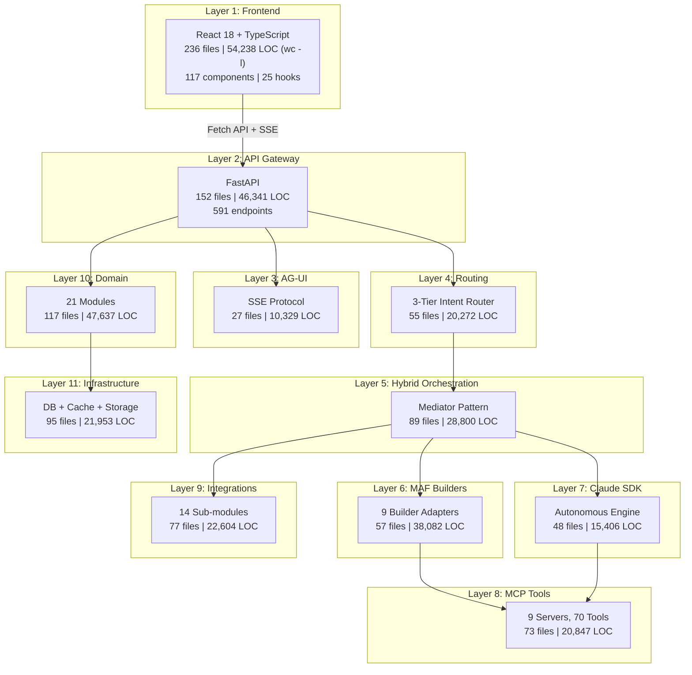

# V9 Codebase Statistics Summary

> Generated: 2026-03-29 | Scope: Phase 1-44 | Base: Full file inventory scan

---

## 1. Overall Metrics

| Metric | Value |
|--------|-------|
| **Total Source Files** | 1,028 (792 .py + 236 .ts/.tsx) |
| **Total LOC** | 326,547 (272,309 backend + 54,238 frontend) |
| **Total Phases** | 44 |
| **Total Sprints** | 152+ |
| **Total Story Points** | ~2,500+ |
| **Project Start** | 2025-11-14 |
| **Current Branch** | feature/phase-42-deep-integration |

### Architecture Overview



### 端到端執行流程圖 (V9)

```
┌─────────────────────────────────────────────────────────────────────────────────────┐
│                IPA Platform V9 端到端執行流程圖                                      │
│                1,028 files (792 .py + 236 .ts/.tsx) | 326,547 LOC                   │
│                Phase 1-44 | 152+ Sprints | agent_framework 1.0.0rc4                 │
├─────────────────────────────────────────────────────────────────────────────────────┤
│                                                                                     │
│  ╔══════════════════════════════════════════════════════════════════════════════╗    │
│  ║  Layer 1: Frontend (使用者介面)                                              ║    │
│  ║  236 .ts/.tsx | 54,238 LOC | 46 pages | 117 components | 25 hooks          ║    │
│  ╠══════════════════════════════════════════════════════════════════════════════╣    │
│  ║   React 18 + TypeScript + Vite (port 3005) + ReactFlow + Shadcn UI         ║    │
│  ║   ┌──────────┐  ┌──────────┐  ┌──────────┐  ┌──────────┐                   ║    │
│  ║   │ Unified  │  │  Agent   │  │   HITL   │  │  Swarm   │                   ║    │
│  ║   │ Chat UI  │  │ Dashboard│  │ Approval │  │  Panel   │                   ║    │
│  ║   │ (27+comp)│  │          │  │  Cards   │  │(15+4hook)│                   ║    │
│  ║   └──────────┘  └──────────┘  └──────────┘  └──────────┘                   ║    │
│  ║   ┌──────────┐  ┌──────────┐                                                ║    │
│  ║   │ Workflow │  │  DevUI   │  Stores: authStore | unifiedChatStore |         ║    │
│  ║   │ DAG Viz  │  │ (15 comp)│         swarmStore (Zustand)                   ║    │
│  ║   │(ReactFlow)│  └──────────┘                                                ║    │
│  ║   └──────────┘                                                               ║    │
│  ╚══════════════════════════════│════════════════════════════════════════════════╝    │
│                                 │ Fetch API + SSE (port 3005 → 8000)               │
│  ╔══════════════════════════════│════════════════════════════════════════════════╗    │
│  ║  Layer 2: API Gateway (591 endpoints, 43 route modules)                      ║    │
│  ║  152 files | 46,341 LOC | FastAPI (port 8000)                                ║    │
│  ║  Auth: JWT (HS256) + protected_router 全域保護                               ║    │
│  ╚══════════════════════════════│════════════════════════════════════════════════╝    │
│                                 │                                                    │
│  ╔══════════════════════════════│════════════════════════════════════════════════╗    │
│  ║  Layer 3: AG-UI Protocol (即時 Agent UI + Swarm SSE)                         ║    │
│  ║  27 files, 10,329 LOC | 11 event types | 7 features                         ║    │
│  ║  SharedState, FileAttach, ThreadStore, ExtThinking, HITL, Swarm             ║    │
│  ╚══════════════════════════════│════════════════════════════════════════════════╝    │
│                                 │                                                    │
│  ╔══════════════════════════════│════════════════════════════════════════════════╗    │
│  ║  Layer 4: Input & Routing (輸入閘道 + 三層意圖路由)                          ║    │
│  ║  55 files, 20,272 LOC | Phase 35 Breakpoint #1 #2 修復完成                  ║    │
│  ╠══════════════════════════════│════════════════════════════════════════════════╣    │
│  ║                              ▼                                                ║    │
│  ║   ┌────────────────────────────────────────────────────────────────────────┐  ║    │
│  ║   │  InputGateway (統一標準化)     │   BusinessIntentRouter (三層路由)     │  ║    │
│  ║   │                               │                                       │  ║    │
│  ║   │  • ServiceNow Handler         │   L1: PatternMatcher   (< 1ms)       │  ║    │
│  ║   │  • Prometheus Handler         │   L2: SemanticRouter   (< 100ms)     │  ║    │
│  ║   │  • UserInput Handler          │   L3: LLMClassifier    (< 2000ms)    │  ║    │
│  ║   │  • Schema Validator           │   • ClassificationCache (帶快取)      │  ║    │
│  ║   │  • C-07 SQL Injection ✅ 已修 │   • 多任務: 意圖+風險+完整度          │  ║    │
│  ║   └────────────────────────────────────────────────────────────────────────┘  ║    │
│  ║   ┌────────────────────────────────────────────────────────────────────────┐  ║    │
│  ║   │  GuidedDialog (5 files)       │  RiskAssessor (3 files)               │  ║    │
│  ║   │  ~3,314 LOC                   │  ~1,200 LOC (7 維度風險因子)          │  ║    │
│  ║   │  • Dialog Engine              │  • Production Environment (0.3)       │  ║    │
│  ║   │  • Context Manager            │  • Weekend (0.2) + Urgent (0.15)     │  ║    │
│  ║   │  • Question Generator         │  → LOW / MEDIUM / HIGH / CRITICAL    │  ║    │
│  ║   └────────────────────────┬───────────────────────────────────────────────┘  ║    │
│  ║                            │                                                  ║    │
│  ║            ┌───────────────┴───────────────┐                                  ║    │
│  ║            │   需要人工審批?                │                                  ║    │
│  ║            │   HIGH / CRITICAL → 審批      │                                  ║    │
│  ║            └───────────────┬───────────────┘                                  ║    │
│  ║                  ┌─────────┴─────────┐                                        ║    │
│  ║                 No                  Yes                                        ║    │
│  ║                  │                    │                                        ║    │
│  ║                  │                    ▼                                        ║    │
│  ║                  │   ┌──────────────────────────────────────────────────┐      ║    │
│  ║                  │   │     HITLController (人機協作, Phase 36 強化)     │      ║    │
│  ║                  │   │  ┌──────────────┐  ┌──────────────┐             │      ║    │
│  ║                  │   │  │ Unified      │  │   Teams      │             │      ║    │
│  ║                  │   │  │ Approval Mgr │  │ Notification │             │      ║    │
│  ║                  │   │  │ (PostgreSQL) │  │ (繁中卡片)   │             │      ║    │
│  ║                  │   │  └──────────────┘  └──────────────┘             │      ║    │
│  ║                  │   │  等待審批 (timeout: 30 min → EXPIRED)           │      ║    │
│  ║                  │   │  Phase 36: +PromptGuard +ToolGateway 強化       │      ║    │
│  ║                  │   └───────────┬──────────────────────────────────────┘      ║    │
│  ║                  │               │ (審批通過)                                  ║    │
│  ║                  │   ←───────────┘                                             ║    │
│  ║                  ▼                                                             ║    │
│  ╚══════════════════│════════════════════════════════════════════════════════════╝    │
│                     │                                                                │
│  ╔══════════════════│════════════════════════════════════════════════════════════╗    │
│  ║  Layer 5: Hybrid Orchestration (Mediator Pattern, Phase 39 Bootstrap)        ║    │
│  ║  89 files, 28,800 LOC — OrchestratorBootstrap 一鍵初始化 (Phase 39)          ║    │
│  ╠══════════════════│════════════════════════════════════════════════════════════╣    │
│  ║                  ▼                                                             ║    │
│  ║   ┌────────────────────────────────────────────────────────────────────────┐   ║    │
│  ║   │   OrchestratorMediator (7-Handler Pipeline, Phase 32+39 完成接線)      │   ║    │
│  ║   │                                                                        │   ║    │
│  ║   │   ① ContextHandler → ② RoutingHandler → ③ DialogHandler →            │   ║    │
│  ║   │   ④ ApprovalHandler → ⑤ AgentHandler → ⑥ ExecutionHandler →          │   ║    │
│  ║   │   ⑦ ObservabilityHandler                                              │   ║    │
│  ║   │                                                                        │   ║    │
│  ║   │   FrameworkSelector 決策:                                              │   ║    │
│  ║   │   ┌────────────────────────────────────────────────────────────────┐   │   ║    │
│  ║   │   │ • 結構化任務 (已知模式) ─────────────→ MAF Builder             │   │   ║    │
│  ║   │   │ • 開放式推理 (Extended Thinking) ───→ Claude SDK Worker        │   │   ║    │
│  ║   │   │ • 混合任務 ─────────────────────────→ MAF 編排 + Claude 執行   │   │   ║    │
│  ║   │   │ • 多 Agent 群集 ────────────────────→ Swarm Mode ✅ (Phase 43) │   │   ║    │
│  ║   │   └────────────────────────────────────────────────────────────────┘   │   ║    │
│  ║   │                                                                        │   ║    │
│  ║   │   ┌──────────────┐  ┌──────────────┐  ┌──────────────┐                │   ║    │
│  ║   │   │ Checkpoint   │  │ MediatorEvent│  │ AG-UI Server │                │   ║    │
│  ║   │   │ (PG+Redis    │  │ Bridge (P40) │  │ (SSE Stream  │                │   ║    │
│  ║   │   │  +InMemory⚠) │  │ →SSE format  │  │  11 事件類型)│                │   ║    │
│  ║   │   └──────────────┘  └──────────────┘  └──────────────┘                │   ║    │
│  ║   │                                                                        │   ║    │
│  ║   │   ContextBridge (Session+Memory+Checkpoint 上下文注入)                 │   ║    │
│  ║   └────────────────────────────┬───────────────────────────────────────────┘   ║    │
│  ║                                │                                               ║    │
│  ║                ┌───────────────┴───────────────┐                               ║    │
│  ║                │      Task Dispatcher          │                               ║    │
│  ║                │   (任務分發到 Worker Pool)    │                               ║    │
│  ║                └───────┬───────────┬───────────┘                               ║    │
│  ╚════════════════════════│═══════════│═══════════════════════════════════════════╝    │
│                           │           │                                                │
│              ┌────────────┘           └────────────────┐                               │
│              ▼                                         ▼                               │
│  ╔══════════════════════════════╗  ╔═══════════════════════════════════════════╗       │
│  ║  Layer 6: MAF Builder Layer  ║  ║  Layer 7: Claude SDK Worker Layer         ║       │
│  ║  57 files, 38,082 LOC        ║  ║  48 files, 15,406 LOC                    ║       │
│  ╠══════════════════════════════╣  ╠═══════════════════════════════════════════╣       │
│  ║  9 Builder Adapters (7 MAF   ║  ║  ClaudeSDKClient (AsyncAnthropic)        ║       │
│  ║  compliant, 100% API usage)  ║  ║                                           ║       │
│  ║  ┌────────────┐ ┌──────────┐ ║  ║  ┌──────────────┐  ┌──────────────┐     ║       │
│  ║  │ Concurrent │ │ Handoff  │ ║  ║  │ Autonomous   │  │ Hook System  │     ║       │
│  ║  │  Builder   │ │ Builder  │ ║  ║  │ (7 files)    │  │ (6 files)    │     ║       │
│  ║  └────────────┘ └──────────┘ ║  ║  └──────────────┘  └──────────────┘     ║       │
│  ║  ┌────────────┐ ┌──────────┐ ║  ║  ┌──────────────┐  ┌──────────────┐     ║       │
│  ║  │ GroupChat  │ │ Magentic │ ║  ║  │ Tool System  │  │ Coordinator  │     ║       │
│  ║  │  Builder   │ │ Builder  │ ║  ║  │ (10 tools)   │  │ (4 modes)    │     ║       │
│  ║  └────────────┘ └──────────┘ ║  ║  └──────────────┘  └──────────────┘     ║       │
│  ║  ┌────────────┐ ┌──────────┐ ║  ║  Autonomous Engine:                      ║       │
│  ║  │ Swarm      │ │ Custom   │ ║  ║  Analyze→Plan→Execute→Verify             ║       │
│  ║  │ Builder    │ │(DSL,A2A) │ ║  ║  + SmartFallback (6 策略)                ║       │
│  ║  └────────────┘ └──────────┘ ║  ║                                           ║       │
│  ╚════════════════│═════════════╝  ╚══════════════════════│════════════════════╝       │
│                   │                                       │                             │
│                   └──────────────────┬────────────────────┘                             │
│                                      │                                                  │
│  ╔═══════════════════════════════════│══════════════════════════════════════════════╗   │
│  ║                     Layer 8: 統一 MCP 工具層 (9 Servers, 70 Tools)               ║   │
│  ║                     73 files, 20,847 LOC                                         ║   │
│  ╠═══════════════════════════════════│══════════════════════════════════════════════╣   │
│  ║   ┌───────────────────────────────────────────────────────────────────────────┐  ║   │
│  ║   │                         MCP Gateway Service                               │  ║   │
│  ║   │   ┌─────────┐  ┌───────┐  ┌────────┐  ┌──────┐  ┌─────┐                 │  ║   │
│  ║   │   │  Azure   │  │ Shell │  │Filesys │  │ SSH  │  │LDAP │                 │  ║   │
│  ║   │   │(23 tool)│  │(3 tl) │  │(6 tl)  │  │(6 tl)│  │(6tl)│                 │  ║   │
│  ║   │   └─────────┘  └───────┘  └────────┘  └──────┘  └─────┘                 │  ║   │
│  ║   │   ┌─────────┐  ┌───────┐  ┌────────┐  ┌──────┐                           │  ║   │
│  ║   │   │Srv.Now  │  │  n8n  │  │  D365  │  │ ADF  │  ← Phase 33-37 新增      │  ║   │
│  ║   │   │ (6 tool)│  │(6 tl) │  │(6 tl)  │  │(8 tl)│                           │  ║   │
│  ║   │   └─────────┘  └───────┘  └────────┘  └──────┘                           │  ║   │
│  ║   │   Security: 4-level RBAC (NONE/READ/EXECUTE/ADMIN)                        │  ║   │
│  ║   │   CommandWhitelist: 24 blocked + 79 allowed                               │  ║   │
│  ║   │   + PromptGuard (Phase 36) + ToolGateway (Phase 36)                       │  ║   │
│  ║   │   Permission mode: 'log' (Phase 1) → 'enforce' (目標)                     │  ║   │
│  ║   └───────────────────────────────────────────────────────────────────────────┘  ║   │
│  ╚══════════════════════════════════════════════════════════════════════════════════╝   │
│                                                                                         │
│  ╔══════════════════════════════════════════════════════════════════════════════════╗   │
│  ║  Layer 9: Supporting Integrations (14 modules) + Swarm 群集執行層               ║   │
│  ║  77 files, 22,604 LOC | Swarm: Phase 43 升級為真實 LLM 並行執行                ║   │
│  ╠══════════════════════════════════════════════════════════════════════════════════╣   │
│  ║   ┌──────────┐  ┌──────────┐  ┌──────────┐  ┌──────────┐  ┌──────────┐        ║   │
│  ║   │  swarm/  │  │  llm/   │  │ memory/  │  │knowledge/│  │ patrol/  │        ║   │
│  ║   │多Agent並行│  │LLM 抽象 │  │ 統一記憶 │  │RAG 管線  │  │ 健康巡邏 │        ║   │
│  ║   └──────────┘  └──────────┘  └──────────┘  └──────────┘  └──────────┘        ║   │
│  ║   ┌──────────┐  ┌──────────┐  ┌──────────┐  ┌──────────┐  ┌──────────┐        ║   │
│  ║   │correlat. │  │rootcause/│  │incident/ │  │learning/ │  │  audit/  │        ║   │
│  ║   │事件關聯  │  │根因分析  │  │事件處理  │  │Few-shot  │  │決策追蹤  │        ║   │
│  ║   └──────────┘  └──────────┘  └──────────┘  └──────────┘  └──────────┘        ║   │
│  ║   ┌──────────┐  ┌──────────┐  ┌──────────┐  ┌──────────┐                      ║   │
│  ║   │   a2a/   │  │   n8n/   │  │contracts/│  │ shared/  │                      ║   │
│  ║   │Agent通訊 │  │外部工作流│  │跨模組合約│  │共用工具  │                      ║   │
│  ║   └──────────┘  └──────────┘  └──────────┘  └──────────┘                      ║   │
│  ╚══════════════════════════════════════════════════════════════════════════════════╝   │
│                                                                                         │
│  ╔══════════════════════════════════════════════════════════════════════════════════╗   │
│  ║                    可觀測性 + AG-UI 即時串流 (含 Swarm 事件)                     ║   │
│  ╠══════════════════════════════════════════════════════════════════════════════════╣   │
│  ║   AG-UI SSE 即時串流到前端 (11 event types):                                    ║   │
│  ║   ┌────────────────────────────────────────────────────────────────────────────┐ ║   │
│  ║   │ • TEXT_MESSAGE_START/CONTENT/END  → 思考過程顯示                           │ ║   │
│  ║   │ • TOOL_CALL_START/ARGS/END       → 工具調用顯示                           │ ║   │
│  ║   │ • APPROVAL_REQUEST               → 內聯審批卡片 (Phase 35)                │ ║   │
│  ║   │ • STATE_SNAPSHOT/DELTA           → 共享狀態更新                           │ ║   │
│  ║   │ • RUN_STARTED/FINISHED           → 執行生命週期                           │ ║   │
│  ║   │ • CUSTOM (swarm_*, workflow_*)   → Swarm + 工作流事件                     │ ║   │
│  ║   │ + MediatorEventBridge (Phase 40) → Pipeline 事件格式轉換                  │ ║   │
│  ║   └────────────────────────────────────────────────────────────────────────────┘ ║   │
│  ╚══════════════════════════════════════════════════════════════════════════════════╝   │
│                                                                                         │
│  ╔══════════════════════════════════════════════════════════════════════════════════╗   │
│  ║  Layer 10: Domain (117 files, 47,637 LOC, 21 modules)                           ║   │
│  ║  sessions/ (33 files, 15,473 LOC ★CRITICAL) | orchestration/ (22 files ⚠DEPR)  ║   │
│  ║  workflows/ | agents/ | connectors/ | executions/ | checkpoints/ | auth/        ║   │
│  ║  ⚠ 5 模組 InMemory: audit, routing, learning, versioning, devtools             ║   │
│  ╠══════════════════════════════════════════════════════════════════════════════════╣   │
│  ║  Layer 11: Infrastructure + Core (95 files, 21,953 LOC)                          ║   │
│  ║  PostgreSQL 16 (9 ORM models) | Redis 7 (LLM cache + checkpoint + locks)        ║   │
│  ║  Storage (S3 + Local) | ARQ Workers (Redis-backed background queue, Phase 40)   ║   │
│  ║  Core: Security (JWT+RBAC) | Performance (Profiler+Metrics) | Sandbox           ║   │
│  ║  ⚠ messaging/ = STUB (1 行，RabbitMQ 無實現)                                    ║   │
│  ╚══════════════════════════════════════════════════════════════════════════════════╝   │
│                                                                                         │
│  V9 E2E 流程驗證結果 (基於 V8 22 Agent 驗證 + V9 Phase 35-44 實際修復):              │
│  ═══════════════════════════════════════════════════════════════════════                │
│  • Flow 1 Chat Message:    ✅ CONNECTED (Phase 35 修復 Breakpoint #1 #2)              │
│  • Flow 2 Agent CRUD:      ✅ FULLY CONNECTED (6 步驟, PostgreSQL 全程持久化)         │
│  • Flow 3 Workflow Execute: ✅ CONNECTED (OrchestratorBootstrap Phase 39 接線)         │
│  • Flow 4 HITL Approval:   ⚠ IMPROVED (UnifiedApprovalManager Phase 38, 仍需統一)    │
│  • Flow 5 Swarm:           ⚠ UPGRADED (Phase 43 mock→real LLM, 但仍有 6 gap)         │
│                                                                                         │
│  V8→V9 關鍵改進:                                                                       │
│  • ✅ C-07 SQL Injection 修復 (Phase 35)                                               │
│  • ✅ AG-UI ↔ InputGateway ↔ Mediator 斷點修復 (Phase 35)                             │
│  • ✅ OrchestratorBootstrap 一鍵初始化 7 Handlers (Phase 39)                           │
│  • ✅ MediatorEventBridge → SSE 格式轉換 (Phase 40)                                    │
│  • ✅ ARQ 背景任務佇列 (Phase 40)                                                      │
│  • ✅ Swarm 真實 LLM 並行執行引擎 (Phase 43)                                          │
│  • ⚠ 仍存: InMemory 風險 (20+ modules), Messaging STUB, Permission log-only           │
│                                                                                         │
└─────────────────────────────────────────────────────────────────────────────────────────┘
```

### 十一層架構總覽 (V9)

```
┌─────────────────────────────────────────────────────────────────────────────────────┐
│                    IPA Platform：智能體編排平台架構 (V9)                              │
│                    792 .py + 236 .ts/.tsx = 1,028 files, 326,547 LOC                │
│                    agent_framework 1.0.0rc4 | Phase 1-44 | 152+ Sprints            │
├─────────────────────────────────────────────────────────────────────────────────────┤
│                                                                                     │
│  ╔══════════════════════════════════════════════════════════════════════════════╗    │
│  ║  Layer 1: Frontend (使用者介面)                                              ║    │
│  ║  236 .ts/.tsx | 54,238 LOC | 46 pages | 117 components | 25 hooks          ║    │
│  ╠══════════════════════════════════════════════════════════════════════════════╣    │
│  ║   React 18 + TypeScript + Vite (port 3005) + ReactFlow + Shadcn UI         ║    │
│  ║   ┌──────────┐  ┌──────────┐  ┌──────────┐  ┌──────────┐  ┌──────────┐    ║    │
│  ║   │ Unified  │  │  Agent   │  │   HITL   │  │  Swarm   │  │ Workflow │    ║    │
│  ║   │ Chat UI  │  │ Dashboard│  │ Approval │  │  Panel   │  │ DAG Viz  │    ║    │
│  ║   │(27+ comp)│  │          │  │  Cards   │  │(15+4hook)│  │(ReactFlow)│   ║    │
│  ║   └──────────┘  └──────────┘  └──────────┘  └──────────┘  └──────────┘    ║    │
│  ║   ┌──────────┐                                                              ║    │
│  ║   │  DevUI   │  Stores: authStore | unifiedChatStore | swarmStore (Zustand) ║    │
│  ║   │ (15 comp)│  API: Fetch (not Axios) | 99 call sites                     ║    │
│  ║   └──────────┘                                                              ║    │
│  ╚══════════════════════════════════════════════════════════════════════════════╝    │
│                                                                                     │
│  ╔══════════════════════════════════════════════════════════════════════════════╗    │
│  ║  Layer 2: API Gateway (591 endpoints, 43 route modules, 56 routers)         ║    │
│  ║  152 files | 46,341 LOC | FastAPI (port 8000)                               ║    │
│  ║  Auth: JWT (HS256) + protected_router | 7 auth endpoints (1.2%)             ║    │
│  ╚══════════════════════════════════════════════════════════════════════════════╝    │
│                                                                                     │
│  ╔══════════════════════════════════════════════════════════════════════════════╗    │
│  ║  Layer 3: AG-UI Protocol (即時 Agent UI + Swarm SSE)                        ║    │
│  ║  27 files, 10,329 LOC | 11 event types | 7 features                        ║    │
│  ║  SharedState, FileAttach, ThreadStore, ExtThinking, HITL, Swarm             ║    │
│  ║  + MediatorEventBridge (Phase 40) → Pipeline 事件轉 AG-UI 格式             ║    │
│  ╚══════════════════════════════════════════════════════════════════════════════╝    │
│                                                                                     │
│  ╔══════════════════════════════════════════════════════════════════════════════╗    │
│  ║  Layer 4: Input & Routing (輸入閘道 + 三層意圖路由 + 風險評估)              ║    │
│  ║  55 files, 20,272 LOC | Phase 35 Breakpoint 修復 | OrchestrationMetrics     ║    │
│  ╠══════════════════════════════════════════════════════════════════════════════╣    │
│  ║   ┌──────────────────┐  ┌──────────────────┐  ┌────────────────────┐        ║    │
│  ║   │  InputGateway    │  │ BusinessIntent   │  │ GuidedDialog       │        ║    │
│  ║   │  ServiceNow/     │  │ Router (3-tier)  │  │ Engine (3,314 LOC) │        ║    │
│  ║   │  Prometheus/     │  │ Pattern→Semantic │  │ + CompletenessCheck│        ║    │
│  ║   │  UserInput       │  │ →LLM (cascade)   │  │ + RefinementRules  │        ║    │
│  ║   └──────────────────┘  └──────────────────┘  └────────────────────┘        ║    │
│  ║   ┌──────────────────┐  ┌──────────────────┐                                ║    │
│  ║   │  RiskAssessor    │  │ HITLController   │  Phase 36: +PromptGuard        ║    │
│  ║   │  7 維度風險因子  │  │ UnifiedApproval  │         +ToolGateway            ║    │
│  ║   │  (1,200 LOC)     │  │ Mgr (Phase 38)   │                                ║    │
│  ║   └──────────────────┘  └──────────────────┘                                ║    │
│  ╚══════════════════════════════════════════════════════════════════════════════╝    │
│                                                                                     │
│  ╔══════════════════════════════════════════════════════════════════════════════╗    │
│  ║  Layer 5: Hybrid Orchestration (混合編排層)                                  ║    │
│  ║  89 files, 28,800 LOC — Phase 39 OrchestratorBootstrap 組裝完成             ║    │
│  ╠══════════════════════════════════════════════════════════════════════════════╣    │
│  ║   ┌────────────────────────────────────────────────────────────────────┐     ║    │
│  ║   │  OrchestratorMediator (7-Handler Pipeline)                        │     ║    │
│  ║   │  ┌──────────────┐  ┌──────────────┐  ┌──────────────┐            │     ║    │
│  ║   │  │ Framework    │  │ Context      │  │ Unified      │            │     ║    │
│  ║   │  │ Selector     │  │ Bridge       │  │ ToolExecutor │            │     ║    │
│  ║   │  │ (MAF/Claude/ │  │ (Session+    │  │ (5 files)    │            │     ║    │
│  ║   │  │  Swarm)      │  │  Memory+CP)  │  │              │            │     ║    │
│  ║   │  └──────────────┘  └──────────────┘  └──────────────┘            │     ║    │
│  ║   │  ┌──────────────┐  ┌──────────────┐  ┌──────────────┐            │     ║    │
│  ║   │  │ Risk Engine  │  │ Switching    │  │ Checkpoint   │            │     ║    │
│  ║   │  │ (8 files)    │  │ Logic        │  │ Manager (4)  │            │     ║    │
│  ║   │  └──────────────┘  └──────────────┘  └──────────────┘            │     ║    │
│  ║   └────────────────────────────────────────────────────────────────────┘     ║    │
│  ╚══════════════════════════════════════════════════════════════════════════════╝    │
│                                                                                     │
│  ╔══════════════════════════════════════════════════════════════════════════════╗    │
│  ║  Layer 6: MAF Builder Layer (MAF 編排模式層)                                ║    │
│  ║  57 files, 38,082 LOC — 9 Builder Adapters (7 MAF compliant)               ║    │
│  ╠══════════════════════════════════════════════════════════════════════════════╣    │
│  ║   ┌────────────────────────────────────────────────────────────────────┐     ║    │
│  ║   │  9 Builders via BuilderAdapter[T,R] (Generic Abstract Base)       │     ║    │
│  ║   │  ┌────────────┐  ┌────────────┐  ┌────────────┐  ┌────────────┐  │     ║    │
│  ║   │  │ Concurrent │  │  Handoff   │  │ GroupChat  │  │  Magentic  │  │     ║    │
│  ║   │  │ (1,634 LOC)│  │  (992)     │  │ (1,913)    │  │ (1,810)    │  │     ║    │
│  ║   │  └────────────┘  └────────────┘  └────────────┘  └────────────┘  │     ║    │
│  ║   │  ┌────────────┐  ┌────────────┐  ┌────────────┐  ┌────────────┐  │     ║    │
│  ║   │  │   Swarm    │  │  Custom    │  │    A2A     │  │ EdgeRouting│  │     ║    │
│  ║   │  │ (1,308 LOC)│  │ (1,367)    │  │ (1,307)    │  │  (884)     │  │     ║    │
│  ║   │  └────────────┘  └────────────┘  └────────────┘  └────────────┘  │     ║    │
│  ║   │  ┌────────────┐                                                   │     ║    │
│  ║   │  │ Assistant  │  + handoff_hitl, groupchat_voting, ACL (S126-128)│     ║    │
│  ║   │  │ (868 LOC)  │                                                   │     ║    │
│  ║   │  └────────────┘                                                   │     ║    │
│  ║   └────────────────────────────────────────────────────────────────────┘     ║    │
│  ╚══════════════════════════════════════════════════════════════════════════════╝    │
│                                                                                     │
│  ╔══════════════════════════════════════════════════════════════════════════════╗    │
│  ║  Layer 7: Claude SDK Worker Layer (Claude 自主執行層)                        ║    │
│  ║  48 files, 15,406 LOC                                                        ║    │
│  ╠══════════════════════════════════════════════════════════════════════════════╣    │
│  ║   ┌────────────────────────────────────────────────────────────────────┐     ║    │
│  ║   │  ClaudeSDKClient (AsyncAnthropic) — 真實 SDK 整合                 │     ║    │
│  ║   │  ┌──────────────┐  ┌──────────────┐  ┌──────────────┐            │     ║    │
│  ║   │  │ Autonomous   │  │ Hook System  │  │ Tool System  │            │     ║    │
│  ║   │  │ (7 files)    │  │ (6 files)    │  │ (10 tools)   │            │     ║    │
│  ║   │  └──────────────┘  └──────────────┘  └──────────────┘            │     ║    │
│  ║   │  ┌──────────────┐  ┌──────────────┐                              │     ║    │
│  ║   │  │ MCP Client   │  │ Coordinator  │  SmartFallback (6 策略)      │     ║    │
│  ║   │  │ (manager)    │  │ (4 modes)    │                              │     ║    │
│  ║   │  └──────────────┘  └──────────────┘                              │     ║    │
│  ║   └────────────────────────────────────────────────────────────────────┘     ║    │
│  ╚══════════════════════════════════════════════════════════════════════════════╝    │
│                                                                                     │
│  ╔══════════════════════════════════════════════════════════════════════════════╗    │
│  ║  Layer 8: MCP Tool Layer (統一工具存取層)                                    ║    │
│  ║  73 files, 20,847 LOC | 9 servers, 70 tools | 4-level RBAC                 ║    │
│  ╠══════════════════════════════════════════════════════════════════════════════╣    │
│  ║   ┌──────────┐  ┌──────────┐  ┌──────────┐  ┌──────────┐  ┌──────────┐    ║    │
│  ║   │  Azure   │  │  Shell   │  │Filesystem│  │   SSH    │  │  LDAP   │    ║    │
│  ║   │(23 tool) │  │ (3 tool) │  │ (6 tool) │  │ (6 tool) │  │ (6 tool) │    ║    │
│  ║   └──────────┘  └──────────┘  └──────────┘  └──────────┘  └──────────┘    ║    │
│  ║   ┌──────────┐  ┌──────────┐  ┌──────────┐  ┌──────────┐                  ║    │
│  ║   │Srv.Now   │  │   n8n    │  │   D365   │  │   ADF    │  (P33-37)       ║    │
│  ║   │ (6 tool) │  │ (6 tool) │  │ (6 tool) │  │ (8 tool) │                  ║    │
│  ║   └──────────┘  └──────────┘  └──────────┘  └──────────┘                  ║    │
│  ║   Security: PromptGuard + ToolGateway + CommandWhitelist (P36)             ║    │
│  ╚══════════════════════════════════════════════════════════════════════════════╝    │
│                                                                                     │
│  ╔══════════════════════════════════════════════════════════════════════════════╗    │
│  ║  Layer 9: Supporting Integrations (14 modules, 77 files, 22,604 LOC)        ║    │
│  ║  swarm(10) | llm(6) | memory(5) | knowledge(8) | patrol(11)                ║    │
│  ║  correlation(6) | rootcause(5) | incident(6) | learning(5) | audit(4)      ║    │
│  ║  a2a(4) | n8n(3) | contracts(2) | shared(2)                                ║    │
│  ║  Phase 43: Swarm mock→real LLM 並行 (asyncio.gather + per-worker tools)    ║    │
│  ╚══════════════════════════════════════════════════════════════════════════════╝    │
│                                                                                     │
│  ╔══════════════════════════════════════════════════════════════════════════════╗    │
│  ║  Layer 10: Domain Layer (21 modules, 117 files, 47,637 LOC)                 ║    │
│  ║  sessions/ (33 files, 15,473 LOC ★CRITICAL)                                ║    │
│  ║  orchestration/ (22 files, 11,465 LOC ⚠DEPRECATED → hybrid/)               ║    │
│  ║  workflows(11) | agents(7) | connectors(6) | executions(2) | auth(3)       ║    │
│  ║  ⚠ InMemory risk: audit, routing, learning, versioning, devtools (5 mod)   ║    │
│  ╚══════════════════════════════════════════════════════════════════════════════╝    │
│                                                                                     │
│  ╔══════════════════════════════════════════════════════════════════════════════╗    │
│  ║  Layer 11: Infrastructure + Core (95 files, 21,953 LOC)                      ║    │
│  ║  infrastructure/ (54 files, 9,901 LOC):                                      ║    │
│  ║    database (18, PG16) | storage (18, S3+Local) | checkpoint (8, PG+Redis)  ║    │
│  ║    cache (2, Redis LLM) | workers (ARQ, Phase 40) | ⚠messaging=STUB        ║    │
│  ║  core/ (39 files, 11,945 LOC):                                               ║    │
│  ║    security (7, JWT+RBAC) | performance (11, Profiler) | sandbox (7)        ║    │
│  ║  middleware/ (2 files, 107 LOC): Rate Limiting                               ║    │
│  ╚══════════════════════════════════════════════════════════════════════════════╝    │
│                                                                                     │
└─────────────────────────────────────────────────────────────────────────────────────┘
```

---

## 2. Backend Breakdown (792 Python files, 272,309 LOC)

### By Architectural Layer

| Layer | Directory | Files | LOC (wc -l) | % of Backend |
|-------|-----------|-------|-------------|--------------|
| L2: API Gateway | api/v1/ | 152 | 46,341 | 17.0% |
| L3: AG-UI Protocol | integrations/ag_ui/ | 27 | 10,329 | 3.8% |
| L4: Orchestration/Routing | integrations/orchestration/ | 55 | 20,272 | 7.4% |
| L5: Hybrid Orchestration | integrations/hybrid/ | 89 | 28,800 | 10.5% |
| L6: MAF Builders | integrations/agent_framework/ | 57 | 38,082 | 13.9% |
| L7: Claude SDK | integrations/claude_sdk/ | 48 | 15,406 | 5.6% |
| L8: MCP Tools | integrations/mcp/ | 73 | 20,847 | 7.6% |
| L9: Supporting Integrations | integrations/{swarm,llm,patrol,...} | 77 | 22,604 | 8.3% |
| L10: Domain Layer | domain/ | 117 | 47,637 | 17.4% |
| L11: Infrastructure | infrastructure/ | 54 | 9,901 | 3.6% |
| L11: Core | core/ | 39 | 11,945 | 4.4% |
| Middleware | middleware/ | 2 | 107 | 0.04% |
| **Subtotal (layers)** | | **790** | **272,271** | **99.99%** |
| Root __init__.py* | src/, integrations/ | 2 | 38 | 0.01% |
| **Total** | | **792** | **272,309** | **100%** |

> *2 root-level `__init__.py` files (src/__init__.py: 1 LOC, integrations/__init__.py: 37 LOC) not assigned to any specific layer.

### By Module Category

| Category | Modules | Files (non-init) | __init__.py | Total Files | % of Backend |
|----------|---------|-------------------|-------------|-------------|--------------|
| Integrations | 19 | 340 | 87 | 427 | 53.8% |
| API Routes | 48 | 107 | 45 | 152 | 19.2% |
| Domain | 21 | 86 | 31 | 117 | 14.8% |
| Infrastructure | 7 | 42 | 12 | 54 | 6.8% |
| Core | 5 | 33 | 6 | 39 | 4.9% |
| Middleware | 1 | 1 | 1 | 2 | 0.3% |
| src/ root | — | 0 | 1 | 1 | 0.1% |
| **Total** | — | **609** | **183** | **792** | **100%** |

### Top 10 Largest Backend Modules (by file count)

| # | Module | Files | Est. LOC |
|---|--------|-------|----------|
| 1 | integrations/hybrid/ | 89 | 28,800 |
| 2 | integrations/agent_framework/ | 57 | 38,082 |
| 3 | integrations/mcp/ | 73 | 20,847 |
| 4 | integrations/orchestration/ | 55 | 20,272 |
| 5 | integrations/claude_sdk/ | 48 | 15,406 |
| 6 | domain/sessions/ | 33 | ~15,473 |
| 7 | integrations/ag_ui/ | 27 | 10,329 |
| 8 | domain/orchestration/ | 22 | ~11,465 |
| 9 | core/ | 39 | 11,945 |
| 10 | infrastructure/storage/ | 14 | ~3,800 |

---

## 3. Frontend Breakdown (236 TypeScript/React files, 54,238 LOC)

### By Module

| Module | Files | LOC (wc -l) | % of Frontend |
|--------|-------|-------------|---------------|
| components/unified-chat/ (core) | 29 | 7,409 | 13.7% |
| components/unified-chat/agent-swarm/ | 16 + 12 tests + 5 hooks + 2 types | 5,752 | 10.6% |
| components/unified-chat/renderers/ | 4 | 709 | 1.3% |
| components/ag-ui/ | 19 | 3,573 | 6.6% |
| components/DevUI/ | 15 | 4,108 | 7.6% |
| components/ui/ | 18 | 1,211 | 2.2% |
| components/workflow-editor/ | 10 | 1,483 | 2.7% |
| components/layout/ | 5 | 422 | 0.8% |
| components/shared/ | 4 | 128 | 0.2% |
| components/auth/ | 1 | 128 | 0.2% |
| hooks/ | 25 | 8,958 | 16.5% |
| pages/ (all) | 46 | 14,669 | 27.0% |
| api/ | 11 | 2,152 | 4.0% |
| stores/ + store/ | 3 + 1 | 1,693 | 3.1% |
| types/ | 4 | 1,297 | 2.4% |
| utils/ + lib/ | 2 | 340 | 0.6% |

### Top 10 Largest Frontend Files

| # | File | LOC |
|---|------|-----|
| 1 | pages/UnifiedChat.tsx | 1,403 |
| 2 | hooks/useUnifiedChat.ts | 1,313 |
| 3 | pages/workflows/EditWorkflowPage.tsx | 1,040 |
| 4 | pages/agents/CreateAgentPage.tsx | 1,015 |
| 5 | hooks/useAGUI.ts | 982 |
| 6 | pages/agents/EditAgentPage.tsx | 958 |
| 7 | pages/SwarmTestPage.tsx | 844 |
| 8 | hooks/useSwarmMock.ts | 623 |
| 9 | hooks/useSwarmReal.ts | 603 |
| 10 | pages/DevUI/TraceDetail.tsx | 562 |

---

## 4. API Surface

| Metric | Count |
|--------|-------|
| API Route Modules | 43 |
| Total Endpoints | 591 (587 REST + 4 WebSocket) |
| Auth-Protected Routes | ~583 (via protected_router) |
| Public Routes | 8 (5 auth + 3 health) |

---

## 5. Data Model Summary

| Layer | Type | Count |
|-------|------|-------|
| Database | SQLAlchemy Models | 8 (User, Agent, Workflow, Execution, Checkpoint, Audit, Session, Message) |
| Backend | Pydantic Schema Files | 38 |
| Backend | Pydantic BaseModel Classes | ~690 |
| Frontend | TypeScript Type Files | 4 |
| Frontend | Interface/Type Definitions | ~1,000+ |
| Frontend | Zustand Stores | 3 (auth, unifiedChat, swarm) |

---

## 6. Event & Contract Summary

| System | Event Types | Location |
|--------|-------------|----------|
| Pipeline SSE | 13 | integrations/hybrid/orchestrator/sse_events.py |
| AG-UI Protocol | 11 | integrations/ag_ui/events/ |
| Swarm Events | 9 | integrations/swarm/events/ |
| Routing Contracts | 6 enums + 2 models | integrations/orchestration/contracts.py |
| **Total** | **40+** | |

---

## 7. Testing Summary

| Category | Files | Coverage Target |
|----------|-------|-----------------|
| Backend Unit Tests | 289 | 80% fail_under |
| Backend Integration Tests | 28 | — |
| Backend E2E Tests | 23 | — |
| Backend Security Tests | 3 | — |
| Backend Performance Tests | 10 | — |
| Backend Load Tests | 1 | — |
| Backend Mocks | 3 | — |
| Backend conftest.py | 4 | — |
| Frontend Unit Tests | 13 (12 swarm + 1 store) | — |
| Frontend E2E Tests | 12 (8 ag-ui + 3 root + 1 swarm) | — |
| **Total Test Files** | **386** (361 backend + 25 frontend) | |

---

## 8. Configuration Surface

| Category | Count |
|----------|-------|
| Environment Variables | 170+ |
| Docker Services (dev) | 6 (postgres, redis, rabbitmq, jaeger, prometheus, grafana) |
| Docker Services (prod) | 4 (backend, frontend, postgres, redis) |
| Python Dependencies | 40+ packages |
| npm Dependencies | 30+ packages |
| MCP Servers | 9 (8 under servers/ + ServiceNow root-level) |
| MCP Tools | 70 (azure:23 + adf:8 + servicenow:6 + d365:6 + n8n:6 + filesystem:6 + ldap:6 + ssh:6 + shell:3) |

---

## 9. Mock vs Real Status

| Category | Real | Mock/InMemory | Stub |
|----------|------|---------------|------|
| LLM Service | Azure OpenAI (if configured) | MockLLMService (default) | — |
| Semantic Router | Aurelio/Azure AI Search (if configured) | MockSemanticRouter (default) | — |
| LLM Classifier | Azure/Claude (if configured) | Returns UNKNOWN (default) | — |
| Message Queue | — | — | RabbitMQ (STUB, 1 line) |
| Approval Storage | 3 independent systems | All InMemory | — |
| Domain Storage | 4/21 modules use DB | 6+ modules InMemory only | — |
| Frontend Swarm | useSwarmReal.ts | useSwarmMock.ts | — |

---

## 10. Phase Coverage Delta (V8 → V9)

| Metric | V8 (2026-03-15) | V9 (2026-03-29) | Delta |
|--------|-----------------|-----------------|-------|
| Phases | 1-34 | 1-44 | +10 phases |
| Sprints | ~133 | ~152 | +19 sprints |
| Source Files | 939 | 1,028 | +89 files |
| LOC (source only) | ~160K | ~327K (272K backend + 54K frontend) | +167K LOC |
| Features Tracked | 70+15 | TBD (V9 analysis) | — |
| Issues Tracked | 62 | TBD (V9 analysis) | — |
