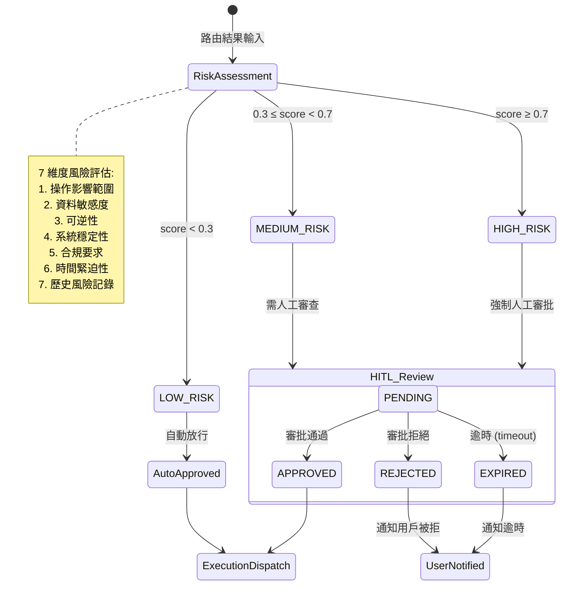

# Layer 04: Input & Routing

> **V9 Deep Analysis** | Orchestration Module (`backend/src/integrations/orchestration/`)
> Phase 28 (Sprints 91-99) + Sprint 111/116/119/128 | **55+ files, ~16,000 LOC**

---

## 1. Identity

| Attribute | Value |
|-----------|-------|
| **Layer** | L04 — Input & Routing |
| **Module Path** | `backend/src/integrations/orchestration/` |
| **Sub-Layers** | L4a (Input Processing), L4b (Decision Engine) |
| **Primary Purpose** | Receive multi-source inputs, classify IT intents via 3-tier cascade, assess risk, gate high-risk operations through HITL approval |
| **ITIL Alignment** | Incident, Request, Change, Query (4 primary categories + UNKNOWN) |
| **Phase** | 28 (core), extended by Sprint 111 (UnifiedApprovalManager), Sprint 116 (contracts), Sprint 119 (Redis centralization) |
| **Key Design Decision** | Incremental dialog updates use rule-based sub-intent refinement, NEVER LLM re-classification |

---

### 三層意圖路由總覽

```
┌─────────────────────────────────────────────────────────────────────────────┐
│                    L04 三層意圖分類管線                                      │
├─────────────────────────────────────────────────────────────────────────────┤
│                                                                             │
│  用戶輸入 (Web UI / API / ServiceNow / Prometheus)                         │
│       │                                                                     │
│       ↓                                                                     │
│  ┌──────────────────────────────────────────────────────────┐               │
│  │  L1: PatternMatcher (規則匹配)                           │               │
│  │  • YAML-loaded regex rules, priority-sorted              │               │
│  │  • 411 LOC | 速度: <1ms                                  │               │
│  │  • 匹配 → confidence ≥ 0.90? ──→ ✓ 直接路由             │               │
│  └─────────────┬────────────────────────────────────────────┘               │
│                │ 未匹配 (confidence < 0.8)                                  │
│                ↓                                                             │
│  ┌──────────────────────────────────────────────────────────┐               │
│  │  L2: SemanticRouter (語義路由)                            │               │
│  │  • Aurelio 向量相似度 / Azure AI Search                   │               │
│  │  • 15 predefined routes, 75 utterances                   │               │
│  │  • 匹配 → confidence ≥ 0.7? ──→ ✓ 語義路由              │               │
│  └─────────────┬────────────────────────────────────────────┘               │
│                │ 未匹配 (confidence < 0.7)                                  │
│                ↓                                                             │
│  ┌──────────────────────────────────────────────────────────┐               │
│  │  L3: LLMClassifier (LLM 分類)                            │               │
│  │  • Azure OpenAI GPT-4o, Traditional Chinese prompts      │               │
│  │  • 294 LOC | 帶快取 (ClassificationCache)                │               │
│  │  • 多任務: 意圖 + 風險 + 完整度 一次推理                 │               │
│  └─────────────┬────────────────────────────────────────────┘               │
│                │                                                             │
│                ↓                                                             │
│  ┌──────────────────────────────────────────────────────────┐               │
│  │  CompletenessChecker (資訊完整度)                         │               │
│  │  • 缺少必要欄位? ──→ GuidedDialogEngine (引導式對話)     │               │
│  │  • 資訊完整 ──→ RiskAssessor (風險評估)                   │               │
│  └──────────────────────────────────────────────────────────┘               │
│                                                                             │
└─────────────────────────────────────────────────────────────────────────────┘
```

### Intent → 工作流類型映射

```
┌─────────────────────────────────────────────────────────────────────────────┐
│                 ITIntentCategory → WorkflowType 映射                        │
├─────────────────────────────────────────────────────────────────────────────┤
│                                                                             │
│  ITIntentCategory          RiskLevel        WorkflowType                    │
│  ─────────────────         ─────────        ────────────                    │
│  INCIDENT (事件)     ──→   HIGH        ──→  MAGENTIC (多Agent協作)          │
│    ├ server_down                             需要診斷+修復+驗證             │
│    └ service_outage                                                         │
│                                                                             │
│  REQUEST (請求)      ──→   MEDIUM      ──→  HANDOFF (逐步交接)             │
│    ├ access_request                          需要多部門審批                 │
│    └ resource_provision                                                     │
│                                                                             │
│  CHANGE (變更)       ──→   HIGH        ──→  SEQUENTIAL (順序執行)           │
│    ├ config_change                           需要嚴格步驟控制               │
│    └ deployment                                                             │
│                                                                             │
│  QUERY (查詢)        ──→   LOW         ──→  SIMPLE (直接回答)               │
│    ├ status_check                            單輪對話即可                   │
│    └ knowledge_lookup                                                       │
│                                                                             │
│  UNKNOWN (未知)      ──→   MEDIUM      ──→  GuidedDialog (引導澄清)        │
│    └ ambiguous_input                         需要更多資訊                   │
│                                                                             │
└─────────────────────────────────────────────────────────────────────────────┘
```

### 風險評估與 HITL 審批流程



---

## 2. File Inventory (55 files)

### 2.1 Intent Router (14 files, ~3,815 LOC)

| File | LOC | Sprint | Purpose |
|------|-----|--------|---------|
| `intent_router/router.py` | 639 | S93 | `BusinessIntentRouter` — 3-layer coordinator with metrics, `RouterConfig.from_env()`, factory functions `create_router()` + `create_router_with_llm()` |
| `intent_router/models.py` | 450 | S91 | `ITIntentCategory`, `RiskLevel`, `WorkflowType`, `RoutingDecision`, `PatternMatchResult`, `SemanticRouteResult`, `LLMClassificationResult`, `CompletenessInfo`, `PatternRule`, `SemanticRoute` |
| `intent_router/pattern_matcher/matcher.py` | 411 | S91 | `PatternMatcher` — YAML-loaded regex rules, priority-sorted, pre-compiled |
| `intent_router/pattern_matcher/__init__.py` | ~10 | S91 | Re-exports |
| `intent_router/semantic_router/router.py` | ~350 | S92 | `SemanticRouter` — vector similarity via Aurelio library |
| `intent_router/semantic_router/routes.py` | 373 | S92 | 15 predefined `SemanticRoute` definitions (75 utterances) |
| `intent_router/semantic_router/route_manager.py` | ~200 | S92 | Route CRUD management |
| `intent_router/semantic_router/azure_semantic_router.py` | ~300 | S116 | Azure AI Search backed semantic router |
| `intent_router/semantic_router/azure_search_client.py` | ~200 | S116 | `AzureSearchClient` — Azure AI Search client wrapper (17 methods: `__init__`, `_retry_with_backoff`, `_vector_search_sync`, `_hybrid_search_sync`, `_upload_documents_sync`, `search`, `upload_routes`, `delete_routes`, `ensure_index`) |
| `intent_router/semantic_router/embedding_service.py` | ~150 | S116 | Embedding generation service |
| `intent_router/semantic_router/setup_index.py` | ~100 | S116 | Index setup script |
| `intent_router/semantic_router/migration.py` | ~100 | S116 | Migration utilities |
| `intent_router/semantic_router/__init__.py` | ~10 | S92 | Re-exports |
| `intent_router/llm_classifier/classifier.py` | 294 | S92/S128 | `LLMClassifier` — uses `LLMServiceProtocol`, graceful degradation |
| `intent_router/llm_classifier/prompts.py` | 231 | S92 | Multi-task classification prompt (Traditional Chinese), simplified prompt variant |
| `intent_router/llm_classifier/cache.py` | ~150 | S92 | `ClassificationCache` for LLM result caching |
| `intent_router/llm_classifier/evaluation.py` | ~200 | S99 | Classification quality evaluation |
| `intent_router/llm_classifier/__init__.py` | ~10 | S92 | Re-exports |
| `intent_router/completeness/checker.py` | ~250 | S93 | `CompletenessChecker` — field validation per intent |
| `intent_router/completeness/rules.py` | ~200 | S93 | Completeness field requirement rules |
| `intent_router/completeness/__init__.py` | ~10 | S93 | Re-exports |
| `intent_router/contracts.py` | ~100 | S116 | Intent router specific contracts |
| `intent_router/__init__.py` | ~50 | S91 | Re-exports |

### 2.2 Guided Dialog (4 files, ~3,530 LOC)

| File | LOC | Sprint | Purpose |
|------|-----|--------|---------|
| `guided_dialog/engine.py` | 593 | S94 | `GuidedDialogEngine` — multi-turn orchestration (max 5 turns), phases: initial->gathering->complete->handoff. Integrates BusinessIntentRouter, ConversationContextManager, QuestionGenerator, RefinementRules |
| `guided_dialog/context_manager.py` | 1,102 | S94/S97 | `ConversationContextManager` + `PersistentConversationContextManager` (Redis) + `RedisDialogSessionStorage` + `InMemoryDialogSessionStorage` |
| `guided_dialog/generator.py` | ~1,151 | S94 | `QuestionGenerator` — template-based question generation per intent |
| `guided_dialog/refinement_rules.py` | ~622 | S94 | `RefinementRules` — rule-based sub-intent refinement (NOT LLM) |
| `guided_dialog/__init__.py` | ~10 | S94 | Re-exports |

### 2.3 Input Gateway (8 files, ~2,302 LOC)

| File | LOC | Sprint | Purpose |
|------|-----|--------|---------|
| `input_gateway/gateway.py` | 370 | S95 | `InputGateway` — source detection, handler dispatch |
| `input_gateway/models.py` | 278 | S95 | `IncomingRequest`, `SourceType`, `GatewayConfig`, `GatewayMetrics` |
| `input_gateway/schema_validator.py` | ~200 | S95 | JSON schema validation for webhooks |
| `input_gateway/source_handlers/base_handler.py` | ~100 | S95 | `BaseSourceHandler` abstract class |
| `input_gateway/source_handlers/servicenow_handler.py` | ~300 | S95 | ServiceNow ticket field mapping |
| `input_gateway/source_handlers/prometheus_handler.py` | ~250 | S95 | Prometheus alert mapping |
| `input_gateway/source_handlers/user_input_handler.py` | ~200 | S95 | User text to full routing pipeline |
| `input_gateway/source_handlers/__init__.py` | ~10 | S95 | Re-exports |
| `input_gateway/__init__.py` | ~10 | S95 | Re-exports |

### 2.4 Risk Assessor (3 files, ~1,350 LOC)

| File | LOC | Sprint | Purpose |
|------|-----|--------|---------|
| `risk_assessor/assessor.py` | 639 | S96 | `RiskAssessor` — 7 risk dimensions, context-aware scoring |
| `risk_assessor/policies.py` | 712 | S96 | `RiskPolicies` — 26 ITIL-aligned policies + factory functions |
| `risk_assessor/__init__.py` | ~10 | S96 | Re-exports |

### 2.5 HITL Controller (5 files, ~2,213+ LOC)

| File | LOC | Sprint | Purpose |
|------|-----|--------|---------|
| `hitl/controller.py` | 834 | S97/S112/S119 | `HITLController`, `InMemoryApprovalStorage`, approval lifecycle (PENDING/APPROVED/REJECTED/EXPIRED/CANCELLED), Redis factory, quorum-based multi-approver support |
| `hitl/approval_handler.py` | 694 | S97 | `ApprovalHandler`, `RedisApprovalStorage` with TTL |
| `hitl/notification.py` | 733 | S97 | `TeamsNotificationService`, `TeamsCardBuilder`, `CompositeNotificationService` |
| `hitl/unified_manager.py` | 546 | S111 | `UnifiedApprovalManager` — consolidated approval for 5 sources |
| `hitl/__init__.py` | ~30 | S97 | Re-exports |

### 2.6 Contracts & Cross-Cutting (5 files)

| File | LOC | Sprint | Purpose |
|------|-----|--------|---------|
| `contracts.py` | 359 | S116 | L4a/L4b interface: `RoutingRequest`, `RoutingResult`, `InputGatewayProtocol`, `RouterProtocol`, bridge adapters |
| `metrics.py` | ~893 | S99 | `OrchestrationMetricsCollector` — OpenTelemetry integration |
| `audit/logger.py` | ~281 | S99 | `AuditLogger` — structured JSON audit logging |
| `input/` | ~4 files | S95/S116 | Legacy input handling (ServiceNow webhook, RITM mapper, incident handler) |
| `__init__.py` | ~100 | — | 57 organized exports |

---

## 3. Architecture Diagram

```
                        ┌─────────────────────────────────────────────────┐
                        │              External Sources                    │
                        │  ServiceNow    Prometheus    User Chat    API    │
                        └────┬──────────────┬────────────┬─────────┬──────┘
                             │              │            │         │
                        ═════╪══════════════╪════════════╪═════════╪══════════
                        L4a  │  INPUT PROCESSING                          │
                        ═════╪════════════════════════════════════════════ │
                             │              │            │         │
                     ┌───────▼──────────────▼────────────▼─────────▼──────┐
                     │                  InputGateway                       │
                     │  _identify_source() → header/source_type detection │
                     │  SchemaValidator (JSON schema for webhooks)         │
                     └───────┬──────────────┬────────────┬────────────────┘
                             │              │            │
              ┌──────────────▼──┐   ┌───────▼──────┐  ┌─▼──────────────────┐
              │ ServiceNowHandler│   │PrometheusHdlr│  │ UserInputHandler   │
              │ ticket mapping   │   │ alert mapping│  │ → BusinessRouter   │
              │ < 10ms target    │   │ < 10ms       │  │                    │
              └──────┬──────────┘   └──────┬───────┘  └─┬──────────────────┘
                     │                     │            │
                     └─────────┬───────────┘            │
                               │                        │
                     ┌─────────▼─────────┐              │
                     │  RoutingRequest    │◄─────────────┘
                     │  (contracts.py)    │
                     └─────────┬─────────┘
                               │
                     ══════════╪═══════════════════════════════════════════
                     L4b       │  DECISION ENGINE
                     ══════════╪═══════════════════════════════════════════
                               │
              ┌────────────────▼────────────────────────────────────┐
              │          BusinessIntentRouter (router.py)            │
              │  Cascade: Pattern → Semantic → LLM                  │
              │                                                     │
              │  ┌─────────────────────────────────────────┐       │
              │  │  Layer 1: PatternMatcher                 │       │
              │  │  < 10ms | 30+ regex rules from YAML     │       │
              │  │  confidence threshold: >= 0.90           │       │
              │  │  DEFAULT_CONFIDENCE = 0.95               │       │
              │  └──────────────┬──── miss ─────────────────┘       │
              │                 ▼                                    │
              │  ┌─────────────────────────────────────────┐       │
              │  │  Layer 2: SemanticRouter                 │       │
              │  │  < 100ms | 15 routes, 75 utterances      │       │
              │  │  similarity threshold: >= 0.85           │       │
              │  │  Aurelio library / Azure AI Search        │       │
              │  └──────────────┬──── miss ─────────────────┘       │
              │                 ▼                                    │
              │  ┌─────────────────────────────────────────┐       │
              │  │  Layer 3: LLMClassifier                  │       │
              │  │  < 2000ms | LLMServiceProtocol           │       │
              │  │  Azure OpenAI / Claude / Mock             │       │
              │  │  Multi-task prompt (classify + complete)  │       │
              │  │  Graceful degradation if unavailable      │       │
              │  └──────────────┬───────────────────────────┘       │
              └─────────────────┼───────────────────────────────────┘
                                │
                     ┌──────────▼──────────┐
                     │  RoutingDecision     │
                     │  intent_category     │
                     │  sub_intent          │
                     │  confidence          │
                     │  workflow_type       │
                     │  risk_level          │
                     │  routing_layer       │
                     │  completeness        │
                     └──────────┬──────────┘
                                │
                  ┌─────────────┤
                  │             │
        ┌────────▼────────┐    │
        │CompletenessCheck│    │
        │ is_complete?    │    │
        └───┬────────┬────┘    │
          YES        NO        │
            │         │        │
            │  ┌──────▼──────┐ │
            │  │GuidedDialog │ │
            │  │Engine       │ │
            │  │max 5 turns  │ │
            │  │rule-based   │ │
            │  │refinement   │ │
            │  └──────┬──────┘ │
            │         │        │
            ├─────────┘        │
            │                  │
     ┌──────▼──────┐          │
     │RiskAssessor │◄─────────┘
     │7 dimensions │
     │26 policies  │
     └──────┬──────┘
            │
     ┌──────▼──────┐
     │RiskAssessment│
     │requires_     │
     │approval?     │
     └──┬──────┬───┘
       YES     NO
        │       │
  ┌─────▼────┐  │    ┌──────────────────────┐
  │HITL      │  │    │ UnifiedApproval      │
  │Controller│──┼───►│ Manager (Sprint 111) │
  │Teams     │  │    │ 5 sources unified    │
  │notify    │  │    └──────────────────────┘
  └──────────┘  │
                ▼
        Workflow Execution
        (L05 / L06)
```

---

## 4. Sub-System Analysis

### 4.1 InputGateway (`input_gateway/`)

**Purpose**: Normalize multi-source inputs into a unified `IncomingRequest` then route to the appropriate handler.

**Source Detection Priority**:
1. HTTP header check (`x-servicenow-webhook`, `x-prometheus-alertmanager`)
2. Generic `x-webhook-source` header
3. Explicit `source_type` field on request
4. Default: `"user"`

**Source Types** (`SourceType` enum):

| Value | Handler | Processing Path |
|-------|---------|-----------------|
| `servicenow` | `ServiceNowHandler` | Simplified ticket mapping, < 10ms target |
| `prometheus` | `PrometheusHandler` | Alert mapping, < 10ms target |
| `user` | `UserInputHandler` | Full 3-layer routing |
| `api` | (via business router) | Full 3-layer routing |
| `unknown` | (via business router) | Full 3-layer routing |

**Key Classes**:
- `IncomingRequest` — Unified request model with factory methods: `from_user_input()`, `from_servicenow_webhook()`, `from_prometheus_webhook()`
- `GatewayConfig` — Environment-configurable: schema validation toggle, metrics toggle, max content length, header names
- `GatewayMetrics` — Per-source request counts, latency tracking (avg, p95), rolling window of 1000 measurements

**L4a/L4b Contract** (`contracts.py`, Sprint 116):

The contracts module defines the clean interface between Input Processing (L4a) and Decision Engine (L4b):

| Contract | Direction | Purpose |
|----------|-----------|---------|
| `RoutingRequest` | L4a output | Normalized query + context + source + metadata |
| `RoutingResult` | L4b output | Intent + confidence + workflow_type + risk_level + completeness |
| `InputGatewayProtocol` | L4a interface | `receive()` + `validate()` abstract methods |
| `RouterProtocol` | L4b interface | `route()` + `get_available_layers()` abstract methods |
| `InputSource` | Shared enum | 7 values: WEBHOOK_SERVICENOW, WEBHOOK_PROMETHEUS, HTTP_API, SSE_STREAM, USER_CHAT, RITM, UNKNOWN |

**Bridge Adapters** (backwards compatibility):
- `incoming_request_to_routing_request()` — Sprint 95 `IncomingRequest` to Sprint 116 `RoutingRequest`
- `routing_decision_to_routing_result()` — Sprint 93 `RoutingDecision` to Sprint 116 `RoutingResult`

---

### 4.2 BusinessIntentRouter (`intent_router/`)

**Purpose**: Three-layer cascading intent classification with decreasing speed but increasing accuracy.

**Core Enums** (`models.py`):

| Enum | Values | ITIL Basis |
|------|--------|------------|
| `ITIntentCategory` | INCIDENT, REQUEST, CHANGE, QUERY, UNKNOWN | ITIL v4 Service Management |
| `RiskLevel` | CRITICAL, HIGH, MEDIUM, LOW | ITIL Risk Framework |
| `WorkflowType` | MAGENTIC, HANDOFF, CONCURRENT, SEQUENTIAL, SIMPLE | Agent orchestration patterns |

**RouterConfig** (environment-configurable):

| Parameter | Default | Env Var |
|-----------|---------|---------|
| `pattern_threshold` | 0.90 | `PATTERN_CONFIDENCE_THRESHOLD` |
| `semantic_threshold` | 0.85 | `SEMANTIC_SIMILARITY_THRESHOLD` |
| `enable_llm_fallback` | true | `ENABLE_LLM_FALLBACK` |
| `enable_completeness` | true | `ENABLE_COMPLETENESS` |
| `track_latency` | true | `TRACK_LATENCY` |

**Routing Flow**:
1. Validate input (empty check)
2. Layer 1: `PatternMatcher.match()` -- if confidence >= 0.90, return
3. Layer 2: `SemanticRouter.route()` -- if similarity >= 0.85, return
4. Layer 3: `LLMClassifier.classify()` -- if enabled, final fallback
5. If all fail: return UNKNOWN with HANDOFF workflow

**Workflow Type Mapping** (from `_get_workflow_type()`):

| Intent | Sub-Intent | Workflow |
|--------|-----------|----------|
| INCIDENT | system_unavailable, system_down | MAGENTIC |
| INCIDENT | (other) | SEQUENTIAL |
| CHANGE | release_deployment, database_change | MAGENTIC |
| CHANGE | (other) | SEQUENTIAL |
| REQUEST | * | SIMPLE |
| QUERY | * | SIMPLE |
| UNKNOWN | * | HANDOFF |

**Risk Level Keyword Detection** (from `_get_risk_level()`):

| Keywords (ZH/EN) | Intent | Result |
|-------------------|--------|--------|
| `urgent`, `critical`, `stop`, `crash` | INCIDENT | CRITICAL |
| `affect`, `production`, `cannot`, `business`, `customer` | INCIDENT | HIGH |
| `production`, `database` | CHANGE | HIGH |
| (any) | QUERY | LOW |

**RoutingMetrics**: Tracks total_requests, pattern_matches, semantic_matches, llm_fallbacks, latency (avg, p95) with rolling window of 1000.

**Factory Functions**:
- `create_router()` — Full manual configuration
- `create_router_with_llm()` — Production factory using `LLMServiceFactory.create()` with fallback

#### 4.2.1 Layer 1: PatternMatcher (`pattern_matcher/matcher.py`)

| Attribute | Value |
|-----------|-------|
| **Target Latency** | < 10ms |
| **Default Confidence** | 0.95 |
| **Min Threshold** | 0.50 |
| **Rule Source** | YAML file or dictionary |
| **Regex Flags** | `re.IGNORECASE \| re.UNICODE` |

**Confidence Calculation Formula**:
```
confidence = DEFAULT_CONFIDENCE * (
    0.70                             +   // base weight
    0.10 * coverage_factor           +   // match_length / input_length
    0.10 * priority_factor           +   // rule.priority / 200
    0.10 * position_factor               // 1.0 - (start_pos / length) * 0.1
)
```

**Key Features**:
- Rules sorted by priority (descending) at load time
- Pre-compiled patterns stored as `CompiledRule` with `(Pattern, str)` tuples
- `match()` returns first match; `match_all()` returns up to N matches
- Dynamic rule management: `add_rule()`, `remove_rule()`, `reload_rules()`
- Statistics API: total_rules, total_patterns, load_time_ms, category_distribution

#### 4.2.2 Layer 2: SemanticRouter — 15 Semantic Routes

| # | Route Name | Category | Sub-Intent | Workflow | Risk | Utterances |
|---|-----------|----------|------------|----------|------|------------|
| 1 | `incident_etl` | INCIDENT | etl_failure | MAGENTIC | HIGH | 5 (ETL pipeline/sync failures) |
| 2 | `incident_network` | INCIDENT | network_issue | MAGENTIC | HIGH | 5 (connectivity, disconnection) |
| 3 | `incident_performance` | INCIDENT | performance_degradation | MAGENTIC | MEDIUM | 5 (slowness, lag, loading) |
| 4 | `incident_system_down` | INCIDENT | system_unavailable | MAGENTIC | CRITICAL | 5 (outage, service down) |
| 5 | `request_account` | REQUEST | account_creation | SEQUENTIAL | LOW | 5 (new account requests) |
| 6 | `request_access` | REQUEST | permission_change | SEQUENTIAL | MEDIUM | 5 (permission requests) |
| 7 | `request_software` | REQUEST | software_installation | SIMPLE | LOW | 5 (install software) |
| 8 | `request_password` | REQUEST | password_reset | SIMPLE | MEDIUM | 5 (forgot/locked/expired password) |
| 9 | `change_deployment` | CHANGE | release_deployment | MAGENTIC | HIGH | 5 (deploy, release, production) |
| 10 | `change_config` | CHANGE | configuration_update | SEQUENTIAL | MEDIUM | 5 (config, settings changes) |
| 11 | `change_database` | CHANGE | database_change | MAGENTIC | HIGH | 5 (schema, migration, DB changes) |
| 12 | `query_status` | QUERY | status_inquiry | SIMPLE | LOW | 5 (system status checks) |
| 13 | `query_report` | QUERY | report_request | SIMPLE | LOW | 5 (report generation) |
| 14 | `query_ticket` | QUERY | ticket_status | SIMPLE | LOW | 5 (ticket progress inquiries) |
| 15 | `query_documentation` | QUERY | documentation_request | SIMPLE | LOW | 5 (help, manual, documentation) |

**Totals**: 4 Incident + 4 Request + 3 Change + 4 Query = **15 routes, 75 utterances**

All utterances are in **Traditional Chinese**, targeting Taiwan/Hong Kong enterprise IT.

#### 4.2.3 Layer 3: LLMClassifier (`llm_classifier/`)

| Attribute | Value |
|-----------|-------|
| **Target Latency** | < 2000ms |
| **Default Max Tokens** | 500 |
| **Default Temperature** | 0.0 (deterministic) |
| **Interface** | `LLMServiceProtocol` (Sprint 128 migration) |
| **Graceful Degradation** | Returns UNKNOWN with confidence 0.0 when no LLM service |

**Prompt Design** (Traditional Chinese, multi-task):
1. Intent classification (incident/request/change/query)
2. Sub-intent determination
3. Completeness assessment with required fields per category
4. Missing field identification with suggestions

**Required Fields by Intent Category**:

| Category | Required Fields |
|----------|----------------|
| INCIDENT | Problem description (what), Impact scope (scope), Timing (when) |
| REQUEST | Request content (what), Requester (who), Reason (why, partial) |
| CHANGE | Change content (what), Change reason (why), Expected time (when) |
| QUERY | Query content (what) |

**Response Parsing** (3-level fallback):
1. Direct JSON parse
2. Extract JSON from markdown code blocks
3. Regex extract `{...}` from text
4. Keyword-based text extraction (incident/request/change/query keywords)

---

### 4.3 GuidedDialogEngine (`guided_dialog/`)

**Purpose**: Multi-turn information gathering when initial input lacks required fields. Key design principle: **rule-based sub-intent refinement only, zero LLM re-classification during dialog**.

**Dialog Lifecycle**:
```
start_dialog(user_input)
    → route via BusinessIntentRouter
    → check completeness
    → if incomplete: generate questions, enter "gathering" phase
    → if complete: enter "complete" phase

process_response(user_response)     [max 5 turns]
    → extract fields (rule-based regex)
    → update collected_info
    → refine sub_intent (rule-based)
    → recalculate completeness
    → if complete: "complete" phase
    → if max turns: "handoff" phase
    → else: generate next questions
```

**Dialog Phases**: `initial` → `gathering` → `complete` | `handoff` | `clarification`

**ConversationContextManager** — Field Extraction Patterns (10 categories):

| Category | Fields Extracted | Pattern Count |
|----------|-----------------|---------------|
| System Name | affected_system | 10 patterns (ETL, ERP, CRM, DB, API, mail, etc.) |
| Symptom Type | symptom_type | 7 patterns (error, slow, down, disconnect, timeout, login, abnormal) |
| Urgency | urgency | 3 levels (urgent, serious, normal) |
| Request Type | request_type | 6 patterns (account, permission, software, hardware, password, VPN) |
| Change Type | change_type | 4 patterns (deploy, config, upgrade, migration) |
| Error Message | error_message | Quoted text or `error:` patterns |
| Requester | requester | Name extraction from ZH patterns |
| Justification | justification | Reason extraction from ZH connectors |
| Target System | target_system | Context-based extraction |

**PersistentConversationContextManager** (Sprint 97):
- Extends base with Redis session persistence
- Session TTL: 30 minutes (configurable)
- Max turns: 10 (configurable)
- Auto-expire on inactivity
- Session recovery via `resume_session(session_id)`
- Storage backends: `RedisDialogSessionStorage` (production), `InMemoryDialogSessionStorage` (dev/test)

---

### 4.4 RiskAssessor (`risk_assessor/`)

**Purpose**: Evaluate routing decisions across 7 risk dimensions with configurable ITIL-aligned policies.

#### 4.4.1 Seven Risk Dimensions

| # | Dimension | Factor Name | Weight Range | Trigger |
|---|-----------|-------------|-------------|---------|
| 1 | Intent Category | `intent_category` | 0.2 - 0.8 | Always evaluated |
| 2 | Sub-Intent Severity | `sub_intent` | 0.1 - 0.5 | When sub_intent present |
| 3 | Production Environment | `is_production` | 0.3 (fixed) | `context.is_production == True` |
| 4 | Weekend Execution | `is_weekend` | 0.2 (fixed) | `context.is_weekend == True` |
| 5 | Urgency Flag | `is_urgent` | 0.15 (fixed) | `context.is_urgent == True` |
| 6 | Affected Systems Count | `affected_systems` | 0.1 * count (cap 0.3) | `len(systems) > 0` |
| 7 | Low Routing Confidence | `low_confidence` | 0.2 * (1 - confidence) | `confidence < 0.8` |

**Category Base Weights**:

| Category | Weight | Risk Direction |
|----------|--------|----------------|
| INCIDENT | 0.8 | High risk |
| CHANGE | 0.6 | Medium-high |
| UNKNOWN | 0.5 | Uncertain |
| REQUEST | 0.4 | Medium |
| QUERY | 0.2 | Low risk |

**High-Risk Sub-Intents** (weight overrides):

| Sub-Intent | Weight |
|------------|--------|
| system_down, system_unavailable, security_incident, emergency_change | 0.5 |
| etl_failure, database_change | 0.4 |
| access_request | 0.3 |

**Context Adjustments** (each can elevate risk by one level):
- Production environment: +1 level
- Weekend execution: +1 level
- Urgent flag: +1 level
- Multiple systems (> 3): +1 level

**Score Calculation**:
```
base_score = RISK_LEVEL_SCORES[final_level]   // LOW=0.25, MEDIUM=0.50, HIGH=0.75, CRITICAL=1.0
factor_adjustment = sum(factor.weight * 0.1 for each "increase" factor)
                  - sum(factor.weight * 0.1 for each "decrease" factor)
final_score = clamp(base_score + factor_adjustment, 0.0, 1.0)
```

**Approval Requirements**:

| Risk Level | Requires Approval | Approval Type |
|------------|-------------------|---------------|
| CRITICAL | Yes | `multi` (multiple approvers) |
| HIGH | Yes | `single` (one approver) |
| MEDIUM | No | `none` |
| LOW | No | `none` |

#### 4.4.2 Twenty-Six ITIL-Aligned Risk Policies

| # | Policy ID | Category | Sub-Intent | Default Risk | Approval | Priority |
|---|-----------|----------|------------|-------------|----------|----------|
| 1 | `incident_system_down` | INCIDENT | system_down | CRITICAL | multi | 200 |
| 2 | `incident_system_unavailable` | INCIDENT | system_unavailable | CRITICAL | multi | 200 |
| 3 | `incident_security_incident` | INCIDENT | security_incident | CRITICAL | multi | 200 |
| 4 | `incident_etl_failure` | INCIDENT | etl_failure | HIGH | single | 180 |
| 5 | `incident_network_failure` | INCIDENT | network_failure | HIGH | single | 175 |
| 6 | `incident_database_issue` | INCIDENT | database_issue | HIGH | single | 170 |
| 7 | `incident_hardware_failure` | INCIDENT | hardware_failure | HIGH | single | 165 |
| 8 | `incident_performance_issue` | INCIDENT | performance_issue | MEDIUM | none | 150 |
| 9 | `incident_software_issue` | INCIDENT | software_issue | MEDIUM | none | 140 |
| 10 | `incident_default` | INCIDENT | * | MEDIUM | none | 100 |
| 11 | `request_access_request` | REQUEST | access_request | HIGH | single | 160 |
| 12 | `request_account_request` | REQUEST | account_request | MEDIUM | none | 130 |
| 13 | `request_software_request` | REQUEST | software_request | MEDIUM | none | 120 |
| 14 | `request_hardware_request` | REQUEST | hardware_request | MEDIUM | none | 120 |
| 15 | `request_default` | REQUEST | * | LOW | none | 100 |
| 16 | `change_emergency_change` | CHANGE | emergency_change | CRITICAL | multi | 200 |
| 17 | `change_database_change` | CHANGE | database_change | HIGH | single | 175 |
| 18 | `change_release_deployment` | CHANGE | release_deployment | HIGH | single | 170 |
| 19 | `change_normal_change` | CHANGE | normal_change | HIGH | single | 150 |
| 20 | `change_configuration_update` | CHANGE | configuration_update | MEDIUM | none | 130 |
| 21 | `change_standard_change` | CHANGE | standard_change | MEDIUM | none | 120 |
| 22 | `change_default` | CHANGE | * | MEDIUM | none | 100 |
| 23 | `query_status_inquiry` | QUERY | status_inquiry | LOW | none | 110 |
| 24 | `query_documentation` | QUERY | documentation | LOW | none | 110 |
| 25 | `query_default` | QUERY | * | LOW | none | 100 |
| 26 | `unknown_default` | UNKNOWN | * | MEDIUM | none | 50 |

**Policy Lookup Order**: Exact match (category:sub_intent) → Category default (category:*) → Global default

**Policy Factory Functions**:
- `create_default_policies()` — Standard 26-policy set
- `create_strict_policies()` — Elevated: all incidents and changes require approval
- `create_relaxed_policies()` — Reduced: changes auto-approved in dev

---

### 4.5 HITLController (`hitl/`)

**Purpose**: Human-in-the-loop approval workflow management for high-risk operations. Coordinates approval lifecycle from creation through resolution/expiration.

#### 4.5.1 Original HITLController (Sprint 97)

**Approval Status Lifecycle**:
```
PENDING ──► APPROVED
        ├─► REJECTED
        ├─► EXPIRED    (auto-expire after timeout)
        └─► CANCELLED  (user-initiated)
```

**Storage Backends**:
- `InMemoryApprovalStorage` — Development/testing (dict-based)
- `RedisApprovalStorage` — Production (approval_handler.py, Sprint 97)
  - Key format: `approval:{request_id}`, `approval_history:{request_id}`, `approval_pending` (Set)
  - Pending TTL: 30 minutes
  - Completed TTL: 7 days (audit retention)

**Storage Selection** (Sprint 112/119 environment-aware):
- `testing`: InMemoryApprovalStorage directly
- `development`: Redis preferred, InMemory fallback with WARNING
- `production`: Redis required, RuntimeError if unavailable
- Sprint 119: Attempts centralized Redis client first (`src.infrastructure.redis_client`)

**Callback System**: Event-driven hooks for `on_approved`, `on_rejected`, `on_expired` events.

**Notification**: `TeamsNotificationService` sends Outlook Actionable Message cards via Incoming Webhooks.

**TeamsCardBuilder** — Fluent API for constructing approval cards:
- Risk-level color coding (Green/Orange/Red/DarkRed)
- Facts display (intent, sub-intent, risk level, score, approval type, expiry)
- Action buttons: Approve (HttpPOST), Reject (HttpPOST), View Details (OpenUri)
- Result notification cards for approved/rejected outcomes

**CompositeNotificationService**: Fan-out to multiple notification channels (Teams + Email placeholder).

#### 4.5.2 UnifiedApprovalManager (Sprint 111)

**Problem**: The platform had 4-5 independent approval systems that could not share state or coordinate:
1. Phase 28 `HITLController` (Orchestration)
2. AG-UI SSE approval flow
3. Claude SDK `ApprovalHook`
4. MAF `handoff_hitl`
5. Orchestrator Agent `request_approval` tool

**Solution**: `UnifiedApprovalManager` — single entry point for all approval workflows.

**ApprovalSource** enum: `ORCHESTRATION`, `AG_UI`, `CLAUDE_SDK`, `MAF_HANDOFF`, `ORCHESTRATOR_AGENT`

**Operating Modes**:
- With `ApprovalStore` (PostgreSQL-backed): Full persistent storage
- Without: In-memory dict fallback with warning

**Key Differences from Original HITLController**:

| Aspect | HITLController (S97) | UnifiedApprovalManager (S111) |
|--------|---------------------|-------------------------------|
| Scope | Orchestration only | All 5 approval sources |
| Storage | Redis-based | PostgreSQL via ApprovalStore |
| Request Model | Tightly coupled to RoutingDecision + RiskAssessment | Generic: title, description, tool_name, tool_args |
| Priority System | Risk-level based | Explicit ApprovalPriority enum |
| Callbacks | Sync event hooks | Async coroutine callbacks |
| Expiration | Check on access | Batch `check_expired()` method |
| Filtering | By approver | By user_id + source |

**NOTE**: Both systems coexist. The original HITLController is still used for Phase 28 orchestration-specific workflows, while UnifiedApprovalManager serves as the cross-cutting approval consolidation layer. This is a known architectural tension (see Known Issues).

---

## 5. Cross-Cutting Concerns

### 5.1 Metrics & Observability (`metrics.py`)

`OrchestrationMetricsCollector` (893 LOC) provides OpenTelemetry integration:
- Routing latency histograms (per-layer: pattern, semantic, LLM)
- Request counters (by source, intent category, routing layer)
- Risk assessment distribution
- HITL approval metrics
- Completeness scores

### 5.2 Audit Logging (`audit/logger.py`)

`AuditLogger` (281 LOC) provides structured JSON audit logging:
- All routing decisions logged with full context
- Approval events logged with actor, timestamp, metadata
- Risk assessment results logged

### 5.3 Configuration Strategy

All major components support environment-based configuration:
- `RouterConfig.from_env()`
- `GatewayConfig.from_env()`
- HITL storage selection via `APP_ENV`
- Redis connection via `REDIS_HOST`/`REDIS_PORT`/`REDIS_PASSWORD`

---

## 6. Known Issues

### 6.1 Dual Approval Systems (CRITICAL)

The coexistence of `HITLController` (Sprint 97) and `UnifiedApprovalManager` (Sprint 111) creates ambiguity:
- Two different storage backends (Redis vs PostgreSQL/ApprovalStore)
- Two different request models (`ApprovalRequest` in controller.py vs `ApprovalRequest` in unified_manager.py — same class name, different schemas)
- No migration path or adapter between the two
- Risk of approval state fragmentation if both are active simultaneously

**Recommendation**: Migrate all Phase 28 approval flows to UnifiedApprovalManager and deprecate the original HITLController's approval storage.

### 6.2 InMemory Storage in Non-Test Contexts (HIGH)

Multiple components default to in-memory storage:
- `InMemoryApprovalStorage` (controller.py)
- `InMemoryDialogSessionStorage` (context_manager.py)
- UnifiedApprovalManager in-memory fallback

In development mode, data loss on restart is silently accepted with only a WARNING log. This can cause confusing behavior during local development.

### 6.3 Semantic Router Library Dependency (MEDIUM)

The original `SemanticRouter` uses the Aurelio `semantic-router` library for vector similarity, but Sprint 116 introduced Azure AI Search as an alternative backend. The two implementations coexist without a clear migration path or feature flag.

### 6.4 LLM Prompt Language Lock-in (LOW)

The classification prompt in `prompts.py` is hardcoded in Traditional Chinese. While appropriate for the Taiwan/HK target market, this prevents localization without code changes. Could be addressed by externalizing prompts to configuration.

### 6.5 datetime.utcnow() Deprecation (LOW)

Multiple files use `datetime.utcnow()` which is deprecated in Python 3.12+. The `unified_manager.py` (Sprint 111) correctly uses `datetime.now(timezone.utc)`, but earlier Sprint 91-99 code has not been updated.

### 6.6 Thread Safety in RoutingMetrics (LOW)

`RoutingMetrics.latencies` list is mutated without locking. In a multi-worker async context this is generally safe (GIL), but could be an issue with true multi-threading.

---

## 7. Phase Evolution Timeline

| Sprint | Phase | Component | Key Deliverable |
|--------|-------|-----------|-----------------|
| **S91** | 28 | PatternMatcher | Regex rules engine, YAML config, priority system |
| **S92** | 28 | SemanticRouter + LLMClassifier | 15 semantic routes, 75 utterances, Claude Haiku fallback |
| **S93** | 28 | BusinessIntentRouter | 3-layer coordinator, CompletenessChecker, workflow mapping |
| **S94** | 28 | GuidedDialogEngine | Multi-turn dialog, ConversationContextManager, QuestionGenerator |
| **S95** | 28 | InputGateway | Source handlers (ServiceNow, Prometheus, User), schema validation |
| **S96** | 28 | RiskAssessor | 7 risk dimensions, 26 ITIL policies, context adjustments |
| **S97** | 28 | HITLController | Approval workflows, RedisApprovalStorage, TeamsNotificationService |
| **S99** | 28 | Metrics + Tests | OrchestrationMetricsCollector (OpenTelemetry), E2E test suite |
| **S111** | 35 | UnifiedApprovalManager | Consolidated 5-source approval, PostgreSQL ApprovalStore |
| **S116** | 36 | Contracts + Azure Search | L4a/L4b interface contracts, Azure AI Search semantic router |
| **S119** | 37 | Redis Centralization | Centralized Redis client for HITL storage, environment-aware factory |
| **S128** | 40 | LLMServiceProtocol | Migrated LLMClassifier from direct anthropic SDK to LLMServiceProtocol |

---

## 8. Integration Points

### 8.1 Upstream (Input Sources)

| Source | Entry Point | Protocol |
|--------|-------------|----------|
| ServiceNow | `InputGateway` via webhook | HTTP POST with `x-servicenow-webhook` header |
| Prometheus | `InputGateway` via Alertmanager | HTTP POST with `x-prometheus-alertmanager` header |
| User Chat | `InputGateway` via `IncomingRequest.from_user_input()` | Direct method call |
| API Client | `api/v1/orchestration/` routes | REST API |
| RITM | `input/ritm_intent_mapper.py` | ServiceNow RITM integration |

### 8.2 Downstream (Consumers)

| Consumer | Interface | Data |
|----------|-----------|------|
| Hybrid Layer (L05) | `RoutingDecision` | Intent + workflow_type → MAF vs Claude SDK selection |
| Agent Execution (L06) | `WorkflowType` | MAGENTIC/SEQUENTIAL/SIMPLE → execution strategy |
| AG-UI SSE | `RoutingResult` (via contracts) | Real-time routing status events |
| Frontend | `DialogResponse` | Questions, state, completion status |
| Teams | `TeamsNotificationService` | Approval request/result cards |

### 8.3 Infrastructure Dependencies

| Dependency | Component | Required |
|------------|-----------|----------|
| Redis | HITL storage, Dialog sessions | Production only |
| PostgreSQL | UnifiedApprovalManager via ApprovalStore | When using persistent store |
| Azure OpenAI | LLMClassifier (Layer 3) | Optional (graceful degradation) |
| Azure AI Search | Azure SemanticRouter (Sprint 116) | Optional alternative to Aurelio |
| httpx | TeamsNotificationService | For Teams webhook calls |
| PyYAML | PatternMatcher rule loading | For YAML rule files |

---

## 9. Data Flow Example: End-to-End

**Scenario**: User types `"ETL 今天跑失敗了，很緊急"` in chat.

```
1. IncomingRequest.from_user_input("ETL 今天跑失敗了，很緊急")
   → source_type = "user"

2. InputGateway.process(request)
   → _identify_source() = "user"
   → delegates to BusinessIntentRouter

3. BusinessIntentRouter.route("ETL 今天跑失敗了，很緊急")
   │
   ├─ Layer 1: PatternMatcher.match()
   │  → matched_pattern: "ETL.*失敗" (rule: incident_etl)
   │  → confidence: 0.95
   │  → MATCH (>= 0.90 threshold)
   │
   └─ Result: RoutingDecision(
        intent_category = INCIDENT,
        sub_intent = "etl_failure",
        confidence = 0.95,
        workflow_type = SEQUENTIAL,
        risk_level = CRITICAL,        // "緊急" keyword → CRITICAL
        routing_layer = "pattern",
        completeness.is_complete = False,
        completeness.missing_fields = ["影響範圍", "發生時間"]
      )

4. GuidedDialogEngine.start_dialog()
   → incomplete → generate questions:
     "1. 請問影響範圍有多大？(影響哪些系統/用戶)"
     "2. 問題是什麼時候開始發生的？"

5. User responds: "影響到整個資料倉儲，今天早上 8 點開始"

6. ConversationContextManager.update_with_user_response()
   → extract: { affected_system: "ETL", urgency: "緊急" }
   → refine_sub_intent: "etl_failure" (confirmed)
   → recalculate completeness: 1.0 (complete)

7. RiskAssessor.assess(routing_decision, context)
   → policy: incident_etl_failure (HIGH)
   → context adjustments: "緊急" → elevate to CRITICAL
   → score: 0.92
   → requires_approval: True, approval_type: "multi"

8. HITLController.request_approval()
   → create ApprovalRequest
   → save to Redis
   → TeamsNotificationService → Teams channel card
   → await approval decision

9. Approver clicks "Approve" in Teams
   → process_approval(approved=True)
   → workflow execution proceeds (SEQUENTIAL workflow)
```

---

*Analysis generated: 2026-03-29 | Source: 55 Python files in `backend/src/integrations/orchestration/`*
