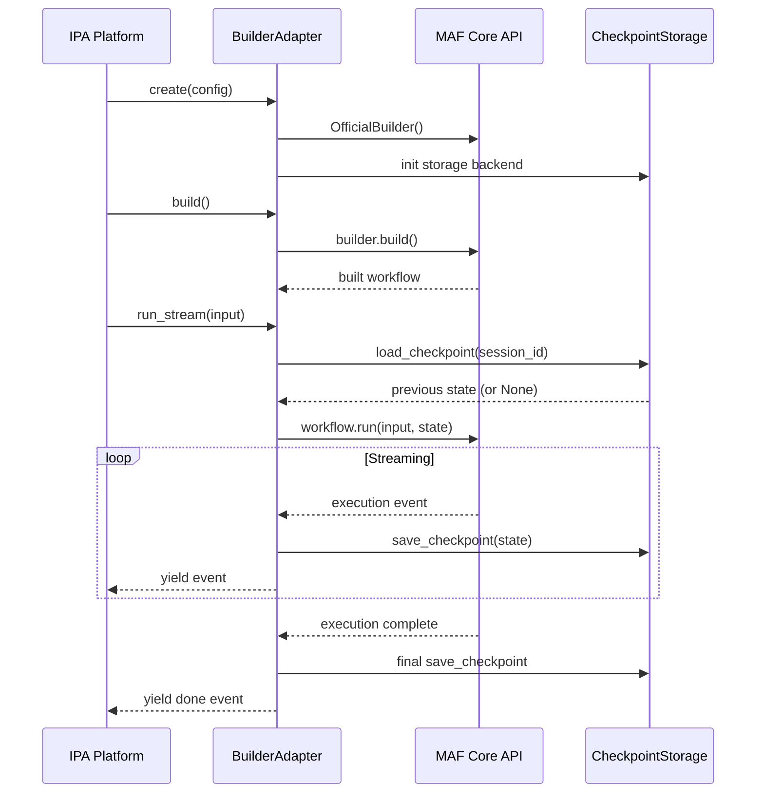

# Layer 06: MAF Builder Layer

> **V9 Codebase Analysis** | Analysis Date: 2026-03-29
> Scope: `backend/src/integrations/agent_framework/` — 56 Python files across 8 subdirectories

---

## 1. Identity

| Attribute | Value |
|-----------|-------|
| **Layer Name** | MAF Builder Layer (Layer 06) |
| **Location** | `backend/src/integrations/agent_framework/` |
| **Purpose** | Adapter layer wrapping Microsoft Agent Framework (MAF) official API for IPA Platform integration |
| **Pattern** | Adapter Pattern — every builder wraps an official MAF `XxxBuilder` class |
| **MAF Version** | `1.0.0rc4` (Release Candidate, upgraded from 1.0.0b251204) |
| **Python Version** | >= 3.11 |
| **Internal Version** | `0.1.0` |
| **Total Files** | 57 `.py` files (excluding `__pycache__`, R7 verified) |
| **Verified LOC** | **38,082 lines** (R4 verified via `wc -l`, root=2,194 + builders=24,215 + core=5,695 + acl/memory/multiturn/assistant/tools=5,978) |
| **Phase Coverage** | Phase 1-4 (Sprint 14-24), Phase 5 (Sprint 26-28), Phase 6 (Sprint 31), Phase 7 (Sprint 37-38), Phase 8 (Sprint 54), Phase 42 (Sprint 126-128) |

### Design Principle

```
IPA Platform Application Layer
    ↓
Adapter Layer (this module)
    ├── BuilderAdapter subclasses (9 builder adapters)
    ├── Core Adapters (Workflow, Executor, Edge, Events, Approval)
    ├── ACL (Anti-Corruption Layer)
    ├── Memory / MultiTurn / Tools subsystems
    └── Assistant (Code Interpreter)
    ↓
Microsoft Agent Framework Core API
    (agent_framework package — preview)
```

---

### MAF Builder Adapter 架構總覽

```
┌─────────────────────────────────────────────────────────────────────────────┐
│                    MAF Builder Adapter 架構                                  │
├─────────────────────────────────────────────────────────────────────────────┤
│                                                                             │
│  IPA Platform Application Layer                                             │
│       │                                                                     │
│       ↓                                                                     │
│  ┌──────────────────────────────────────────────────────────────────┐       │
│  │  BuilderAdapter[T, R] (Abstract Generic Base)                    │       │
│  │  base.py — lifecycle: init → build (lazy) → run/run_stream       │       │
│  └───────────────────────────┬──────────────────────────────────────┘       │
│                              │                                              │
│       ┌──────────┬───────────┼───────────┬───────────┐                      │
│       ↓          ↓           ↓           ↓           ↓                      │
│  ┌─────────┐┌─────────┐┌─────────┐┌──────────┐┌──────────┐                │
│  │Concurrent││ Handoff ││GroupChat││ Magentic ││  Swarm   │                │
│  │Builder  ││Builder  ││Builder  ││ Builder  ││ Builder  │                │
│  │1,634 LOC││1,427 LOC││1,466 LOC││1,810 LOC ││1,800 LOC │                │
│  │4 modes  ││策略交接 ││群聊投票 ││多Agent   ││並行群集  │                │
│  └─────────┘└─────────┘└─────────┘└──────────┘└──────────┘                │
│       ┌──────────┬───────────┬───────────┐                                  │
│       ↓          ↓           ↓           ↓                                  │
│  ┌─────────┐┌─────────┐┌─────────┐┌──────────┐                             │
│  │ Custom  ││ A2A     ││ Edge    ││Assistant │                             │
│  │ Builder ││ Builder ││Routing  ││(Code Int)│                             │
│  │3,024 LOC││1,321 LOC││ 884 LOC ││ 923 LOC  │                             │
│  │DSL 定義 ││跨系統   ││條件路由 ││程式解讀  │                             │
│  └─────────┘└─────────┘└─────────┘└──────────┘                             │
│       │          │           │           │                                  │
│       └──────────┴───────────┴───────────┘                                  │
│                              │                                              │
│                              ↓                                              │
│  ┌──────────────────────────────────────────────────────────────────┐       │
│  │  Microsoft Agent Framework Core API (agent_framework 1.0.0rc4)   │       │
│  │  ConcurrentBuilder, HandoffBuilder, GroupChatBuilder, etc.       │       │
│  └──────────────────────────────────────────────────────────────────┘       │
│                                                                             │
└─────────────────────────────────────────────────────────────────────────────┘
```

### Checkpoint 存儲後端

```
┌─────────────────────────────────────────────────────────────────────────────┐
│                    Checkpoint 三層存儲架構                                   │
├─────────────────────────────────────────────────────────────────────────────┤
│                                                                             │
│  Agent Execution (run/run_stream)                                           │
│       │                                                                     │
│       ↓  save_checkpoint() / load_checkpoint()                             │
│  ┌──────────────────────────────────────────────────────────────┐          │
│  │          CachedCheckpointStorage (組合模式)                   │          │
│  │          primary + cache 雙層寫入                             │          │
│  └──────────────┬───────────────────────┬───────────────────────┘          │
│                 │ write-through          │ read (cache-first)               │
│                 ↓                        ↓                                  │
│  ┌──────────────────────┐  ┌──────────────────────┐                        │
│  │ PostgresCheckpoint   │  │ RedisCheckpointCache  │                        │
│  │ Storage (持久化)      │  │ (快取加速)            │                        │
│  │                      │  │                      │                        │
│  │ • SQLAlchemy text()  │  │ • TTL: 3600s (1hr)  │                        │
│  │ • 永久保存           │  │ • 自動過期            │                        │
│  │ • 查詢歷史記錄       │  │ • 高速讀取            │                        │
│  └──────────────────────┘  └──────────────────────┘                        │
│                                                                             │
│  ⚠️ InMemoryCheckpointStorage (開發/測試用)                                │
│  • 進程重啟後資料遺失  • 不適合生產環境  • ⚠ VOLATILE                     │
│                                                                             │
└─────────────────────────────────────────────────────────────────────────────┘
```

### Builder 生命週期



---

## 2. File Inventory

### 2.1 Root Files (5 files)

| File | LOC (est.) | Sprint | Purpose |
|------|-----------|--------|---------|
| `__init__.py` | 166 | S14 | Unified re-exports, version info, public API surface |
| `base.py` | 328 | S13 | `BaseAdapter` (ABC) + `BuilderAdapter[T, R]` (Generic) — lifecycle, build, run, run_stream |
| `exceptions.py` | 399 | S13 | 8 exception classes: `AdapterError`, `AdapterInitializationError`, `WorkflowBuildError`, `ExecutionError`, `CheckpointError`, `ValidationError`, `ConfigurationError`, `RecursionError` |
| `workflow.py` | 590 | S13 | `WorkflowAdapter` + `WorkflowConfig` — wraps `WorkflowBuilder` |
| `checkpoint.py` | 711 | S13 | `CheckpointStorageAdapter`, `PostgresCheckpointStorage`, `RedisCheckpointCache`, `CachedCheckpointStorage`, `InMemoryCheckpointStorage` |

### 2.2 builders/ (22 files)

| File | LOC (est.) | Sprint | Purpose |
|------|-----------|--------|---------|
| `__init__.py` | 805 | S14-37 | Massive re-export hub — 200+ symbols from all builder modules |
| `concurrent.py` | 1,634 | S14, S22 | `ConcurrentBuilderAdapter` — wraps `ConcurrentBuilder`, 4 modes (ALL/ANY/MAJORITY/FIRST_SUCCESS), Gateway types |
| `concurrent_migration.py` | 688 | S14 | `ConcurrentExecutorAdapter` — Phase 2 migration shim |
| `edge_routing.py` | 884 | S14 | FanOut/FanIn edge routing — `FanOutRouter`, `FanInAggregator`, `ConditionalRouter` |
| `handoff.py` | 992 | S15, S19 | `HandoffBuilderAdapter` — wraps `HandoffBuilder`, HITL + autonomous modes |
| `handoff_migration.py` | 734 | S15 | `HandoffControllerAdapter` — Phase 2 migration shim |
| `handoff_hitl.py` | 1,005 | S15 | `HITLManager`, `HITLSession`, `HITLCheckpointAdapter` — Human-in-the-Loop |
| `handoff_policy.py` | 513 | S21 | `HandoffPolicyAdapter` — Phase 2 policy mapping (IMMEDIATE/GRACEFUL/CONDITIONAL) |
| `handoff_capability.py` | 1,050 | S21 | `CapabilityMatcherAdapter` — 4 match strategies (BEST_FIT/FIRST_FIT/ROUND_ROBIN/LEAST_LOADED) |
| `handoff_context.py` | 855 | S21 | `ContextTransferAdapter` — context transfer between agents |
| `handoff_service.py` | 821 | S21 | `HandoffService` — unified facade integrating all handoff adapters |
| `groupchat.py` | 1,913 | S16, S19, S20 | `GroupChatBuilderAdapter` — wraps `GroupChatBuilder`, 7 speaker selection methods, termination conditions |
| `groupchat_voting.py` | 736 | S20 | `GroupChatVotingAdapter` — 5 voting methods (MAJORITY/UNANIMOUS/RANKED/WEIGHTED/APPROVAL) |
| `groupchat_orchestrator.py` | 883 | S16 | `GroupChatOrchestrator` — manager-based orchestration |
| `groupchat_migration.py` | 1,028 | S16 | `GroupChatManagerAdapter` — Phase 2 migration shim |
| `magentic.py` | 1,810 | S17, S19 | `MagenticBuilderAdapter` — wraps `MagenticBuilder`, Task/Progress Ledger, Human Intervention |
| `magentic_migration.py` | 1,038 | S17 | `MagenticManagerAdapter` — Phase 2 DynamicPlanner migration shim |
| `workflow_executor.py` | 1,308 | S18, S19 | `WorkflowExecutorAdapter` — wraps `WorkflowExecutor`, sub-workflow request/response |
| `workflow_executor_migration.py` | 1,277 | S18 | `NestedWorkflowManagerAdapter` — Phase 2 migration shim |
| `nested_workflow.py` | 1,307 | S23 | `NestedWorkflowAdapter` — wraps `WorkflowBuilder`+`WorkflowExecutor`, context propagation, recursion control |
| `planning.py` | 1,367 | S24 | `PlanningAdapter` — wraps `MagenticBuilder`, task decomposition, decision engine |
| `agent_executor.py` | 699 | S31 | `AgentExecutorAdapter` — wraps `ChatAgent`+`AzureOpenAIResponsesClient` |
| `code_interpreter.py` | 868 | S37 | `CodeInterpreterAdapter` — Code Interpreter via Responses API or Assistants API |

### 2.3 core/ (9 files)

| File | LOC (est.) | Sprint | Purpose |
|------|-----------|--------|---------|
| `__init__.py` | 189 | S26-28 | Re-exports from all core modules |
| `executor.py` | 577 | S26 | `WorkflowNodeExecutor` — adapts `WorkflowNode` to MAF `Executor` |
| `edge.py` | 448 | S26 | `WorkflowEdgeAdapter` — adapts `WorkflowEdge` to MAF `Edge` |
| `workflow.py` | 569 | S26 | `WorkflowDefinitionAdapter` — adapts `WorkflowDefinition` to MAF `Workflow` |
| `context.py` | 454 | S26 | `WorkflowContextAdapter` — context adaptation utilities |
| `execution.py` | 797 | S27 | `SequentialOrchestrationAdapter`, `ExecutorAgentWrapper`, `ExecutionAdapter` |
| `events.py` | 614 | S27 | `WorkflowStatusEventAdapter` — processes MAF `WorkflowStatusEvent` |
| `state_machine.py` | 599 | S27 | `EnhancedExecutionStateMachine` — state machine with domain status mapping |
| `approval.py` | 884 | S28 | `HumanApprovalExecutor` — HITL approval via MAF `RequestResponseExecutor` |
| `approval_workflow.py` | 564 | S28 | `WorkflowApprovalAdapter`, `ApprovalWorkflowManager` |

### 2.4 acl/ (4 files)

| File | LOC (est.) | Sprint | Purpose |
|------|-----------|--------|---------|
| `__init__.py` | 46 | S128 | Re-exports ACL interfaces and adapter |
| `interfaces.py` | 266 | S128 | `AgentBuilderInterface` (ABC), `AgentRunnerInterface` (ABC), `ToolInterface` (ABC), frozen `AgentConfig`, frozen `WorkflowResult` |
| `adapter.py` | 252 | S128 | `MAFAdapter` — singleton version-aware adapter, builder class lookup |
| `version_detector.py` | 244 | S128 | `MAFVersionDetector` — detects installed MAF version, checks API compatibility |

### 2.5 memory/ (4 files)

| File | LOC (est.) | Sprint | Purpose |
|------|-----------|--------|---------|
| `__init__.py` | 69 | S22 | Re-exports memory storage types |
| `base.py` | 452 | S22 | `MemoryStorageProtocol`, `MemoryRecord`, `MemorySearchResult` — wraps MAF `BaseContextProvider` |
| `redis_storage.py` | 482 | S22 | `RedisMemoryStorage` — Redis-backed implementation |
| `postgres_storage.py` | 729 | S22 | `PostgresMemoryStorage` — PostgreSQL-backed implementation |

### 2.6 multiturn/ (3 files)

| File | LOC (est.) | Sprint | Purpose |
|------|-----------|--------|---------|
| `__init__.py` | 51 | S24 | Re-exports multiturn types |
| `adapter.py` | 860 | S24 | `MultiTurnAdapter` — wraps MAF `CheckpointStorage` for multi-turn conversation management |
| `checkpoint_storage.py` | 491 | S24 | `RedisCheckpointStorage`, `PostgresCheckpointStorage`, `FileCheckpointStorage` — extends MAF `CheckpointStorage` |

### 2.7 tools/ (3 files)

| File | LOC (est.) | Sprint | Purpose |
|------|-----------|--------|---------|
| `__init__.py` | 61 | S38 | Re-exports + `register_default_tools()` |
| `base.py` | 344 | S38 | `BaseTool`, `ToolResult`, `ToolSchema`, `ToolParameter`, `ToolRegistry` |
| `code_interpreter_tool.py` | 414 | S38 | `CodeInterpreterTool` — tool wrapper for Code Interpreter |

### 2.8 assistant/ (5 files)

| File | LOC (est.) | Sprint | Purpose |
|------|-----------|--------|---------|
| `__init__.py` | 95 | S37 | Re-exports assistant types |
| `models.py` | 146 | S37 | `CodeExecutionResult`, `AssistantConfig`, `AssistantInfo`, `ThreadMessage`, `FileInfo` |
| `exceptions.py` | 167 | S37 | 8 exception classes for assistant operations |
| `manager.py` | 414 | S37 | `AssistantManagerService` — manages Azure OpenAI Assistants |
| `files.py` | 395 | S38 | `FileStorageService` — file management for Code Interpreter |

---

## 3. The 9 Builder Adapters — Detailed Analysis

### 3.1 HandoffBuilderAdapter (Sprint 15, 19, 21)

**File**: `builders/handoff.py` (992 LOC)
**MAF Class**: `agent_framework.orchestrations.HandoffBuilder`
**Import**: `from agent_framework.orchestrations import HandoffBuilder, HandoffAgentUserRequest`

| Aspect | Detail |
|--------|--------|
| **Base Class** | `BuilderAdapter[Any, HandoffExecutionResult]` |
| **Modes** | `HandoffMode.HUMAN_IN_LOOP`, `HandoffMode.AUTONOMOUS` |
| **Key Types** | `HandoffRoute`, `HandoffParticipant`, `UserInputRequest`, `HandoffExecutionResult` |
| **Statuses** | PENDING, RUNNING, WAITING_INPUT, COMPLETED, FAILED, CANCELLED |
| **Features** | Multi-agent participant management, configurable handoff routing, termination conditions, event handlers (on_handoff, on_user_input_request, on_completion), fluent API (method chaining) |
| **Factory Functions** | `create_handoff_adapter()`, `create_autonomous_handoff()`, `create_human_in_loop_handoff()` |
| **MAF Compliance** | COMPLIANT — imports `HandoffBuilder` at module level, creates `self._builder = HandoffBuilder(participants=...)` in `build()`, calls `self._builder.build()` |
| **Fallback** | If official API fails, falls back to IPA internal implementation (returns dict config) |

**Handoff Subsystem** (Sprint 21 — 5 additional files):
- `handoff_policy.py` — `HandoffPolicyAdapter`: Maps Phase 2 policies (IMMEDIATE→autonomous, GRACEFUL→human_in_loop, CONDITIONAL→termination_condition)
- `handoff_capability.py` — `CapabilityMatcherAdapter`: 4 strategies (BEST_FIT, FIRST_FIT, ROUND_ROBIN, LEAST_LOADED), 6 capability categories
- `handoff_context.py` — `ContextTransferAdapter`: Context transfer with transformation rules and validation
- `handoff_service.py` — `HandoffService`: Unified facade integrating all 4 handoff adapters
- `handoff_hitl.py` — `HITLManager`, `HITLSession`: Session management, timeout/escalation, checkpoint integration

### 3.2 GroupChatBuilderAdapter (Sprint 16, 19, 20)

**File**: `builders/groupchat.py` (1,913 LOC)
**MAF Class**: `agent_framework.orchestrations.GroupChatBuilder`
**Import**: `from agent_framework.orchestrations import GroupChatBuilder`

| Aspect | Detail |
|--------|--------|
| **Base Class** | `BuilderAdapter` |
| **Speaker Selection** | 7 methods: AUTO, ROUND_ROBIN, RANDOM, MANUAL, CUSTOM, PRIORITY (S20), EXPERTISE (S20) |
| **Key Types** | `GroupChatParticipant`, `GroupChatMessage`, `GroupChatState`, `GroupChatTurn`, `GroupChatResult`, `SpeakerSelectionResult` |
| **Statuses** | IDLE, RUNNING, WAITING, PAUSED, COMPLETED, FAILED, CANCELLED |
| **Termination** | 7 conditions: MAX_ROUNDS, MAX_MESSAGES, TIMEOUT, KEYWORD, CONSENSUS, NO_PROGRESS, CUSTOM |
| **Built-in Selectors** | `create_round_robin_selector()`, `create_random_selector()`, `create_last_speaker_different_selector()`, `create_priority_selector()`, `create_expertise_selector()` |
| **Factory Functions** | `create_groupchat_adapter()`, `create_round_robin_chat()`, `create_auto_managed_chat()`, `create_custom_selector_chat()`, `create_priority_chat()`, `create_expertise_chat()` |
| **MAF Compliance** | COMPLIANT — imports `GroupChatBuilder` at module level, creates instance in `build()`, calls `.build()`. Falls back to `_MockGroupChatWorkflow` on failure |

**GroupChat Subsystem** (3 additional files):
- `groupchat_voting.py` — `GroupChatVotingAdapter`: 5 methods (MAJORITY, UNANIMOUS, RANKED, WEIGHTED, APPROVAL)
- `groupchat_orchestrator.py` — `GroupChatOrchestrator`: Manager-based orchestration with `ManagerSelectionRequest`/`ManagerSelectionResponse`
- `groupchat_migration.py` — `GroupChatManagerAdapter`: Legacy Phase 2 migration layer

### 3.3 ConcurrentBuilderAdapter (Sprint 14, 22)

**File**: `builders/concurrent.py` (1,634 LOC)
**MAF Class**: `agent_framework.orchestrations.ConcurrentBuilder`
**Import**: `from agent_framework.orchestrations import ConcurrentBuilder`

| Aspect | Detail |
|--------|--------|
| **Base Class** | `BuilderAdapter[Any, ConcurrentExecutionResult]` |
| **Modes** | `ConcurrentMode`: ALL, ANY, MAJORITY, FIRST_SUCCESS |
| **Gateway Types** | `GatewayType`: PARALLEL_SPLIT, PARALLEL_JOIN, INCLUSIVE_GATEWAY (Sprint 22) |
| **Join Conditions** | `JoinCondition`: ALL, ANY, FIRST, N_OF_M |
| **Merge Strategies** | `MergeStrategy`: COLLECT_ALL, MERGE_DICT, FIRST_RESULT, AGGREGATE |
| **Key Types** | `ConcurrentTaskConfig`, `TaskResult`, `ConcurrentExecutionResult`, `GatewayConfig` |
| **Protocols** | `ExecutorProtocol` (runtime_checkable) — defines compatible executor interface |
| **Factory Functions** | `create_all_concurrent()`, `create_any_concurrent()`, `create_majority_concurrent()`, `create_first_success_concurrent()`, `create_parallel_split_gateway()`, `create_n_of_m_gateway()` |
| **MAF Compliance** | COMPLIANT — module-level import of `ConcurrentBuilder` |

**Concurrent Subsystem** (2 additional files):
- `concurrent_migration.py` — `ConcurrentExecutorAdapter`: Phase 2 migration with `ParallelBranch`, `BranchStatus`
- `edge_routing.py` — FanOut/FanIn routing: `FanOutRouter`, `FanInAggregator`, `ConditionalRouter`

### 3.4 MagenticBuilderAdapter (Sprint 17, 19)

**File**: `builders/magentic.py` (1,810 LOC)
**MAF Class**: `agent_framework.orchestrations.MagenticBuilder`, `MagenticManagerBase`, `StandardMagenticManager`
**Import**: `from agent_framework.orchestrations import MagenticBuilder, MagenticManagerBase, StandardMagenticManager`

| Aspect | Detail |
|--------|--------|
| **Base Class** | Standalone (not inheriting `BuilderAdapter`) |
| **Statuses** | `MagenticStatus`: IDLE, PLANNING, EXECUTING, WAITING_APPROVAL, STALLED, REPLANNING, COMPLETED, FAILED, CANCELLED |
| **Human Intervention** | 3 kinds: PLAN_REVIEW, TOOL_APPROVAL, STALL; 6 decisions: APPROVE, REVISE, REJECT, CONTINUE, REPLAN, GUIDANCE |
| **Ledger System** | `TaskLedger` (facts + plan), `ProgressLedger` (5-item evaluation: is_request_satisfied, is_in_loop, is_progress_being_made, next_speaker, instruction_or_question) |
| **Manager Base** | `MagenticManagerBase` (ABC) with `plan()`, `replan()`, `create_progress_ledger()`, `prepare_final_answer()` |
| **Standard Manager** | `StandardMagenticManager` with 4 customizable prompt templates |
| **Key Types** | `MagenticMessage`, `MagenticParticipant`, `MagenticContext`, `MagenticRound`, `MagenticResult`, `HumanInterventionRequest`, `HumanInterventionReply` |
| **Factory Functions** | `create_magentic_adapter()`, `create_research_workflow()`, `create_coding_workflow()` |
| **MAF Compliance** | COMPLIANT — 3 official classes imported at module level, creates `self._builder = MagenticBuilder(participants=...)` in `build()` |
| **Phase 44 Relevance** | This is the core orchestrator for Magentic One multi-agent workflows. Phase 44 planning references this adapter for the Magentic Orchestrator pattern |

**Magentic Subsystem** (1 additional file):
- `magentic_migration.py` — `MagenticManagerAdapter`, `HumanInterventionHandler`: Phase 2 DynamicPlanner migration

### 3.5 WorkflowExecutorAdapter (Sprint 18, 19)

**File**: `builders/workflow_executor.py` (1,308 LOC)
**MAF Class**: `agent_framework.WorkflowExecutor`, `SubWorkflowRequestMessage`, `SubWorkflowResponseMessage`
**Import**: `from agent_framework import WorkflowExecutor, SubWorkflowRequestMessage, SubWorkflowResponseMessage`

| Aspect | Detail |
|--------|--------|
| **Statuses** | `WorkflowExecutorStatus`: IDLE, RUNNING, WAITING_RESPONSE, COMPLETED, FAILED, CANCELLED |
| **Run States** | `WorkflowRunState`: IDLE, IN_PROGRESS, IN_PROGRESS_PENDING_REQUESTS, IDLE_WITH_PENDING_REQUESTS, COMPLETED, FAILED, CANCELLED |
| **Key Types** | `RequestInfoEvent`, `ExecutionContext`, `WorkflowOutput`, `WorkflowRunResult`, `WorkflowExecutorResult` |
| **Protocols** | `WorkflowProtocol` — defines compatible workflow interface |
| **Factory Functions** | `create_workflow_executor()`, `create_simple_workflow()`, `create_nested_workflow_executor()` |
| **MAF Compliance** | COMPLIANT — 3 official classes imported at module level |

### 3.6 NestedWorkflowAdapter (Sprint 23)

**File**: `builders/nested_workflow.py` (1,307 LOC)
**MAF Class**: `agent_framework.WorkflowBuilder`, `agent_framework.Workflow`, `agent_framework.WorkflowExecutor`
**Import**: `from agent_framework import WorkflowBuilder, Workflow, WorkflowExecutor`

| Aspect | Detail |
|--------|--------|
| **Base Class** | `BuilderAdapter` |
| **Context Strategies** | `ContextPropagationStrategy`: INHERITED, ISOLATED, MERGED, FILTERED |
| **Execution Modes** | `ExecutionMode`: SEQUENTIAL, PARALLEL, CONDITIONAL |
| **Key Types** | `ContextConfig`, `RecursionConfig`, `RecursionState`, `SubWorkflowInfo`, `NestedExecutionResult` |
| **Components** | `ContextPropagator` — handles context passing; `RecursiveDepthController` — prevents infinite recursion |
| **Factory Functions** | `create_nested_workflow_adapter()`, `create_sequential_nested_workflow()`, `create_parallel_nested_workflow()`, `create_conditional_nested_workflow()` |
| **MAF Compliance** | COMPLIANT — 3 official classes imported at module level |

### 3.7 PlanningAdapter (Sprint 24)

**File**: `builders/planning.py` (1,367 LOC)
**MAF Class**: `agent_framework.orchestrations.MagenticBuilder`, `agent_framework.Workflow`
**Import**: `from agent_framework.orchestrations import MagenticBuilder` + `from agent_framework import Workflow`

| Aspect | Detail |
|--------|--------|
| **Decomposition** | `DecompositionStrategy`: SEQUENTIAL, HIERARCHICAL, PARALLEL, HYBRID |
| **Modes** | `PlanningMode`: SIMPLE, DECOMPOSED, DECISION_DRIVEN, ADAPTIVE, FULL |
| **Key Types** | `DecisionRule`, `PlanningConfig`, `PlanningResult` |
| **Domain Integration** | Imports from `src.domain.orchestration.planning` — `TaskDecomposer`, `AutonomousDecisionEngine`, `TrialAndErrorEngine`, `DynamicPlanner` |
| **LLM Integration** | Uses `LLMServiceFactory` from `src.integrations.llm` |
| **Factory Functions** | `create_planning_adapter()`, `create_simple_planner()`, `create_decomposed_planner()`, `create_full_planner()` |
| **MAF Compliance** | COMPLIANT — `MagenticBuilder` imported at module level as planning core |

### 3.8 AgentExecutorAdapter (Sprint 31)

**File**: `builders/agent_executor.py` (699 LOC)
**MAF Class**: `agent_framework.Agent` (ChatAgent), `agent_framework.Message` (ChatMessage), `agent_framework.Role`
**Import**: Lazy import in `initialize()` — `from agent_framework import Agent as ChatAgent, Message as ChatMessage, Role` + `from agent_framework.azure import AzureOpenAIResponsesClient`

| Aspect | Detail |
|--------|--------|
| **Key Types** | `AgentExecutorConfig`, `AgentExecutorResult` |
| **Features** | Azure OpenAI client init, ChatAgent creation, message processing, execution tracking |
| **Singleton** | `get_agent_executor_adapter()` / `set_agent_executor_adapter()` — global singleton pattern |
| **Factory Functions** | `create_agent_executor_adapter()`, `create_initialized_adapter()` |
| **MAF Compliance** | PARTIAL — uses lazy imports (in `initialize()` method rather than module level) |

### 3.9 CodeInterpreterAdapter (Sprint 37)

**File**: `builders/code_interpreter.py` (868 LOC)
**MAF Class**: N/A (uses Azure OpenAI Responses/Assistants API directly)
**Import**: None from `agent_framework` — delegates to `assistant.AssistantManagerService`

| Aspect | Detail |
|--------|--------|
| **API Modes** | `APIMode`: RESPONSES, ASSISTANTS, AUTO |
| **Key Types** | `CodeInterpreterConfig`, `ExecutionResult` |
| **Features** | Dual API support (Responses API recommended, Assistants API legacy), auto-cleanup, retry logic |
| **MAF Compliance** | NOT APPLICABLE — does not wrap a MAF builder. Wraps Azure OpenAI Assistants/Responses API directly via the `assistant/` submodule |

---

## 4. MAF Compliance Verification

### 4.1 Import Compliance Matrix

| Builder File | `from agent_framework` Import | Import Location | Official Builder Instance | `.build()` Called | Compliance |
|-------------|-------------------------------|-----------------|--------------------------|-------------------|------------|
| `handoff.py` | `HandoffBuilder, HandoffAgentUserRequest` | Module level (line 54) | `self._builder = HandoffBuilder(participants=...)` | Yes, in `build()` | **COMPLIANT** |
| `groupchat.py` | `GroupChatBuilder` | Module level (line 83) | `self._builder = GroupChatBuilder(participants=...)` | Yes, in `build()` | **COMPLIANT** |
| `concurrent.py` | `ConcurrentBuilder` | Module level (line 83) | References `ConcurrentBuilder` | Yes | **COMPLIANT** |
| `magentic.py` | `MagenticBuilder, MagenticManagerBase, StandardMagenticManager` | Module level (line 39) | `self._builder = MagenticBuilder(participants=...)` | Yes, in `build()` | **COMPLIANT** |
| `workflow_executor.py` | `WorkflowExecutor, SubWorkflowRequestMessage, SubWorkflowResponseMessage` | Module level (line 52) | References `WorkflowExecutor` | Yes | **COMPLIANT** |
| `nested_workflow.py` | `WorkflowBuilder, Workflow, WorkflowExecutor` | Module level (line 71) | References `WorkflowBuilder` | Yes | **COMPLIANT** |
| `planning.py` | `MagenticBuilder` + `Workflow` | Module level (lines 31-32) | References `MagenticBuilder` | Yes | **COMPLIANT** |
| `agent_executor.py` | `Agent, Message, Role, AzureOpenAIResponsesClient` | Lazy (in `initialize()`, line 155) | References `Agent` | Yes | **PARTIAL** — lazy import |
| `code_interpreter.py` | None | N/A | N/A | N/A | **N/A** — wraps Azure API, not MAF |

### 4.2 Core Module Import Compliance

| Core File | Official Import | Compliance |
|-----------|----------------|------------|
| `core/executor.py` | `from agent_framework import Executor, WorkflowContext, handler` | **COMPLIANT** |
| `core/edge.py` | `from agent_framework import Edge` | **COMPLIANT** |
| `core/workflow.py` | `from agent_framework import Workflow, WorkflowBuilder, Edge, Executor` | **COMPLIANT** |
| `core/events.py` | `from agent_framework import WorkflowEvent as WorkflowStatusEvent` | **COMPLIANT** |
| `core/execution.py` | `from agent_framework import Agent as ChatAgent, Workflow` + `from agent_framework.orchestrations import SequentialBuilder` | **COMPLIANT** |
| `core/approval.py` | `from agent_framework import Executor, handler, WorkflowContext` | **COMPLIANT** |
| `core/approval_workflow.py` | `from agent_framework import Workflow, Edge` | **COMPLIANT** |

### 4.3 Other Module Import Compliance

| File | Official Import | Compliance |
|------|----------------|------------|
| `multiturn/checkpoint_storage.py` | `from agent_framework import CheckpointStorage, InMemoryCheckpointStorage` | **COMPLIANT** |
| `multiturn/adapter.py` | `from agent_framework import ...` (line 27) | **COMPLIANT** |
| `memory/base.py` | `from agent_framework import BaseContextProvider as ContextProvider` | **COMPLIANT** |
| `workflow.py` (root) | `from agent_framework import WorkflowBuilder` (lazy, line 425) | **PARTIAL** — lazy import |
| `checkpoint.py` (root) | `from agent_framework import WorkflowCheckpoint` (lazy, line 102) | **PARTIAL** — lazy import |
| `acl/adapter.py` | `from agent_framework.orchestrations import ...` (lazy, line 145) | **PARTIAL** — lazy but intentional (ACL design) |

### 4.4 Compliance Summary

- **7 of 9 builders**: Fully compliant (module-level imports, official builder instance, `.build()` call)
- **1 builder** (AgentExecutorAdapter): Partially compliant (lazy import in `initialize()`)
- **1 builder** (CodeInterpreterAdapter): Not applicable (wraps Azure API directly, not MAF builder)
- **All 7 core modules**: Fully compliant
- **2 root files**: Partially compliant (lazy imports)
- **3 remaining modules** (memory, multiturn, ACL): Mostly compliant

### 4.5 Fallback Pattern

All MAF-compliant builders share a common fallback pattern:

```python
def build(self):
    try:
        self._builder = XxxBuilder(participants=participants)
        workflow = self._builder.build()
        self._workflow = workflow
    except Exception as e:
        logger.warning(f"Official XxxBuilder.build() failed: {e}. Falling back...")
        self._workflow = None  # or _MockWorkflow
    self._built = True
```

This means the IPA platform can operate even when the MAF preview API has breaking changes — it gracefully degrades to internal mock implementations.

---

## 5. Core Architecture (`core/`)

The `core/` subsystem (Sprint 26-28) provides the foundational MAF integration layer that maps Phase 1 MVP domain models to official MAF APIs.

### 5.1 Sprint 26 — Workflow Model Migration

```
Phase 1 Domain Model          →  MAF Official API
─────────────────────          ──────────────────
WorkflowNode                   →  Executor (@handler)
WorkflowEdge                   →  Edge
WorkflowDefinition             →  Workflow (WorkflowBuilder)
WorkflowContext                →  WorkflowContext
```

- **WorkflowNodeExecutor** (`executor.py`): Wraps domain `WorkflowNode` as a MAF `Executor` with the official `@handler` decorator
- **WorkflowEdgeAdapter** (`edge.py`): Converts domain edge conditions to MAF `Edge` objects
- **WorkflowDefinitionAdapter** (`workflow.py`): Builds MAF `Workflow` from domain `WorkflowDefinition` using `WorkflowBuilder`

### 5.2 Sprint 27 — Execution Engine Migration

- **SequentialOrchestrationAdapter** (`execution.py`): Sequential workflow execution via `SequentialBuilder`
- **ExecutorAgentWrapper**: Wraps `Executor` as `ChatAgent` for builder compatibility
- **WorkflowStatusEventAdapter** (`events.py`): Processes MAF `WorkflowStatusEvent` and maps to domain events
- **EnhancedExecutionStateMachine** (`state_machine.py`): Bidirectional mapping between MAF event states and domain execution states

### 5.3 Sprint 28 — Human Approval Migration

- **HumanApprovalExecutor** (`approval.py`): Human-in-the-loop approval via MAF `Executor` with `@handler` decorator
- **WorkflowApprovalAdapter** (`approval_workflow.py`): Integrates approval into MAF `Workflow` with `Edge` connections
- **EscalationPolicy**: Configurable timeout and escalation handling

---

## 6. ACL Layer (Sprint 126-128)

The Anti-Corruption Layer (ACL) is a strategic isolation boundary introduced in Phase 42 to protect the IPA platform from MAF preview API breaking changes.

### 6.1 Architecture

```
IPA Platform Code
  → ACL Interfaces (stable, never change)
    → MAFAdapter (maps stable → current MAF API)
      → agent_framework package (preview, may break)
```

### 6.2 Components

| Component | Purpose |
|-----------|---------|
| `AgentBuilderInterface` (ABC) | Stable interface for building agent workflows |
| `AgentRunnerInterface` (ABC) | Stable interface for running workflows |
| `ToolInterface` (ABC) | Stable interface for tool integration |
| `AgentConfig` (frozen dataclass) | Immutable agent configuration — MAF-independent |
| `WorkflowResult` (frozen dataclass) | Immutable workflow result — MAF-independent |
| `MAFAdapter` (singleton) | Version-aware adapter mapping stable interfaces to current MAF API |
| `MAFVersionDetector` | Detects installed MAF version, checks compatibility |

### 6.3 Version Compatibility

```python
KNOWN_COMPATIBLE = {
    "1.0.0b251204": "full",       # Dec 2025 preview — tested
    "1.0.0b250101": "partial",    # Jan 2026 preview — untested
}
```

### 6.4 Design Decisions

- **Frozen dataclasses**: `AgentConfig` and `WorkflowResult` use `frozen=True` for immutability, with `tuple` fields instead of `list`/`dict`
- **Lazy detection**: Version detection only performed on first access
- **Builder type mapping**: String-based lookup (`"groupchat" → "GroupChatBuilder"`) for dynamic class resolution
- **Exception wrapping**: All MAF exceptions wrapped into the stable `AdapterError` hierarchy

---

## 7. Supporting Subsystems

### 7.1 Memory (`memory/`)

- **Purpose**: MAF memory storage integration (Sprint 22)
- **Base**: `MemoryStorageProtocol` wrapping MAF `BaseContextProvider`
- **Implementations**: `RedisMemoryStorage`, `PostgresMemoryStorage`
- **Types**: `MemoryRecord`, `MemorySearchResult`, `SearchOptions`

### 7.2 MultiTurn (`multiturn/`)

- **Purpose**: Multi-turn conversation support with checkpoint persistence (Sprint 24)
- **Base**: Extends MAF `CheckpointStorage` and `InMemoryCheckpointStorage`
- **Adapter**: `MultiTurnAdapter` with `TurnResult`, `SessionState`, `ContextScope`
- **Storage**: `RedisCheckpointStorage`, `PostgresCheckpointStorage`, `FileCheckpointStorage`

### 7.3 Tools (`tools/`)

- **Purpose**: MAF tool registration and execution (Sprint 38)
- **Base**: `BaseTool` with `ToolResult`, `ToolSchema`, `ToolParameter`
- **Registry**: `ToolRegistry` with global singleton via `get_tool_registry()`
- **Implementation**: `CodeInterpreterTool`

### 7.4 Assistant (`assistant/`)

- **Purpose**: Azure OpenAI Assistants API integration for Code Interpreter (Sprint 37-38)
- **Service**: `AssistantManagerService` — manages assistant lifecycle
- **File Service**: `FileStorageService` — manages generated files
- **Types**: `CodeExecutionResult`, `AssistantConfig`, `AssistantInfo`
- **Exceptions**: 8 dedicated exception classes

---

## 8. Public API Surface

The `builders/__init__.py` re-exports **200+ symbols**, making it the largest public API surface in the integration layer. Key categories:

| Category | Count | Examples |
|----------|-------|---------|
| Builder Adapters | 9 | `HandoffBuilderAdapter`, `GroupChatBuilderAdapter`, etc. |
| Enums | ~25 | `HandoffMode`, `SpeakerSelectionMethod`, `ConcurrentMode`, `MagenticStatus`, etc. |
| Data Classes | ~50 | `HandoffRoute`, `GroupChatParticipant`, `TaskLedger`, `ProgressLedger`, etc. |
| Factory Functions | ~40 | `create_handoff_adapter()`, `create_round_robin_chat()`, `create_magentic_adapter()`, etc. |
| Migration Types | ~40 | `HandoffControllerAdapter`, `GroupChatManagerAdapter`, legacy converters, etc. |
| Routing Types | ~15 | `Edge`, `EdgeGroup`, `FanOutRouter`, `FanInAggregator`, etc. |

---

## 9. Phase Evolution Timeline

| Phase | Sprint | Feature | Files Added |
|-------|--------|---------|-------------|
| Phase 3 | S13 | Base classes, exceptions, workflow adapter, checkpoint | `base.py`, `exceptions.py`, `workflow.py`, `checkpoint.py` |
| Phase 3 | S14 | ConcurrentBuilder adapter + migration + edge routing | `concurrent.py`, `concurrent_migration.py`, `edge_routing.py` |
| Phase 3 | S15 | HandoffBuilder adapter + migration + HITL | `handoff.py`, `handoff_migration.py`, `handoff_hitl.py` |
| Phase 3 | S16 | GroupChatBuilder adapter + orchestrator + migration | `groupchat.py`, `groupchat_orchestrator.py`, `groupchat_migration.py` |
| Phase 3 | S17 | MagenticBuilder adapter + migration | `magentic.py`, `magentic_migration.py` |
| Phase 3 | S18 | WorkflowExecutor adapter + migration | `workflow_executor.py`, `workflow_executor_migration.py` |
| Phase 3 | S19 | Official API integration (all builders) | Updated all builder files with `from agent_framework` imports |
| Phase 4 | S20 | GroupChat voting + priority/expertise selectors + termination | `groupchat_voting.py`, updated `groupchat.py` |
| Phase 4 | S21 | Handoff complete migration (policy, capability, context, service) | `handoff_policy.py`, `handoff_capability.py`, `handoff_context.py`, `handoff_service.py` |
| Phase 4 | S22 | Memory system + concurrent gateway | `memory/` directory, updated `concurrent.py` |
| Phase 4 | S23 | NestedWorkflow adapter | `nested_workflow.py` |
| Phase 4 | S24 | Planning + MultiTurn adapters | `planning.py`, `multiturn/` directory |
| Phase 5 | S26 | Core workflow model migration | `core/executor.py`, `core/edge.py`, `core/workflow.py`, `core/context.py` |
| Phase 5 | S27 | Core execution engine migration | `core/execution.py`, `core/events.py`, `core/state_machine.py` |
| Phase 5 | S28 | Core human approval migration | `core/approval.py`, `core/approval_workflow.py` |
| Phase 6 | S31 | AgentExecutor adapter | `agent_executor.py` |
| Phase 7 | S37-38 | Code Interpreter + Assistant + Tools | `code_interpreter.py`, `assistant/`, `tools/` |
| Phase 8 | S54 | MAF Tool Callback integration | Updated handoff.py, groupchat.py, concurrent.py with `tool_callback` |
| Phase 42 | S126-128 | Anti-Corruption Layer | `acl/` directory |

---

## R8 Supplement: Previously Underdocumented Classes

The following important classes (5+ public methods) were identified by R8 gap detection as insufficiently documented:

### Core Adapters (Root + core/)

| Class | File | Methods | Purpose |
|-------|------|---------|---------|
| `PlanningAdapter` | builders/magentic_planning.py | 42 | Magentic One planning workflow — analyze, plan, execute, evaluate, replan cycle. Largest adapter in L06 |
| `EnhancedExecutionStateMachine` | core/execution.py | 35 | Extended FSM with sub-states, timeouts, retry logic, and event hooks for workflow execution tracking |
| `WorkflowExecutorAdapter` | core/workflow.py | 32 | Core workflow execution engine wrapping MAF's WorkflowBuilder with checkpoint and streaming support |
| `WorkflowContextAdapter` | core/context.py | 23 | Cross-workflow context propagation, variable scoping (ISOLATED/INHERITED/SHARED), and state merging |
| `CodeInterpreterAdapter` | assistant/code_interpreter.py | 22 | Code Interpreter integration — sandbox execution, file I/O, result streaming |
| `CapabilityMatcherAdapter` | builders/handoff_capability.py | 22 | Agent capability matching for handoff decisions — skill vectors, compatibility scoring |
| `NestedWorkflowAdapter` | builders/nested_workflow.py | 24 | Sub-workflow composition (INLINE/REFERENCE/DYNAMIC/RECURSIVE) with depth tracking |
| `BaseMemoryStorageAdapter` | memory/base.py | 18 | Abstract memory storage interface — namespace management, TTL, key-value operations for agent memory |
| `ConditionEvaluator` | core/edge.py | 8 | Expression parser for edge routing conditions — supports comparison, logical, and list operators |
| `SwarmOrchestrationBuilder` | builders/swarm.py | ~15 | Swarm-mode MAF builder — parallel worker dispatch, tool registry per worker, result aggregation |
| `CustomWorkflowBuilder` | builders/custom.py | ~20 | DSL-based custom workflow definition — node/edge/condition graph builder with validation |

---

## 10. Known Issues

### 10.1 CRITICAL Issues

| ID | Issue | Location | Impact |
|----|-------|----------|--------|
| L06-C1 | **Fallback to mock implementations**: All builders silently fall back to internal mock/simulation when MAF API fails. In production, this means the system appears to work but is not actually using the official framework | All `build()` methods | Execution quality degrades silently |
| L06-C2 | **Simulated agent responses**: `HandoffBuilderAdapter._simulate_agent_response()` returns hardcoded responses, not real LLM calls. The `run()` method uses this simulation path | `handoff.py:763-801` | Handoff execution is simulated, not real |

### 10.2 HIGH Issues

| ID | Issue | Location | Impact |
|----|-------|----------|--------|
| L06-H1 | **MagenticBuilderAdapter does not inherit BuilderAdapter**: Unlike all other adapters, `MagenticBuilderAdapter` is a standalone class. This breaks the polymorphic contract and means it cannot be used interchangeably with other adapters | `magentic.py:957` | Architectural inconsistency |
| L06-H2 | **Lazy imports in AgentExecutorAdapter**: Uses `from agent_framework import ...` inside `initialize()` rather than at module level, violating the CLAUDE.md compliance rule | `agent_executor.py:155-156` | Inconsistent with other builders |
| L06-H3 | **Massive `__init__.py` re-export**: `builders/__init__.py` is 806 lines with 200+ symbols. Any import error in any builder crashes the entire module | `builders/__init__.py` | Fragile import chain |
| L06-H4 | **Root `__init__.py` outdated**: Only exports ConcurrentBuilder symbols. HandoffBuilder, GroupChatBuilder, MagenticBuilder, etc. are commented out (lines 114-121) | `__init__.py:114-121` | Root module API incomplete |
| L06-H5 | **No real LLM integration in StandardMagenticManager**: `_execute_prompt()` falls back to `"[Simulated response for: ...]"` when no `agent_executor` is provided | `magentic.py:778-785` | Manager operates in simulation mode |

### 10.3 MEDIUM Issues

| ID | Issue | Location | Impact |
|----|-------|----------|--------|
| L06-M1 | **Thread safety**: No locking on mutable execution state across all builders (conversation lists, counters, status flags) | All builder `run()` methods | Race conditions under concurrent use |
| L06-M2 | **Sleep in simulation**: `_simulate_agent_response` uses `await asyncio.sleep(0.01)` for fake latency | `handoff.py:779` | Unnecessary in production |
| L06-M3 | **Version detector has limited known versions**: Only 2 versions in `KNOWN_COMPATIBLE` dict | `acl/version_detector.py:19-21` | Any new MAF version reports "unknown" compatibility |
| L06-M4 | **Migration layers still present**: 4 migration files (`*_migration.py`) from Phase 2 still active. Should be deprecated or removed if Phase 2 code is no longer in use | Multiple `*_migration.py` files | Dead code if Phase 2 deprecated |
| L06-M5 | **GroupChatBuilderAdapter import collision**: `create_priority_selector` is exported from both `groupchat.py` and `groupchat_migration.py` in `builders/__init__.py` | `builders/__init__.py:176, 248` | Import shadowing |

---

## 11. Dependency Map

### 11.1 Outbound Dependencies (what this layer imports)

```
agent_framework                      ← Official MAF package (preview)
  ├── .orchestrations               ← HandoffBuilder, GroupChatBuilder, ConcurrentBuilder,
  │                                    MagenticBuilder, SequentialBuilder
  ├── Agent, Message, Role          ← ChatAgent API
  ├── Workflow, WorkflowBuilder     ← Workflow definition API
  ├── Executor, WorkflowContext     ← Executor API
  ├── Edge, handler                 ← Edge and decorator API
  ├── WorkflowExecutor              ← Nested workflow API
  ├── CheckpointStorage             ← Checkpoint API
  ├── WorkflowEvent                 ← Event API
  ├── BaseContextProvider           ← Memory API
  └── .azure                        ← AzureOpenAIResponsesClient

src.domain.orchestration.planning   ← TaskDecomposer, DynamicPlanner, etc. (planning.py)
src.integrations.llm                ← LLMServiceFactory (planning.py)
src.integrations.hybrid.execution   ← MAFToolCallback (TYPE_CHECKING only)
```

### 11.2 Inbound Dependencies (what imports this layer)

```
src.integrations.hybrid/            ← Hybrid MAF+SDK bridge (primary consumer)
src.integrations.orchestration/     ← Three-tier intent routing (Tier 3 LLM classification)
src.integrations.swarm/             ← Agent Swarm worker execution
src.api.v1.agents/                  ← Agent CRUD API endpoints
src.api.v1.workflows/               ← Workflow execution API endpoints
```

---

## 12. Architecture Patterns Summary

### 12.1 Adapter Pattern (Primary)

Every builder wraps an official MAF class following the template:
1. Import official class from `agent_framework`
2. Create `self._builder = OfficialBuilder(participants=...)` in `build()`
3. Call `self._builder.build()` to get the workflow
4. Fallback to mock if official API fails

### 12.2 Factory Pattern

Each builder provides factory functions for common configurations:
- `create_xxx_adapter()` — general factory
- `create_yyy_zzz()` — specialized factories (e.g., `create_round_robin_chat()`, `create_autonomous_handoff()`)

### 12.3 Builder Pattern (Fluent API)

Most adapters support method chaining:
```python
adapter = (
    HandoffBuilderAdapter(id="workflow")
    .add_participant("agent1", executor1)
    .add_handoff("agent1", ["agent2"])
    .with_mode(HandoffMode.AUTONOMOUS)
    .build()
)
```

### 12.4 Migration Layer Pattern

Each original builder (Sprint 14-18) has a corresponding `*_migration.py` file that provides:
- Legacy type definitions (to avoid circular dependencies)
- Bidirectional conversion functions (`convert_xxx_to_new()`, `convert_xxx_from_new()`)
- `migrate_xxx()` helper functions

### 12.5 Anti-Corruption Layer Pattern (ACL)

The Sprint 128 ACL provides stable interfaces that shield platform code from MAF API changes:
- Frozen dataclasses for immutable data transfer
- Abstract interfaces for stable contracts
- Singleton adapter with version-aware routing

---

## 13. Metrics Summary

| Metric | Value |
|--------|-------|
| Total Python files | 57 |
| Builder adapter files | 22 (in `builders/`) |
| Core adapter files | 9 (in `core/`) |
| Support modules | 4 directories (memory, multiturn, tools, assistant) + ACL |
| MAF-compliant builders | 7 of 9 fully compliant |
| Exported symbols | 200+ (from `builders/__init__.py`) |
| Factory functions | ~40 |
| Data classes | ~50 |
| Enum types | ~25 |
| Exception types | 7 (base) + 8 (assistant) = 15 total |
| Migration files | 4 (`*_migration.py`) |
| Sprint coverage | S13-S24, S26-S28, S31, S37-S38, S54, S126-S128 |

---

**Analysis Completed**: 2026-03-29
**Analyst**: Claude Opus 4.6 (1M context)
**Confidence**: HIGH — based on direct reading of 30+ source files, all import statements verified via grep
