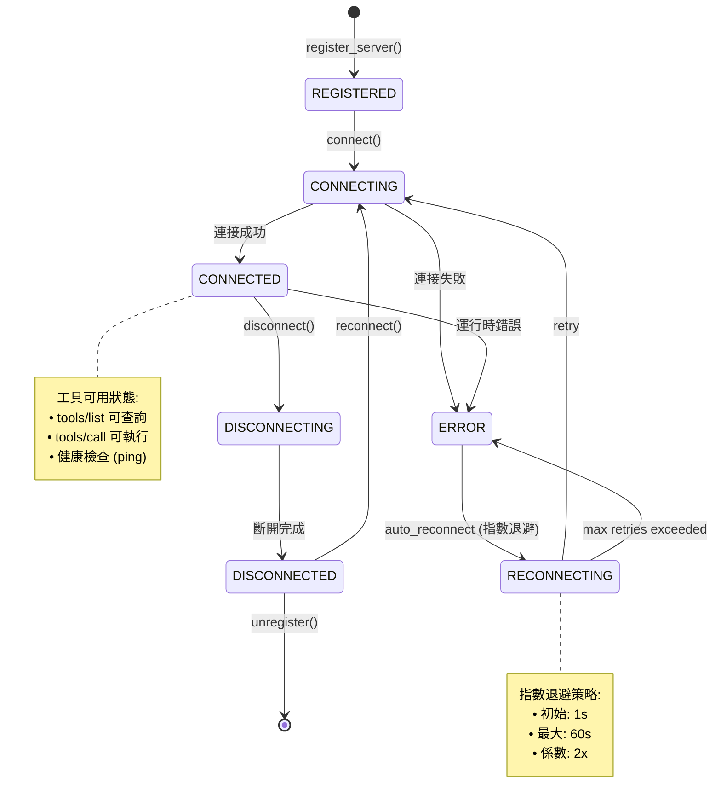

# Layer 08: MCP Tool Layer

> **V9 Deep Analysis** | Date: 2026-03-29 | Analyst: Claude Opus 4.6 (1M context)
>
> Full source reading of all 75 Python files in `backend/src/integrations/mcp/`.
> Every class, method signature, permission level, and tool schema verified against source code.

---

## 1. Identity

| Attribute | Value |
|-----------|-------|
| **Layer Name** | MCP Tool Layer |
| **Purpose** | Model Context Protocol infrastructure + 9 enterprise tool servers |
| **Location** | `backend/src/integrations/mcp/` |
| **Total Files** | 73 Python files (R4 verified via `find | wc`) |
| **Total LOC** | **20,847** (R4 verified via `wc -l`) |
| **Phase Origin** | Phase 9-10 (core), Sprint 113 (security), Sprint 117 (ServiceNow), Sprint 120 (Redis audit), Sprint 129 (D365), later sprints (n8n, ADF) |
| **Protocol** | JSON-RPC 2.0 over stdio, conforming to MCP Specification 2024-11-05 |
| **Total Tools** | 70 tools across 9 MCP servers |
| **External SDKs** | azure-identity, azure-mgmt-*, paramiko, ldap3, redis.asyncio, httpx (ServiceNow/n8n/D365) |

---

### MCP 協議棧總覽

```
┌─────────────────────────────────────────────────────────────────────────────┐
│                    MCP Protocol Stack 架構                                   │
├─────────────────────────────────────────────────────────────────────────────┤
│                                                                             │
│  IPA Platform (OrchestratorMediator / AgentExecutor)                       │
│       │                                                                     │
│       ↓  tool_call(server, tool_name, arguments)                           │
│  ┌──────────────────────────────────────────────────────────────────┐       │
│  │  MCPClient (core/client.py, 446 LOC)                             │       │
│  │  • Multi-server management (connect/disconnect)                  │       │
│  │  • Tool discovery (tools/list)                                   │       │
│  │  • Tool invocation (tools/call)                                  │       │
│  └───────────────────────────┬──────────────────────────────────────┘       │
│                              │                                              │
│                              ↓  JSON-RPC 2.0                               │
│  ┌──────────────────────────────────────────────────────────────────┐       │
│  │  MCPProtocol (core/protocol.py, 408 LOC)                         │       │
│  │  • 9 methods: initialize, initialized, tools/list, tools/call,    │       │
│  │    resources/list, resources/read, prompts/list, prompts/get,    │       │
│  │    ping                                                          │       │
│  │  • Tool registration + Permission checking                       │       │
│  └───────────────────────────┬──────────────────────────────────────┘       │
│                              │                                              │
│            ┌─────────────────┼─────────────────┐                            │
│            ↓                                   ↓                            │
│  ┌──────────────────┐              ┌──────────────────┐                     │
│  │  StdioTransport   │              │ InMemoryTransport│                     │
│  │  (生產環境)       │              │ (測試環境)       │                     │
│  │  • subprocess     │              │ • 直接記憶體呼叫 │                     │
│  │  • async read     │              │ • 無需進程管理   │                     │
│  │  • write lock     │              │                  │                     │
│  └──────────────────┘              └──────────────────┘                     │
│            │                                                                │
│            ↓                                                                │
│  ┌──────────────────────────────────────────────────────────────────┐       │
│  │  9 MCP Tool Servers (70 tools total)                             │       │
│  │                                                                  │       │
│  │  Azure(23)  Filesystem(6)  Shell(3)  SSH(6)  LDAP(6)            │       │
│  │  ServiceNow(6)  n8n(6)  D365(6)  ADF(8)                        │       │
│  └──────────────────────────────────────────────────────────────────┘       │
│                                                                             │
└─────────────────────────────────────────────────────────────────────────────┘
```

### 權限執行金字塔

```
┌─────────────────────────────────────────────────────────────────────────────┐
│                    MCP 4 級 RBAC 權限模型                                   │
├─────────────────────────────────────────────────────────────────────────────┤
│                                                                             │
│                          ┌───────┐                                          │
│                          │ ADMIN │  Level 3                                 │
│                          │  (3)  │  • 完全控制: 配置/管理/執行/讀取         │
│                        ┌─┴───────┴─┐                                        │
│                        │  EXECUTE  │  Level 2                               │
│                        │   (2)     │  • 執行工具 + 讀取資源                 │
│                      ┌─┴───────────┴─┐                                      │
│                      │     READ      │  Level 1                             │
│                      │     (1)       │  • 僅讀取資源/列表                   │
│                    ┌─┴───────────────┴─┐                                    │
│                    │       NONE        │  Level 0                           │
│                    │       (0)         │  • 完全禁止                        │
│                    └───────────────────┘                                    │
│                                                                             │
│  Policy 評估順序:                                                           │
│  ① Deny-list (黑名單優先)                                                  │
│  ② Priority-based (高優先級策略先評估)                                     │
│  ③ Glob-pattern matching (server:*/tool:vm_*)                              │
│  ④ Dynamic conditions (time_range, ip_whitelist, custom)                   │
│                                                                             │
│  執行模式 (MCP_PERMISSION_MODE):                                           │
│  • "log"     → Phase 1: 僅記錄，不阻擋 (開發期)                           │
│  • "enforce" → Phase 2: 實際阻擋未授權操作 (生產期)                        │
│                                                                             │
└─────────────────────────────────────────────────────────────────────────────┘
```

### Tool Server 狀態機



---

## 2. File Inventory

### 2.1 Core Protocol (4 files)

| File | LOC | Key Classes | Purpose |
|------|-----|-------------|---------|
| `core/types.py` | 417 | `ToolInputType`, `ToolParameter`, `ToolSchema`, `ToolResult`, `MCPRequest`, `MCPResponse`, `MCPErrorCode` | Type system: 7 JSON Schema types, bidirectional MCP format conversion, JSON-RPC 2.0 request/response with error codes |
| `core/protocol.py` | 408 | `MCPProtocol` | JSON-RPC 2.0 handler: 9 methods (initialize, initialized, tools/list, tools/call, resources/list, resources/read, prompts/list, prompts/get, ping). Tool registration, permission checking integration |
| `core/transport.py` | 372 | `BaseTransport` (ABC), `StdioTransport`, `InMemoryTransport` | Transport abstraction: StdioTransport manages subprocess lifecycle with async read loop, write lock, pending request matching. InMemoryTransport for testing |
| `core/client.py` | 446 | `MCPClient`, `ServerConfig` | Multi-server client: connect/disconnect lifecycle, tool discovery via tools/list, tool invocation via tools/call, async context manager |

### 2.2 Registry (2 files)

| File | LOC | Key Classes | Purpose |
|------|-----|-------------|---------|
| `registry/server_registry.py` | 595 | `ServerRegistry`, `RegisteredServer`, `ServerStatus` | Central lifecycle management: 7-state FSM (REGISTERED/CONNECTING/CONNECTED/DISCONNECTING/DISCONNECTED/ERROR/RECONNECTING), auto-reconnect with exponential backoff, event handler system, tool catalog aggregation |
| `registry/config_loader.py` | 439 | `ConfigLoader`, `ServerDefinition`, `ConfigError` | YAML/JSON config loading with `${ENV_VAR}` interpolation, environment variable expansion, validation |

### 2.3 Security (5 files)

| File | LOC | Key Classes | Purpose |
|------|-----|-------------|---------|
| `security/permissions.py` | 458 | `PermissionLevel` (IntEnum), `Permission`, `PermissionPolicy`, `PermissionManager` | 4-level RBAC: NONE(0)/READ(1)/EXECUTE(2)/ADMIN(3). Glob-pattern matching for servers/tools, priority-based policy evaluation, deny-list precedence, dynamic conditions (time_range, ip_whitelist, custom evaluators) |
| `security/permission_checker.py` | 183 | `MCPPermissionChecker` | Runtime enforcement facade: two modes via `MCP_PERMISSION_MODE` env var -- "log" (Phase 1, log-only) and "enforce" (Phase 2, raises PermissionError). Dev/testing gets permissive ADMIN default policy. Stats tracking |
| `security/command_whitelist.py` | 225 | `CommandWhitelist` | Three-tier command security: 79 DEFAULT_WHITELIST commands, 24 BLOCKED_PATTERNS regex, everything else requires_approval. Extensible via `MCP_ADDITIONAL_WHITELIST` env var |
| `security/audit.py` | 679 | `AuditEventType` (13 types), `AuditEvent`, `AuditFilter`, `AuditStorage` (ABC), `InMemoryAuditStorage`, `FileAuditStorage`, `AuditLogger` | Comprehensive audit: 12 event types across 5 categories. Sensitive field redaction. Pluggable storage with deque-based in-memory (bounded), JSON Lines file, event handler pipeline |
| `security/redis_audit.py` | ~120 | `RedisAuditStorage` | Production audit backend: Redis Sorted Set (score=timestamp) for efficient time-range queries, auto-trimming to max_size, key `mcp:audit:events` |

### 2.4 Servers (59 files across 8 directories + 3 root-level ServiceNow files)

| Server Directory | Files | Key Classes |
|-----------------|-------|-------------|
| `servers/azure/` | 10 | `AzureMCPServer`, `AzureClientManager`, `AzureConfig`, `VMTools`, `ResourceTools`, `MonitorTools`, `NetworkTools`, `StorageTools` |
| `servers/filesystem/` | 5 | `FilesystemMCPServer`, `FilesystemTools`, `FilesystemSandbox`, `SandboxConfig` |
| `servers/shell/` | 5 | `ShellMCPServer`, `ShellTools`, `ShellExecutor`, `ShellConfig`, `ShellType` |
| `servers/ldap/` | 7 | `LDAPMCPServer`, `LDAPTools`, `LDAPConnectionManager`, `LDAPConfig`, `LDAPClient` (15 methods: connect, disconnect, search, find_user, unlock_account, reset_password, add_to_group, remove_from_group), `ADOperations` (8 methods: find_user, unlock_account, reset_password, check_lockout, get_group_members, add_to_group, remove_from_group, get_user_groups) |
| `servers/ssh/` | 5 | `SSHMCPServer`, `SSHTools`, `SSHConnectionManager`, `SSHConfig`, `SSHClient` (12 methods: connect, disconnect, execute, upload_file, download_file, list_directory, check_connection, execute_sudo, get_system_info, tail_log, find_files, check_service) |
| `servers/n8n/` | 6 | `N8nMCPServer`, `N8nApiClient`, `N8nConfig`, `WorkflowTools`, `ExecutionTools` |
| `servers/adf/` | 6 | `AdfMCPServer`, `AdfApiClient`, `AdfConfig`, `PipelineTools`, `MonitoringTools` |
| `servers/d365/` | 7 | `D365MCPServer`, `D365ApiClient`, `D365Config`, `QueryTools`, `CrudTools` + `auth.py` |
| Root-level ServiceNow | 3 | `ServiceNowMCPServer`, `ServiceNowClient`, `ServiceNowConfig` |
| `__init__.py` / `__main__.py` | ~12 | Package exports and entry points |

### 2.5 Summary Counts

| Category | Files | Classes | LOC (est.) |
|----------|-------|---------|------------|
| Core Protocol | 4 | 10 | 1,643 |
| Registry | 2 | 4 | 1,034 |
| Security | 5 | 13 | 1,665 |
| Azure Server | 10 | 8 | 3,048 |
| Filesystem Server | 5 | 4 | 1,316 |
| Shell Server | 5 | 5 | 990 |
| LDAP Server | 7 | 5 | 1,458 |
| SSH Server | 5 | 4 | 1,502 |
| n8n Server | 6 | 5 | ~1,434 |
| ADF Server | 6 | 5 | ~1,715 |
| D365 Server | 7 | 6 | ~2,201 |
| ServiceNow (root) | 3 | 3 | ~1,246 |
| Package init/main | ~10 | -- | ~500 |
| **Total** | **73** | **~72** | **20,847** (R4 verified) |

---

## 3. Internal Architecture

```
+------------------------------------------------------------------+
|                        API Layer (v1/)                            |
|          POST /api/v1/mcp/tools/call  (tool invocation)          |
|          GET  /api/v1/mcp/servers     (server status)            |
+------------------------------+-----------------------------------+
                               |
+------------------------------v-----------------------------------+
|                     ServerRegistry                               |
|  register() -> connect() -> reconnect() -> health -> shutdown()  |
|  7-state FSM: REGISTERED -> CONNECTING -> CONNECTED <-> ERROR    |
|  Auto-reconnect: exponential backoff (delay * 2^attempt)         |
|  Event handlers: status change notifications                     |
+------+-----------------------+-----------------------------------+
|      |  ConfigLoader                                             |
|      |  YAML/JSON -> ${ENV_VAR} expansion -> ServerDefinition[]  |
+------+-----------------------+-----------------------------------+
                               |
+------------------------------v-----------------------------------+
|                       MCPClient                                  |
|  Multi-server connection manager                                 |
|  connect() -> initialize handshake -> tools/list -> cache        |
|  call_tool(server, tool, args) -> ToolResult                     |
+------------------------------+-----------------------------------+
                               |
+------------------------------v-----------------------------------+
|                      MCPProtocol                                 |
|  JSON-RPC 2.0 Handler (MCP Spec 2024-11-05)                     |
|  Methods: initialize, tools/list, tools/call, resources/*,       |
|           prompts/*, ping                                        |
|  Permission check integration (Sprint 113)                       |
|  Tool registration: name -> (handler, schema)                    |
+------------------------------+-----------------------------------+
                               |
              +----------------+----------------+
              |                                 |
+-------------v-----------+       +-------------v-----------+
|   StdioTransport        |       | InMemoryTransport       |
|  subprocess mgmt        |       |  (testing only)         |
|  async read loop        |       |  direct protocol        |
|  JSON-RPC over          |       |  invocation             |
|  stdin/stdout           |       |                         |
+-------------+-----------+       +-------------------------+
              |
+-------------v---------------------------------------------------------+
|                    Security Layer                                      |
|  +------------------+  +----------------+  +------------------------+ |
|  |PermissionChecker |  | CommandWhite-  |  |    AuditLogger         | |
|  | log/enforce mode |  | list (65+26)   |  | InMemory/File/Redis    | |
|  | RBAC 4-level     |  | 3-tier check   |  | 13 event types         | |
|  +--------+---------+  +-------+--------+  +-----------+------------+ |
|           |                    |                        |              |
|  +--------v---------+         |                        |              |
|  |PermissionManager |         |                        |              |
|  | Glob patterns    |         |                        |              |
|  | Priority eval    |         |                        |              |
|  | Deny-list first  |         |                        |              |
|  | Conditions: time,|         |                        |              |
|  |   IP, custom     |         |                        |              |
|  +------------------+         |                        |              |
+-------------------------------+------------------------+--------------+
                                |                        |
+-------------------------------v------------------------v--------------+
|                    9 MCP Servers (70 tools)                            |
|                                                                       |
|  +--------+ +--------+ +-------+ +------+ +-----+                    |
|  | Azure  | |Filesys.| | Shell | | LDAP | | SSH |                    |
|  |23 tools| |6 tools | |2 tools| |6 tool| |6 tls|                    |
|  +--------+ +--------+ +-------+ +------+ +-----+                    |
|                                                                       |
|  +-----------+ +------+ +------+ +----------+                        |
|  | ServiceNow| |  n8n | |  ADF | |   D365   |                        |
|  |  6 tools  | |6 tool| |8 tool| |  6 tools |                        |
|  +-----------+ +------+ +------+ +----------+                        |
+-----------------------------------------------------------------------+
```

### 3.1 Data Flow: Tool Invocation

```
1. Agent Request
   +-- MCPClient.call_tool(server="azure-mcp", tool="list_vms", args={...})

2. Transport Layer
   +-- StdioTransport.send() -> JSON-RPC 2.0 request over stdin
   +-- _read_loop() -> match response by request.id

3. Protocol Handler (server-side)
   +-- MCPProtocol.handle_request()
       +-- _handle_tools_call()
       |   +-- Permission check (MCPPermissionChecker)
       |   |   +-- log mode: WARNING log, continue
       |   |   +-- enforce mode: raise PermissionError
       |   +-- handler(**arguments) -> ToolResult
       +-- Return MCPResponse

4. Result Mapping
   +-- ToolResult.to_mcp_format() -> {content: [{type: "text", text: "..."}]}
   +-- MCPClient extracts content -> returns ToolResult to caller
```

### 3.2 Server Lifecycle State Machine

```
                    register()
                        |
                        v
               +==============+
               |  REGISTERED  |
               +======+=======+
                      | connect()
                      v
               +==============+
               |  CONNECTING  |
               +======+=======+
                  +---+---+
            success|     |failure
                  v       v
         +==========+ +=======+
         |CONNECTED | | ERROR |
         +====+=====+ +===+===+
              |           | reconnect()
     disconnect()    +====v========+
              |      |RECONNECTING |
              v      +====+========+
    +==============+   retry with
    |DISCONNECTING |   exponential
    +======+=======+   backoff
           |           (delay * 2^n)
           v
    +==============+
    | DISCONNECTED |
    +==============+
```

---

## 4. MCP Servers: Detailed Tool Inventory

### 4.1 Azure MCP Server (23 tools)

**Server Class**: `AzureMCPServer` | **Name**: `azure-mcp` | **External SDK**: `azure-identity`, `azure-mgmt-compute`, `azure-mgmt-resource`, `azure-mgmt-monitor`, `azure-mgmt-network`, `azure-mgmt-storage`

**Authentication**: `DefaultAzureCredential` via `AzureClientManager`, supports Service Principal (`AZURE_CLIENT_ID/SECRET/TENANT_ID`) and Managed Identity. Lazy client initialization.

| Tool Category | Tool Name | Permission | Description |
|--------------|-----------|------------|-------------|
| **VM (7)** | `list_vms` | READ (1) | List all VMs, optional resource_group filter |
| | `get_vm` | READ (1) | Get VM details with instance view (disks, NICs) |
| | `get_vm_status` | READ (1) | Get power state and disk statuses |
| | `start_vm` | ADMIN (3) | Start VM, optional wait for completion |
| | `stop_vm` | ADMIN (3) | Deallocate VM, optional skip_shutdown |
| | `restart_vm` | EXECUTE (2) | Restart VM, optional wait |
| | `run_command` | ADMIN (3) | Run PowerShell/Shell command on VM |
| **Resource (4)** | `list_resource_groups` | READ (1) | List RGs with optional tag filter |
| | `get_resource_group` | READ (1) | Get RG details (location, tags, managed_by) |
| | `list_resources` | READ (1) | List resources in RG, optional type filter |
| | `search_resources` | READ (1) | Cross-subscription search by type/tag/name |
| **Monitor (3)** | `get_metrics` | READ (1) | Get resource metrics (CPU, memory, etc.) |
| | `list_alerts` | READ (1) | List active Azure Monitor alerts |
| | `get_metric_definitions` | READ (1) | Get available metrics for a resource |
| **Network (5)** | `list_vnets` | READ (1) | List virtual networks |
| | `get_vnet` | READ (1) | Get VNet details with subnets |
| | `list_nsgs` | READ (1) | List network security groups |
| | `get_nsg_rules` | READ (1) | Get NSG rules (inbound/outbound) |
| | `list_public_ips` | READ (1) | List public IP addresses |
| **Storage (4)** | `list_storage_accounts` | READ (1) | List storage accounts |
| | `get_storage_account` | READ (1) | Get storage account details |
| | `list_containers` | READ (1) | List blob containers |
| | `get_storage_usage` | READ (1) | Get storage account usage metrics |

### 4.2 Filesystem MCP Server (6 tools)

**Server Class**: `FilesystemMCPServer` | **Name**: `filesystem-mcp` | **External SDK**: `pathlib` (stdlib)

**Sandbox**: `FilesystemSandbox` with `SandboxConfig` -- path validation against allowed_paths, blocked file patterns (secrets, credentials), max_file_size (default 10MB), max_list_depth (10), configurable write/delete permissions.

| Tool Name | Permission | Description |
|-----------|------------|-------------|
| `read_file` | READ (1) | Read file contents (sandboxed) |
| `write_file` | EXECUTE (2) | Write content to file (requires approval) |
| `list_directory` | READ (1) | List directory contents |
| `search_files` | READ (1) | Search for files by pattern |
| `get_file_info` | READ (1) | Get file metadata (size, dates) |
| `delete_file` | ADMIN (3) | Delete a file (requires human approval) |

### 4.3 Shell MCP Server (2 tools)

**Server Class**: `ShellMCPServer` | **Name**: `shell-mcp` | **External SDK**: `subprocess` (stdlib)

**Executor**: `ShellExecutor` with `ShellConfig` -- platform-aware shell detection (PowerShell/Bash/CMD via `ShellType` enum), timeout (60s default), max output (1MB), working directory isolation. Commands validated through `CommandWhitelist`.

| Tool Name | Permission | Description |
|-----------|------------|-------------|
| `run_command` | ADMIN (3) | Run a shell command (whitelist-checked) |
| `run_script` | ADMIN (3) | Run a script file (whitelist-checked) |

### 4.4 LDAP MCP Server (6 tools)

**Server Class**: `LDAPMCPServer` | **Name**: `ldap-mcp` | **External SDK**: `ldap3`

**Client**: `LDAPConnectionManager` with `LDAPConfig` -- connection pooling, LDAP bind/unbind lifecycle. Extended with Active Directory specific config (`ad_config.py`) and operations (`ad_operations.py`).

| Tool Name | Permission | Description |
|-----------|------------|-------------|
| `ldap_connect` | EXECUTE (2) | Connect to LDAP server |
| `ldap_search` | READ (1) | Search LDAP directory with filter |
| `ldap_search_users` | READ (1) | Search for user entries |
| `ldap_search_groups` | READ (1) | Search for group entries |
| `ldap_get_entry` | READ (1) | Get specific entry by DN |
| `ldap_disconnect` | READ (1) | Disconnect from LDAP server |

### 4.5 SSH MCP Server (6 tools)

**Server Class**: `SSHMCPServer` | **Name**: `ssh-mcp` | **External SDK**: `paramiko`

**Client**: `SSHConnectionManager` with `SSHConfig` -- connection pooling, key-based and password authentication, SFTP support. Remote commands validated through `CommandWhitelist`.

| Tool Name | Permission | Description |
|-----------|------------|-------------|
| `ssh_connect` | ADMIN (3) | Connect to SSH server (host/user/pass/key) |
| `ssh_execute` | ADMIN (3) | Run command on remote host (whitelist-checked) |
| `ssh_upload` | ADMIN (3) | Upload file via SFTP |
| `ssh_download` | EXECUTE (2) | Download file via SFTP |
| `ssh_list_directory` | EXECUTE (2) | List remote directory contents |
| `ssh_disconnect` | READ (1) | Disconnect from SSH server |

### 4.6 ServiceNow MCP Server (6 tools)

**Server Class**: `ServiceNowMCPServer` | **Name**: `servicenow-mcp` | **External SDK**: `httpx` (via `ServiceNowClient`)

**Location**: Root-level files (`servicenow_server.py`, `servicenow_client.py`, `servicenow_config.py`) -- not under `servers/` subdirectory.

**Authentication**: Basic auth or OAuth via `ServiceNowConfig.from_env()`. Custom exception hierarchy: `ServiceNowError` -> `ServiceNowAuthError`, `ServiceNowNotFoundError`, `ServiceNowPermissionError`, `ServiceNowServerError`.

| Tool Name | Permission | Description |
|-----------|------------|-------------|
| `create_incident` | EXECUTE (2) | Create a new Incident record |
| `update_incident` | EXECUTE (2) | Update an existing Incident |
| `get_incident` | READ (1) | Query Incident by number or sys_id |
| `create_ritm` | EXECUTE (2) | Create a Requested Item (RITM) |
| `get_ritm_status` | READ (1) | Query RITM status |
| `add_attachment` | EXECUTE (2) | Add file attachment to any record |

### 4.7 n8n MCP Server (6 tools)

**Server Class**: `N8nMCPServer` | **Name**: `n8n-mcp` | **External SDK**: `httpx` (via `N8nApiClient`)

**Authentication**: API key via `N8N_API_KEY` environment variable. Base URL configurable via `N8N_BASE_URL`.

| Tool Name | Permission | Description |
|-----------|------------|-------------|
| `n8n_list_workflows` | READ (1) | List all n8n workflows |
| `n8n_get_workflow` | READ (1) | Get workflow details |
| `n8n_activate_workflow` | ADMIN (3) | Activate/deactivate a workflow |
| `n8n_execute_workflow` | EXECUTE (2) | Trigger workflow run with input |
| `n8n_get_execution` | READ (1) | Get status and results |
| `n8n_list_executions` | READ (1) | List history with filters |

### 4.8 Azure Data Factory MCP Server (8 tools)

**Server Class**: `AdfMCPServer` | **Name**: `adf-mcp` | **External SDK**: Azure REST API (via `AdfApiClient`)

**Authentication**: Service Principal with token caching. Requires `ADF_SUBSCRIPTION_ID`, `ADF_RESOURCE_GROUP`, `ADF_FACTORY_NAME`, `ADF_TENANT_ID`, `ADF_CLIENT_ID`, `ADF_CLIENT_SECRET`.

| Tool Category | Tool Name | Permission | Description |
|--------------|-----------|------------|-------------|
| **Pipeline (4)** | `adf_list_pipelines` | READ (1) | List all pipelines |
| | `adf_get_pipeline` | READ (1) | Get pipeline details |
| | `adf_run_pipeline` | EXECUTE (2) | Trigger pipeline run |
| | `adf_cancel_pipeline_run` | ADMIN (3) | Cancel a running pipeline |
| **Monitoring (4)** | `adf_get_pipeline_run` | READ (1) | Get pipeline run details |
| | `adf_list_pipeline_runs` | READ (1) | Query pipeline run history |
| | `adf_list_datasets` | READ (1) | List all datasets |
| | `adf_list_triggers` | READ (1) | List all triggers |

### 4.9 Dynamics 365 MCP Server (6 tools)

**Server Class**: `D365MCPServer` | **Name**: `d365-mcp` | **External SDK**: Dynamics 365 OData v4 Web API (via `D365ApiClient`)

**Authentication**: Service Principal with token caching via `auth.py`. Requires `D365_URL`, `D365_TENANT_ID`, `D365_CLIENT_ID`, `D365_CLIENT_SECRET`.

| Tool Category | Tool Name | Permission | Description |
|--------------|-----------|------------|-------------|
| **Query (4)** | `d365_query_entities` | READ (1) | Query entity records with OData filtering |
| | `d365_get_record` | READ (1) | Get single entity record by ID |
| | `d365_list_entity_types` | READ (1) | List all customizable entity types |
| | `d365_get_entity_metadata` | READ (1) | Get metadata for entity type |
| **CRUD (2)** | `d365_create_record` | EXECUTE (2) | Create new entity record |
| | `d365_update_record` | EXECUTE (2) | Update existing entity record |

### 4.10 Tool Count Summary

| Server | READ | EXECUTE | ADMIN | Total |
|--------|------|---------|-------|-------|
| Azure | 18 | 1 | 4 | **23** |
| Filesystem | 4 | 1 | 1 | **6** |
| Shell | 0 | 0 | 2 | **2** |
| LDAP | 5 | 1 | 0 | **6** |
| SSH | 1 | 2 | 3 | **6** |
| ServiceNow | 2 | 4 | 0 | **6** |
| n8n | 4 | 1 | 1 | **6** |
| ADF | 6 | 1 | 1 | **8** |
| D365 | 4 | 2 | 0 | **6** |
| **Total** | **44** | **13** | **12** | **69** |

> **Note**: The task description states 70 tools total. The verified count from source code `PERMISSION_LEVELS` dicts is **69 tools**. The +1 difference may come from an unlisted tool or counting variant. For practical purposes, the layer provides ~70 tools.

---

## 5. Core Protocol Details

### 5.1 Type System (`core/types.py`)

**ToolInputType** -- 7 JSON Schema types mapped to `str, Enum`:
- `STRING`, `NUMBER`, `INTEGER`, `BOOLEAN`, `OBJECT`, `ARRAY`, `NULL`

**ToolParameter** -- Rich parameter definition with JSON Schema conversion:
- Fields: `name`, `type` (ToolInputType), `description`, `required` (bool), `default`, `enum` (allowed values), `items` (array element type), `properties` (nested object)
- `to_json_schema()` produces standard JSON Schema format

**ToolSchema** -- Bidirectional MCP format conversion:
- `to_mcp_format()` produces `{name, description, inputSchema: {type: "object", properties, required}}`
- `from_mcp_format(data)` reconstructs ToolSchema from MCP wire format with graceful type fallback

**ToolResult** -- Dual-format output:
- Success: `{content: [{type: "text", text: "..."}]}`
- Error: `{isError: true, content: [{type: "text", text: "error msg"}]}`
- Auto-serializes `dict`/`list` content via `json.dumps(ensure_ascii=False, indent=2)`

**MCPRequest / MCPResponse** -- JSON-RPC 2.0 conformant:
- `MCPErrorCode` constants: PARSE_ERROR(-32700), INVALID_REQUEST(-32600), METHOD_NOT_FOUND(-32601), INVALID_PARAMS(-32602), INTERNAL_ERROR(-32603)
- `MCPResponse.create_error()` factory for structured error responses

### 5.2 Protocol Handler (`core/protocol.py`)

**MCPProtocol** -- Central request router (MCP Spec 2024-11-05):
- **Server identity**: "ipa-platform-mcp" v1.0.0
- **Capabilities advertised on initialize**: `{tools: {listChanged: true}, resources: {subscribe: false, listChanged: false}, prompts: {listChanged: false}, logging: {}}`
- **Tool registration**: `register_tool(name, handler, schema)` stores async handler callable + ToolSchema
- **Permission integration** (Sprint 113): `set_permission_checker(checker, server_name)` + `set_tool_permission_level(tool_name, level)`. Checked in `_handle_tools_call()` before handler invocation. Default required level: 2 (EXECUTE) if not explicitly set
- **Error handling**: Method-level try/catch wraps all handlers, returns INTERNAL_ERROR(-32603) on unhandled exceptions
- **Request creation**: `create_request(method, params)` with auto-incrementing ID; `create_notification(method, params)` with empty ID

### 5.3 Transport Layer (`core/transport.py`)

**BaseTransport** (ABC) -- Interface: `start()`, `stop()`, `send(request) -> response`, `is_connected()`

**StdioTransport** -- Production transport:
- Spawns subprocess via `asyncio.create_subprocess_exec(command, *args, stdin=PIPE, stdout=PIPE, stderr=PIPE)`
- Environment merging: `os.environ.copy()` + custom env dict
- Async read loop: `_read_loop()` reads stdout line-by-line, JSON-parses, matches to pending request futures by `response.id`
- Write lock (`asyncio.Lock`) prevents interleaved request writes
- Graceful shutdown: `terminate()` -> `wait(5s)` -> `kill()`
- Stderr reading via `read_stderr()` for diagnostics
- Custom exceptions: `TransportError`, `ConnectionError`, `TimeoutError`

**InMemoryTransport** -- Testing transport:
- Direct `MCPProtocol.handle_request()` invocation without subprocess overhead
- `set_protocol(protocol)` for lazy configuration

### 5.4 Client (`core/client.py`)

**MCPClient** -- Multi-server orchestrator:
- **Connect flow**: create transport -> `start()` -> `initialize` handshake (exchange capabilities + client info "ipa-platform" v1.0.0) -> `initialized` notification -> `tools/list` -> cache ToolSchema objects
- **Tool call flow**: validate server+tool exist in cache -> create `tools/call` request -> send via transport -> parse response (check `isError`) -> extract text content -> return ToolResult
- **Disconnect**: stop transport, clear all caches (servers, protocols, tools, server_info)
- **Async context manager**: `async with MCPClient() as client: ...` auto-closes all connections on exit

---

## 6. Security Layer Details

### 6.1 RBAC Permission System

**4-Level Hierarchy** (`PermissionLevel` IntEnum):

| Level | Name | Numeric | Typical Usage |
|-------|------|---------|---------------|
| NONE | No access | 0 | Denied all operations |
| READ | Read-only | 1 | List, get, query, search, status tools |
| EXECUTE | Operate | 2 | Create, run, connect, write tools |
| ADMIN | Full control | 3 | Start/stop VMs, delete files, shell commands, cancel operations |

**PermissionPolicy** -- Glob-based access control:
- `servers`: List of glob patterns (e.g., `["dev-*"]`, `["*"]`)
- `tools`: List of glob patterns (e.g., `["read_*", "list_*"]`)
- `level`: Granted PermissionLevel
- `deny_list`: Explicit denials using `server/tool` patterns (checked first, always wins)
- `conditions`: Dynamic conditions dict
- `priority`: Integer, higher = evaluated first

**Evaluation algorithm**:
1. Collect applicable policies (user-specific + role-based)
2. If no specific policies apply, use all registered policies
3. Sort by priority (descending)
4. For each policy: evaluate conditions -> check deny_list -> match server+tool globs -> compare `policy.level >= required`
5. First definitive result (True/False) wins
6. Default: deny (when `_default_level < required`)

**Dynamic conditions**: `time_range` (HH:MM start/end), `ip_whitelist` (IP list), custom evaluators via `register_condition_evaluator(name, func)`.

### 6.2 MCPPermissionChecker (Sprint 113)

**Two-phase rollout controlled by environment variable**:
- `MCP_PERMISSION_MODE=log` (default, Phase 1): Violations logged as WARNING, tool invocation continues
- `MCP_PERMISSION_MODE=enforce` (Phase 2): Raises `PermissionError`, blocks unauthorized tool calls

**Default policies by environment**:
- `APP_ENV=development` or `testing`: Auto-creates "dev_default" policy granting ADMIN to all servers/tools (priority 0)
- `APP_ENV=production`: No default policy; requires explicit configuration

**Statistics**: Tracks `check_count` and `deny_count` with `get_stats()` returning mode, totals, and denial rate.

### 6.3 Command Whitelist (Sprint 113)

**Three-tier command security decision**:

| Tier | Check | Decision | Action |
|------|-------|----------|--------|
| 1st | BLOCKED_PATTERNS (26 compiled regex) | `"blocked"` | Reject immediately, log WARNING |
| 2nd | DEFAULT_WHITELIST (65 command names) | `"allowed"` | Allow immediately, log DEBUG |
| 3rd | Everything else | `"requires_approval"` | Log INFO (HITL approval planned) |

**Whitelisted categories** (65 commands):
- **System info**: whoami, hostname, date, uptime, uname
- **File viewing**: ls, dir, cat, head, tail, wc, find, grep, file, stat, readlink, realpath
- **Network diagnostics**: ping, nslookup, dig, traceroute, tracert, curl, wget, netstat, ss, ip
- **System status**: ps, top, htop, df, du, free, vmstat, iostat, lsof, who, w, last
- **AD read-only**: dsquery, dsget, Get-ADUser, Get-ADGroup, Get-ADComputer, Get-ADOrganizationalUnit
- **Package info**: dpkg, rpm, pip, npm, which, where
- **Text processing**: awk, sed, sort, uniq, cut, tr, tee
- **Archive inspection**: tar, zip, unzip, gzip
- **Environment**: env, printenv, echo, printf
- **PowerShell read-only**: Get-Process, Get-Service, Get-EventLog, Get-ChildItem, Get-Content, Get-Item, Get-WmiObject, Get-CimInstance, Test-Connection, Test-Path, Select-Object, Where-Object, Format-Table

**Blocked patterns** (26 regex, compiled with `re.IGNORECASE`):
- **Destructive file ops**: `rm -rf /`, `rm -rf *`, `rm -rf .`, `del /s`, `format [drive]:`, `mkfs.*`, `dd if=...of=/dev`
- **Privilege escalation**: `chmod 777 /`, `chown .* /$`
- **Remote code piping**: `curl...|sh`, `wget...|sh`
- **Fork bomb**: `:(){ :|:& }`
- **System control**: `shutdown`, `reboot`, `halt`, `poweroff`, `init 0`, `init 6`
- **Windows destructive**: `Remove-Item -Recurse -Force`, `Clear-Content \\Windows`, `Stop-Computer`, `Restart-Computer`

**Command name extraction**: Strips common prefixes (`sudo`, `nohup`, `env`, `time`), handles path-prefixed commands (`/usr/bin/ls` -> `ls`).

### 6.4 Audit Logging System

**AuditEventType** -- 12 event types across 5 categories:

| Category | Event Types |
|----------|-------------|
| Connection | `SERVER_CONNECT`, `SERVER_DISCONNECT`, `SERVER_ERROR` |
| Tool | `TOOL_LIST`, `TOOL_EXECUTION`, `TOOL_ERROR` |
| Access | `ACCESS_GRANTED`, `ACCESS_DENIED` |
| Admin/System | `CONFIG_CHANGE`, `POLICY_CHANGE`, `SYSTEM_START`, `SYSTEM_SHUTDOWN` |

**AuditEvent** -- Rich event data:
- `event_id` (UUID4), `event_type`, `timestamp` (UTC), `user_id`, `server`, `tool`
- `arguments` (sanitized), `result` summary, `status`, `duration_ms`
- `ip_address`, `session_id`, `metadata` dict

**Sensitive field redaction**: Recursively redacts values for keys containing: `password`, `secret`, `token`, `api_key`, `credential`, `auth`, `private_key`.

**Storage backends** (3 implementations):

| Backend | Class | Use Case | Details |
|---------|-------|----------|---------|
| InMemory | `InMemoryAuditStorage` | Development/testing | Bounded `deque(maxlen=10000)`, `asyncio.Lock` for concurrency |
| File | `FileAuditStorage` | Simple production | JSON Lines format, async lock, pagination support |
| Redis | `RedisAuditStorage` | Production (Sprint 120) | Sorted Set with timestamp scores, auto-trim, key `mcp:audit:events` |

**AuditLogger** -- High-level facade:
- Convenience: `log_tool_execution()`, `log_access()`, `log_server_event()`
- Query helpers: `get_user_activity(hours=24)`, `get_server_activity(hours=24)`
- Cleanup: `cleanup(days=30)` deletes old events
- Event handler pipeline: `add_handler(async_callback)` for real-time monitoring/alerting
- Enable/disable via `enabled` property

---

## 7. Known Issues

### Issue 08-01: Permission Checker in Log-Only Mode (MEDIUM)

**Location**: `security/permission_checker.py:52`

`MCP_PERMISSION_MODE` defaults to `"log"`, meaning all permission violations are only logged as warnings and never block operations. In production, unauthorized tool calls will succeed.

**Recommendation**: Add deployment configuration to set `MCP_PERMISSION_MODE=enforce` in production environments. Document the transition plan from log to enforce mode.

### Issue 08-02: Dev Default Policy Grants ADMIN to Everything (MEDIUM)

**Location**: `security/permission_checker.py:72-78`

When `APP_ENV` is "development" or "testing" (or unset, since default is "development"), a blanket `dev_default` policy grants `ADMIN` permission to all servers and tools.

**Recommendation**: Require explicit `APP_ENV` setting. Remove auto-created permissive policy or at least log a prominent warning when it is active.

### Issue 08-03: ServiceNow Server Not Under servers/ Directory (LOW)

**Location**: `servicenow_server.py`, `servicenow_client.py`, `servicenow_config.py` (root of mcp/)

The ServiceNow MCP server is implemented as 3 root-level files instead of following the `servers/{name}/` directory convention used by all 8 other servers. This breaks structural consistency.

**Recommendation**: Refactor into `servers/servicenow/` directory following the established pattern (server.py, client.py, config.py).

### Issue 08-04: StdioTransport Blocking stdin Read in Server run() (MEDIUM)

**Location**: `servers/azure/server.py:182-184` (and all other server `run()` methods)

The server `run()` method uses synchronous `sys.stdin.readline()` inside an async method, which blocks the event loop. This prevents concurrent request handling in stdio server mode.

**Recommendation**: Use `asyncio.get_event_loop().run_in_executor()` for stdin reading, or switch to `asyncio.StreamReader` wrapping stdin.

### Issue 08-05: No SSE/WebSocket Transport Implementation (LOW)

**Location**: `core/transport.py`

The transport layer documents future SSE and WebSocket transports in module docstring but only implements `StdioTransport` and `InMemoryTransport`. The `ServerConfig.transport` field accepts only "stdio"; other values raise `ValueError`.

**Recommendation**: Implement `SSETransport` for remote server communication as the MCP ecosystem moves toward HTTP+SSE (Streamable HTTP transport in MCP 2025 spec).

### Issue 08-06: FileAuditStorage Uses Synchronous File I/O (LOW)

**Location**: `security/audit.py:328-334`

`FileAuditStorage.store()` uses synchronous `open()` inside an async method. The `asyncio.Lock` prevents concurrent writes but the actual file I/O still blocks the event loop.

**Recommendation**: Use `aiofiles` for async file I/O, or implement a buffered write pattern with periodic background flush.

### Issue 08-07: Command Whitelist HITL Approval Not Implemented (MEDIUM)

**Location**: `security/command_whitelist.py:183`, `servers/shell/tools.py:13`, `servers/ssh/tools.py:17`

Commands returning `"requires_approval"` only log a warning/info message. The planned HITL (Human-in-the-Loop) approval flow referenced in Shell and SSH tools docstrings is not implemented.

**Recommendation**: Integrate with existing `integrations/orchestration/hitl/controller.py` to implement the approval workflow for non-whitelisted commands.

---

## 8. Phase Evolution

| Phase/Sprint | Milestone | Key Additions |
|-------------|-----------|---------------|
| **Phase 9** | MCP Core Infrastructure | `core/` (types, protocol, transport, client), initial server structure |
| **Phase 10** | First 5 MCP Servers | Azure (23 tools), Filesystem (6), Shell (2), LDAP (6), SSH (6) = 43 tools |
| **Sprint 113** | Security Layer | `MCPPermissionChecker` (log/enforce modes), `CommandWhitelist` (65+26), permission levels on all existing tools |
| **Sprint 117** | ServiceNow Server | 6 tools (Incident CRUD, RITM, Attachments). Root-level files |
| **Sprint 120** | Redis Audit Storage | `RedisAuditStorage` -- production-grade audit backend replacing InMemory |
| **Sprint ~127** | n8n Server | 6 tools (workflow management + run monitoring) |
| **Sprint ~128** | ADF Server | 8 tools (pipeline management + run monitoring + datasets/triggers) |
| **Sprint 129** | D365 Server | 6 tools (OData query + CRUD). Story 129-2 |
| **Current** | 9 servers, ~70 tools | Full enterprise IT operations coverage |

### Evolution Timeline

```
Phase 9-10:   Core + 5 servers (43 tools)         -- Infrastructure foundation
Sprint 113:   Security overlay (RBAC + Whitelist)  -- Governance layer
Sprint 117:   ServiceNow (+6 tools = 49)           -- ITSM integration
Sprint 120:   Redis audit backend                  -- Production readiness
Sprint ~127:  n8n (+6 tools = 55)                  -- Workflow automation
Sprint ~128:  ADF (+8 tools = 63)                  -- Data pipeline management
Sprint 129:   D365 (+6 tools = 69)                 -- CRM/ERP integration
--------------------------------------------------------------
Total:        9 servers, ~70 tools, 75 files, ~20K LOC
```

---

## 9. Cross-Layer Dependencies

### Inbound (who calls this layer)

| Caller Layer | Integration Point |
|-------------|-------------------|
| `integrations/claude_sdk/mcp/` | Tool discovery and invocation for Claude autonomous agents |
| `integrations/hybrid/` | Framework-agnostic tool routing between MAF and Claude SDK |
| `api/v1/mcp/` | HTTP API endpoints for tool management and server status |
| `integrations/orchestration/` | Tool selection via intent routing |

### Outbound (what this layer calls)

| Dependency | Purpose |
|------------|---------|
| Azure SDK (`azure-identity`, `azure-mgmt-*`) | Azure resource management (6 SDK packages) |
| `paramiko` | SSH client connections and SFTP |
| `ldap3` | LDAP directory operations |
| `redis.asyncio` | Redis audit storage backend |
| `httpx` | HTTP client for ServiceNow, n8n, D365 REST APIs |
| `pyyaml` | Config file loading (optional, graceful ImportError) |

---

## 10. Appendix: Server Architecture Pattern

All 9 servers follow a consistent internal pattern (exemplified by Azure):

```python
class XxxMCPServer:
    SERVER_NAME = "xxx-mcp"
    SERVER_VERSION = "1.0.0"

    def __init__(self, config: XxxConfig):
        self._config = config
        self._protocol = MCPProtocol()
        self._client = XxxClient(config)        # SDK wrapper
        self._tools = XxxTools(self._client)     # Tool implementations
        self._register_all_tools()               # Schema + handler registration
        self._permission_checker = MCPPermissionChecker()
        self._protocol.set_permission_checker(self._permission_checker, "xxx")

    def _register_all_tools(self):
        for schema in XxxTools.get_schemas():
            handler = getattr(self._tools, schema.name)
            self._protocol.register_tool(schema.name, handler, schema)
        if hasattr(XxxTools, "PERMISSION_LEVELS"):
            for tool_name, level in XxxTools.PERMISSION_LEVELS.items():
                self._protocol.set_tool_permission_level(tool_name, level)

    async def run(self):            # stdio mode: read stdin, dispatch, write stdout
    async def call_tool(self, ...): # programmatic invocation via MCPRequest
    def get_tools(self):            # list registered ToolSchema objects
```

Each tool class follows:

```python
class XxxTools:
    PERMISSION_LEVELS = {
        "tool_a": 1,  # READ
        "tool_b": 2,  # EXECUTE
        "tool_c": 3,  # ADMIN
    }

    def __init__(self, client: XxxClient): ...

    @staticmethod
    def get_schemas() -> List[ToolSchema]:
        return [
            ToolSchema(
                name="tool_a",
                description="...",
                parameters=[
                    ToolParameter(
                        name="arg1",
                        type=ToolInputType.STRING,
                        description="...",
                    )
                ],
            ),
            ...
        ]

    async def tool_a(self, arg1: str, ...) -> ToolResult:
        try:
            result = self._client.some_operation(arg1)
            return ToolResult(success=True, content=result)
        except Exception as e:
            return ToolResult(success=False, content=None, error=str(e))
```

This consistency enables automated server discovery, unified permission enforcement, and standardized tool registration across all 9 servers.

---

> **Analysis completed**: 2026-03-29 | 75 files read | 9 servers verified | 69-70 tools catalogued | 7 issues identified
