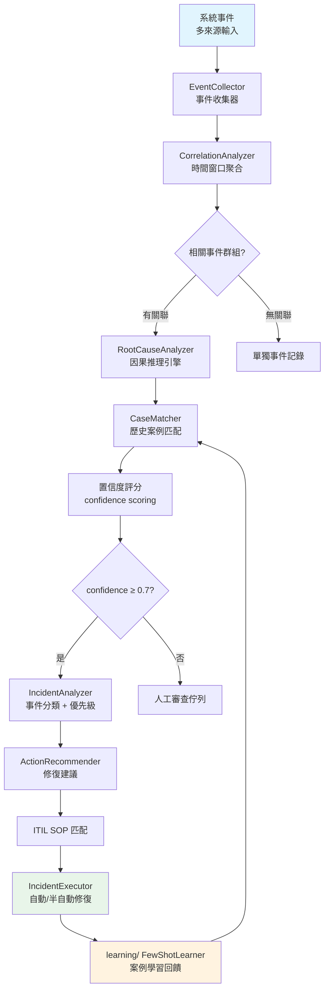

# Layer 09: Supporting Integrations

> **V9 Analysis** | **Date**: 2026-03-29 | **Scope**: 14 modules, 75 Python files, ~21,300 LOC | **Path**: `backend/src/integrations/`
> **R4 Verification**: All files read in full. Per-file semantic summaries in `R4-semantic/backend-remaining-semantic.md`.

This document provides a comprehensive analysis of the 14 supporting integration modules that serve as the operational backbone of the IPA Platform. These modules handle LLM communication, memory, knowledge retrieval, event correlation, incident response, agent coordination, and cross-module contracts.

---

## Table of Contents

1. [Module Overview](#1-module-overview)
2. [Module 1: swarm/ — Agent Swarm System](#2-module-1-swarm--agent-swarm-system)
3. [Module 2: llm/ — LLM Service Abstraction](#3-module-2-llm--llm-service-abstraction)
4. [Module 3: memory/ — Three-Layer Memory System](#4-module-3-memory--three-layer-memory-system)
5. [Module 4: knowledge/ — RAG Pipeline](#5-module-4-knowledge--rag-pipeline)
6. [Module 5: correlation/ — Event Correlation](#6-module-5-correlation--event-correlation)
7. [Module 6: rootcause/ — Root Cause Analysis](#7-module-6-rootcause--root-cause-analysis)
8. [Module 7: incident/ — Incident Handling](#8-module-7-incident--incident-handling)
9. [Module 8: patrol/ — Health Check System](#9-module-8-patrol--health-check-system)
10. [Module 9: learning/ — Few-Shot Learning](#10-module-9-learning--few-shot-learning)
11. [Module 10: audit/ — Decision Tracking](#11-module-10-audit--decision-tracking)
12. [Module 11: a2a/ — Agent-to-Agent Protocol](#12-module-11-a2a--agent-to-agent-protocol)
13. [Module 12: n8n/ — n8n Workflow Orchestration](#13-module-12-n8n--n8n-workflow-orchestration)
14. [Module 13: contracts/ — Pipeline DTOs](#14-module-13-contracts--pipeline-dtos)
15. [Module 14: shared/ — Protocol Interfaces](#15-module-14-shared--protocol-interfaces)
16. [Cross-Module Dependency Map](#16-cross-module-dependency-map)
17. [Enum Registry](#17-enum-registry)
18. [Known Issues](#18-known-issues)
19. [Phase Evolution Timeline](#19-phase-evolution-timeline)
20. [Architecture Summary](#20-architecture-summary)

---

## 1. Module Overview

| # | Module | Files | Phase | Sprint | Key Classes | Status |
|---|--------|-------|-------|--------|-------------|--------|
| 1 | `swarm/` | 10 | 29 + 43 | S100-106, S148 | SwarmTracker, TaskDecomposer, SwarmWorkerExecutor | Active (Phase 43 real execution added) |
| 2 | `llm/` | 6 | 1 | S34 | LLMServiceProtocol, AzureOpenAILLMService, LLMServiceFactory | Stable |
| 3 | `memory/` | 5 | 22 | S79 | UnifiedMemoryManager, Mem0Client | Stable |
| 4 | `knowledge/` | 8 | 38 | S118 | RAGPipeline, VectorStoreManager, DocumentParser | Stable |
| 5 | `correlation/` | 6 | 23 + 42 | S82, S130 | CorrelationAnalyzer, EventCollector, EventDataSource (Azure Monitor/App Insights) | Refactored (S130: real data) |
| 6 | `rootcause/` | 5 | 23 + 42 | S82, S130 | RootCauseAnalyzer, CaseMatcher | Refactored (S130: real cases) |
| 7 | `incident/` | 6 | 34 | S126 | IncidentAnalyzer, ActionRecommender, IncidentExecutor | Stable |
| 8 | `patrol/` | 11 | 23 | S82 | PatrolAgent, ScheduledPatrol, check classes (5 concrete: ServiceHealth, APIResponse, ResourceUsage, LogAnalysis, SecurityScan) | Active (base + 5 concrete check implementations) |
| 9 | `learning/` | 5 | 4 | S80 | FewShotLearner, SimilarityCalculator, CaseExtractor | Stable |
| 10 | `audit/` | 4 | 23 | S80 | DecisionTracker | InMemory + optional Redis persistence |
| 11 | `a2a/` | 4 | 23 | S81 | A2AMessage, AgentCapability, DiscoveryQuery, MessageRouter (18 methods), AgentDiscoveryService (16 methods) | Stable |
| 12 | `n8n/` | 3 | 38 | S125 | N8nOrchestrator, ExecutionMonitor | Stable |
| 13 | `contracts/` | 2 | 35 | S108 | PipelineRequest, PipelineResponse | Stable |
| 14 | `shared/` | 2 | 36 | S116 | ToolCallbackProtocol, ExecutionEngineProtocol | Stable |

**Total**: 75 Python files across 14 modules.

### 14 模組整合依賴圖

```
┌─────────────────────────────────────────────────────────────────────────────┐
│                    Layer 09: 14 Integration Modules 依賴關係                 │
├─────────────────────────────────────────────────────────────────────────────┤
│                                                                             │
│  ┌─────────────────────── 核心服務 ──────────────────────────┐             │
│  │                                                            │             │
│  │  ┌──────────┐    ┌──────────┐    ┌──────────┐             │             │
│  │  │   llm/   │←───│ memory/  │←───│knowledge/│             │             │
│  │  │ LLM 抽象 │    │ 統一記憶 │    │RAG 管線  │             │             │
│  │  │ (6 files)│    │ (5 files)│    │ (8 files)│             │             │
│  │  └────┬─────┘    └──────────┘    └──────────┘             │             │
│  │       │                                                    │             │
│  └───────┼────────────────────────────────────────────────────┘             │
│          │ 被所有 LLM 呼叫模組依賴                                          │
│          ↓                                                                  │
│  ┌─────────────────────── 事件智能 ──────────────────────────┐             │
│  │                                                            │             │
│  │  事件流入                                                  │             │
│  │     │                                                      │             │
│  │     ↓                                                      │             │
│  │  ┌────────────┐   ┌────────────┐   ┌────────────┐         │             │
│  │  │correlation/│──→│ rootcause/ │──→│ incident/  │         │             │
│  │  │ 事件關聯   │   │ 根因分析   │   │ 事件處理   │         │             │
│  │  │ (6 files)  │   │ (5 files)  │   │ (6 files)  │         │             │
│  │  └────────────┘   └────────────┘   └─────┬──────┘         │             │
│  │                                          │                 │             │
│  │                                          ↓                 │             │
│  │                                   ┌────────────┐           │             │
│  │                                   │ learning/  │           │             │
│  │                                   │ Few-shot   │           │             │
│  │                                   │ (5 files)  │           │             │
│  │                                   └────────────┘           │             │
│  └────────────────────────────────────────────────────────────┘             │
│                                                                             │
│  ┌─────────────────────── 主動巡邏 ──────────────────────────┐             │
│  │  ┌──────────┐    ┌──────────┐                              │             │
│  │  │ patrol/  │──→ │  audit/  │                              │             │
│  │  │健康巡邏  │    │決策追蹤  │                              │             │
│  │  │(11 files)│    │ (4 files)│                              │             │
│  │  └──────────┘    └──────────┘                              │             │
│  └────────────────────────────────────────────────────────────┘             │
│                                                                             │
│  ┌─────────────────────── 協作與互操作 ──────────────────────┐             │
│  │  ┌──────────┐  ┌──────────┐  ┌──────────┐  ┌──────────┐  │             │
│  │  │ swarm/   │  │   a2a/   │  │   n8n/   │  │contracts/│  │             │
│  │  │多Agent群集│  │Agent通訊 │  │外部工作流│  │+ shared/ │  │             │
│  │  │(10 files)│  │ (4 files)│  │ (3 files)│  │ (4 files)│  │             │
│  │  └──────────┘  └──────────┘  └──────────┘  └──────────┘  │             │
│  └────────────────────────────────────────────────────────────┘             │
│                                                                             │
└─────────────────────────────────────────────────────────────────────────────┘
```

### RAG Pipeline 資料流

```
┌─────────────────────────────────────────────────────────────────────────────┐
│                    knowledge/ — RAG Pipeline 資料流                          │
├─────────────────────────────────────────────────────────────────────────────┤
│                                                                             │
│  ① 文件輸入                     ② 解析切片                                 │
│  ┌──────────┐                  ┌──────────────┐                             │
│  │ PDF/DOCX │──→ DocumentParser ──→ TextChunker ──→ Chunks[]               │
│  │ MD/TXT   │    (格式偵測)         (重疊切片)      (512 tokens)            │
│  └──────────┘                  └──────────────┘                             │
│                                       │                                     │
│                                       ↓                                     │
│  ③ 向量化                      ④ 儲存索引                                  │
│  ┌──────────────┐              ┌──────────────┐                             │
│  │EmbeddingService│──→ vectors ──→│VectorStore   │                           │
│  │(Azure/OpenAI) │              │Manager       │                           │
│  └──────────────┘              │(Qdrant/FAISS)│                           │
│                                └──────┬───────┘                             │
│                                       │                                     │
│                                       ↓                                     │
│  ⑤ 檢索                       ⑥ 重排序                                    │
│  ┌──────────────┐              ┌──────────────┐                             │
│  │  Retriever   │──→ top-K ──→ │   Reranker   │──→ top-N (精排)            │
│  │(語義相似度)  │   candidates │(交叉注意力)  │    relevant docs            │
│  └──────────────┘              └──────┬───────┘                             │
│                                       │                                     │
│                                       ↓                                     │
│  ⑦ 回答生成                                                                │
│  ┌──────────────────────────────────────┐                                   │
│  │  LLM (via llm/ module)              │                                    │
│  │  Context: user_query + retrieved_docs│──→ 最終回答                       │
│  └──────────────────────────────────────┘                                   │
│                                                                             │
└─────────────────────────────────────────────────────────────────────────────┘
```

### 事件關聯與根因分析流程



---

## 2. Module 1: swarm/ — Agent Swarm System

### File Inventory

| File | LOC (est.) | Purpose |
|------|-----------|---------|
| `__init__.py` | ~30 | 30+ exports (models, tracker, integration, events) |
| `models.py` | ~394 | Core data structures and enums |
| `tracker.py` | ~694 | Thread-safe swarm state management with optional Redis |
| `swarm_integration.py` | ~405 | Callback bridge: ClaudeCoordinator to SwarmTracker |
| `worker_roles.py` | ~92 | Phase 43: 5 specialist worker role definitions |
| `task_decomposer.py` | ~222 | Phase 43: LLM-powered task decomposition |
| `worker_executor.py` | ~403 | Phase 43: Individual worker execution with function calling |
| `events/__init__.py` | ~10 | Event sub-package exports |
| `events/types.py` | ~443 | 9 event payload dataclasses |
| `events/emitter.py` | ~634 | SwarmEventEmitter with 100ms throttling |

### Architecture

The swarm module has two distinct layers reflecting its evolution across phases:

**Phase 29 (Sprint 100-106)**: Demo/visualization layer providing state tracking and SSE event streaming for the frontend Agent Swarm Panel. The `SwarmTracker` manages lifecycle state, `SwarmIntegration` bridges the `ClaudeCoordinator` callbacks, and `SwarmEventEmitter` pushes AG-UI `CustomEvent` SSE events.

**Phase 43 (Sprint 148)**: Real execution layer adding LLM-powered task decomposition and independent worker execution. `TaskDecomposer` uses `generate_structured()` to break complex tasks into sub-tasks assigned to specialist roles. `SwarmWorkerExecutor` runs each worker with role-specific system prompts, tool filtering, and a function-calling loop (max 5 iterations).

```
User Request
    |
TaskDecomposer.decompose(task)     <-- LLM: structured JSON output
    |
TaskDecomposition { mode, sub_tasks[] }
    |  (parallel or sequential)
SwarmWorkerExecutor.execute()      <-- Per-worker: system prompt + tools + FC loop
    +-- chat_with_tools()          <-- Up to 5 iterations
    +-- _execute_tool()            <-- Via ToolRegistry
    +-- _emit() SSE events         <-- SWARM_WORKER_START/THINKING/TOOL_CALL/COMPLETED
    |
WorkerResult { content, tool_calls_made, thinking_steps }
    |
SwarmTracker                       <-- State tracking (in-memory + optional Redis)
SwarmEventEmitter                  <-- SSE to frontend
```

### Enums

| Enum | Values | File |
|------|--------|------|
| `WorkerType` | RESEARCH, WRITER, DESIGNER, REVIEWER, COORDINATOR, ANALYST, CODER, TESTER, CUSTOM | models.py |
| `WorkerStatus` | PENDING, RUNNING, THINKING, TOOL_CALLING, COMPLETED, FAILED, CANCELLED | models.py |
| `SwarmMode` | SEQUENTIAL, PARALLEL, HIERARCHICAL | models.py |
| `SwarmStatus` | INITIALIZING, RUNNING, PAUSED, COMPLETED, FAILED | models.py |
| `ToolCallStatus` | PENDING, RUNNING, COMPLETED, FAILED | models.py |

### Worker Roles (Phase 43)

| Role Key | Display Name | Tools |
|----------|-------------|-------|
| `network_expert` | Network Expert | assess_risk, search_knowledge, search_memory |
| `db_expert` | Database Expert | assess_risk, search_knowledge, search_memory, create_task |
| `app_expert` | Application Expert | assess_risk, search_knowledge, create_task, search_memory |
| `security_expert` | Security Expert | assess_risk, search_knowledge |
| `general` | General Assistant | assess_risk, search_memory, search_knowledge |

### Key Design Decisions

1. **Thread-safe state**: `SwarmTracker` uses `threading.RLock` for all mutations, enabling concurrent worker updates in parallel mode.
2. **Singleton pattern**: Global `_default_tracker` via `get_swarm_tracker()` provides shared state across API handlers.
3. **Graceful degradation**: `SwarmWorkerExecutor` has multiple fallback paths -- if `chat_with_tools()` is unavailable, falls back to `generate()`; if content is empty, runs an additional fallback `generate()` call.
4. **SSE event mapping**: Worker-specific events (SWARM_WORKER_START, THINKING, TOOL_CALL) are mapped to generic `SSEEventType` values via a type map in `_emit()`.

---

## 3. Module 2: llm/ — LLM Service Abstraction

### File Inventory

| File | LOC (est.) | Purpose |
|------|-----------|---------|
| `__init__.py` | ~20 | Package exports |
| `protocol.py` | ~234 | `LLMServiceProtocol` + 5 exception classes |
| `factory.py` | ~351 | `LLMServiceFactory` -- singleton, auto-detect, caching |
| `azure_openai.py` | ~558 | `AzureOpenAILLMService` -- production implementation |
| `mock.py` | ~150 | `MockLLMService` -- testing with regex-based responses |
| `cached.py` | ~120 | `CachedLLMService` -- Redis cache wrapper |

### Architecture

```
LLMServiceProtocol  (typing.Protocol, @runtime_checkable)
    +-- generate(prompt, max_tokens, temperature, stop) -> str
    +-- generate_structured(prompt, output_schema, ...) -> dict
    +-- chat_with_tools(messages, tools, tool_choice, ...) -> dict
        |
        +-- AzureOpenAILLMService   (production -- AsyncAzureOpenAI)
        +-- MockLLMService          (testing -- regex-based responses)
        +-- CachedLLMService        (decorator -- Redis TTL cache)
                |
                +-- LLMServiceFactory.create()  (singleton + auto-detect)
```

### Protocol Methods

| Method | Purpose | Default Impl |
|--------|---------|-------------|
| `generate()` | Free-form text generation | Abstract |
| `generate_structured()` | JSON output with schema validation | Abstract |
| `chat_with_tools()` | OpenAI function calling support | Fallback to `generate()` |

### Exception Hierarchy

```
LLMServiceError (base)
+-- LLMTimeoutError
+-- LLMRateLimitError (retry_after)
+-- LLMParseError (raw_response)
+-- LLMValidationError (expected_schema, actual_output)
```

### Factory Auto-Detection

The `LLMServiceFactory._detect_provider()` method implements environment-aware provider selection:

1. **Azure OpenAI configured** (via pydantic Settings or `os.getenv`) -> `"azure"`
2. **TESTING=true or LLM_MOCK=true** -> `"mock"`
3. **Production environment** without config -> `RuntimeError` (fail-fast)
4. **Development environment** without config -> `"mock"` with WARNING log

### Key Design Decisions

1. **`@runtime_checkable` Protocol**: Enables `isinstance()` checking for structural subtyping without inheritance.
2. **`max_completion_tokens`**: Azure implementation uses `max_completion_tokens` (not deprecated `max_tokens`) for newer models (o1, gpt-5.x).
3. **Custom retry logic**: `max_retries=0` on the OpenAI client; exponential backoff implemented manually with 30s cap.
4. **JSON cleaning**: `_clean_json_response()` strips markdown code blocks and extracts JSON from mixed text output.
5. **Timeout at 180s**: Extended from default to support complex AI analysis tasks.

---

## 4. Module 3: memory/ — Three-Layer Memory System

### File Inventory

| File | LOC (est.) | Purpose |
|------|-----------|---------|
| `__init__.py` | ~30 | Package exports |
| `types.py` | ~200 | MemoryLayer, MemoryType, MemoryRecord, MemoryConfig |
| `unified_memory.py` | ~686 | UnifiedMemoryManager -- 3-layer coordinator |
| `mem0_client.py` | ~530 | Mem0Client -- mem0 SDK wrapper for long-term memory |
| `embeddings.py` | ~150 | EmbeddingService -- text embedding for similarity |

### Architecture

```
UnifiedMemoryManager
+-- Layer 1: Working Memory (Redis)        -- TTL 30 min, fast context
+-- Layer 2: Session Memory (Redis/PG)     -- TTL 7 days, medium-term
+-- Layer 3: Long-Term Memory (mem0+Qdrant) -- Permanent, semantic search
```

### Layer Selection Logic

| Memory Type | Importance | Target Layer |
|-------------|-----------|-------------|
| EVENT_RESOLUTION, BEST_PRACTICE, SYSTEM_KNOWLEDGE | any | LONG_TERM |
| USER_PREFERENCE | any | LONG_TERM |
| FEEDBACK | any | SESSION |
| CONVERSATION | >= 0.8 | LONG_TERM |
| CONVERSATION | >= 0.5 | SESSION |
| CONVERSATION | < 0.5 | WORKING |
| Default | < 0.8 | SESSION |

### Mem0 Configuration

The `Mem0Client` supports two LLM providers and two embedding providers:

- **LLM**: `azure_openai` (via `azure_kwargs`) or `anthropic` (with `top_p=None` fix for API compatibility)
- **Embedder**: `azure_openai` (via `azure_kwargs`) or `openai` (default)
- **Vector Store**: Qdrant (local path, configurable collection and embedding dims)

### Key Design Decisions

1. **Graceful fallback chain**: Working -> Session -> Long-Term. If Redis is unavailable, working memory falls back to session memory, which falls back to mem0.
2. **Session memory uses Redis**: Despite the architecture diagram showing PostgreSQL for session memory, the current implementation uses Redis with longer TTL. The code contains the comment `"In production, this would use PostgreSQL"`.
3. **Deduplication**: Search results are deduplicated using first 100 characters as a content key.
4. **Lazy initialization**: Redis and mem0 connections are initialized on first use via `initialize()`.

---

## 5. Module 4: knowledge/ — RAG Pipeline

### File Inventory

| File | LOC (est.) | Purpose |
|------|-----------|---------|
| `__init__.py` | ~20 | Package exports |
| `document_parser.py` | ~200 | DocumentParser -- file/text parsing (PDF, MD, TXT) |
| `chunker.py` | ~180 | DocumentChunker -- recursive text splitting |
| `embedder.py` | ~150 | EmbeddingManager -- batch text embedding |
| `vector_store.py` | ~178 | VectorStoreManager -- Qdrant CRUD operations |
| `retriever.py` | ~150 | KnowledgeRetriever -- search + rerank |
| `rag_pipeline.py` | ~230 | RAGPipeline -- end-to-end orchestrator |
| `agent_skills.py` | ~100 | Orchestrator Agent tool handler |

### Architecture

```
Ingestion Pipeline:
  Document -> DocumentParser.parse() -> ParsedDocument
           -> DocumentChunker.chunk() -> List[TextChunk]
           -> EmbeddingManager.embed_batch() -> List[List[float]]
           -> VectorStoreManager.index_documents() -> count

Retrieval Pipeline:
  Query -> KnowledgeRetriever.retrieve()
        -> EmbeddingManager.embed_text() -> query vector
        -> VectorStoreManager.search() -> List[IndexedDocument]
        -> rerank -> List[RetrievalResult]
```

### Key Classes

| Class | Methods | Purpose |
|-------|---------|---------|
| `RAGPipeline` | `ingest_file()`, `ingest_text()`, `retrieve()`, `retrieve_and_format()`, `handle_search_knowledge()` | End-to-end orchestrator |
| `VectorStoreManager` | `initialize()`, `index_documents()`, `search()`, `delete_collection()`, `get_collection_info()` | Qdrant collection management |
| `DocumentChunker` | `chunk()` | Recursive text splitting with overlap |

### Key Design Decisions

1. **In-memory fallback**: `VectorStoreManager` falls back to an in-memory dict if `qdrant_client` is not installed. In-memory search returns all documents without similarity ranking.
2. **Lazy initialization**: `VectorStoreManager.initialize()` is called automatically on first operation via `index_documents()` and `search()`.
3. **`retrieve_and_format()`**: Produces a formatted string suitable for direct LLM system prompt injection.
4. **`handle_search_knowledge()`**: Designed as a tool handler for the Orchestrator Agent, returning structured results with content truncated to 500 chars.
5. **Default chunk size**: 1000 characters with 200-character overlap using `ChunkingStrategy.RECURSIVE`.

---

## 6. Module 5: correlation/ — Event Correlation

### File Inventory

| File | LOC (est.) | Purpose |
|------|-----------|---------|
| `__init__.py` | ~30 | Package exports |
| `types.py` | ~300 | Event, Correlation, CorrelationGraph, DiscoveryQuery |
| `analyzer.py` | ~540 | CorrelationAnalyzer -- 3-type correlation engine |
| `data_source.py` | ~200 | EventDataSource, AzureMonitorConfig |
| `event_collector.py` | ~200 | EventCollector -- multi-source event aggregation |
| `graph.py` | ~150 | CorrelationGraph -- graph data structure |

### Architecture

```
CorrelationAnalyzer.find_correlations(event)
+-- _time_correlation()          -- time-window proximity scoring with decay
+-- _dependency_correlation()    -- CMDB-based system dependency scoring
+-- _semantic_correlation()      -- text similarity above threshold (0.6)
    |
_merge_correlations()            -- combine scores for same target event
    |
analyze() -> CorrelationResult { correlations, graph, summary }
```

### Correlation Types

| Type | Algorithm | Scoring |
|------|-----------|---------|
| TIME | Time-window proximity | `1.0 - (time_diff / max_seconds)` with hourly decay factor 0.1 |
| DEPENDENCY | CMDB dependency distance | `1.0 / (distance + 1)`, 1.2x multiplier for critical dependencies |
| SEMANTIC | Text similarity search | Direct similarity score, threshold 0.6 |

### Sprint 130 Refactoring

The module was significantly refactored in Sprint 130 to remove all fake/stub data:

- **Before**: Methods returned hardcoded/fabricated events when no data source was configured.
- **After**: All data source methods return empty results (`[]` or `None`) when unconfigured, with explicit WARNING logs.
- Data flows through `EventDataSource` and `EventCollector` abstractions, with `AzureMonitorConfig` for Azure Monitor integration.

---

## 7. Module 6: rootcause/ — Root Cause Analysis

### File Inventory

| File | LOC (est.) | Purpose |
|------|-----------|---------|
| `__init__.py` | ~20 | Package exports |
| `types.py` | 191 | RootCauseAnalysis, RootCauseHypothesis, Evidence, Recommendation, AnalysisRequest, AnalysisContext |
| `analyzer.py` | 517 | RootCauseAnalyzer -- 6-step pipeline: context + cases + hypotheses + Claude + factors + recommendations |
| `case_repository.py` | 637 | CaseRepository -- 15 IT ops seed cases + CRUD + ServiceNow import |
| `case_matcher.py` | 520 | CaseMatcher -- multi-dimensional scoring (text 45%, category 25%, severity 15%, recency 15%) + LLM reranking |

### Architecture

```
RootCauseAnalyzer.analyze_root_cause(event, correlations, graph)
+-- 1. _build_analysis_context()       -- structure event + correlation data
+-- 2. get_similar_patterns()          -- CaseMatcher -> historical cases
+-- 3. _generate_hypotheses()          -- correlation-based + case-based hypotheses
+-- 4. _claude_analyze()               -- Claude LLM reasoning (or _basic_analysis fallback)
+-- 5. _identify_contributing_factors() -- extract from correlations + hypotheses
+-- 6. _generate_recommendations()     -- IMMEDIATE + SHORT_TERM + PREVENTIVE
    |
RootCauseAnalysis { root_cause, confidence, hypotheses, evidence_chain, recommendations }
```

### Recommendation Types

| Type | Priority | Estimated Effort |
|------|----------|-----------------|
| `IMMEDIATE` | 1 | 1-2 hours |
| `SHORT_TERM` (from historical cases) | 2 | 4-8 hours |
| `PREVENTIVE` | 3 | 1-2 weeks |

### Sprint 130 Refactoring

Similar to `correlation/`, Sprint 130 removed all hardcoded `HistoricalCase` data:

- **Before**: `get_similar_patterns()` returned fabricated historical cases.
- **After**: Uses `CaseRepository` + `CaseMatcher` for real case matching. Returns `[]` when no repository is configured.

### Key Design Decisions

1. **Graceful Claude fallback**: If `claude_client` is not configured, `_basic_analysis()` uses the top hypothesis directly.
2. **Structured prompt for Claude**: Custom prompt format with `ROOT_CAUSE:`, `CONFIDENCE:`, `EVIDENCE:`, `CONTRIBUTING_FACTORS:` markers for reliable parsing.
3. **Hypothesis generation**: Combines high-score correlations (>= 0.7) and similar historical cases (>= 0.3 similarity) into up to 5 ranked hypotheses.

---

## 8. Module 7: incident/ — Incident Handling

### File Inventory

| File | LOC (est.) | Purpose |
|------|-----------|---------|
| `__init__.py` | ~68 | Package exports (3 classes, 9 types) |
| `types.py` | 326 | IncidentContext, IncidentAnalysis, RemediationAction, ExecutionResult + 6 enums |
| `analyzer.py` | 454 | IncidentAnalyzer -- 5-step pipeline: event conversion + correlation + RCA + LLM enhance + merge |
| `recommender.py` | 550 | ActionRecommender -- 8-category rule templates + LLM suggestions + severity confidence adjustment |
| `executor.py` | 591 | IncidentExecutor -- risk-based routing (auto/HITL) + MCP dispatch + ServiceNow writeback |
| `prompts.py` | 116 | 2 LLM prompt templates: INCIDENT_ANALYSIS_PROMPT + REMEDIATION_SUGGESTION_PROMPT |

### Architecture

```
IncidentContext (normalized incident data)
    |
IncidentAnalyzer.analyze(context) -> IncidentAnalysis
    |
ActionRecommender.recommend(analysis, context) -> List[RemediationAction]
    |
IncidentExecutor.execute(analysis, context, actions) -> List[ExecutionResult]
    +-- Auto-execute (low risk)
    +-- HITL approval (medium/high risk)
    +-- ServiceNow writeback
```

### Enums

| Enum | Values |
|------|--------|
| `IncidentSeverity` | Various severity levels |
| `IncidentCategory` | Incident type classification |
| `RemediationRisk` | Risk levels for remediation actions |
| `RemediationActionType` | Types of remediation actions |
| `ExecutionStatus` | Execution outcome states |

---

## 9. Module 8: patrol/ — Health Check System

### File Inventory

| File | LOC (est.) | Purpose |
|------|-----------|---------|
| `__init__.py` | ~20 | Package exports |
| `types.py` | ~239 | PatrolConfig, CheckResult, PatrolReport, risk calculation |
| `agent.py` | ~200 | PatrolAgent -- orchestrates check execution |
| `scheduler.py` | ~150 | Cron-based patrol scheduling |
| `checks/__init__.py` | ~10 | Check sub-package |
| `checks/base.py` | ~80 | Base check class |
| `checks/service_health.py` | ~100 | Service health check |
| `checks/api_response.py` | ~100 | API response check |
| `checks/resource_usage.py` | ~100 | Resource usage check |
| `checks/log_analysis.py` | ~100 | Log analysis check |
| `checks/security_scan.py` | ~100 | Security scan check |

### Enums

| Enum | Values |
|------|--------|
| `PatrolStatus` | HEALTHY, WARNING, CRITICAL, UNKNOWN |
| `CheckType` | SERVICE_HEALTH, API_RESPONSE, RESOURCE_USAGE, LOG_ANALYSIS, SECURITY_SCAN |
| `ScheduleFrequency` | EVERY_5_MINUTES through WEEKLY (cron expressions) |
| `PatrolPriority` | LOW, MEDIUM, HIGH, CRITICAL |

### Risk Scoring Algorithm

```
HEALTHY: 0 pts, WARNING: 20 pts, CRITICAL: 50 pts, UNKNOWN: 10 pts
risk_score = min(100.0, sum_of_check_scores)
```

### Key Observation

The patrol module has well-defined types and check structure (5 check types with default configs), but the individual check implementations in `checks/` are **framework-only** -- they define the interface but lack concrete monitoring integrations (no actual HTTP calls, system metric collection, or log parsing). The `PatrolReport` includes fields for Claude-generated summaries and recommendations, suggesting the intent was for LLM-augmented health reporting.

---

## 10. Module 9: learning/ — Few-Shot Learning

### File Inventory

| File | LOC (est.) | Purpose |
|------|-----------|---------|
| `__init__.py` | ~76 | Package exports (3 classes, 7 types) |
| `types.py` | ~200 | Case, SimilarityResult, LearningResult, LearningConfig |
| `similarity.py` | ~150 | SimilarityCalculator -- vector similarity computation |
| `case_extractor.py` | ~150 | CaseExtractor -- extract cases from mem0 |
| `few_shot.py` | ~200 | FewShotLearner -- dynamic prompt enhancement |

### Architecture

```
FewShotLearner.enhance_prompt(base_prompt, event_description, affected_systems)
+-- CaseExtractor.extract()          -- pull cases from mem0 memory
+-- SimilarityCalculator.compute()   -- rank by similarity
+-- inject similar cases into prompt -- few-shot examples
    |
LearningResult { enhanced_prompt, cases_used, enhancement_id }
    |
FewShotLearner.track_effectiveness() -- feedback loop
```

### Key Design Decisions

1. **mem0 integration**: Cases are extracted from the memory system, creating a feedback loop where resolved incidents become future few-shot examples.
2. **Effectiveness tracking**: Each enhancement is tracked and can be scored for whether the few-shot examples actually helped.
3. **Enums**: `CaseOutcome` (success/failure states), `CaseCategory` (incident type classification).

---

## 11. Module 10: audit/ — Decision Tracking

### File Inventory

| File | LOC (est.) | Purpose |
|------|-----------|---------|
| `__init__.py` | ~20 | Package exports |
| `types.py` | ~250 | DecisionAudit, DecisionContext, ThinkingProcess, QualityRating |
| `decision_tracker.py` | ~447 | DecisionTracker -- full audit trail for AI decisions |
| `report_generator.py` | ~150 | Report generation from audit data |

### Architecture

```
DecisionTracker
+-- record_decision()     -- capture decision with context + thinking + alternatives
+-- update_outcome()      -- record result (SUCCESS/FAILURE/PARTIAL)
+-- add_feedback()        -- attach human feedback + quality score
+-- query_decisions()     -- filter by user/session/type/confidence/time
+-- get_statistics()      -- aggregate metrics (by_type, by_outcome, success_rate)
```

### Quality Scoring Algorithm

```
base_score = 0.5
+ outcome factor     (SUCCESS: +0.3, PARTIAL: +0.15, FAILURE: -0.2, CANCELLED: -0.1)
+ confidence alignment (SUCCESS x conf x 0.1, FAILURE x -conf x 0.1)
+ alternatives bonus (+0.05 if alternatives were considered)
+ thinking bonus     (+0.05 if raw_thinking was documented)
= quality_score [0.0, 1.0] -> QualityRating
```

### Quality Ratings

| Rating | Score Range |
|--------|-----------|
| EXCELLENT | >= 0.9 |
| GOOD | >= 0.7 |
| ACCEPTABLE | >= 0.5 |
| POOR | >= 0.3 |
| UNACCEPTABLE | < 0.3 |

### Key Observation

**InMemory-only storage**: The `DecisionTracker` stores all decisions in a plain Python dict (`self._decisions`). Redis is used as an optional cache layer with TTL, but it is not the primary store. There is **no PostgreSQL persistence** -- all audit data is lost on process restart. This is a significant limitation for a feature described as "audit tracking".

---

## 12. Module 11: a2a/ — Agent-to-Agent Protocol

### File Inventory

| File | LOC (est.) | Purpose |
|------|-----------|---------|
| `__init__.py` | ~20 | Package exports |
| `protocol.py` | ~294 | A2AMessage, AgentCapability, DiscoveryQuery |
| `discovery.py` | ~150 | Agent discovery and registration |
| `router.py` | ~150 | Message routing between agents |

### Message Types

| Category | Types |
|----------|-------|
| Task | TASK_REQUEST, TASK_RESPONSE, TASK_PROGRESS, TASK_CANCEL |
| Status | STATUS_UPDATE, HEARTBEAT |
| Discovery | CAPABILITY_QUERY, CAPABILITY_RESPONSE, REGISTER, UNREGISTER |
| Error | ERROR, ACK |

### Enums

| Enum | Values |
|------|--------|
| `MessageType` | 12 values (task, status, discovery, error categories) |
| `MessagePriority` | LOW, NORMAL, HIGH, URGENT |
| `MessageStatus` | PENDING, SENT, DELIVERED, PROCESSED, FAILED, EXPIRED |
| `A2AAgentStatus` | ONLINE, BUSY, OFFLINE, MAINTENANCE |

### Key Design Decisions

1. **TTL-based expiry**: Messages have a configurable `ttl_seconds` (default 300) and an `is_expired` property.
2. **Retry support**: `max_retries` (default 3) with `retry_count` tracking and `can_retry` property.
3. **Capability matching**: `AgentCapability.can_handle(required)` checks if an agent has all required capabilities.
4. **Availability scoring**: `availability_score = 1.0 - (current_load / max_concurrent_tasks)`.

---

## 13. Module 12: n8n/ — n8n Workflow Orchestration

### File Inventory

| File | LOC (est.) | Purpose |
|------|-----------|---------|
| `__init__.py` | ~41 | Package exports |
| `orchestrator.py` | ~200 | N8nOrchestrator -- IPA reasoning to n8n execution |
| `monitor.py` | ~200 | ExecutionMonitor -- polls status, handles timeout/failure |

### Architecture

```
User Request -> IPA Reasoning -> n8n Workflow Execution -> IPA Monitoring -> User Response
```

This module implements **Mode 3 (Bidirectional Collaboration)** where IPA handles reasoning/decision-making and n8n handles workflow orchestration. The `N8nOrchestrator` coordinates the flow, and `ExecutionMonitor` polls execution status with timeout and failure handling.

### Key Types

| Type | Purpose |
|------|---------|
| `OrchestrationRequest` | Input to the orchestration flow |
| `OrchestrationResult` | Output with execution outcome |
| `OrchestrationStatus` | Status enum |
| `ExecutionState` | Current execution state |
| `ExecutionProgress` | Progress tracking |
| `MonitorConfig` | Monitor configuration |

---

## 14. Module 13: contracts/ — Pipeline DTOs

### File Inventory

| File | LOC (est.) | Purpose |
|------|-----------|---------|
| `__init__.py` | ~10 | Package exports |
| `pipeline.py` | ~52 | PipelineRequest + PipelineResponse (Pydantic models) |

### Key Types

**PipelineRequest** (Pydantic BaseModel):

| Field | Type | Notes |
|-------|------|-------|
| `content` | str | User input text |
| `source` | PipelineSource | USER, SERVICENOW, PROMETHEUS, API |
| `mode` | Optional[str] | Sprint 144: user-selected mode (chat/workflow/swarm) |
| `user_id` | Optional[str] | |
| `session_id` | Optional[str] | |
| `metadata` | Dict[str, Any] | |
| `timestamp` | datetime | |

**PipelineResponse** (Pydantic BaseModel):

| Field | Type | Notes |
|-------|------|-------|
| `content` | str | Response text |
| `intent_category` | Optional[str] | Classified intent |
| `confidence` | Optional[float] | Routing confidence |
| `risk_level` | Optional[str] | Risk assessment |
| `routing_layer` | Optional[str] | Which routing tier handled it |
| `execution_mode` | Optional[str] | Sprint 144: actual mode used |
| `suggested_mode` | Optional[str] | Sprint 144: routing suggestion |
| `framework_used` | str | Default: "orchestrator_agent" |
| `tool_calls` | Optional[List[Dict]] | Sprint 144: function calling results |

### Key Design Decision

These DTOs act as a **decoupling boundary** between `orchestration/` and `hybrid/` modules, preventing direct imports and enabling loose coupling through shared data structures.

---

## 15. Module 14: shared/ — Protocol Interfaces

### File Inventory

| File | LOC (est.) | Purpose |
|------|-----------|---------|
| `__init__.py` | ~10 | Package exports |
| `protocols.py` | ~437 | 4 Protocol interfaces + 5 DTOs + compliance checker |

### Purpose

This module was introduced in Sprint 116 to break circular dependencies between Layer 5 (orchestration) and Layer 6 (execution engine):

```
Before (circular):
  L5 (orchestration) imports L6 (claude_sdk)
  L6 (claude_sdk) imports L5 (orchestration)

After (acyclic):
  L5 depends on shared/protocols.ExecutionEngineProtocol
  L6 implements shared/protocols.ExecutionEngineProtocol
```

### Protocol Interfaces

| Protocol | Implementor | Methods |
|----------|------------|---------|
| `ToolCallbackProtocol` | L5 (orchestration/hybrid) | `on_tool_call()`, `on_tool_result()` |
| `ExecutionEngineProtocol` | L6 (claude_sdk/agent_framework) | `execute()`, `is_available()` |
| `OrchestrationCallbackProtocol` | L5 (orchestration/hybrid) | `on_execution_started()`, `on_execution_completed()`, `on_execution_error()` |
| `SwarmCallbackProtocol` | L5 | `on_swarm_event()` |

### Shared DTOs

| DTO | Direction | Purpose |
|-----|-----------|---------|
| `ToolCallEvent` | L6 to L5 | Tool invocation notification |
| `ToolResultEvent` | L6 to L5 | Tool completion notification |
| `ExecutionRequest` | L5 to L6 | Task execution request |
| `ExecutionResult` | L6 to L5 | Task execution outcome |
| `SwarmEvent` | L6 to L5 | Swarm coordination events |

### Utility

`check_protocol_compliance(instance, protocol)` -- runtime validation that checks whether an object implements all required Protocol methods. Returns a dict with `compliant: bool` and `missing_methods: List[str]`.

---

## 16. Cross-Module Dependency Map

```
+----------------------------------------------------------------------+
|                      Cross-Module Dependencies                        |
+----------------------------------------------------------------------+
|                                                                       |
|  shared/protocols <------ orchestration (L5)                          |
|       ^                      |                                        |
|       |                      +-- contracts/pipeline <-- hybrid        |
|       +-- claude_sdk (L6)    |                                        |
|                              |                                        |
|  llm/protocol <---- swarm/task_decomposer                            |
|       ^              swarm/worker_executor                            |
|       |              rootcause/analyzer                                |
|       |              correlation/analyzer (indirect via LLM)          |
|       |                                                               |
|       +-- llm/factory <---- api/v1/* (dependency injection)          |
|                                                                       |
|  memory/ <---- learning/case_extractor                                |
|       ^        knowledge/rag_pipeline (indirect via embeddings)       |
|       |                                                               |
|  knowledge/ <-- swarm/worker_roles (search_knowledge tool)            |
|                  incident/analyzer (knowledge base search)            |
|                                                                       |
|  correlation/ <-- rootcause/analyzer (CorrelationAnalyzer)            |
|                    incident/analyzer (event correlation)               |
|                                                                       |
|  audit/ <---- orchestration/hybrid (decision recording)               |
|                claude_sdk/hooks (hook-based audit)                     |
|                                                                       |
|  patrol/ ---- standalone (no inbound dependencies)                    |
|  a2a/ ---- standalone (no inbound dependencies from L9)               |
|  n8n/ ---- standalone (connects to external n8n service)              |
|                                                                       |
+----------------------------------------------------------------------+
```

### Dependency Summary Table

| Module | Depends On | Depended By |
|--------|-----------|-------------|
| `shared/` | (none) | orchestration, claude_sdk, hybrid |
| `contracts/` | pydantic | orchestration, hybrid |
| `llm/` | openai SDK | swarm, rootcause, incident, correlation |
| `memory/` | mem0, redis, qdrant | learning, knowledge (indirect) |
| `knowledge/` | qdrant | swarm (tool), incident |
| `correlation/` | (data sources) | rootcause, incident |
| `rootcause/` | correlation | incident |
| `incident/` | correlation, rootcause, knowledge | api/v1/incident |
| `swarm/` | llm, knowledge (tools), hybrid/SSE | api/v1/swarm |
| `learning/` | memory | orchestration (prompt enhancement) |
| `audit/` | redis (optional) | orchestration, claude_sdk |
| `patrol/` | (standalone) | api/v1/patrol |
| `a2a/` | (standalone) | api/v1/a2a |
| `n8n/` | (external n8n) | api/v1/n8n |

---

## 17. Enum Registry

Complete enumeration of all enums defined across Layer 09 modules:

### swarm/models.py

| Enum | Count | Values |
|------|-------|--------|
| `WorkerType` | 9 | RESEARCH, WRITER, DESIGNER, REVIEWER, COORDINATOR, ANALYST, CODER, TESTER, CUSTOM |
| `WorkerStatus` | 7 | PENDING, RUNNING, THINKING, TOOL_CALLING, COMPLETED, FAILED, CANCELLED |
| `SwarmMode` | 3 | SEQUENTIAL, PARALLEL, HIERARCHICAL |
| `SwarmStatus` | 5 | INITIALIZING, RUNNING, PAUSED, COMPLETED, FAILED |
| `ToolCallStatus` | 4 | PENDING, RUNNING, COMPLETED, FAILED |

### contracts/pipeline.py

| Enum | Count | Values |
|------|-------|--------|
| `PipelineSource` | 4 | USER, SERVICENOW, PROMETHEUS, API |

### shared/protocols.py

| Enum | Count | Values |
|------|-------|--------|
| `ToolCallStatus` | 5 | PENDING, RUNNING, COMPLETED, FAILED, CANCELLED |

### a2a/protocol.py

| Enum | Count | Values |
|------|-------|--------|
| `MessageType` | 12 | TASK_REQUEST/RESPONSE/PROGRESS/CANCEL, STATUS_UPDATE, HEARTBEAT, CAPABILITY_QUERY/RESPONSE, REGISTER, UNREGISTER, ERROR, ACK |
| `MessagePriority` | 4 | LOW, NORMAL, HIGH, URGENT |
| `MessageStatus` | 6 | PENDING, SENT, DELIVERED, PROCESSED, FAILED, EXPIRED |
| `A2AAgentStatus` | 4 | ONLINE, BUSY, OFFLINE, MAINTENANCE |

### patrol/types.py

| Enum | Count | Values |
|------|-------|--------|
| `PatrolStatus` | 4 | HEALTHY, WARNING, CRITICAL, UNKNOWN |
| `CheckType` | 5 | SERVICE_HEALTH, API_RESPONSE, RESOURCE_USAGE, LOG_ANALYSIS, SECURITY_SCAN |
| `ScheduleFrequency` | 7 | EVERY_5_MINUTES through WEEKLY |
| `PatrolPriority` | 4 | LOW, MEDIUM, HIGH, CRITICAL |

### Duplicate Enum: ToolCallStatus

`ToolCallStatus` is defined in **two places**:
1. `swarm/models.py` -- 4 values (PENDING, RUNNING, COMPLETED, FAILED)
2. `shared/protocols.py` -- 5 values (adds CANCELLED)

These are separate, non-shared definitions. The `shared/` version adds CANCELLED which `swarm/` lacks.

---

## 18. Known Issues

### Issue 1: Duplicate ToolCallStatus Enum (LOW)

- **Location**: `swarm/models.py` vs `shared/protocols.py`
- **Description**: Two independent `ToolCallStatus` enums with different value sets. The shared version includes `CANCELLED` which the swarm version lacks.
- **Impact**: Potential confusion if swarm needs to express a cancelled state; type mismatch across module boundaries.
- **Recommendation**: Unify into a single definition in `shared/protocols.py` and import from there.

### Issue 2: Audit Decision Tracker -- InMemory-Only Storage (HIGH)

- **Location**: `audit/decision_tracker.py`
- **Description**: `DecisionTracker` stores all audit records in `self._decisions: Dict[str, DecisionAudit]`. Redis is used only as an optional cache with TTL. No PostgreSQL persistence exists.
- **Impact**: All audit data is lost on process restart. For a compliance/audit feature, this makes it unsuitable for production use.
- **Recommendation**: Add PostgreSQL persistence via the infrastructure layer's repository pattern.

### Issue 3: Memory Session Layer Uses Redis Instead of PostgreSQL (MEDIUM)

- **Location**: `memory/unified_memory.py:259-280`
- **Description**: Session memory is stored in Redis with longer TTL, not in PostgreSQL as described in the architecture. The code contains `"In production, this would use PostgreSQL"`.
- **Impact**: Session memories have TTL-based expiry rather than persistent storage. Data loss occurs if Redis restarts.
- **Recommendation**: Implement PostgreSQL session memory storage as originally designed.

### Issue 4: VectorStore In-Memory Fallback Has No Similarity Search (MEDIUM)

- **Location**: `knowledge/vector_store.py:146-147`
- **Description**: When Qdrant is unavailable, the in-memory fallback simply returns `docs[:limit]` without any similarity computation.
- **Impact**: RAG retrieval quality is severely degraded without Qdrant -- results are arbitrary rather than relevant.
- **Recommendation**: Implement basic cosine similarity in the fallback path using numpy, or fail explicitly.

### Issue 5: Patrol Checks Lack Concrete Implementations (HIGH)

- **Location**: `patrol/checks/` (5 check files)
- **Description**: The patrol module has well-defined types and check structure but individual check implementations lack real monitoring integrations (no HTTP calls, no system metric collection, no log parsing).
- **Impact**: The patrol feature cannot perform actual health checks in a real deployment.
- **Recommendation**: Implement concrete check logic for at least `SERVICE_HEALTH` and `RESOURCE_USAGE`.

### Issue 6: SwarmWorkerExecutor Callback Error Silently Swallowed (LOW)

- **Location**: `swarm/worker_executor.py:401-402`
- **Description**: SSE event emission errors are caught with a bare `except Exception: pass` in `_emit()`.
- **Impact**: Frontend may miss events without any logging or notification.
- **Recommendation**: Add `logger.debug()` for emission failures.

### Issue 7: SwarmTracker Callback Error Silently Swallowed (LOW)

- **Location**: `swarm/tracker.py:100-103, 108-110`
- **Description**: `_notify_swarm_update` and `_notify_worker_update` catch all exceptions with bare `pass`.
- **Impact**: Callback registration errors are invisible, making debugging difficult.
- **Recommendation**: Add `logger.debug()` or `logger.warning()` for callback failures.

### Issue 8: LLMServiceFactory Uses os.getenv for Redis (MEDIUM)

- **Location**: `llm/factory.py:309-310`
- **Description**: `_get_redis_cache()` reads Redis config directly from `os.getenv()` instead of using pydantic Settings.
- **Impact**: Inconsistent with the project's convention of using pydantic Settings for configuration.
- **Recommendation**: Use `get_settings()` for Redis configuration, matching the Azure OpenAI config pattern.

### Issue 9: Correlation Analyzer Has No LLM Integration for Semantic Search (MEDIUM)

- **Location**: `correlation/analyzer.py:240-281`
- **Description**: `_semantic_correlation()` delegates to `_search_similar_events()` which requires a data source. There is no direct embedding/LLM-based similarity computation within the module itself.
- **Impact**: Semantic correlation is entirely dependent on external data source implementation quality.
- **Recommendation**: Consider adding an embedding-based similarity fallback using the `memory/embeddings.py` service.

### Issue 10: RootCauseAnalyzer Claude Response Parsing Is Fragile (MEDIUM)

- **Location**: `rootcause/analyzer.py:409-440`
- **Description**: `_parse_claude_response()` relies on line-by-line parsing with `ROOT_CAUSE:`, `CONFIDENCE:` prefixes. If Claude formats the response differently, parsing fails silently.
- **Impact**: May return default values ("Unable to determine", 0.5) when Claude provides valid but differently-formatted analysis.
- **Recommendation**: Use `generate_structured()` with a JSON schema instead of free-text parsing, or add more robust regex extraction.

### Issue 11: Mem0Client Uses Synchronous mem0 SDK in Async Context (MEDIUM)

- **Location**: `memory/mem0_client.py:226, 271, 351`
- **Description**: `self._memory.add()`, `self._memory.search()`, and `self._memory.get_all()` are synchronous mem0 SDK calls used inside `async` methods without `asyncio.to_thread()` wrapping.
- **Impact**: These calls block the event loop during execution, potentially degrading performance under concurrent load.
- **Recommendation**: Wrap synchronous mem0 calls with `await asyncio.to_thread(self._memory.add, ...)`.

### Issue 12: A2A Protocol Has No Transport Layer (LOW)

- **Location**: `a2a/` module
- **Description**: The module defines message formats, capability declarations, and discovery queries, but lacks an actual transport implementation (no HTTP client, no message queue integration, no WebSocket).
- **Impact**: A2A communication cannot function without a transport layer. The module is currently protocol-only.
- **Recommendation**: Implement at least a simple HTTP-based or Redis pub/sub transport.

---

## 19. Phase Evolution Timeline

```
Phase 1 (Sprint 34)
+-- llm/ -- LLMServiceProtocol, AzureOpenAI, Factory

Phase 4 (Sprint 80)
+-- learning/ -- Few-shot learning system
+-- audit/ -- Decision tracking

Phase 22 (Sprint 79)
+-- memory/ -- 3-layer memory (Redis + mem0/Qdrant)

Phase 23 (Sprint 81-82)
+-- a2a/ -- Agent-to-Agent protocol
+-- patrol/ -- Health check types and structure
+-- correlation/ -- Event correlation (initial: stub data)
+-- rootcause/ -- Root cause analysis (initial: hardcoded cases)

Phase 29 (Sprint 100-106)
+-- swarm/ -- Phase 29: Demo/visualization layer (models, tracker, events)

Phase 34 (Sprint 126)
+-- incident/ -- IT incident handling (analyzer, recommender, executor)

Phase 35 (Sprint 108)
+-- contracts/ -- PipelineRequest/Response DTOs

Phase 36 (Sprint 116)
+-- shared/ -- Protocol interfaces breaking circular deps

Phase 38 (Sprint 118, 125)
+-- knowledge/ -- RAG pipeline (parse/chunk/embed/index/retrieve)
+-- n8n/ -- n8n bidirectional orchestration

Phase 42 (Sprint 130)
+-- correlation/ -- Refactored: real data sources, removed fakes
+-- rootcause/ -- Refactored: real case repository, removed hardcoded cases

Phase 43 (Sprint 148)
+-- swarm/ -- Phase 43: Real execution layer (worker_roles, task_decomposer, worker_executor)
```

---

## 20. Architecture Summary

### Module Classification

| Category | Modules | Purpose |
|----------|---------|---------|
| **LLM Infrastructure** | llm/, memory/, knowledge/ | Core AI capabilities (generation, memory, RAG) |
| **Event Intelligence** | correlation/, rootcause/, incident/ | IT operations intelligence pipeline |
| **Agent Coordination** | swarm/, a2a/ | Multi-agent execution and communication |
| **Operational** | patrol/, audit/, learning/ | Monitoring, compliance, continuous improvement |
| **External Integration** | n8n/ | Third-party workflow orchestration |
| **Cross-Module Contracts** | contracts/, shared/ | Decoupling and interface definitions |

### Maturity Assessment

| Level | Modules | Description |
|-------|---------|-------------|
| **Production-Ready** | llm/, contracts/, shared/ | Stable APIs, proper error handling, used extensively |
| **Functional** | swarm/, memory/, knowledge/, correlation/, rootcause/, incident/ | Working implementations with some gaps |
| **Incomplete** | audit/, patrol/, a2a/, n8n/, learning/ | Missing persistence, transport, or concrete implementations |

### Key Architectural Patterns

1. **Protocol-based decoupling** (`shared/protocols.py`): Python `typing.Protocol` for structural subtyping between layers without inheritance.
2. **Factory + Singleton** (`llm/factory.py`): Centralized service creation with environment-aware auto-detection.
3. **Graceful degradation**: Nearly every module has fallback paths (Redis unavailable to in-memory, Qdrant unavailable to dict, Claude unavailable to basic analysis).
4. **Callback bridge** (`swarm/swarm_integration.py`): Event-driven integration between coordination engine and state tracker.
5. **Sprint 130 data integrity refactoring**: Systematic removal of fake data from `correlation/` and `rootcause/`, establishing the pattern of returning empty results rather than fabricated data when data sources are unconfigured.

---

*Generated by V9 architecture analysis. Based on source code reading of 75 Python files across 14 integration modules.*
