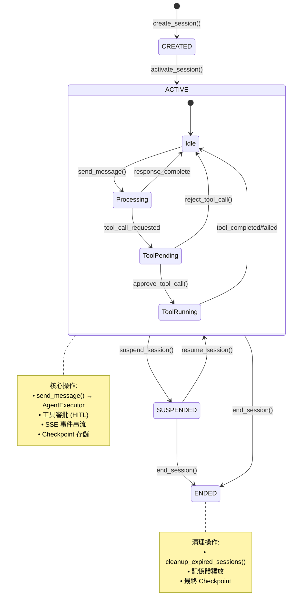

# Layer 10: Domain Layer

> V9 Deep Architecture Analysis — Domain Business Logic Layer
> Analysis Date: 2026-03-29
> Analyst: Claude Opus 4.6 (1M context)
> Source: 117 files deep-read (R4 full coverage), ripgrep LOC verification (47,637 LOC confirmed)

---

## 1. Identity

| Attribute | Value |
|-----------|-------|
| **Layer Number** | 10 (of 11) |
| **Directory** | `backend/src/domain/` |
| **Responsibility** | Business logic, state machines, domain models |
| **Total Modules** | 21 directories + 1 root `__init__.py` |
| **Total Python Files** | 117 |
| **Total LOC** | ~47,637 |
| **Critical Module** | `sessions/` (33 files, ~15,473 LOC, 32.5% of layer) |
| **Deprecated Module** | `orchestration/` (22 files, ~11,465 LOC, 24.1% of layer) |
| **Phase Range** | Phase 1 (Sprint 1) through Phase 29 (Sprint 100) |
| **Key Dependencies** | infrastructure/ (DB, Cache), integrations/ (MAF, LLM, MCP) |

**Layer Position in Stack**:
```
[API Layer (L9)] --> [Domain Layer (L10)] --> [Infrastructure Layer (L11)]
                          |
                          +--> [Integrations Layer (L7-L8)]
```

---

### Domain 模組階層圖

```
┌─────────────────────────────────────────────────────────────────────────────┐
│              Layer 10: Domain Layer — 21 模組 (117 files, 47,637 LOC)       │
├─────────────────────────────────────────────────────────────────────────────┤
│                                                                             │
│  ★ CRITICAL PATH (佔 Layer 56.6%)                                          │
│  ┌──────────────────────────────────────────────────────────────────┐       │
│  │  sessions/ (33 files, 15,473 LOC) — Agent-Session 整合          │       │
│  │  • Session 生命週期   • Message 處理   • ToolCall 審批          │       │
│  │  • AgentExecutor      • SSE Events    • SessionAgentBridge      │       │
│  ├──────────────────────────────────────────────────────────────────┤       │
│  │  ⚠ orchestration/ (22 files, 11,465 LOC) — DEPRECATED          │       │
│  │  • 已被 integrations/hybrid/ 取代  • 保留供向後相容             │       │
│  └──────────────────────────────────────────────────────────────────┘       │
│                                                                             │
│  ■ ACTIVE MODULES                                                           │
│  ┌────────────────┐  ┌────────────────┐  ┌────────────────┐                │
│  │ workflows/ (11)│  │ agents/ (7)    │  │ connectors/ (6)│                │
│  │ ~5,500 LOC     │  │ ~2,500 LOC     │  │ ~1,800 LOC     │                │
│  │ 工作流定義/執行│  │ Agent CRUD/工具│  │ 外部連接器     │                │
│  │ 持久化: DB     │  │ 持久化: DB     │  │ 持久化: 無     │                │
│  └────────────────┘  └────────────────┘  └────────────────┘                │
│                                                                             │
│  ┌────────────────┐  ┌────────────────┐  ┌────────────────┐                │
│  │ executions/ (2)│  │checkpoints/ (3)│  │ templates/ (3) │                │
│  │ ~800 LOC       │  │ ~1,500 LOC     │  │ ~700 LOC       │                │
│  │ 狀態機 6 states│  │ 檢查點存儲     │  │ 工作流模板     │                │
│  │ 持久化: DB     │  │ 持久化: DB     │  │ 持久化: DB     │                │
│  └────────────────┘  └────────────────┘  └────────────────┘                │
│                                                                             │
│  ┌────────────────┐  ┌────────────────┐  ┌────────────────┐                │
│  │ auth/ (3)      │  │ files/ (3)     │  │ triggers/ (2)  │                │
│  │ ~600 LOC       │  │ ~600 LOC       │  │ ~500 LOC       │                │
│  │ 持久化: DB     │  │ 持久化: FS     │  │ 持久化: DB     │                │
│  └────────────────┘  └────────────────┘  └────────────────┘                │
│                                                                             │
│  ⚠ InMemory RISK (資料遺失風險)                                            │
│  ┌────────────────┐  ┌────────────────┐  ┌────────────────┐                │
│  │ audit/ (2)     │  │ routing/ (2)   │  │ learning/ (2)  │                │
│  │ InMemory ⚠     │  │ InMemory ⚠     │  │ InMemory ⚠     │                │
│  ├────────────────┤  ├────────────────┤  ├────────────────┤                │
│  │ versioning/ (2)│  │ devtools/ (2)  │  │ sandbox/ (2)   │                │
│  │ InMemory ⚠     │  │ InMemory ⚠     │  │ Stateless      │                │
│  └────────────────┘  └────────────────┘  └────────────────┘                │
│                                                                             │
└─────────────────────────────────────────────────────────────────────────────┘
```

### Session 生命週期狀態機



### 模組持久化矩陣

```
┌─────────────────────────────────────────────────────────────────────────────┐
│                    Domain 模組持久化方式對照                                 │
├─────────────────────────────────────────────────────────────────────────────┤
│                                                                             │
│  持久化方式        模組                            資料遺失風險             │
│  ─────────────    ─────────────────────            ────────────             │
│                                                                             │
│  PostgreSQL DB    sessions, workflows, agents,     ✅ 安全                  │
│                   executions, checkpoints,                                  │
│                   templates, auth, triggers,                                │
│                   prompts, chat_history, tasks                              │
│                                                                             │
│  Redis Cache      sessions (快取層)                ⚠ TTL 過期              │
│                   orchestration (部分)                                      │
│                                                                             │
│  Filesystem       files (上傳檔案)                 ✅ 安全                  │
│                                                                             │
│  InMemory ⚠       audit, routing, learning,        🔴 進程重啟即遺失       │
│                   versioning, devtools                                      │
│                   (共 5 模組, ~2,100 LOC)                                   │
│                                                                             │
│  Stateless        connectors, sandbox,             ✅ N/A                   │
│                   notifications                                             │
│                                                                             │
│  ⚠ 風險說明: InMemory 模組在進程重啟時會遺失所有資料                       │
│    建議: 遷移至 Redis 或 PostgreSQL 持久化                                  │
│                                                                             │
└─────────────────────────────────────────────────────────────────────────────┘
```

---

## 2. File Inventory

### 2.1 Module Summary Table

| Module | Files | ~LOC | Phase | Status | Persistence |
|--------|-------|------|-------|--------|-------------|
| `sessions/` | 33 | 15,473 | P11/P12/S45/S46 | **Active - Critical Path** | DB + Redis |
| `orchestration/` | 22 | 11,465 | P9 | **DEPRECATED** | InMemory + Redis + Postgres |
| `workflows/` | 11 | ~5,500 | P1/P7/P27 | Active | DB |
| `agents/` | 7 | ~2,500 | P1/S31 | Active | DB (via adapter) |
| `connectors/` | 6 | ~1,800 | P6 | Active | None (stateless) |
| `checkpoints/` | 3 | ~1,500 | P2/S28 | Active (partial deprecation) | DB |
| `executions/` | 2 | ~800 | P1 | Active | DB |
| `templates/` | 3 | ~700 | P4 | Active | DB |
| `auth/` | 3 | ~600 | P3 | Active | DB |
| `files/` | 3 | ~600 | P5 | Active | Filesystem |
| `triggers/` | 2 | ~500 | P5 | Active | DB |
| `notifications/` | 2 | ~400 | P6 | Active | External (Teams) |
| `prompts/` | 2 | ~400 | P8 | Active | DB |
| `audit/` | 2 | ~400 | P8 | Active | **InMemory** |
| `routing/` | 2 | ~400 | P8 | Active | **InMemory** |
| `learning/` | 2 | ~400 | P10 | Active | **InMemory** |
| `versioning/` | 2 | ~400 | P8 | Active | **InMemory** |
| `devtools/` | 2 | ~350 | P10 | Active | **InMemory** |
| `sandbox/` | 2 | ~300 | P5 | Active | None |
| `chat_history/` | ~2 | ~300 | P11 | Active | DB |
| `tasks/` | ~2 | ~300 | P9 | Active | DB |

### 2.2 sessions/ Deep File Inventory

| File | LOC | Sprint | Responsibility | Persistence |
|------|-----|--------|----------------|-------------|
| `models.py` | 688 | P10 | Session, Message, Attachment, ToolCall, SessionConfig dataclasses | N/A (domain models) |
| `service.py` | 626 | P10 | SessionService lifecycle (CRUD, messages, tool calls, cleanup) | DB + Redis |
| `bridge.py` | 873 | S46 | SessionAgentBridge - main entry point for message processing | InMemory (active contexts dict) |
| `executor.py` | 668 | S45 | AgentExecutor - LLM execution with streaming simulation | None |
| `tool_handler.py` | 1,020 | S45 | ToolCallHandler + ToolCallParser (local + MCP tools) | InMemory (stats) |
| `streaming.py` | 748 | S45 | StreamingLLMHandler - real Azure OpenAI SSE | None |
| `events.py` | 830 | P10/S45 | **Dual event system**: ExecutionEventFactory + SessionEventPublisher | InMemory (handlers) |
| `approval.py` | 583 | S46 | ToolApprovalManager - Redis-backed HITL approval | **Redis only** |
| `repository.py` | ~500 | P10 | SessionRepository (DB access) | PostgreSQL |
| `cache.py` | ~400 | P10 | SessionCache (Redis caching) | Redis |
| `error_handler.py` | ~600 | P12 | SessionErrorHandler (24 error codes, HTTP mapping) | None |
| `recovery.py` | ~500 | P12 | SessionRecoveryManager (checkpoint + event buffer) | Redis |
| `metrics.py` | ~400 | P12 | MetricsCollector (Prometheus-style counters/histograms) | **InMemory** |
| **files/** | | | | |
| `types.py` | ~100 | P13 | File type definitions | N/A |
| `analyzer.py` | ~300 | P13 | FileAnalyzer (Strategy pattern base) | None |
| `document_analyzer.py` | ~250 | P13 | Document analysis (PDF, Word) | None |
| `image_analyzer.py` | ~250 | P13 | Image analysis | None |
| `code_analyzer.py` | ~250 | P13 | Code file analysis | None |
| `data_analyzer.py` | ~250 | P13 | Data file analysis (CSV, JSON) | None |
| `generator.py` | ~300 | P13 | FileGenerator (Factory pattern base) | None |
| `code_generator.py` | ~250 | P13 | Code file generation | Filesystem |
| `report_generator.py` | ~250 | P13 | Report generation | Filesystem |
| `data_exporter.py` | ~250 | P13 | Data export (CSV, Excel) | Filesystem |
| **history/** | | | | |
| `manager.py` | ~400 | P14 | HistoryManager (pagination, filtering) | DB |
| `bookmarks.py` | ~300 | P14 | BookmarkService | DB |
| `search.py` | ~300 | P14 | SearchService (full-text) | DB |
| **features/** | | | | |
| `tags.py` | ~300 | P15 | TagService (6 system presets) | DB |
| `statistics.py` | ~300 | P15 | StatisticsService (lazy calc + cache) | Redis |
| `templates.py` | ~300 | P15 | TemplateService (5 system templates) | DB |

---

## 3. sessions/ Deep Dive: The Critical Path

### 3.1 Architecture Overview

The `sessions/` module is the **single most critical module** in the entire domain layer, handling the complete lifecycle of conversational AI interactions. It accounts for 33 files and ~15.5K LOC (32.5% of the domain layer).

#### Critical Execution Path

```
User HTTP Request
    |
    v
[API Layer: /api/v1/sessions/]
    |
    v
[SessionAgentBridge.process_message()]    <-- MAIN ENTRY POINT
    |
    +--1--> [SessionService.send_message()]          Save user msg to DB+Cache
    |
    +--2--> [SessionService.get_conversation_for_llm()]  Fetch history
    |
    +--3--> [AgentExecutor.execute()]                LLM call (via LLMServiceProtocol)
    |           |
    |           +-- _build_messages()                system + history + user
    |           +-- _call_llm()                      LLMServiceProtocol.generate()
    |           +-- yields ExecutionEvent stream      CONTENT_DELTA / TOOL_CALL / DONE
    |
    +--4--> [ToolCallHandler.execute_tool()]          If tool_calls detected
    |           |
    |           +-- _check_permission()              DENIED / AUTO / APPROVAL_REQUIRED
    |           +-- _execute_local_tool()             via ToolRegistry
    |           +-- _execute_mcp_tool()               via MCPClient
    |
    +--5--> [ToolApprovalManager]                    If approval required
    |           |
    |           +-- create_approval_request()         Redis: approval:{id}
    |           +-- resolve_approval()                Redis: update status
    |           +-- yields APPROVAL_REQUIRED event    Pauses execution
    |
    +--6--> [SessionService.add_assistant_message()]  Save response to DB+Cache
    |
    v
[ExecutionEvent stream to client via SSE/WebSocket]
```

### 3.2 Session State Machine (models.py)

```
         ┌──────────┐
         │ CREATED  │
         └────┬─────┘
              │ activate()
              v
         ┌──────────┐
  ┌──────│  ACTIVE  │──────┐
  │      └────┬─────┘      │
  │ suspend() │     end()  │ end()
  v           │            │
┌──────────┐  │            │
│SUSPENDED │──┘            │
└──────────┘  resume()     │
  │                        │
  └────────────────────────┼───> ┌──────────┐
                           └───> │  ENDED   │
                                 └──────────┘
```

**State Transitions** (from `Session` dataclass):
- `CREATED -> ACTIVE`: `activate()` — checks not expired
- `ACTIVE -> SUSPENDED`: `suspend()` — connection lost
- `SUSPENDED -> ACTIVE`: `resume()` — checks not expired, extends expiry
- `ACTIVE -> ENDED`: `end()` — sets ended_at, idempotent
- `CREATED -> ACTIVE -> SUSPENDED -> ACTIVE -> ENDED` (full lifecycle)

**Key Design Decisions**:
- `Session` uses `@dataclass` not SQLAlchemy model (pure domain object)
- Expiry auto-extends on `activate()`, `resume()`, `add_message()`
- Title auto-generated from first user message (first 50 chars)
- `can_accept_message()` checks both `is_active()` AND message count limit
- `to_llm_messages()` converts entire history to OpenAI API format

**ToolCall State Machine** (6 states):
```
PENDING --> APPROVED --> RUNNING --> COMPLETED
    |                      |
    +----> REJECTED        +----> FAILED
```

### 3.3 Dual Event System (events.py)

The events module contains **two independent event systems** that coexist but serve different purposes:

#### System 1: ExecutionEventFactory (Sprint 45) — 11 Event Types

Used by `AgentExecutor` and `SessionAgentBridge` for **real-time streaming** to the client.

| Event Type | Category | Payload |
|------------|----------|---------|
| `STARTED` | Status | agent_id, agent_name |
| `CONTENT` | Content | Full content string (non-streaming) |
| `CONTENT_DELTA` | Content | Content chunk (streaming) |
| `TOOL_CALL` | Tool | ToolCallInfo (id, name, arguments) |
| `TOOL_RESULT` | Tool | ToolResultInfo (result, success, error) |
| `APPROVAL_REQUIRED` | Tool | approval_request_id, tool_call details |
| `APPROVAL_RESPONSE` | Tool | approved/rejected, feedback |
| `DONE` | Status | finish_reason, UsageInfo (tokens) |
| `ERROR` | Status | error_message, error_code |
| `HEARTBEAT` | System | (empty, connection keep-alive) |

- Output format: `to_sse()` for SSE, `to_json()` for WebSocket
- Factory pattern: `ExecutionEventFactory.content_delta(...)`, `.tool_call(...)`, etc.
- **This is the client-facing event stream**

#### System 2: SessionEventPublisher (Phase 10) — 17 Event Types

Used by `SessionService` for **internal domain event pub/sub** and audit logging.

| Event Type | Category |
|------------|----------|
| `SESSION_CREATED` | Session Lifecycle |
| `SESSION_ACTIVATED` | Session Lifecycle |
| `SESSION_SUSPENDED` | Session Lifecycle |
| `SESSION_RESUMED` | Session Lifecycle |
| `SESSION_ENDED` | Session Lifecycle |
| `SESSION_EXPIRED` | Session Lifecycle |
| `MESSAGE_SENT` | Message |
| `MESSAGE_RECEIVED` | Message |
| `MESSAGE_STREAMING` | Message |
| `TOOL_CALL_REQUESTED` | Tool |
| `TOOL_CALL_APPROVED` | Tool |
| `TOOL_CALL_REJECTED` | Tool |
| `TOOL_CALL_COMPLETED` | Tool |
| `TOOL_CALL_FAILED` | Tool |
| `ATTACHMENT_UPLOADED` | Attachment |
| `ATTACHMENT_DELETED` | Attachment |
| `ERROR_OCCURRED` | Error |

- **In-memory pub/sub** with `subscribe()` / `publish()` pattern
- Global singleton via `get_event_publisher()`
- Handlers executed concurrently via `asyncio.gather()`
- Safe handler execution: exceptions logged but don't propagate

**ISSUE**: The two event systems have **overlapping concerns** (both handle tool call events and errors) but are not integrated. ExecutionEvents stream to the client; SessionEvents are internal-only. There is no bridge between them.

### 3.4 AgentExecutor (executor.py) — CRITICAL ISSUE

The `AgentExecutor` is responsible for LLM interaction, but it has a **critical architectural disconnect**:

**The Streaming Simulation Problem**:

```python
# executor.py lines 332-353 — SIMULATED streaming
if config.stream:
    # 串流模式 - 目前 LLMServiceProtocol 不支援串流，先用非串流模擬
    # S45-2 會實作真正的串流
    response = await self._call_llm(built_messages, agent_config, config)

    # 模擬串流：將內容分塊發送
    chunk_size = 20  # 每塊字符數
    content = response.get("content", "")
    for i in range(0, len(content), chunk_size):
        chunk = content[i:i + chunk_size]
        yield ExecutionEventFactory.content_delta(...)
        await asyncio.sleep(0.01)  # 模擬網路延遲
```

Meanwhile, `StreamingLLMHandler` (streaming.py) implements **real Azure OpenAI SSE streaming** with:
- `AsyncAzureOpenAI` client with proper `stream=True`
- Real chunk processing with `delta.content` and `delta.tool_calls`
- Token counting via `tiktoken`
- Heartbeat keep-alive
- Retry with exponential backoff
- `StreamState` tracking (IDLE -> CONNECTING -> STREAMING -> COMPLETED)

**But AgentExecutor does NOT use StreamingLLMHandler**. Instead:
1. `AgentExecutor._call_llm()` calls `LLMServiceProtocol.generate(prompt)` — a simple string-in/string-out interface
2. It then **fakes streaming** by splitting the complete response into 20-char chunks with 10ms delays
3. Token counts are **estimated** (`len(text) // 4`)

**Impact**: Users see "streaming" behavior but it's fake — the entire response is fetched first, then drip-fed. Real TTFT (Time to First Token) is hidden. Token counts are inaccurate.

### 3.5 ToolCallHandler (tool_handler.py)

A comprehensive tool execution framework with dual source support:

**Architecture**:
```
ToolCallParser
    |-- parse_from_response()    OpenAI function calling format
    |-- parse_from_message()     Dict format
    |-- _determine_source()      LOCAL vs MCP routing

ToolCallHandler
    |-- handle_tool_calls()      Main entry: parse -> permission -> execute
    |-- execute_tool()           Single tool execution
    |-- _execute_local_tool()    Via ToolRegistry
    |-- _execute_mcp_tool()      Via MCPClient
    |-- _execute_parallel()      Batched parallel execution
    |-- _handle_approval_call()  HITL approval flow
```

**Key Features**:
- **Permission System**: 4 levels — `AUTO`, `NOTIFY`, `APPROVAL_REQUIRED`, `DENIED`
- **Dual Source**: Local tools (ToolRegistry) + MCP tools (MCPClient)
- **MCP Tool Naming**: Supports `mcp_server_tool` prefix and `server:tool` colon formats
- **Parallel Execution**: Configurable `max_parallel_calls` (default 5) with `asyncio.gather()`
- **Statistics**: `ToolHandlerStats` tracks calls, success rate, execution time per tool
- **Round Limiting**: `max_tool_rounds` (default 10) prevents infinite tool loops

**Notable**: `get_available_tools()` has a `TODO` comment for MCP tool schema — MCP tools cannot be advertised to the LLM for function calling.

### 3.6 ToolApprovalManager (approval.py) — Redis-Only

The approval manager stores all state in Redis with TTL-based expiration:

**Storage Schema**:
```
approval:{approval_id}         -> JSON(ToolApprovalRequest)  TTL: 300s (pending) / 3600s (resolved)
session:approvals:{session_id} -> JSON([approval_id, ...])   TTL: max(300, 3600)
```

**State Machine**: `PENDING -> APPROVED | REJECTED | EXPIRED`

**ISSUE: No DB Persistence**
- Approval history is lost when Redis TTL expires (1 hour after resolution)
- No audit trail beyond Redis retention
- If Redis restarts, all pending approvals are lost with no recovery mechanism
- The `session:approvals:{session_id}` list uses JSON string stored with `setex` (not Redis SET type) — inefficient for large approval lists

### 3.7 SessionService (service.py)

The service layer orchestrates:
1. **Session Lifecycle**: create -> activate -> suspend/resume -> end
2. **Message Processing**: send_message (user), add_assistant_message
3. **Cache Strategy**: Read-through cache (check Redis first, fallback to DB, populate cache)
4. **Event Publishing**: Via `SessionEventPublisher` for all lifecycle and message events
5. **Tool Call Management**: add_tool_call, approve/reject (event-only, no state mutation)
6. **Maintenance**: cleanup_expired_sessions, title/metadata updates

**Dependency Injection**: `SessionRepository` + `SessionCache` + `SessionEventPublisher`

**Notable**: `approve_tool_call()` and `reject_tool_call()` only publish events — they don't actually mutate the ToolCall model. The real approval state lives in `ToolApprovalManager` (Redis).

### 3.8 StreamingLLMHandler (streaming.py)

A production-ready Azure OpenAI streaming implementation that is **not wired into the main execution path**:

**Features**:
- Direct `AsyncAzureOpenAI` client integration
- Real SSE processing with `stream=True` and `stream_options={"include_usage": True}`
- `ToolCallDelta` accumulation for incremental tool call assembly
- `TokenCounter` using `tiktoken` (with fallback estimation)
- `StreamStats`: TTFT, total duration, chunk count, token usage
- Heartbeat loop for connection keep-alive
- Exponential backoff retry (up to 3 attempts)
- Proper error handling: `APITimeoutError`, `RateLimitError`, `APIError`
- `cancel()` support via flag
- Async context manager support

**Why It's Disconnected**: The `AgentExecutor` depends on `LLMServiceProtocol` (a generic interface), while `StreamingLLMHandler` talks directly to Azure OpenAI. They were built in the same sprint (S45) but the bridge was never completed. The `TODO` comment in executor.py line 333 says "S45-2 will implement real streaming" — that task was either incomplete or the result (StreamingLLMHandler) was never integrated back.

---

## 4. orchestration/ Module — DEPRECATED

### 4.1 Overview

| Sub-module | Files | Purpose | Replacement |
|------------|-------|---------|-------------|
| `memory/` | 5 | ConversationMemoryStore (base, models, InMemory, Redis, Postgres) | `integrations/agent_framework/memory/` |
| `multiturn/` | 4 | SessionManager, TurnTracker, ContextManager | `integrations/agent_framework/multiturn/` |
| `planning/` | 5 | TaskDecomposer, DynamicPlanner, DecisionEngine, TrialError | `integrations/agent_framework/builders/` |
| `nested/` | 6 | WorkflowManager, SubExecutor, RecursiveHandler, CompositionBuilder, ContextPropagation | `integrations/agent_framework/builders/` |
| Root | 2 | `__init__.py` files | N/A |
| **Total** | **22** | **~11,465 LOC** | |

### 4.2 InMemoryConversationMemoryStore (in_memory.py)

The `InMemoryConversationMemoryStore` is the most characteristic file in the deprecated module:

- Implements `ConversationMemoryStore` ABC
- Storage: 3 Python dicts (`_sessions`, `_turns`, `_messages`)
- Features: CRUD, pagination, content search, statistics, archival
- **No persistence** — all data lost on restart
- Still importable and usable despite deprecation

### 4.3 Deprecation Status

**The module is marked DEPRECATED in CLAUDE.md** but:
- All 22 files are still present and importable
- No deprecation warnings in code (unlike `checkpoints/service.py` which has `warnings.warn()`)
- `__init__.py` files still export symbols
- No redirect imports pointing to replacements
- **Still reachable** from any code that imports from `src.domain.orchestration`

**Risk**: New developers may accidentally use deprecated orchestration code instead of the official MAF adapters in `integrations/agent_framework/`.

---

## 5. workflows/ Module

### 5.1 WorkflowExecutionService (service.py)

**Dual Execution Mode** (Sprint 27):

```python
class WorkflowExecutionService:
    def __init__(self, use_official_api: bool = False):
        # Legacy mode (default) or Official API mode
```

| Mode | Implementation | State Tracking |
|------|---------------|----------------|
| Legacy | Direct `AgentService.run_agent_with_config()` | Manual sequential loop |
| Official API | `SequentialOrchestrationAdapter` + `EnhancedExecutionStateMachine` | Event-driven via `WorkflowStatusEventAdapter` |

**Legacy Flow**: Start node -> sequential agent execution -> gateway evaluation -> end node
**Official API Flow**: Create executors from nodes -> `SequentialOrchestrationAdapter.run_stream()` -> event handling

**Key Integration Points**:
- `AgentService` (domain/agents) for LLM execution
- `WorkflowNodeExecutor`, `SequentialOrchestrationAdapter` (integrations/agent_framework)
- `EnhancedExecutionStateMachine`, `StateMachineManager` (integrations/agent_framework)
- Event handlers for workflow status updates

### 5.2 DeadlockDetector (deadlock_detector.py)

A standalone deadlock detection system for parallel workflow execution:

- **Algorithm**: DFS cycle detection on Wait-for Graph
- **Resolution Strategies**: CANCEL_YOUNGEST, CANCEL_OLDEST, CANCEL_ALL, CANCEL_LOWEST_PRIORITY, NOTIFY_ONLY
- **Timeout Handling**: Per-task timeouts with `TimeoutHandler`
- **Continuous Monitoring**: Async loop with configurable check interval
- **Statistics**: Detection history, resolution tracking

**Status**: Fully implemented and functional, used by concurrent workflow executors.

---

## 6. agents/ Module

### 6.1 AgentService (service.py)

**Sprint 31 Migration**: All official Agent Framework API imports were moved to `AgentExecutorAdapter`.

**Architecture**:
```
AgentService
    |-- initialize()       Creates AgentExecutorAdapter via factory
    |-- run_agent_with_config()  Delegates to adapter.execute()
    |-- run_simple()       Convenience wrapper
    |-- test_connection()  Via adapter.test_connection()
    |-- shutdown()         Via adapter.shutdown()
```

**Key Design**:
- Singleton pattern via `get_agent_service()` / `_agent_service` global
- Lazy initialization (must call `initialize()` before use)
- Config format translation: `AgentConfig` (domain) -> `AgentExecutorConfig` (adapter)
- Result format translation: `AdapterResult` (adapter) -> `AgentExecutionResult` (domain)
- Mock fallback: returns mock response if adapter is None
- Cost calculation: GPT-4o pricing ($5/M input, $15/M output) — but delegated to adapter

### 6.2 ToolRegistry (tools/registry.py)

Central registry for tools available to agents:

- **Registration**: `BaseTool` instances, callables (wrapped in `FunctionTool`), or classes (lazy instantiation)
- **Built-in Tools**: `HttpTool`, `DateTimeTool`, `get_weather`, `search_knowledge_base`, `calculate`
- **Singleton**: `get_tool_registry()` auto-loads builtins on first call
- **Schema Generation**: `get_schemas()` for OpenAI function calling format
- **Functions Export**: `get_functions()` for Agent Framework tool lists

---

## 7. checkpoints/ Module

### CheckpointService (service.py)

**Sprint 28 Partial Deprecation**:

| Method | Status | Replacement |
|--------|--------|-------------|
| `create_checkpoint()` | Active | Still primary |
| `get_checkpoint()` | Active | Still primary |
| `get_pending_approvals()` | Active | Still primary |
| `approve_checkpoint()` | **DEPRECATED** | `HumanApprovalExecutor.respond()` |
| `reject_checkpoint()` | **DEPRECATED** | `HumanApprovalExecutor.respond()` |
| `create_checkpoint_with_approval()` | Active | Bridges legacy + new API |
| `handle_approval_response()` | Active | Bridges new API -> legacy storage |

**Bridge Pattern**: `create_checkpoint_with_approval()` creates a DB checkpoint AND registers with `HumanApprovalExecutor`. `handle_approval_response()` translates approval executor responses back to checkpoint status updates.

---

## 8. connectors/ Module

External service connectors following adapter pattern:

| Connector | File | Target |
|-----------|------|--------|
| `base.py` | Base class + interface | Abstract connector |
| `registry.py` | ConnectorRegistry | Central connector management |
| `dynamics365.py` | Dynamics365Connector | Microsoft Dynamics 365 |
| `servicenow.py` | ServiceNowConnector | ServiceNow ITSM |
| `sharepoint.py` | SharePointConnector | SharePoint Online |

All connectors are **stateless** with no persistence layer.

---

## 9. Small Modules Summary

| Module | Key Class | Purpose | Notes |
|--------|-----------|---------|-------|
| `executions/` | `ExecutionStateMachine` | 8-state execution lifecycle (PENDING->RUNNING->COMPLETED etc.) | Used by workflow execution |
| `auth/` | Auth models | Authentication domain logic | Integrates with `core/security/` |
| `files/` | File domain models | File handling business logic | Supports upload/download |
| `templates/` | `TemplateService` | Workflow template management | 5 system templates |
| `triggers/` | `WebhookTrigger` | External trigger handling | Webhook-based |
| `notifications/` | `TeamsNotification` | Microsoft Teams notifications | External API |
| `prompts/` | `PromptTemplate` | Prompt template management | Jinja2-style |
| `sandbox/` | Sandbox models | Sandboxed code execution domain | Stateless |
| `audit/` | `AuditLogger` | Audit log management | **InMemory only** |
| `routing/` | `ScenarioRouter` | Intelligent scenario routing | **InMemory only** |
| `learning/` | `LearningService` | Few-shot learning management | **InMemory only** |
| `versioning/` | `VersioningService` | Agent/workflow version control | **InMemory only** |
| `devtools/` | `Tracer` | Development tracing/debugging | **InMemory only** |
| `chat_history/` | Chat history models | Chat history domain | DB-backed |
| `tasks/` | Task models | Task management domain | DB-backed |

---

## 10. InMemory vs Persistent Analysis

### 10.1 Confirmed InMemory-Only Modules

These 7 modules/components store all state in Python dicts and lose data on process restart:

| Module/Component | Storage Mechanism | Data Lost on Restart |
|-----------------|-------------------|---------------------|
| `sessions/metrics.py` | `MetricsCollector` with Python dicts | All counters/histograms reset |
| `sessions/bridge.py` | `_active_contexts: Dict[str, ProcessingContext]` | Active processing contexts |
| `audit/logger.py` | In-memory list | All audit records |
| `learning/service.py` | In-memory dict | All learning data |
| `routing/scenario_router.py` | In-memory dict | All routing rules |
| `versioning/service.py` | In-memory dict | All version history |
| `devtools/tracer.py` | In-memory list | All trace records |
| `orchestration/memory/in_memory.py` | 3 Python dicts | All sessions, turns, messages |

### 10.2 Redis-Only (No DB Fallback)

| Component | Redis Keys | Risk |
|-----------|-----------|------|
| `sessions/approval.py` | `approval:{id}`, `session:approvals:{session_id}` | Approval history lost after TTL (1 hour) |
| `sessions/recovery.py` | Recovery checkpoints | Recovery data lost on Redis restart |

### 10.3 Properly Persistent (DB + Cache)

| Component | DB Table | Cache Layer |
|-----------|----------|-------------|
| `sessions/service.py` | `sessions`, `messages` | Redis (read-through) |
| `checkpoints/service.py` | `checkpoints` | None |
| `workflows/service.py` | `workflow_executions` | None |
| `agents/service.py` | `agents` (via adapter) | None |

### 10.4 Impact Assessment

**Production Risk**: Modules marked InMemory-only cannot survive container restarts, deployments, or scaling events. In a multi-instance deployment, each instance has its own isolated in-memory state.

**Most Critical Gap**: `sessions/approval.py` — tool approval requests have no DB persistence. If Redis restarts mid-approval, the user is left hanging with no way to resume.

---

## 11. Session Lifecycle E2E Flow

### 11.1 Complete Message Processing Flow

```
                                    ┌─────────────────────────┐
                                    │    Frontend (React)      │
                                    │  UnifiedChat component   │
                                    └────────┬────────────────┘
                                             │ POST /api/v1/sessions/{id}/messages
                                             │ { content: "Hello", stream: true }
                                             v
                                    ┌─────────────────────────┐
                                    │   API Layer (FastAPI)    │
                                    │  sessions/routes.py      │
                                    └────────┬────────────────┘
                                             │
                                             v
                              ┌──────────────────────────────────┐
                              │   SessionAgentBridge              │
                              │   .process_message()              │
                              │                                   │
                              │  1. _get_active_session()         │
                              │     └─ SessionService.get_session │
                              │        └─ Cache → DB → Cache      │
                              │                                   │
                              │  2. _get_agent_config()           │
                              │     └─ AgentRepository.get()      │
                              │     └─ AgentConfig.from_agent()   │
                              │                                   │
                              │  3. SessionService.send_message() │
                              │     └─ Repository.add_message()   │
                              │     └─ Cache.append_message()     │
                              │     └─ Events.message_sent()      │
                              │                                   │
                              │  4. _execute_with_tools() LOOP    │──────────────────┐
                              │     ┌─────────────────────────┐   │                  │
                              │     │  AgentExecutor.execute() │   │                  │
                              │     │  ┌─ _build_messages()   │   │                  │
                              │     │  ├─ _get_available_tools │   │                  │
                              │     │  └─ _call_llm()         │   │    If tool_calls │
                              │     │     └─ LLMService       │   │    detected      │
                              │     │        .generate()      │   │                  │
                              │     │  yields:                │   │                  │
                              │     │    STARTED              │   │                  │
                              │     │    CONTENT_DELTA (fake) │   │                  │
                              │     │    DONE                 │   │                  │
                              │     └─────────────────────────┘   │                  │
                              │                                   │                  │
                              │  5. If tool_calls:                │<─────────────────┘
                              │     ┌─────────────────────────┐   │
                              │     │ ToolCallHandler          │   │
                              │     │  .execute_tool()         │   │
                              │     │  ┌─ _check_permission()  │   │
                              │     │  ├─ requires_approval?   │   │
                              │     │  │  YES: ApprovalManager │   │
                              │     │  │    .create_approval() │   │
                              │     │  │    yield APPROVAL_REQ │   │
                              │     │  │    return (PAUSE)     │   │
                              │     │  │  NO:                  │   │
                              │     │  │    _execute_local()   │   │
                              │     │  │    OR _execute_mcp()  │   │
                              │     │  └─ yield TOOL_RESULT    │   │
                              │     └─────────────────────────┘   │
                              │     └─ Append tool results        │
                              │     └─ Loop back to step 4        │
                              │                                   │
                              │  6. SessionService                │
                              │     .add_assistant_message()      │
                              │     └─ Repository.add_message()   │
                              │     └─ Cache.append_message()     │
                              │     └─ Events.message_received()  │
                              └──────────────────────────────────┘
                                             │
                                             │ SSE: event: content_delta
                                             │      data: {"content": "..."}
                                             v
                                    ┌─────────────────────────┐
                                    │    Frontend (React)      │
                                    │  Renders streaming text  │
                                    └─────────────────────────┘
```

### 11.2 HITL Approval Sub-flow

```
[Bridge pauses at APPROVAL_REQUIRED]
         │
         │  yield APPROVAL_REQUIRED event
         │  (includes approval_request_id, tool details)
         v
[Frontend shows approval card]
         │
         │  POST /api/v1/sessions/{id}/approvals/{approval_id}
         │  { approved: true, feedback: "OK" }
         v
[Bridge.handle_tool_approval()]
         │
         ├─ ApprovalManager.resolve_approval()
         │   └─ Redis: update approval status
         │
         ├─ yield APPROVAL_RESPONSE event
         │
         └─ _continue_after_approval()
             ├─ ToolCallHandler.execute_tool()
             ├─ Get updated conversation history
             ├─ Continue _execute_with_tools() loop
             └─ Save assistant message
```

---

## 12. Cross-Module Dependencies

### 12.1 Dependency Graph

```
sessions/bridge.py ──────────────> sessions/service.py ──────> infrastructure/database/
       │                                  │
       ├──> sessions/executor.py          ├──> sessions/repository.py
       │         │                        ├──> sessions/cache.py ──> infrastructure/cache/
       │         ├──> integrations/llm/   └──> sessions/events.py
       │         └──> agents/tools/registry.py
       │
       ├──> sessions/tool_handler.py
       │         ├──> agents/tools/registry.py
       │         └──> integrations/mcp/ (via protocol)
       │
       ├──> sessions/approval.py ──────> infrastructure/cache/ (Redis)
       │
       └──> sessions/events.py

agents/service.py ─────────────> integrations/agent_framework/builders/
       │                                  │
       └──> core/config.py                └──> agent_framework (official SDK)

workflows/service.py ──────────> agents/service.py
       │                        integrations/agent_framework/core/executor
       │                        integrations/agent_framework/core/execution
       │                        integrations/agent_framework/core/events
       │                        integrations/agent_framework/core/state_machine
       │
       └──> workflows/models.py

checkpoints/service.py ────────> infrastructure/database/repositories/checkpoint
       │
       └──> integrations/agent_framework/core/approval (TYPE_CHECKING only)

orchestration/memory/in_memory.py ──> orchestration/memory/base.py
                                      orchestration/memory/models.py
```

### 12.2 Circular Dependency Risk

No actual circular imports detected. The codebase uses:
- `Protocol` classes for interface definitions (avoiding import cycles)
- `TYPE_CHECKING` guards for type-only imports (checkpoints -> approval)
- Factory functions for deferred instantiation

---

## 13. Known Issues

### CRITICAL

| # | Issue | Location | Impact |
|---|-------|----------|--------|
| C1 | **AgentExecutor streaming is simulated**, not real SSE | `executor.py:332-353` | Users see fake streaming; real TTFT hidden; token counts estimated |
| C2 | **StreamingLLMHandler disconnected** from execution path | `streaming.py` vs `executor.py` | Production-ready SSE code exists but is unused |
| C3 | **ToolApprovalManager Redis-only**, no DB persistence | `approval.py` | Approval history lost after Redis TTL; no audit trail |

### HIGH

| # | Issue | Location | Impact |
|---|-------|----------|--------|
| H1 | **Dual event system** with overlapping concerns, no bridge | `events.py` | ExecutionEvents (client) and SessionEvents (internal) independently track tool call state |
| H2 | **7 modules InMemory-only** in production domain layer | audit, learning, routing, versioning, devtools, sessions/metrics, orchestration/memory | Data loss on restart; no multi-instance support |
| H3 | **orchestration/ DEPRECATED but reachable** — no runtime warnings | `orchestration/` (22 files) | Developers may accidentally use deprecated code |
| H4 | **SessionService.approve_tool_call()** is event-only | `service.py:507-531` | Publishes event but does not mutate ToolCall state; real approval lives in Redis |
| H5 | **MCP tool schemas not advertised** to LLM | `tool_handler.py:652` | LLM cannot initiate MCP tool calls via function calling |

### MEDIUM

| # | Issue | Location | Impact |
|---|-------|----------|--------|
| M1 | **Token count estimation** in executor uses `len(text) // 4` | `executor.py:611` | Inaccurate billing and usage tracking |
| M2 | **Session expiry uses UTC** without timezone awareness | `models.py` | `datetime.utcnow()` is deprecated in Python 3.12+ |
| M3 | **Bridge._active_contexts** is a plain dict | `bridge.py:281` | Not thread-safe; no cleanup on crash; no size limit |
| M4 | **CheckpointService approve/reject** emit deprecation warnings | `checkpoints/service.py` | Still functional but migration incomplete |
| M5 | **AgentConfig.from_agent()** uses `hasattr` chain | `executor.py:111-136` | Fragile duck-typing; no type validation |
| M6 | **Approval list stored as JSON string** in Redis | `approval.py:540` | Uses `setex` with JSON array instead of Redis SET; O(n) appends |

### LOW

| # | Issue | Location | Impact |
|---|-------|----------|--------|
| L1 | **Heartbeat in StreamingLLMHandler** doesn't actually yield events | `streaming.py:670` | Comment says "cannot yield here" — heartbeat loop logs but doesn't send |
| L2 | **Session title** generated from first 50 chars only | `models.py:575` | Titles may be unhelpful for short messages |
| L3 | **Global singletons** throughout domain layer | Multiple files | Makes testing harder; prevents clean dependency injection |

---

## 14. Phase Evolution Timeline

| Phase | Sprint | Domain Changes |
|-------|--------|----------------|
| **P1** | S1 | `agents/service.py`, `workflows/service.py`, `executions/state_machine.py` — core foundation |
| **P2** | S2 | `checkpoints/service.py` — HITL approval system |
| **P3** | S3 | `auth/` — authentication domain |
| **P4** | S4 | `templates/` — workflow templates |
| **P5** | S5-S6 | `files/`, `triggers/`, `sandbox/` — supporting modules |
| **P6** | S7-S8 | `connectors/`, `notifications/` — external integrations |
| **P7** | S9 | `workflows/deadlock_detector.py` — concurrent execution |
| **P8** | S10-S11 | `audit/`, `routing/`, `versioning/`, `prompts/` — operational modules |
| **P9** | S12-S13 | `orchestration/` — multi-turn, memory, planning, nested (now DEPRECATED) |
| **P10** | S14-S15 | `sessions/models.py`, `sessions/service.py`, `sessions/events.py` — session foundation |
| **P11-P12** | S16-S20 | `sessions/` expansion: error_handler, recovery, metrics |
| **P13-P15** | S21-S30 | `sessions/files/`, `sessions/history/`, `sessions/features/` — session sub-modules |
| **S27** | S27 | `workflows/service.py` — Official API dual-mode migration |
| **S28** | S28 | `checkpoints/service.py` — HumanApprovalExecutor bridge |
| **S31** | S31 | `agents/service.py` — AgentExecutorAdapter delegation |
| **S45** | S45 | `sessions/executor.py`, `sessions/streaming.py`, `sessions/events.py` (ExecutionEvent), `sessions/tool_handler.py` |
| **S46** | S46 | `sessions/bridge.py`, `sessions/approval.py` — session-agent bridge + HITL |

---

## 15. Recommendations

### Priority 1: Wire StreamingLLMHandler into AgentExecutor

The real Azure SSE streaming implementation exists in `streaming.py` but is disconnected. Create a `StreamingAgentExecutor` or modify `AgentExecutor` to use `StreamingLLMHandler` when `config.stream=True`. This resolves issues C1 and C2.

### Priority 2: Add DB Persistence for Approvals

Create a `tool_approvals` PostgreSQL table and modify `ToolApprovalManager` to write-through (Redis + DB). Redis remains the fast-path for pending approvals; DB provides audit trail and crash recovery. This resolves issue C3.

### Priority 3: Unify Event Systems

Create an `EventBridge` that translates between `ExecutionEvent` and `SessionEvent`. When an `ExecutionEvent.TOOL_CALL` fires, automatically publish `SessionEventType.TOOL_CALL_REQUESTED`. This resolves issue H1.

### Priority 4: Add Deprecation Warnings to orchestration/

Add `warnings.warn(DeprecationWarning)` to all `orchestration/` module `__init__.py` files, following the pattern already established in `checkpoints/service.py`. This resolves issue H3.

### Priority 5: Migrate InMemory Modules

For production readiness, the 7 InMemory-only modules need at minimum a Redis-backed alternative. Start with `sessions/metrics.py` (most impact) and `audit/logger.py` (compliance requirement).

---

## Appendix A: Protocol Interfaces

The domain layer makes extensive use of `typing.Protocol` for loose coupling:

| Protocol | File | Methods |
|----------|------|---------|
| `SessionServiceProtocol` | `bridge.py` | `get_session()`, `send_message()`, `add_assistant_message()`, `get_messages()`, `get_conversation_for_llm()` |
| `AgentRepositoryProtocol` | `bridge.py` | `get()` |
| `LLMServiceProtocol` | `executor.py` (imported from `integrations/llm/protocol.py`) | `generate()` |
| `MCPClientProtocol` | `executor.py` | `call_tool()`, `get_available_tools()` |
| `MCPClientProtocol` | `tool_handler.py` | `call_tool()`, `list_tools()`, `connected_servers` |
| `ToolRegistryProtocol` | `tool_handler.py` | `get()`, `get_all()`, `get_schemas()` |
| `ApprovalCacheProtocol` | `approval.py` | `get()`, `setex()`, `delete()`, `scan()`, `keys()` |

Note: There are **two different `MCPClientProtocol`** definitions — one in `executor.py` and one in `tool_handler.py` — with different method signatures. This is a minor code duplication issue.

---

## Appendix B: Singleton Instances

| Global | File | Accessor | Reset |
|--------|------|----------|-------|
| `_agent_service` | `agents/service.py` | `get_agent_service()` | N/A |
| `_registry_instance` | `agents/tools/registry.py` | `get_tool_registry()` | `reset_tool_registry()` |
| `_event_publisher` | `sessions/events.py` | `get_event_publisher()` | `reset_event_publisher()` |
| `_workflow_execution_service` | `workflows/service.py` | `get_workflow_execution_service()` | `reset_workflow_execution_service()` |
| `_detector` | `workflows/deadlock_detector.py` | `get_deadlock_detector()` | `reset_deadlock_detector()` |

All singletons follow the same pattern: module-level `Optional[T] = None` with a `get_*()` function that lazily initializes. Most have a `reset_*()` for testing.

---

*End of Layer 10 Analysis*
