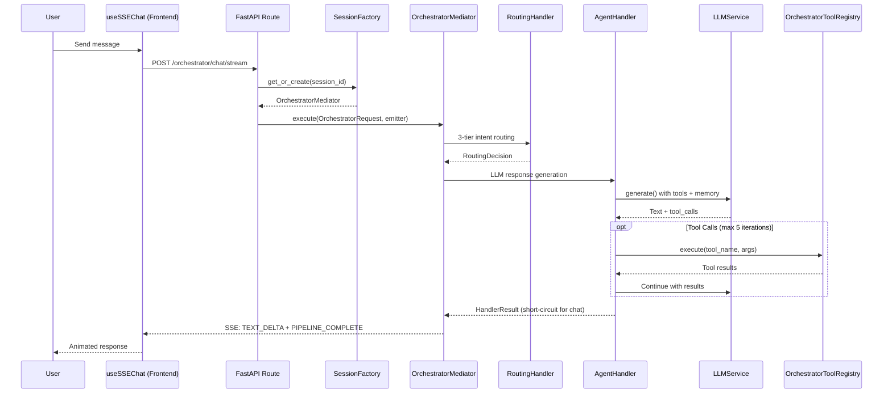
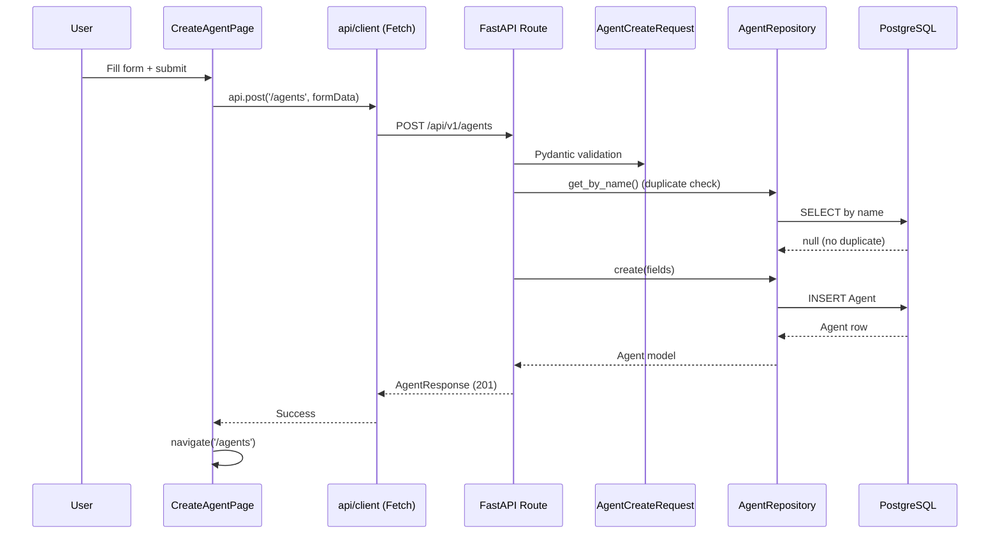
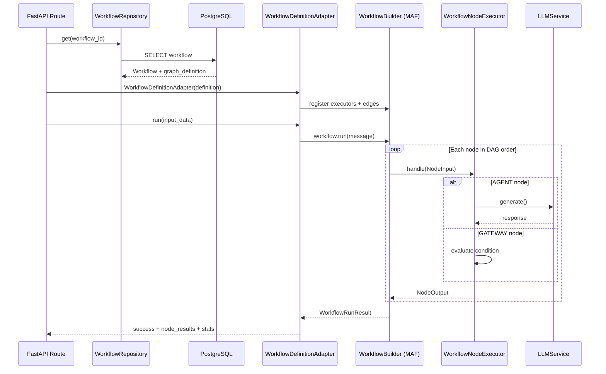
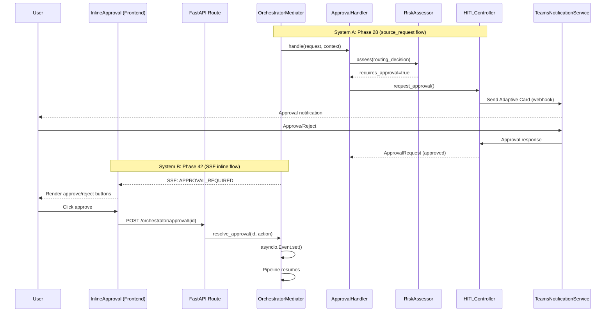
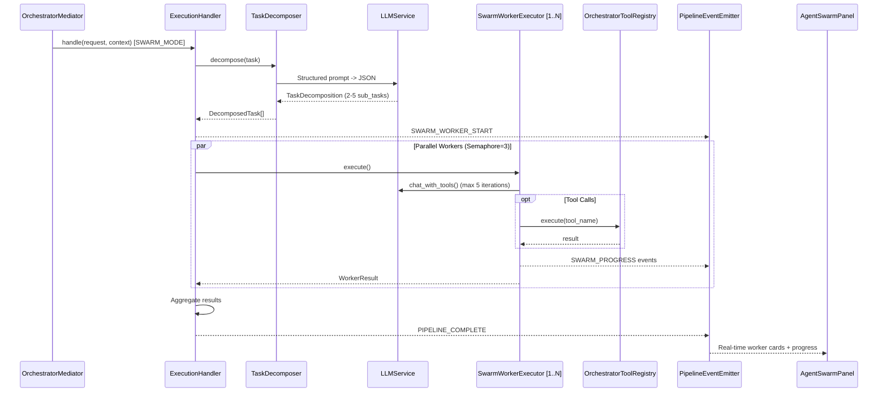

# V9 E2E Flow Verification — Flows 01-05

> **Date**: 2026-03-29
> **Method**: Manual code-path tracing through actual codebase
> **Scope**: 5 end-to-end flows covering Chat, CRUD, Workflow, HITL, and Swarm

---

## Sequence Diagrams

### Flow 1 — Chat Message E2E

### Flow 2 — Agent CRUD (Create)

### Flow 3 — Workflow Execute

### Flow 4 — HITL Approval

### Flow 5 — Swarm Multi-Agent

---

## Flow 1: Chat Message (User -> Response)

**Path**: User types message -> SSE stream -> LLM response displayed

---

### Step 1: Frontend — User sends message via SSE hook

- **File**: `frontend/src/hooks/useSSEChat.ts:68-96`
- **Function**: `sendSSE(request: SSEChatRequest, handlers: SSEEventHandlers)`
- **Input**: `SSEChatRequest { content: string, mode?: 'chat'|'workflow'|'swarm', source?, user_id?, session_id?, metadata? }`
- **Output**: Initiates `fetch()` POST to `${API_BASE_URL}/orchestrator/chat/stream`
- **Mock/Real**: REAL — uses native `fetch()` with `AbortController`
- **Potential failure**: Network timeout, CORS error, missing auth token from `useAuthStore`

**Details**: Creates `AbortController` for cancellation. Sets `Content-Type: application/json` and guest headers via `getGuestHeaders()`. Auth token from Zustand `authStore` added as `Bearer` header if present. Response body consumed as `ReadableStream` with `TextDecoder`.

---

### Step 2: Frontend — SSE event parsing and dispatch

- **File**: `frontend/src/hooks/useSSEChat.ts:110-143`
- **Function**: `dispatchEvent(type: PipelineSSEEventType, data, handlers)` (line 168-211)
- **Input**: Raw SSE text chunks from `ReadableStream`
- **Output**: Parsed events dispatched to typed callback handlers (12 event types)
- **Mock/Real**: REAL — standard SSE line parsing (`event:`, `data:`, blank line delimiter)
- **Potential failure**: Malformed SSE events silently skipped (catch at line 136). Buffer accumulation on slow connections.

**Details**: Parses `event: TYPE\ndata: JSON\n\n` format. Maps to 12 `PipelineSSEEventType` values: `PIPELINE_START`, `ROUTING_COMPLETE`, `AGENT_THINKING`, `TOOL_CALL_START`, `TOOL_CALL_END`, `TEXT_DELTA`, `TASK_DISPATCHED`, `SWARM_WORKER_START`, `SWARM_PROGRESS`, `APPROVAL_REQUIRED`, `PIPELINE_COMPLETE`, `PIPELINE_ERROR`.

---

### Step 3: Backend — FastAPI SSE endpoint receives request

- **File**: `backend/src/api/v1/orchestrator/routes.py:275-340`
- **Function**: `orchestrator_chat_stream(request: PipelineRequest)`
- **Input**: `PipelineRequest { content: str, source, mode?, user_id?, session_id?, metadata }`
- **Output**: `StreamingResponse` with `media_type="text/event-stream"`
- **Mock/Real**: REAL — FastAPI `StreamingResponse` wrapping `emitter.stream()`
- **Potential failure**: Bootstrap failure at `_get_session_factory()` (falls back to minimal mediator). `asyncio.create_task(run_pipeline())` errors logged but may leave stream hanging.

**Details**: Parses `PipelineRequest` (Pydantic model from `integrations/contracts/pipeline.py`). Maps `request.mode` string to `ExecutionMode` enum. Creates `PipelineEventEmitter` (async queue-based). Builds `OrchestratorRequest` dataclass. Launches pipeline as background task via `asyncio.create_task()`.

---

### Step 4: Backend — Session factory creates/retrieves mediator

- **File**: `backend/src/integrations/hybrid/orchestrator/session_factory.py:52-71`
- **Function**: `OrchestratorSessionFactory.get_or_create(session_id: str) -> OrchestratorMediator`
- **Input**: `session_id` string (default "default")
- **Output**: Fully-wired `OrchestratorMediator` with 7 handlers
- **Mock/Real**: REAL — LRU cache with `OrderedDict`, max 200 sessions (routes.py:86 overrides class default of 100)
- **Potential failure**: `_create_orchestrator()` catches all exceptions and falls back to minimal mediator with only `AgentHandler`.

**Details**: Uses `OrchestratorBootstrap.build()` which wires all 7 handlers: ContextHandler, RoutingHandler, DialogHandler, ApprovalHandler, AgentHandler, ExecutionHandler, ObservabilityHandler. Each handler uses graceful degradation — if a dependency is unavailable, handler is created with `None` dependency.

---

### Step 5: Backend — Bootstrap assembles full pipeline

- **File**: `backend/src/integrations/hybrid/orchestrator/bootstrap.py:39-101`
- **Function**: `OrchestratorBootstrap.build() -> OrchestratorMediator`
- **Input**: Optional `llm_service` (created via `LLMServiceFactory` if None)
- **Output**: `OrchestratorMediator` with all handlers wired
- **Mock/Real**: REAL infrastructure wiring, but many sub-dependencies may be unavailable (each logged as warning)
- **Potential failure**: Each `_wire_*_handler()` method wraps in try/except. Total failure returns `None` handler; SessionFactory catches and falls back to minimal mediator.

**Key wiring**:
- `_wire_context_handler()`: ContextBridge + OrchestratorMemoryManager (with UnifiedMemoryManager)
- `_wire_routing_handler()`: InputGateway + BusinessIntentRouter (3-tier) + FrameworkSelector (2 classifiers) + SwarmModeHandler
- `_wire_dialog_handler()`: GuidedDialogEngine (requires router)
- `_wire_approval_handler()`: RiskAssessor + HITLController (with InMemoryApprovalStorage)
- `_wire_agent_handler()`: LLM service + OrchestratorToolRegistry
- `_wire_execution_handler()`: ClaudeCoordinator + WorkflowExecutorAdapter + SwarmModeHandler
- `_wire_observability_handler()`: ObservabilityBridge

---

### Step 6: Backend — Mediator executes 7-handler pipeline

- **File**: `backend/src/integrations/hybrid/orchestrator/mediator.py:196-569`
- **Function**: `OrchestratorMediator.execute(request, event_emitter) -> OrchestratorResponse`
- **Input**: `OrchestratorRequest` + optional `PipelineEventEmitter`
- **Output**: `OrchestratorResponse { success, content, framework_used, execution_mode, ... }`
- **Mock/Real**: REAL pipeline execution with SSE event emission at each step
- **Potential failure**: Any handler failure is caught; routing failure returns error response. Pipeline-level exception returns error `OrchestratorResponse`.

**Pipeline steps with SSE events**:
1. `PIPELINE_START` emitted (line 288)
2. **ContextHandler**: Memory read + context preparation
3. **RoutingHandler**: 3-tier intent routing -> `ROUTING_COMPLETE` emitted (line 315)
4. **DialogHandler**: Conditional guided dialog (may short-circuit)
5. **ApprovalHandler**: Risk assessment (may short-circuit or emit `APPROVAL_REQUIRED`)
6. **HITL inline approval** (line 356-402): For high/critical risk, emits `APPROVAL_REQUIRED`, waits 120s via `asyncio.Event`
7. `AGENT_THINKING` emitted (line 404)
8. **AgentHandler**: LLM response generation with function calling loop
9. `TOOL_CALL_END` emitted per tool call (line 416)
10. If chat mode: `TEXT_DELTA` + `PIPELINE_COMPLETE` emitted, short-circuit return (line 450-455)
11. **ExecutionHandler**: MAF/Claude/Swarm dispatch -> `TASK_DISPATCHED` emitted (line 475)
12. **Context sync** after execution
13. **ObservabilityHandler**: Metrics recording
14. Memory write (conversation to long-term memory)
15. Session update + `TEXT_DELTA` + `PIPELINE_COMPLETE` emitted (line 549-553)

---

### Step 7: Backend — RoutingHandler performs 3-tier intent classification

- **File**: `backend/src/integrations/hybrid/orchestrator/handlers/routing.py:135-226`
- **Function**: `RoutingHandler._handle_direct_routing(request, context) -> HandlerResult`
- **Input**: `OrchestratorRequest` content string
- **Output**: `HandlerResult` with `routing_decision`, `intent_analysis`, `execution_mode`
- **Mock/Real**: REAL when `BusinessIntentRouter` is wired (requires PatternMatcher YAML + SemanticRouter + LLMClassifier)
- **Potential failure**: 3-tier routing failure caught and logged as warning; falls back to FrameworkSelector-only analysis.

**Details**: Calls `self._business_router.route(request.content)` which runs the 3-tier cascade:
- Layer 1: PatternMatcher (<10ms, regex from YAML, confidence >= 0.90)
- Layer 2: SemanticRouter (<100ms, vector similarity, threshold >= 0.85)
- Layer 3: LLMClassifier (<2000ms, Claude Haiku fallback)

Result: `RoutingDecision { intent_category, sub_intent, confidence, risk_level, routing_layer, workflow_type }`.

Then runs `FrameworkSelector.select_framework()` with 2 classifiers (RuleBasedClassifier + RoutingDecisionClassifier) to determine `ExecutionMode` (CHAT_MODE, WORKFLOW_MODE, SWARM_MODE, HYBRID_MODE). If `force_mode` is set by user, it overrides.

---

### Step 8: Backend — AgentHandler generates LLM response

- **File**: `backend/src/integrations/hybrid/orchestrator/agent_handler.py:65-176`
- **Function**: `AgentHandler.handle(request, context) -> HandlerResult`
- **Input**: `OrchestratorRequest` + pipeline context with routing_decision, memory_context, conversation_history
- **Output**: `HandlerResult` with `content`, `tool_calls`, `should_short_circuit`
- **Mock/Real**: REAL when `llm_service` is configured (Azure OpenAI via `LLMServiceFactory`)
- **Potential failure**: LLM not configured -> returns Chinese fallback message. LLM call failure -> returns error message. Max 5 tool iterations.

**Details**: Builds messages array:
- System prompt: `ORCHESTRATOR_SYSTEM_PROMPT` + tools prompt + memory context + routing context
- Last 10 conversation history messages
- Current user message

If tool schemas available + `llm_service.chat_with_tools()` supported: enters function calling loop (max 5 iterations). Each iteration calls LLM, processes tool_calls via `OrchestratorToolRegistry.execute()`, appends results. Loop ends when LLM returns content without tool_calls.

For CHAT_MODE: `should_short_circuit=True` -> pipeline skips ExecutionHandler and returns directly.

---

### Step 9: Backend — SSE events streamed back via PipelineEventEmitter

- **File**: `backend/src/integrations/hybrid/orchestrator/sse_events.py:93-158`
- **Function**: `PipelineEventEmitter.stream(agui_format=False) -> AsyncGenerator[str, None]`
- **Input**: Events pushed to `asyncio.Queue` by handlers
- **Output**: SSE-formatted strings: `event: TYPE\ndata: JSON\n\n`
- **Mock/Real**: REAL — async queue with 120s keepalive timeout
- **Potential failure**: 120s timeout sends keepalive `": keepalive\n\n"`. Stream terminates on `PIPELINE_COMPLETE` or `PIPELINE_ERROR`.

---

### Step 10: Frontend — Response rendered in chat UI

- **File**: `frontend/src/hooks/useSSEChat.ts:173-210`
- **Function**: `dispatchEvent()` -> callbacks like `onTextDelta`, `onPipelineComplete`
- **Input**: Parsed SSE events
- **Output**: UI state updates via callback handlers (typically updating Zustand `unifiedChatStore`)
- **Mock/Real**: REAL
- **Potential failure**: `AbortError` on user cancellation (handled at line 145-147). Store state inconsistency if `PIPELINE_COMPLETE` never received.

---

### Flow 1 Summary

| Aspect | Status |
|--------|--------|
| Frontend -> Backend | REAL (fetch + SSE) |
| Intent Routing | REAL (3-tier) when BusinessIntentRouter wired |
| LLM Call | REAL when Azure OpenAI configured |
| Function Calling | REAL with OrchestratorToolRegistry |
| SSE Streaming | REAL (PipelineEventEmitter) |
| Memory Read/Write | REAL when UnifiedMemoryManager + mem0 configured |
| Session Persistence | REAL when ConversationStateStore available (fallback: in-memory) |

---

## Flow 2: Agent CRUD (Create Agent)

**Path**: User fills form -> POST /agents -> DB insert -> Response displayed

---

### Step 1: Frontend — CreateAgentPage form submission

- **File**: `frontend/src/pages/agents/CreateAgentPage.tsx:1-60+`
- **Function**: Multi-step form component using `useMutation` from TanStack React Query
- **Input**: `AgentFormData { name, description, category, instructions, tools[], model_config_data, max_iterations }`
- **Output**: `api.post('/agents', formData)` via Fetch API
- **Mock/Real**: REAL — uses `api.post()` from `@/api/client`
- **Potential failure**: Form validation (client-side). Network error. 409 Conflict if name already exists.

---

### Step 2: Frontend — API client sends POST request

- **File**: `frontend/src/api/client.ts:1-60`
- **Function**: `api.post<T>(endpoint, body)` -> `fetchApi<T>(endpoint, { method: 'POST', body: JSON.stringify(body) })`
- **Input**: `/agents` endpoint + JSON body
- **Output**: Parsed JSON response
- **Mock/Real**: REAL — native Fetch API (NOT Axios)
- **Potential failure**: 401 -> `handleUnauthorized()` (logout + redirect). Non-OK response throws `ApiError`.

**Details**: Adds auth token from `useAuthStore.getState().token` as `Authorization: Bearer` header. Adds `X-Guest-Id` header from `getGuestHeaders()` for sandbox isolation.

---

### Step 3: Backend — FastAPI route handler

- **File**: `backend/src/api/v1/agents/routes.py:65-117`
- **Function**: `create_agent(request: AgentCreateRequest, repo: AgentRepository)`
- **Input**: `AgentCreateRequest { name, description?, instructions, category?, tools[], model_config_data, max_iterations }`
- **Output**: `AgentResponse` (HTTP 201 Created)
- **Mock/Real**: REAL
- **Potential failure**: 409 Conflict if `repo.get_by_name(request.name)` finds existing agent.

**Details**:
1. Duplicate name check via `repo.get_by_name()`
2. Calls `repo.create()` with all fields
3. Returns `AgentResponse` with all fields including `id`, `created_at`, `updated_at`

---

### Step 4: Backend — Dependency injection provides repository

- **File**: `backend/src/api/v1/agents/routes.py:48-53`
- **Function**: `get_agent_repository(session: AsyncSession = Depends(get_session)) -> AgentRepository`
- **Input**: `AsyncSession` from database session provider
- **Output**: `AgentRepository` instance
- **Mock/Real**: REAL — uses FastAPI `Depends()` with SQLAlchemy async session
- **Potential failure**: Database connection failure at `get_session()`.

---

### Step 5: Backend — AgentRepository.create() persists to PostgreSQL

- **File**: `backend/src/infrastructure/database/repositories/agent.py:20-31` (inherits from `BaseRepository`)
- **Function**: `BaseRepository.create(name, description, instructions, category, tools, model_config, max_iterations)`
- **Input**: Agent field values
- **Output**: `Agent` ORM model instance
- **Mock/Real**: REAL — SQLAlchemy ORM with PostgreSQL
- **Potential failure**: Database constraint violation. Connection pool exhaustion. Transaction rollback.

**Details**: `AgentRepository` extends `BaseRepository[Agent]`. The `Agent` model is a SQLAlchemy ORM model in `infrastructure/database/models/agent.py` with UUID primary key, JSONB columns for `tools` and `model_config`.

---

### Step 6: Backend — Pydantic schema validation

- **File**: `backend/src/domain/agents/schemas.py:16-50`
- **Function**: `AgentCreateRequest` Pydantic BaseModel validation
- **Input**: Raw JSON from HTTP body
- **Output**: Validated `AgentCreateRequest` instance
- **Mock/Real**: REAL — Pydantic v2 validation
- **Potential failure**: `name` min_length=1, max_length=255. `instructions` min_length=1. `max_iterations` ge=1, le=100. FastAPI auto-returns 422 on validation failure.

---

### Step 7: Frontend — React Query mutation success handler

- **File**: `frontend/src/pages/agents/CreateAgentPage.tsx` (within `useMutation` config)
- **Function**: `onSuccess` callback
- **Input**: `AgentResponse` from API
- **Output**: `navigate('/agents')` only (no cache invalidation)
- **Mock/Real**: REAL
- **Potential failure**: Navigation failure.

---

### Flow 2 Summary

| Aspect | Status |
|--------|--------|
| Frontend Form | REAL (multi-step React form) |
| API Client | REAL (Fetch API, not Axios) |
| Route Handler | REAL (FastAPI with Depends) |
| Schema Validation | REAL (Pydantic v2) |
| Repository | REAL (SQLAlchemy async) |
| Database | REAL (PostgreSQL with JSONB) |
| Mock Barriers | None — fully real path |

---

## Flow 3: Workflow Execute

**Path**: API trigger -> Validate -> Parse DAG -> Execute nodes -> Return results

---

### Step 1: Frontend/API — Trigger workflow execution

- **File**: `backend/src/api/v1/workflows/routes.py:346-470`
- **Function**: `execute_workflow(workflow_id: UUID, request: WorkflowExecuteRequest, repo: WorkflowRepository)`
- **Input**: `WorkflowExecuteRequest { input: Dict, variables?: Dict }` + workflow_id path param
- **Output**: `WorkflowExecutionResponse { execution_id, workflow_id, status, result, node_results[], stats, started_at, completed_at }`
- **Mock/Real**: REAL
- **Potential failure**: 404 if workflow not found. 400 if workflow not active. 500 on parse/execution failure.

---

### Step 2: Backend — Load and validate workflow from database

- **File**: `backend/src/api/v1/workflows/routes.py:366-388`
- **Function**: `repo.get(workflow_id)` + status check + `WorkflowDefinition.from_dict()`
- **Input**: `workflow_id` UUID
- **Output**: Parsed `WorkflowDefinition` domain model
- **Mock/Real**: REAL — PostgreSQL lookup + domain model parsing
- **Potential failure**: Workflow not found (404). Workflow not active (400). Definition parse failure (500).

**Details**: Loads `graph_definition` JSONB from database. Parses into `WorkflowDefinition` domain model containing `WorkflowNode` list (with types: START, END, AGENT, GATEWAY) and `WorkflowEdge` list.

---

### Step 3: Backend — Create WorkflowDefinitionAdapter

- **File**: `backend/src/integrations/agent_framework/core/workflow.py:113+` (imports at line 37)
- **Function**: `WorkflowDefinitionAdapter(definition=definition)` constructor
- **Input**: `WorkflowDefinition` domain model
- **Output**: Adapter wrapping official `WorkflowBuilder` from `agent_framework`
- **Mock/Real**: REAL — uses official `from agent_framework import Workflow, WorkflowBuilder, Edge, Executor`
- **Potential failure**: Import failure if `agent_framework` package not installed or version mismatch.

**Details**: Uses official Microsoft Agent Framework API: `WorkflowBuilder` to register executors, add edges, set start executor. Each node becomes a registered `Executor`. Edges define the DAG.

---

### Step 4: Backend — Execute workflow via adapter.run()

- **File**: `backend/src/api/v1/workflows/routes.py:394-430`
- **Function**: `adapter.run(input_data, execution_id, context)`
- **Input**: `{ **request.input, "variables": request.variables or {} }` + execution_id UUID + context
- **Output**: `WorkflowRunResult { success, result, execution_path, node_results, error, metadata }`
- **Mock/Real**: REAL — delegates to official `Workflow.run()` via adapter
- **Potential failure**: Node execution failure. Timeout. Missing agent for AGENT-type nodes.

**Details**: The adapter internally:
1. Builds official `Workflow` via `WorkflowBuilder`
2. Registers `WorkflowNodeExecutor` for each node
3. Defines edges via `Edge` objects
4. Calls `workflow.run(message)` which traverses the DAG
5. Collects `NodeOutput` from each node execution
6. Returns aggregated `WorkflowRunResult`

---

### Step 5: Backend — DAG traversal (node-by-node execution)

- **File**: `backend/src/integrations/agent_framework/core/workflow.py` (run method) + `executor.py`
- **Function**: `WorkflowNodeExecutor.handle()` for each node in topological order
- **Input**: `NodeInput` (from previous node or initial input)
- **Output**: `NodeOutput` (data + metadata for next node)
- **Mock/Real**: REAL for structure, but node execution depends on agent availability
- **Potential failure**: AGENT nodes require LLM service. GATEWAY nodes need condition evaluation. Missing edges cause unreachable nodes.

**Node types**:
- `START`: Pass-through, initializes data flow
- `END`: Collects final result
- `AGENT`: Invokes AI agent (requires LLM) — the core execution
- `GATEWAY`: Decision routing (EXCLUSIVE, PARALLEL, INCLUSIVE subtypes)

---

### Step 6: Backend — Build execution response

- **File**: `backend/src/api/v1/workflows/routes.py:432-458`
- **Function**: Response construction from `WorkflowRunResult`
- **Input**: `WorkflowRunResult` + timing data
- **Output**: `WorkflowExecutionResponse` with per-node results and stats
- **Mock/Real**: REAL
- **Potential failure**: Result serialization failure (handled with `json.dumps(result.result, default=str)` fallback at line 436-442).

---

### Flow 3 Summary

| Aspect | Status |
|--------|--------|
| API Route | REAL (FastAPI with async) |
| DB Lookup | REAL (PostgreSQL via WorkflowRepository) |
| Validation | REAL (WorkflowDefinitionAdapter validates graph) |
| DAG Parsing | REAL (WorkflowDefinition.from_dict) |
| Execution Engine | REAL (official agent_framework WorkflowBuilder) |
| Node Execution | REAL structure, AGENT nodes need LLM |
| Mock Barriers | AGENT node execution requires Azure OpenAI config |
| Critical Issues | `stats` always returns 0 for llm_calls/tokens/cost (line 451-455) — metrics not propagated from node executors |

---

## Flow 4: HITL Approval

**Path**: Risk detection -> Approval request -> (Teams notification) -> User approval -> Execution resume

This flow has **3 separate approval systems** in the codebase:

### System A: Phase 28 — ApprovalHandler + HITLController (source_request flow)

### Step A1: ApprovalHandler detects high-risk operation

- **File**: `backend/src/integrations/hybrid/orchestrator/handlers/approval.py:49-120`
- **Function**: `ApprovalHandler.handle(request, context) -> HandlerResult`
- **Input**: `routing_decision` from pipeline context (set by RoutingHandler)
- **Output**: `HandlerResult` with `should_short_circuit=True` if approval needed
- **Mock/Real**: REAL when `risk_assessor` and `hitl_controller` are wired
- **Potential failure**: Only activates when `request.source_request` is present (Phase 28 flow). Skipped for direct chat.

**Details**:
1. `RiskAssessor.assess(routing_decision)` evaluates risk based on intent category, risk level, and policies
2. If `risk_assessment.requires_approval == True`: `HITLController.request_approval()` creates `ApprovalRequest`
3. If status is PENDING: short-circuits pipeline with approval_id
4. If status is REJECTED: short-circuits with rejection message

---

### Step A2: HITLController creates approval request

- **File**: `backend/src/integrations/orchestration/hitl/controller.py:1-100+`
- **Function**: `HITLController.request_approval(routing_decision, risk_assessment, requester)`
- **Input**: `RoutingDecision` + `RiskAssessment` + requester ID
- **Output**: `ApprovalRequest { request_id, status: PENDING, ... }`
- **Mock/Real**: REAL — creates `ApprovalRequest` dataclass with UUID, stores in `InMemoryApprovalStorage` (not persistent)
- **Potential failure**: `InMemoryApprovalStorage` loses data on server restart. No Redis/DB persistence.
- **Note**: `ApprovalType.MULTI` enum is defined in `controller.py` for quorum-based approval, but is not implemented in the current pipeline flow — only single-approver requests are created.

---

### Step A3: Teams notification sent

- **File**: `backend/src/integrations/orchestration/hitl/notification.py:1-80+`
- **Function**: `TeamsNotificationService` with `TeamsCardBuilder`
- **Input**: `ApprovalRequest` details
- **Output**: HTTP POST to Teams Webhook URL with MessageCard JSON
- **Mock/Real**: REAL structure, but requires `TEAMS_WEBHOOK_URL` environment variable
- **Potential failure**: Missing webhook URL. Teams API rate limiting. Network failure.

**Details**: Builds Microsoft Teams Adaptive Card with:
- Risk level color coding (CRITICAL=red, HIGH=orange, MEDIUM=yellow, LOW=green)
- Intent category, sub-intent, confidence
- Approve/Reject action buttons linking back to API endpoint

---

### System B: Phase 42 — SSE Inline HITL (mediator.py direct flow)

### Step B1: Mediator detects high-risk routing decision during SSE stream

- **File**: `backend/src/integrations/hybrid/orchestrator/mediator.py:355-402`
- **Function**: Inline HITL check within `execute()` pipeline (after ApprovalHandler)
- **Input**: `routing_decision.risk_level` from pipeline context + `event_emitter` present
- **Output**: `APPROVAL_REQUIRED` SSE event emitted to frontend
- **Mock/Real**: REAL — uses `asyncio.Event` for blocking wait
- **Potential failure**: 120s timeout -> approval expires, pipeline continues.

**Details**:
1. Checks if `routing_decision.risk_level` contains "high" or "critical"
2. Generates `approval_id = uuid4()`
3. Creates `asyncio.Event` stored in `self._pending_approvals[approval_id]`
4. Emits `APPROVAL_REQUIRED` SSE event with approval_id, action, risk_level, description
5. Blocks via `asyncio.wait_for(approval_event.wait(), timeout=120)`
6. If rejected: emits `PIPELINE_COMPLETE` with rejection message, returns short-circuit
7. If timeout: logs warning, pipeline continues (fails open)

---

### Step B2: Frontend receives APPROVAL_REQUIRED event

- **File**: `frontend/src/hooks/useSSEChat.ts:190-191` (dispatch) + `frontend/src/components/unified-chat/InlineApproval.tsx`
- **Function**: `handlers.onApprovalRequired?.(data)` callback
- **Input**: `{ approval_id, action, risk_level, description, details }`
- **Output**: Renders approval UI (approve/reject buttons)
- **Mock/Real**: REAL
- **Potential failure**: UI not rendering if callback not wired in parent component.

---

### Step B3: User approves/rejects via API

- **File**: `backend/src/api/v1/orchestrator/routes.py:247-272`
- **Function**: `orchestrator_approval(approval_id: str, body: Dict)`
- **Input**: `POST /orchestrator/approval/{approval_id}` with `{ action: "approve" | "reject" }`
- **Output**: `{ approval_id, action, status: "resolved" }`
- **Mock/Real**: REAL
- **Potential failure**: 404 if approval_id not found in any active session mediator. 400 if action not "approve" or "reject".

**Details**: Iterates all active sessions in `SessionFactory._sessions`, finds the mediator with pending approval, calls `mediator.resolve_approval(approval_id, action)` which sets the `asyncio.Event` and stores result.

---

### Step B4: Pipeline resumes after approval

- **File**: `backend/src/integrations/hybrid/orchestrator/mediator.py:377-398`
- **Function**: Continuation after `approval_event.wait()` returns
- **Input**: `self._approval_results[approval_id]` = "approve" or "reject"
- **Output**: Pipeline continues to AgentHandler (if approved) or returns rejection (if rejected)
- **Mock/Real**: REAL
- **Potential failure**: Race condition if approval resolved after timeout.

---

### System C: Phase 4 — Checkpoint-based approval (domain/checkpoints)

### Step C1: Checkpoint service requests approval

- **File**: `backend/src/domain/checkpoints/service.py` (documented in domain/CLAUDE.md)
- **Function**: `CheckpointService.request_approval(execution_id, checkpoint_name, timeout_minutes)`
- **Input**: execution_id + checkpoint config
- **Output**: `Checkpoint` with PENDING status
- **Mock/Real**: REAL structure — uses `ExecutionStateMachine` for state transitions
- **Potential failure**: This is the oldest HITL system. May not be connected to the Phase 42 pipeline.

---

### Flow 4 Summary

| Approval System | Trigger | Storage | Notification | Status |
|----------------|---------|---------|--------------|--------|
| **System A** (Phase 28) | `source_request` present + high risk | InMemoryApprovalStorage | Teams Webhook | REAL but requires Phase 28 source request |
| **System B** (Phase 42) | High/critical risk in SSE stream | `asyncio.Event` in mediator | SSE `APPROVAL_REQUIRED` event | REAL for SSE chat flow |
| **System C** (Phase 4) | Workflow checkpoint | Database (CheckpointRepository) | Notification service | REAL but disconnected from pipeline |

| Aspect | Status |
|--------|--------|
| Risk Detection | REAL (RiskAssessor with policies) |
| Approval Storage | MOCK-like (InMemoryApprovalStorage, asyncio.Event — no persistence) |
| Teams Notification | REAL structure, requires TEAMS_WEBHOOK_URL env var |
| SSE Inline Approval | REAL (asyncio.Event + SSE) |
| Timeout Behavior | Fails OPEN (pipeline continues after 120s) |
| Mock Barriers | InMemoryApprovalStorage not persistent. Teams webhook needs config. |
| Critical Issues | 3 disconnected approval systems. System B fails open on timeout. No audit trail for SSE approvals. |

---

## Flow 5: Swarm Multi-Agent

**Path**: Swarm trigger -> Task decomposition -> Worker dispatch -> Parallel execution -> Result aggregation

This flow has **2 paths**: Phase 29 demo path and Phase 43 real path.

### Path A: Phase 29 — Demo/Mock Swarm (via /swarm/demo endpoints)

### Step A1: Demo swarm start

- **File**: `backend/src/api/v1/swarm/demo.py` (5 endpoints)
- **Function**: `POST /api/v1/swarm/demo/start`
- **Input**: Demo configuration
- **Output**: Swarm ID + SSE stream
- **Mock/Real**: MOCK — uses `SwarmTracker` with simulated workers and pre-defined subtasks
- **Potential failure**: N/A (demo mode)

**Details**: Creates `SwarmIntegration` with `SwarmTracker`. Simulates worker lifecycle: `on_coordination_started()` -> `on_subtask_started()` -> `on_subtask_progress()` -> `on_subtask_completed()` -> `on_coordination_completed()`. Events emitted via `SwarmEventEmitter` as AG-UI CustomEvents.

---

### Step A2: Demo SSE streaming

- **File**: `backend/src/integrations/swarm/events/emitter.py`
- **Function**: `SwarmEventEmitter.emit_*()` methods (9 event types)
- **Input**: Event payloads (SwarmCreatedPayload, WorkerStartedPayload, etc.)
- **Output**: AG-UI CustomEvent SSE stream
- **Mock/Real**: REAL event infrastructure, MOCK data
- **Potential failure**: N/A (demo mode)

---

### Path B: Phase 43 — Real Swarm (via orchestrator pipeline)

### Step B1: Swarm mode triggered in ExecutionHandler

- **File**: `backend/src/integrations/hybrid/orchestrator/handlers/execution.py:62-104`
- **Function**: `ExecutionHandler.handle(request, context) -> HandlerResult`
- **Input**: `execution_mode == SWARM_MODE` or `swarm_decomposition` in context
- **Output**: Delegates to `_execute_swarm()`
- **Mock/Real**: REAL
- **Potential failure**: Swarm mode detection depends on either user-selected `force_mode=swarm` or RoutingHandler setting `swarm_decomposition` in context.

**Details**: Two triggers for swarm mode:
1. User explicitly selects "swarm" mode in UI -> `request.force_mode = ExecutionMode.SWARM_MODE`
2. RoutingHandler's `SwarmModeHandler.analyze_for_swarm()` detects complex task -> sets `context["swarm_decomposition"]`

---

### Step B2: Task decomposition via LLM

- **File**: `backend/src/integrations/swarm/task_decomposer.py:79-146`
- **Function**: `TaskDecomposer.decompose(task: str) -> TaskDecomposition`
- **Input**: User's complex request string
- **Output**: `TaskDecomposition { original_task, mode, sub_tasks: List[DecomposedTask], reasoning }`
- **Mock/Real**: REAL — uses LLM to decompose (via `generate_structured()` or `generate()` + JSON parse)
- **Potential failure**: LLM failure -> single-task fallback. JSON parse failure -> fallback.

**Details**: Sends structured prompt to LLM with:
- Available roles: research, writer, designer, reviewer, coordinator, analyst, coder, tester, general
- Available tools from registry
- Decomposition rules (2-5 subtasks, each independent)
- Output format: JSON with mode, reasoning, sub_tasks array

Each `DecomposedTask` has: `task_id`, `title`, `description`, `role`, `priority`, `tools_needed`.

---

### Step B3: ExecutionHandler creates parallel worker executors

- **File**: `backend/src/integrations/hybrid/orchestrator/handlers/execution.py:223-360+`
- **Function**: `ExecutionHandler._execute_swarm(request, context, decomposition)`
- **Input**: `TaskDecomposition` with sub-tasks
- **Output**: Aggregated `HandlerResult` with all worker results
- **Mock/Real**: REAL — uses `asyncio.Semaphore(3)` for max 3 concurrent workers
- **Potential failure**: LLM service unavailable. Tool registry unavailable. All workers timeout.

**Details**:
1. Gets LLM service (from context or creates via `LLMServiceFactory`)
2. Gets tool registry (from context or creates new `OrchestratorToolRegistry`)
3. Calls `TaskDecomposer.decompose(request.content)` for LLM-powered decomposition
4. Emits `SWARM_WORKER_START` SSE event with swarm overview
5. Creates `SwarmWorkerExecutor` per sub-task
6. Runs all workers via `asyncio.gather(*tasks)` with semaphore (max 3 concurrent)
7. Aggregates results

---

### Step B4: Individual worker execution with LLM + tools

- **File**: `backend/src/integrations/swarm/worker_executor.py:40-402`
- **Function**: `SwarmWorkerExecutor.execute() -> WorkerResult`
- **Input**: `DecomposedTask` + LLM service + tool registry + event emitter
- **Output**: `WorkerResult { worker_id, role, task_title, status, content, tool_calls_made, thinking_steps, messages, duration_ms }`
- **Mock/Real**: REAL — independent LLM function calling loop per worker
- **Potential failure**: LLM call failure (retry once). Timeout (60s default). Tool execution failure.

**Details per worker**:
1. Emits `SWARM_WORKER_START` SSE event
2. Builds role-specific system prompt from `worker_roles.py`
3. Gets role-filtered tool schemas from registry
4. Enters function calling loop (max 5 iterations):
   a. Emits `SWARM_WORKER_PROGRESS` with progress percentage
   b. Calls `llm_service.chat_with_tools()` or fallback `generate()`
   c. Emits `SWARM_WORKER_THINKING` with content
   d. If tool_calls: Emits `SWARM_WORKER_TOOL_CALL`, executes via registry, appends results
   e. If no tool_calls: final response reached
5. Emits `SWARM_WORKER_COMPLETED` with content preview + duration
6. Returns `WorkerResult`

Worker SSE events are mapped to Pipeline SSE types:
- `SWARM_WORKER_START` -> `SSEEventType.SWARM_WORKER_START`
- `SWARM_WORKER_THINKING/PROGRESS/TOOL_CALL/COMPLETED` -> `SSEEventType.SWARM_PROGRESS`
- `SWARM_WORKER_FAILED` -> `SSEEventType.PIPELINE_ERROR`

---

### Step B5: Result aggregation and synthesis

- **File**: `backend/src/integrations/hybrid/orchestrator/handlers/execution.py:317+` (continuation of `_execute_swarm`)
- **Function**: Result collection from `asyncio.gather()` + aggregation
- **Input**: List of `WorkerResult` from all workers
- **Output**: `HandlerResult` with aggregated content
- **Mock/Real**: REAL structure. Aggregation is concatenation with role headers (no ResultSynthesiser in current code).
- **Potential failure**: All workers failed -> error result.

**Details**: After `asyncio.gather()` completes:
1. Collects all `WorkerResult` objects
2. Counts completed vs failed workers
3. Concatenates worker outputs with role display names as headers: `"\n\n".join(content_parts)`
4. Emits final `PIPELINE_COMPLETE` SSE event
5. Returns `HandlerResult` with aggregated content and worker metadata

---

### Step B6: Frontend — Swarm visualization

- **File**: `frontend/src/components/unified-chat/agent-swarm/AgentSwarmPanel.tsx` (15 components + 4 hooks)
- **Function**: `AgentSwarmPanel` renders worker cards, progress, thinking, tool calls
- **Input**: SSE events via `useSSEChat` handlers (`onSwarmWorkerStart`, `onSwarmProgress`)
- **Output**: Real-time UI showing worker cards with status, progress bars, thinking panels
- **Mock/Real**: REAL UI components. Can use mock data via `useSwarmMock.ts` hook in dev mode.
- **Potential failure**: Worker card accumulation bug (fixed in Sprint 148). Drawer auth fix.

**Key components**:
- `WorkerCard.tsx` / `WorkerCardList.tsx`: Individual worker visualization
- `WorkerDetailDrawer.tsx`: Side panel with worker details
- `ExtendedThinkingPanel.tsx`: AI thinking process display
- `ToolCallsPanel.tsx` / `ToolCallItem.tsx`: Tool execution tracking
- `SwarmHeader.tsx` / `SwarmStatusBadges.tsx`: Overall swarm status
- `OverallProgress.tsx`: Aggregated progress bar

---

### Flow 5 Summary

| Aspect | Phase 29 Demo | Phase 43 Real |
|--------|--------------|---------------|
| Trigger | `/swarm/demo/start` API | User selects swarm mode or auto-detected |
| Task Decomposition | Pre-defined subtasks | LLM-powered via TaskDecomposer |
| Worker Execution | Simulated callbacks | Real LLM + function calling per worker |
| Tool Calls | Simulated | Real via OrchestratorToolRegistry |
| SSE Events | SwarmEventEmitter (AG-UI) | PipelineEventEmitter (Pipeline SSE) |
| Frontend | Same components | Same components |
| Result Synthesis | N/A | Concatenation with role headers (no ResultSynthesiser in current code) |

| Aspect | Status |
|--------|--------|
| Swarm Trigger | REAL (user-selected or auto-detected) |
| Task Decomposition | REAL (LLM-powered with fallback) |
| Parallel Execution | REAL (asyncio.gather + Semaphore(3)) |
| Worker LLM Calls | REAL (independent chat_with_tools loops) |
| Worker Tool Calls | REAL (OrchestratorToolRegistry) |
| SSE Streaming | REAL (mapped to Pipeline SSE events) |
| Result Synthesis | REAL — concatenation with role headers |
| Mock Barriers | Requires Azure OpenAI config for LLM calls |
| Critical Issues | Phase 29 event format (AG-UI CustomEvent) vs Phase 43 format (Pipeline SSE) are different protocols — frontend must handle both |

---

## Summary Table

| Flow | Total Steps | Status | Mock Barriers | Critical Issues |
|------|-------------|--------|---------------|-----------------|
| **Flow 1: Chat Message** | 10 | Functional E2E | Azure OpenAI config required for LLM | AgentHandler short-circuits in CHAT_MODE (skips ExecutionHandler) — by design |
| **Flow 2: Agent CRUD** | 7 | Fully Real | None | No mock barriers — pure CRUD path |
| **Flow 3: Workflow Execute** | 6 | Functional E2E | AGENT nodes require LLM | `stats` always returns 0 (metrics not propagated from node executors) |
| **Flow 4: HITL Approval** | 8 (across 3 systems) | Partially Real | Teams webhook URL, InMemoryApprovalStorage | 3 disconnected approval systems; SSE approval fails open on 120s timeout; no persistent audit trail |
| **Flow 5: Swarm Multi-Agent** | 12 (2 paths) | Functional E2E | Azure OpenAI config required | Phase 29 vs Phase 43 use different SSE event protocols; Demo path is mock, Real path is functional |

### Cross-Flow Issues

| Issue | Severity | Affected Flows | Description |
|-------|----------|----------------|-------------|
| InMemoryApprovalStorage | HIGH | Flow 4 | Approval state lost on server restart |
| 3 disconnected HITL systems | HIGH | Flow 4 | Phase 4, 28, 42 each have separate approval mechanisms |
| SSE protocol mismatch | MEDIUM | Flow 5 | Phase 29 (AG-UI CustomEvent) vs Phase 43 (Pipeline SSE) different formats |
| Stats always zero | MEDIUM | Flow 3 | Workflow execution metrics not propagated from node executors |
| MemoryCheckpointStorage default | MEDIUM | Flow 1 | In-memory checkpoint storage used as default instead of Redis/Postgres |
| Session persistence | LOW | Flow 1 | ConversationStateStore fallback to in-memory dict |
| Timeout fails open | HIGH | Flow 4 | HITL approval timeout (120s) allows pipeline to continue without approval |
