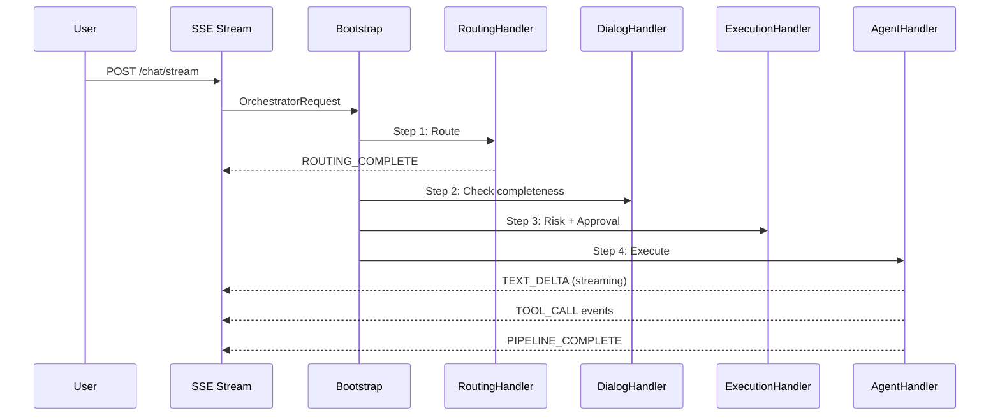

# V9 E2E Flow Verification: Flows 6-8 (Phase 35-44)

> **Scope**: New flows that did NOT exist in V8. Traced from scratch against source code.
> **Date**: 2026-03-29
> **Branch**: `feature/phase-42-deep-integration`

---

## Sequence Diagram

### Flow 6 — 10-Step Pipeline E2E



---

## Flow 6: 10-Step Pipeline E2E (Phase 39-42)

**Entry Point**: `POST /api/v1/orchestrator/chat` (sync) or `POST /api/v1/orchestrator/chat/stream` (SSE)

### Step-by-Step Trace

#### Step 0: HTTP Entry + Session Factory

| # | Component | File:Line | Action |
|---|-----------|-----------|--------|
| 0a | FastAPI route (sync) | `backend/src/api/v1/orchestrator/routes.py:343-479` | Receives `PipelineRequest` (content, mode, session_id, user_id, metadata) |
| 0b | FastAPI route (SSE) | `backend/src/api/v1/orchestrator/routes.py:275-340` | SSE variant: creates `PipelineEventEmitter`, starts pipeline as `asyncio.create_task` |
| 0c | PipelineRequest contract | `backend/src/integrations/contracts/pipeline.py:25-34` | Pydantic model: content, source, mode, user_id, session_id, metadata |
| 0d | Lazy Bootstrap | `backend/src/api/v1/orchestrator/routes.py:33-48` | `_get_bootstrap()` lazy-initialises `OrchestratorBootstrap().build()` on first call |
| 0e | SessionFactory | `backend/src/integrations/hybrid/orchestrator/session_factory.py:52-71` | `get_or_create(session_id)` returns per-session `OrchestratorMediator` via `OrchestratorBootstrap.build()` |
| 0f | Bootstrap assembly | `backend/src/integrations/hybrid/orchestrator/bootstrap.py:39-101` | Wires all 7 handlers with real deps (LLM, ToolRegistry, ContextBridge, etc.) |

**Mode mapping** (routes.py:304-310):
```
"chat" -> ExecutionMode.CHAT_MODE
"workflow" -> ExecutionMode.WORKFLOW_MODE
"swarm" -> ExecutionMode.SWARM_MODE
"hybrid" -> ExecutionMode.HYBRID_MODE
```

#### Step 1: Context Preparation (ContextHandler)

| # | Component | File:Line | Action |
|---|-----------|-----------|--------|
| 1a | Mediator entry | `backend/src/integrations/hybrid/orchestrator/mediator.py:196-210` | `execute()` called with `OrchestratorRequest` + optional `event_emitter` |
| 1b | Session load | `mediator.py:643-676` | `_get_or_create_session()`: checks in-memory cache, then `ConversationStateStore.load()`, then creates new |
| 1c | Checkpoint resume | `mediator.py:268-285` | Checks `RedisCheckpointStorage.load_latest()` for resumable checkpoint; emits `CHECKPOINT_RESTORED` if found |
| 1d | PIPELINE_START SSE | `mediator.py:288-291` | Emits `SSEEventType.PIPELINE_START` with session_id and mode |
| 1e | ContextHandler.handle() | `backend/src/integrations/hybrid/orchestrator/handlers/context.py:48-103` | Calls `ContextBridge.get_or_create_hybrid()` to prepare `HybridContext` |
| 1f | Memory retrieval | `context.py:74-90` | `OrchestratorMemoryManager.retrieve_relevant_memories(query, user_id)` searches 3-layer memory |
| 1g | Memory injection | `context.py:82-84` | `build_memory_context()` formats memories into `MEMORY_INJECTION_TEMPLATE` string, stored as `context["memory_context"]` |

**BARRIER**: `ContextBridge` uses in-memory dict (no locks) -- thread-safety risk (known issue from V8).

#### Step 2: Routing (RoutingHandler)

| # | Component | File:Line | Action |
|---|-----------|-----------|--------|
| 2a | RoutingHandler entry | `backend/src/integrations/hybrid/orchestrator/handlers/routing.py:56-81` | Dispatches to Phase28 flow (if source_request) or direct routing |
| 2b | 3-tier intent routing | `routing.py:151-163` | `BusinessIntentRouter.route(content)` runs Pattern (<10ms) -> Semantic (<100ms) -> LLM (<2s) |
| 2c | FrameworkSelector | `routing.py:187-196` | `select_framework()` with `RoutingDecisionClassifier(weight=1.5)` + `RuleBasedClassifier(weight=1.0)` |
| 2d | force_mode override | `routing.py:167-172` | If user set mode, creates `IntentAnalysis(mode=force_mode, confidence=1.0)` -- skips selector |
| 2e | Suggested mode | `routing.py:200-215` | Generates UI suggestion: incident+critical -> "swarm", incident+high -> "workflow", request/change -> "workflow" |
| 2f | ROUTING_COMPLETE SSE | `mediator.py:314-322` | Emits intent, risk_level, mode, confidence, routing_layer, suggested_mode |
| 2g | Checkpoint save | `mediator.py:324` | `_save_checkpoint("routing", 2)` persists to Redis/Memory checkpoint storage |

**Key design**: Mode is user-controlled (`force_mode`). 3-tier routing ALWAYS runs for risk/security assessment regardless of mode choice (routing.py:151 comment).

#### Step 3: Dialog (DialogHandler) -- Conditional

| # | Component | File:Line | Action |
|---|-----------|-----------|--------|
| 3a | DialogHandler | `mediator.py:327-338` | Runs `GuidedDialogEngine` if completeness check fails |
| 3b | Short-circuit | `mediator.py:332-338` | If `should_short_circuit=True`, returns dialog prompt to user asking for missing info |

**BARRIER**: `GuidedDialogEngine` wired with `create_router_with_llm()` (bootstrap.py:346) -- requires LLM for dialog generation.

#### Step 4: Approval (ApprovalHandler) -- Conditional

| # | Component | File:Line | Action |
|---|-----------|-----------|--------|
| 4a | ApprovalHandler | `mediator.py:341-352` | `RiskAssessor` + `HITLController` check risk level |
| 4b | SSE HITL approval | `mediator.py:355-401` | For high/critical risk + SSE stream: emits `APPROVAL_REQUIRED`, waits on `asyncio.Event` (120s timeout) |
| 4c | Approval endpoint | `routes.py:247-272` | `POST /orchestrator/approval/{approval_id}` resolves the pending event via `mediator.resolve_approval()` |
| 4d | Rejection path | `mediator.py:381-397` | If rejected, emits `PIPELINE_COMPLETE` with "操作已被拒絕" and returns short-circuit |

**BARRIER**: `HITLController` wired with `InMemoryApprovalStorage` fallback (bootstrap.py:388) -- no durable persistence.

#### Step 5: Agent Response (AgentHandler)

| # | Component | File:Line | Action |
|---|-----------|-----------|--------|
| 5a | AGENT_THINKING SSE | `mediator.py:404` | Emits `AGENT_THINKING` event |
| 5b | AgentHandler | `backend/src/integrations/hybrid/orchestrator/agent_handler.py` | LLM call via `llm_service.generate()` with system prompt (includes memory_context), tool definitions from `OrchestratorToolRegistry` |
| 5c | Tool call loop | agent_handler.py | If LLM returns tool_calls, executes them via `OrchestratorToolRegistry.execute()`, feeds results back to LLM |
| 5d | TOOL_CALL_END SSE | `mediator.py:413-420` | Emits `TOOL_CALL_END` for each tool call with tool_name, result, iteration |
| 5e | Short-circuit check | `mediator.py:422-470` | If agent produced direct response (no execution dispatch needed), writes memory, updates history, emits `TEXT_DELTA` + `PIPELINE_COMPLETE`, returns |
| 5f | Memory write (short-circuit) | `mediator.py:426-439` | `memory_mgr._write_to_longterm()` with conversation pair |
| 5g | Checkpoint save | `mediator.py:472` | `_save_checkpoint("agent", 5)` |

**Key design**: Most chat-mode requests short-circuit here after step 5. Steps 6-7 only run when execution dispatch is needed (workflow/swarm).

#### Step 6: Execution Dispatch (ExecutionHandler)

| # | Component | File:Line | Action |
|---|-----------|-----------|--------|
| 6a | TASK_DISPATCHED SSE | `mediator.py:475-478` | Emits `TASK_DISPATCHED` with mode and description |
| 6b | ExecutionHandler entry | `backend/src/integrations/hybrid/orchestrator/handlers/execution.py:62-104` | Routes by `execution_mode`: SWARM_MODE, WORKFLOW_MODE, HYBRID_MODE, CHAT_MODE |
| 6c | SWARM path | `execution.py:223-392` | `TaskDecomposer.decompose()` -> parallel `SwarmWorkerExecutor.execute()` with semaphore(3) -> combine results |
| 6d | SWARM SSE events | `execution.py:273-284` | Emits `SWARM_WORKER_START` (with tasks list) and `SWARM_PROGRESS` (SWARM_COMPLETED) |
| 6e | WORKFLOW path | `execution.py:106-156` | `maf_executor()` (MAF WorkflowExecutorAdapter) with Claude fallback |
| 6f | CHAT path | `execution.py:158-198` | `claude_executor()` (ClaudeCoordinator.coordinate_agents) |
| 6g | HYBRID path | `execution.py:200-221` | Dynamic: MAF if `maf_confidence > 0.7`, else Claude |

**BARRIER**: MAF executor (`WorkflowExecutorAdapter`) and Claude executor (`ClaudeCoordinator.coordinate_agents`) may not be connected to real LLM in all environments. ExecutionHandler returns simulated `[MODE] Processed: ...` response when both are `None` (execution.py:148-156, 190-198).

#### Step 7: Post-Execution Context Sync

| # | Component | File:Line | Action |
|---|-----------|-----------|--------|
| 7a | Context sync | `mediator.py:494-502` | `ContextHandler.sync_after_execution()` -> `ContextBridge.sync_after_execution()` |
| 7b | Observability | `mediator.py:505-509` | `ObservabilityHandler` records metrics (via `ObservabilityBridge`) |

#### Step 8: Memory Write

| # | Component | File:Line | Action |
|---|-----------|-----------|--------|
| 8a | Auto memory write | `mediator.py:512-538` | Formats `"User: {content}\nAssistant: {response[:500]}"` and calls `memory_mgr._write_to_longterm()` |
| 8b | Session update | `mediator.py:541-543` | `_update_session_after_execution()` appends to conversation_history |
| 8c | Session persist | `mediator.py:712-721` | `ConversationStateStore.save()` with messages, routing_decision, context |

#### Step 9: Response Build + Final SSE

| # | Component | File:Line | Action |
|---|-----------|-----------|--------|
| 9a | Build response | `mediator.py:546-556` | `_build_response()` aggregates content, framework_used, execution_mode, tool_calls, routing_decision |
| 9b | TEXT_DELTA SSE | `mediator.py:549` | Emits final `TEXT_DELTA` with complete content |
| 9c | PIPELINE_COMPLETE SSE | `mediator.py:550-554` | Emits `PIPELINE_COMPLETE` with content, mode, processing_time_ms |
| 9d | PipelineResponse build | `routes.py:422-479` | Maps response fields to `PipelineResponse` Pydantic model |

#### Step 10: Frontend SSE Consumption

| # | Component | File:Line | Action |
|---|-----------|-----------|--------|
| 10a | useSSEChat hook | `frontend/src/hooks/useSSEChat.ts:64-166` | `sendSSE()` POSTs to `/orchestrator/chat/stream`, reads `ReadableStream` |
| 10b | SSE parsing | `useSSEChat.ts:113-142` | Parses `event:` + `data:` lines, dispatches to typed callbacks |
| 10c | Event dispatch | `useSSEChat.ts:168-211` | `dispatchEvent()` maps 12 SSE event types to handler callbacks |
| 10d | AbortController | `useSSEChat.ts:71-76,157-163` | Supports stream cancellation via `cancelStream()` |

### SSE Event Type Registry (14 types)

Defined in `backend/src/integrations/hybrid/orchestrator/sse_events.py:39-54`:

| # | Event Type | AG-UI Mapping | Emitted At |
|---|-----------|---------------|------------|
| 1 | `PIPELINE_START` | `RUN_STARTED` | mediator.py:288 |
| 2 | `ROUTING_COMPLETE` | `STEP_FINISHED` | mediator.py:315 |
| 3 | `AGENT_THINKING` | `TEXT_MESSAGE_START` | mediator.py:404 |
| 4 | `TOOL_CALL_START` | `TOOL_CALL_START` | agent_handler.py (tool loop) |
| 5 | `TOOL_CALL_END` | `TOOL_CALL_END` | mediator.py:416 |
| 6 | `TEXT_DELTA` | `TEXT_MESSAGE_CONTENT` | mediator.py:450,549 |
| 7 | `TASK_DISPATCHED` | `STEP_STARTED` | mediator.py:475 |
| 8 | `SWARM_WORKER_START` | `STEP_STARTED` | execution.py:275 |
| 9 | `SWARM_PROGRESS` | `STATE_SNAPSHOT` | execution.py:330 |
| 10 | `APPROVAL_REQUIRED` | `STATE_SNAPSHOT` | mediator.py:364 |
| 11 | `CHECKPOINT_RESTORED` | `STATE_SNAPSHOT` | mediator.py:281 |
| 12 | `PIPELINE_COMPLETE` | `RUN_FINISHED` | mediator.py:451,550 |
| 13 | `PIPELINE_ERROR` | `RUN_ERROR` | mediator.py:307 |

AG-UI bridge mapping: `sse_events.py:22-36` (`PIPELINE_TO_AGUI_MAP`). AG-UI format toggled via `emitter.stream(agui_format=True)`.

### Flow 6 Barrier Summary

| Barrier | Location | Severity | Description |
|---------|----------|----------|-------------|
| **InMemory sessions** | `mediator.py:89` | MEDIUM | Sessions stored in `Dict[str, Dict]` -- lost on restart. `ConversationStateStore` used for persistence but fallback is in-memory |
| **ContextBridge thread-safety** | `context/sync/synchronizer.py` | HIGH | In-memory dict without locks (known V8 issue) |
| **HITLController InMemory** | `bootstrap.py:388` | MEDIUM | `InMemoryApprovalStorage` fallback -- approvals lost on restart |
| **Checkpoint MemoryBackend** | `mediator.py:107-110` | MEDIUM | Falls back to `MemoryCheckpointStorage` if Redis unavailable |
| **Executor simulators** | `execution.py:148,190` | HIGH | When MAF/Claude executors are `None`, returns `[MODE] Processed:` stub |
| **MAF WorkflowExecutor TODO** | `task_functions.py:53` | HIGH | `# TODO: Call executor with workflow_type and input_data` in ARQ task |

---

## Flow 7: Async Task Dispatch + Background Execution

**Entry Point**: Tool call `dispatch_workflow` or `dispatch_swarm` from AgentHandler during pipeline execution.

### Step-by-Step Trace

#### Step 1: Tool Call Triggers Dispatch

| # | Component | File:Line | Action |
|---|-----------|-----------|--------|
| 1a | AgentHandler tool loop | agent_handler.py | LLM returns tool_call with name=`dispatch_workflow` or `dispatch_swarm` |
| 1b | ToolRegistry.execute() | `backend/src/integrations/hybrid/orchestrator/tools.py` | Routes to registered handler callable |
| 1c | DispatchHandlers | `backend/src/integrations/hybrid/orchestrator/dispatch_handlers.py:456-469` | `register_all()` maps 8 tool names to handler methods |

#### Step 2: Task Record Creation

| # | Component | File:Line | Action |
|---|-----------|-----------|--------|
| 2a | handle_dispatch_workflow | `dispatch_handlers.py:112-191` | Creates `TaskResultEnvelope(task_id, task_type="workflow")` |
| 2b | TaskService.create_task | `dispatch_handlers.py:129-138` | Creates task record via `TaskService` -> `TaskStore` (in-memory store) |
| 2c | TaskService.start_task | `dispatch_handlers.py:138` | Transitions task to "in_progress", assigns agent |
| 2d | handle_dispatch_swarm | `dispatch_handlers.py:193-280` | Same pattern for swarm: creates task, assigns `swarm_engine` |

#### Step 3: ARQ Queue Submission

| # | Component | File:Line | Action |
|---|-----------|-----------|--------|
| 3a | _enqueue_arq() | `dispatch_handlers.py:438-450` | Lazy-initialises `ARQClient`, calls `initialize()` to connect Redis |
| 3b | ARQClient.initialize() | `backend/src/infrastructure/workers/arq_client.py:40-56` | `arq.create_pool(RedisSettings)` -- requires `arq` package + Redis |
| 3c | ARQClient.enqueue() | `arq_client.py:65-103` | `pool.enqueue_job(function_name, *args, _job_id, _timeout)` |
| 3d | Fallback: direct exec | `dispatch_handlers.py:159-191` | If ARQ unavailable (`is_available=False`), falls back to synchronous execution in-process |

**Queue details**:
- Queue name: `ipa:arq:queue` (arq_client.py:32)
- Default timeout: 600 seconds (arq_client.py:69)
- Redis URL: from `REDIS_URL` env or `redis://{REDIS_HOST}:{REDIS_PORT}` (arq_client.py:30-35)

#### Step 4: Worker Pickup + Execution

| # | Component | File:Line | Action |
|---|-----------|-----------|--------|
| 4a | execute_workflow_task | `backend/src/infrastructure/workers/task_functions.py:17-78` | ARQ worker function: receives task_id, session_id, workflow_type, input_data |
| 4b | Status update: in_progress | `task_functions.py:44` | `_update_task_status(task_id, "in_progress", 0.1)` |
| 4c | MAF execution | `task_functions.py:48-56` | Imports `WorkflowExecutorAdapter()` -- **TODO: actual execution not connected** (line 53) |
| 4d | Progress update | `task_functions.py:54` | `_update_task_status(task_id, "in_progress", 0.5)` |
| 4e | Completion | `task_functions.py:64` | `_update_task_status(task_id, "completed", 1.0)` |
| 4f | execute_swarm_task | `task_functions.py:81-142` | Same pattern: `SwarmIntegration().on_coordination_started()` |

#### Step 5: Status Updates (Result Callback)

| # | Component | File:Line | Action |
|---|-----------|-----------|--------|
| 5a | _update_task_status | `task_functions.py:145-164` | Creates new `TaskStore()` + `TaskService`, calls `service.update_task()` |
| 5b | Job status query | `arq_client.py:105-121` | `get_job_status(job_id)` returns status + result from ARQ |

#### Step 6: Result Normalisation

| # | Component | File:Line | Action |
|---|-----------|-----------|--------|
| 6a | TaskResultEnvelope | `backend/src/integrations/hybrid/orchestrator/task_result_protocol.py` | Wraps results in normalised envelope with task_id, task_type, results[], status |
| 6b | TaskResultNormaliser | `task_result_protocol.py` | `from_maf_execution()`, `from_claude_response()`, `from_swarm_coordination()` -- framework-agnostic |
| 6c | ResultSynthesiser | `backend/src/integrations/hybrid/orchestrator/result_synthesiser.py` | Aggregates multi-result envelopes via LLM summarisation |

### Flow 7 Barrier Summary

| Barrier | Location | Severity | Description |
|---------|----------|----------|-------------|
| **ARQ not installed** | `arq_client.py:52` | HIGH | `arq` package may not be in requirements; `ImportError` catch falls back to direct exec |
| **Workflow TODO** | `task_functions.py:53` | CRITICAL | `# TODO: Call executor with workflow_type and input_data` -- actual MAF workflow not connected |
| **Swarm fire-and-forget** | `task_functions.py:110-119` | HIGH | `SwarmIntegration.on_coordination_started()` only records lifecycle event, doesn't run actual workers |
| **TaskStore in-memory** | `task_functions.py:155-157` | HIGH | Each `_update_task_status` creates new `TaskStore()` -- state not shared across calls |
| **No result callback to SSE** | N/A | MEDIUM | Background job results are not pushed back to the SSE stream; client must poll `get_job_status()` |
| **No retry mechanism** | `task_functions.py` | MEDIUM | Failed tasks set status to "failed" but no retry/dead-letter logic |

---

## Flow 8: Cross-Conversation Memory + Knowledge Retrieval

**Entry Point**: Automatic -- triggered within Pipeline Steps 1 (read) and 8 (write) of Flow 6.

### Memory Architecture Overview

```
Layer 1: Working Memory  (Redis, TTL 30 min)
Layer 2: Session Memory  (Redis/PostgreSQL, TTL 7 days)
Layer 3: Long-term Memory (mem0 + Qdrant, permanent)

ConversationStateStore (Redis, TTL 24h) -- separate from 3-layer memory
```

### Part A: Memory Write After Conversation

#### Step A1: Conversation Completion

| # | Component | File:Line | Action |
|---|-----------|-----------|--------|
| A1a | Pipeline step 8 | `mediator.py:512-538` | After execution, formats conversation: `"User: {content}\nAssistant: {response[:500]}"` |
| A1b | Short-circuit write | `mediator.py:426-439` | Same write also happens on AgentHandler short-circuit path (most chat requests) |

#### Step A2: Write to Long-term Memory

| # | Component | File:Line | Action |
|---|-----------|-----------|--------|
| A2a | OrchestratorMemoryManager._write_to_longterm() | `backend/src/integrations/hybrid/orchestrator/memory_manager.py:387-418` | Entry point for memory write |
| A2b | UnifiedMemoryManager.add() | `backend/src/integrations/memory/unified_memory.py:173-238` | Selects layer based on `MemoryType` + `importance` score |
| A2c | Layer selection | `unified_memory.py:130-171` | CONVERSATION type + importance <0.5 -> WORKING; >=0.5 -> SESSION; >=0.8 -> LONG_TERM |
| A2d | Working Memory store | `unified_memory.py:240-257` | Redis `SETEX` with key `memory:working:{user_id}:{id}`, TTL from config (30 min default) |
| A2e | Session Memory store | `unified_memory.py:259-288` | Redis `SETEX` with key `memory:session:{user_id}:{id}`, TTL from config (7 days default) |
| A2f | Long-term Memory store | `unified_memory.py:227-233` | `Mem0Client.add_memory()` -> mem0 SDK -> Qdrant vector storage |

#### Step A3: Conversation State Persistence

| # | Component | File:Line | Action |
|---|-----------|-----------|--------|
| A3a | Session update | `mediator.py:678-721` | `_update_session_after_execution()` appends user + assistant messages to history |
| A3b | ConversationStateStore.save() | `mediator.py:712-721` | Persists messages, routing_decision, context to Redis (TTL 24h) |
| A3c | Backend auto-select | `conversation_state.py:81-91` | `StorageFactory.create(backend_type="auto")` -- Redis preferred, memory fallback |

#### Step A4: Summarisation (Session End)

| # | Component | File:Line | Action |
|---|-----------|-----------|--------|
| A4a | summarise_and_store() | `memory_manager.py:77-133` | Triggered explicitly on session end (not automatic per-message) |
| A4b | Load conversation | `memory_manager.py:323-337` | `ConversationStateStore.load(session_id)` -> format messages as `[ROLE]: content` |
| A4c | LLM summarisation | `memory_manager.py:340-371` | Calls `llm_service.generate()` with `SUMMARY_PROMPT` -> extracts problem, resolution, outcome, lessons, tags, importance |
| A4d | Format + store | `memory_manager.py:113-128` | Formats structured summary, writes to long-term via `_write_to_longterm()` with metadata (session_id, source="auto_summary", tags, importance) |

### Part B: Memory Retrieval for Next Conversation

#### Step B1: Context Handler Memory Injection

| # | Component | File:Line | Action |
|---|-----------|-----------|--------|
| B1a | ContextHandler.handle() | `context.py:48-103` | Runs at pipeline step 1 for every request |
| B1b | retrieve_relevant_memories() | `context.py:76-79` | `OrchestratorMemoryManager.retrieve_relevant_memories(query=request.content, user_id, limit=5)` |

#### Step B2: Multi-Layer Search

| # | Component | File:Line | Action |
|---|-----------|-----------|--------|
| B2a | OrchestratorMemoryManager.retrieve_relevant_memories() | `memory_manager.py:138-198` | Tries `UnifiedMemoryManager.search()` first, then `Mem0Client.search_memory()` fallback |
| B2b | UnifiedMemoryManager.search() | `unified_memory.py:290-360` | Searches all 3 layers in parallel |
| B2c | Working Memory search | `unified_memory.py:362-409` | Redis `SCAN` for `memory:working:{user_id}:*`, computes embedding similarity via `EmbeddingService` |
| B2d | Session Memory search | `unified_memory.py:411-458` | Redis `SCAN` for `memory:session:{user_id}:*`, same embedding similarity |
| B2e | Long-term Memory search | `unified_memory.py:338-346` | `Mem0Client.search_memory(MemorySearchQuery)` -> Qdrant vector similarity search |
| B2f | Result merge + dedup | `unified_memory.py:349-360` | Sort by score, deduplicate by first 100 chars, limit to `limit` |

#### Step B3: Context Injection

| # | Component | File:Line | Action |
|---|-----------|-----------|--------|
| B3a | build_memory_context() | `memory_manager.py:200-226` | Formats memories into `MEMORY_INJECTION_TEMPLATE`: `--- 相關歷史記憶 ---\n{memories}\n--- 歷史記憶結束 ---` |
| B3b | Pipeline context storage | `context.py:82-84` | Stores as `context["memory_context"]` and `context["retrieved_memories"]` |
| B3c | AgentHandler consumption | agent_handler.py | Reads `context["memory_context"]` and injects into LLM system prompt |

### Part C: Knowledge Base (RAG Pipeline)

#### Step C1: Ingestion Pipeline

| # | Component | File:Line | Action |
|---|-----------|-----------|--------|
| C1a | RAGPipeline.ingest_file() | `backend/src/integrations/knowledge/rag_pipeline.py:58-79` | Entry: file_path + metadata |
| C1b | DocumentParser.parse() | `rag_pipeline.py:75` | Parse document to `ParsedDocument` |
| C1c | DocumentChunker.chunk() | `rag_pipeline.py:104` | Split by `ChunkingStrategy.RECURSIVE` (1000 chars, 200 overlap) |
| C1d | EmbeddingManager.embed_batch() | `rag_pipeline.py:110` | Batch embed all chunks |
| C1e | VectorStoreManager.index_documents() | `rag_pipeline.py:126` | Index `IndexedDocument` objects into Qdrant collection |

#### Step C2: Retrieval Pipeline (via Tool)

| # | Component | File:Line | Action |
|---|-----------|-----------|--------|
| C2a | dispatch_handlers.handle_search_knowledge() | `dispatch_handlers.py:411-432` | Tool handler for `search_knowledge` orchestrator tool |
| C2b | RAGPipeline.retrieve() | `rag_pipeline.py:146-166` | `KnowledgeRetriever.retrieve(query, collection, limit)` |
| C2c | retrieve_and_format() | `rag_pipeline.py:168-186` | Formats as `--- 知識庫參考資料 ---\n{results}\n--- 參考資料結束 ---` for LLM injection |
| C2d | RAGPipeline.handle_search_knowledge() | `rag_pipeline.py:192-217` | Returns `{results, count, query}` for tool response |

#### Step C3: Memory Promotion

| # | Component | File:Line | Action |
|---|-----------|-----------|--------|
| C3a | promote_working_to_longterm() | `memory_manager.py:232-274` | Scans Working Memory for `important=True` entries, writes to Long-term |
| C3b | UnifiedMemoryManager.promote() | `unified_memory.py:514-571` | Reads from source layer (Redis), writes to target layer (mem0) |

### Flow 8 Barrier Summary

| Barrier | Location | Severity | Description |
|---------|----------|----------|-------------|
| **mem0 initialization** | `unified_memory.py:74-94` | HIGH | Requires `mem0` SDK + Qdrant running; `initialize()` must be called before any operation |
| **Qdrant dependency** | `mem0_client.py:43-44` | HIGH | Uses local Qdrant for vector storage; if unavailable, all long-term memory ops fail |
| **EmbeddingService** | `unified_memory.py:67` | HIGH | Requires OpenAI/Azure embedding API; working + session search need embeddings for similarity |
| **Redis dependency** | `unified_memory.py:96-121` | MEDIUM | Working + Session memory layers need Redis; if unavailable, falls through to mem0 for everything |
| **Session Memory is Redis** | `unified_memory.py:271-280` | MEDIUM | Session memory uses Redis with longer TTL instead of PostgreSQL (comment: "In production, this would use PostgreSQL") |
| **No automatic summarisation trigger** | `memory_manager.py:77` | MEDIUM | `summarise_and_store()` must be explicitly called; no automatic trigger on session close |
| **LLM needed for summarisation** | `memory_manager.py:342-343` | LOW | Without LLM, falls back to truncated raw text (first 200 chars) |
| **RAG pipeline Qdrant** | `rag_pipeline.py:48-49` | HIGH | `VectorStoreManager` requires Qdrant for indexing/retrieval |

---

## Cross-Flow Integration Map

```
Flow 6 (Pipeline)
  Step 1 ─── reads ──── Flow 8 Part B (Memory Retrieval)
  Step 5 ─── calls ──── Flow 7 (if tool_call = dispatch_workflow/dispatch_swarm)
  Step 6 ─── triggers ── Flow 7 (via ExecutionHandler for SWARM/WORKFLOW mode)
  Step 8 ─── writes ──── Flow 8 Part A (Memory Write)

Flow 7 (Async Dispatch)
  Step 2 ─── creates ─── TaskService record
  Step 3 ─── submits ─── ARQ queue (Redis)
  Step 4 ─── executes ── Worker function (background)
  Step 5 ─── updates ─── TaskService status

Flow 8 (Memory)
  Part A ─── writes ──── 3-layer memory (per-message auto-write)
  Part B ─── reads ───── 3-layer memory (per-request retrieval)
  Part C ─── indexes ─── RAG knowledge base (separate from conversation memory)
```

## Overall Readiness Assessment

| Flow | Real Data Path | Mock/Stub Barriers | Production Readiness |
|------|---------------|-------------------|---------------------|
| **Flow 6: Pipeline** | SSE streaming works E2E. 7 handlers wired via Bootstrap. Routing, approval, memory injection all functional. | ExecutionHandler returns stubs when MAF/Claude unavailable. Checkpoint fallback to memory. | **70%** -- works for chat mode; workflow/swarm dispatch needs real executors |
| **Flow 7: Async Dispatch** | Task creation + ARQ submission functional. Status tracking works. | MAF workflow execution is TODO (task_functions.py:53). ARQ package may not be installed. No result-to-SSE push. | **30%** -- infrastructure exists but actual execution not connected |
| **Flow 8: Memory** | 3-layer architecture implemented. Retrieval + injection into pipeline works. RAG pipeline complete. | Requires mem0 + Qdrant + Redis + embedding API. Session memory uses Redis not PostgreSQL. No auto-summarisation trigger. | **50%** -- works when all external services available; fragile dependency chain |
