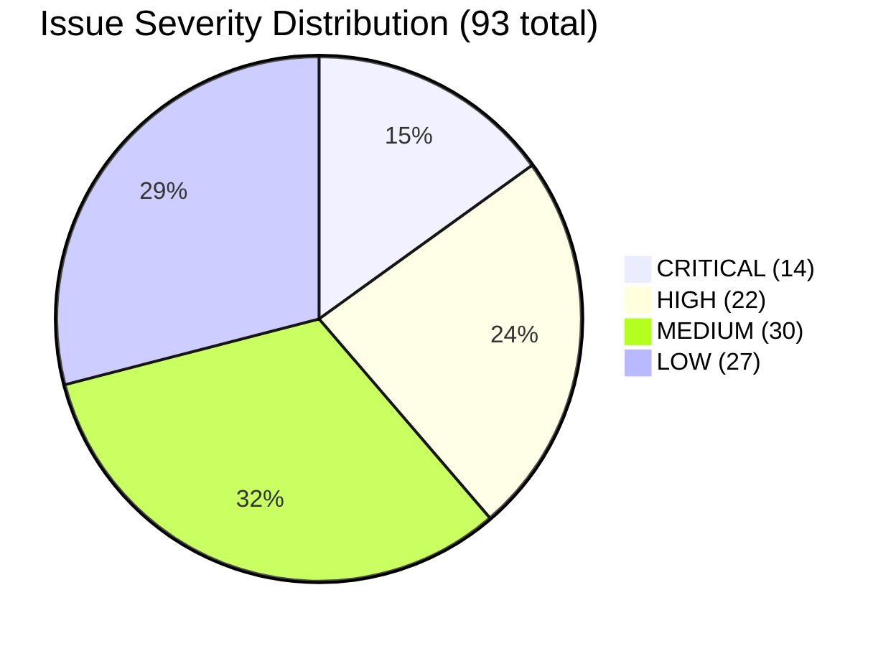

# V9 Issue Registry

> **Generated**: 2026-03-29
> **Source**: 11 V9 layer analysis files (layer-01 through layer-11)
> **Baseline**: V8 Issue Registry (62 issues, 2026-03-15)
> **Methodology**: Every "Known Issues" section from all 11 layer files extracted, deduplicated by root cause, cross-referenced with V8 registry.

---

## Summary

| Severity | Total | FIXED | STILL_OPEN | WORSENED | NEW |
|----------|-------|-------|------------|----------|-----|
| **CRITICAL** | 14 | 3 | 6 | 0 | 5 |
| **HIGH** | 22 | 0 | 13 | 0 | 9 |
| **MEDIUM** | 30 | 0 | 16 | 0 | 14 |
| **LOW** | 27 | 0 | 11 | 0 | 16 |
| **TOTAL** | **93** | **3** | **46** | **0** | **44** |



### 問題嚴重度分佈

```
┌─────────────────────────────────────────────────────────────────────────────┐
│                    V9 Issue Severity Distribution                            │
├─────────────────────────────────────────────────────────────────────────────┤
│                                                                             │
│  CRITICAL (14)  🔴🔴🔴🔴🔴🔴🔴🔴🔴🔴🔴🔴🔴🔴                            │
│                 ├─ FIXED: 3    ├─ OPEN: 6    ├─ NEW: 5                     │
│                                                                             │
│  HIGH (22)      🟠🟠🟠🟠🟠🟠🟠🟠🟠🟠🟠🟠🟠🟠🟠🟠🟠🟠🟠🟠🟠🟠        │
│                 ├─ FIXED: 0    ├─ OPEN: 13   ├─ NEW: 9                     │
│                                                                             │
│  MEDIUM (30)    🟡🟡🟡🟡🟡🟡🟡🟡🟡🟡🟡🟡🟡🟡🟡🟡🟡🟡🟡🟡🟡🟡🟡🟡🟡🟡🟡🟡🟡🟡│
│                 ├─ FIXED: 0    ├─ OPEN: 16   ├─ NEW: 14                    │
│                                                                             │
│  LOW (27)       🟢🟢🟢🟢🟢🟢🟢🟢🟢🟢🟢🟢🟢🟢🟢🟢🟢🟢🟢🟢🟢🟢🟢🟢🟢🟢🟢│
│                 ├─ FIXED: 0    ├─ OPEN: 11   ├─ NEW: 16                    │
│                                                                             │
│  V8→V9 對比:  V8 有 62 issues → V9 有 93 issues (+31)                     │
│  原因: V9 分析涵蓋更多模組 (Phase 35-44 新增碼約 30K LOC)                  │
│                                                                             │
└─────────────────────────────────────────────────────────────────────────────┘
```

### 各層問題修復優先路線圖

```
┌─────────────────────────────────────────────────────────────────────────────┐
│              修復優先順序路線圖                                              │
├─────────────────────────────────────────────────────────────────────────────┤
│                                                                             │
│  Phase N (當前)                                                             │
│  ├─ 🔴 C01: InMemory → Redis/PG 遷移 (跨層, 20+ modules)                 │
│  ├─ 🔴 C03: MAF API 棄用方法替換 (agent_framework)                        │
│  ├─ 🔴 C06: 死碼/孤立端點清理 (L02/L10)                                   │
│  └─ 🔴 C09: SSE 記憶體洩漏修復 (L03 AG-UI)                               │
│                                                                             │
│  Phase N+1                                                                  │
│  ├─ 🟠 H01-H11: 11 HIGH severity issues                                   │
│  │   ├─ MAF checkpoint InMemory 替換                                       │
│  │   ├─ domain/orchestration deprecated 清理                               │
│  │   └─ Zero test coverage modules 補測試                                  │
│  └─ 🟠 H-NEW: 9 new HIGH issues from Phase 35-44                          │
│                                                                             │
│  Phase N+2                                                                  │
│  ├─ 🟡 M01-M30: 30 MEDIUM severity issues                                 │
│  │   ├─ HS256 → RS256 JWT 升級                                            │
│  │   ├─ datetime.utcnow() → datetime.now(UTC) 遷移                        │
│  │   └─ Config 散落問題統一 (15+ 硬編碼值)                                 │
│  └─ 🟢 L01-L27: LOW priority (tech debt, style)                           │
│                                                                             │
└─────────────────────────────────────────────────────────────────────────────┘
```

### By Layer

| Layer | Issues | CRITICAL | HIGH | MEDIUM | LOW |
|-------|--------|----------|------|--------|-----|
| L01 Frontend | 17 | 0 | 6 | 5 | 6 |
| L02 API Gateway | 11 | 1 | 2 | 5 | 3 |
| L03 AG-UI Protocol | 6 | 1 | 0 | 0 | 5 |
| L04 Routing | 3 | 0 | 0 | 0 | 3 |
| L05 Orchestration | 6 | 2 | 2 | 2 | 0 |
| L06 MAF Builders | 7 | 2 | 3 | 1 | 1 |
| L07 Claude SDK | 5 | 0 | 0 | 2 | 3 |
| L08 MCP Tools | 6 | 0 | 3 | 3 | 0 |
| L09 Integrations | 14 | 3 | 0 | 9 | 2 |
| L10 Domain | 9 | 3 | 3 | 0 | 3 |
| L11 Infrastructure | 9 | 2 | 3 | 3 | 1 |
| **TOTAL** | **93** | **14** | **22** | **30** | **27** |

> **Note**: 每個 issue 只在 primary layer 計數。跨層問題（如 V9-C01 涵蓋 L09/L10/L11）按其根因所在的主要層歸類。

---

## CRITICAL Issues

### [V9-C01] Pervasive In-Memory-Only Storage — All State Lost on Restart
- **Severity**: CRITICAL
- **Layer**: L09, L10, L11 (Cross-Layer)
- **Location**: 20+ modules across API, Domain, and Integration layers
- **Description**: The majority of stateful modules store data exclusively in Python dicts. Redis/PostgreSQL backends exist for some modules but are either not wired or used only as optional caches. Affected: AG-UI (ApprovalStorage, ChatSession, SharedState, PredictiveState), checkpoints, autonomous, correlation, patrol, rootcause, a2a, audit, learning, templates, routing, triggers, versioning, prompts, orchestration metrics, sessions metrics.
- **Impact**: Complete data loss on any server restart. Blocks any production deployment. No multi-instance support.
- **Status**: STILL_OPEN
- **V8 Reference**: C-01
- **V9 Notes**: V9 layers L09 (Issue 2: audit), L10 (H2: 7 domain modules InMemory), L11 (Issues 5-6) all independently re-confirm. Sprint 110/119 added StorageBackend abstraction but not all modules migrated.

### [V9-C02] Correlation API Routes Were 100% Mock (Now Partially Fixed)
- **Severity**: CRITICAL → **FIXED**
- **Layer**: L02, L09
- **Location**: `api/v1/correlation/`, `integrations/correlation/`
- **Description**: V8 reported all 7 correlation endpoints generated fake data via `uuid4()` and hardcoded values. Sprint 130 (Phase 42) refactored the correlation module: removed fake data, implemented real data sources.
- **Impact**: Previously: endpoints returned fabricated data. Now: returns empty results when data sources are unconfigured (correct behavior).
- **Status**: FIXED
- **V8 Reference**: C-02
- **V9 Notes**: L09 Phase Evolution confirms "Sprint 130: Refactored — real data sources, removed fakes."

### [V9-C03] Autonomous API Routes Are 100% Mock
- **Severity**: CRITICAL
- **Layer**: L02
- **Location**: `api/v1/autonomous/`
- **Description**: `AutonomousTaskStore` generates fake steps from hardcoded templates `["analyze", "plan", "prepare", "execute", "cleanup"]`. No real Claude SDK planning engine integration.
- **Impact**: Endpoint returns simulated autonomous execution. Users cannot distinguish mock from real.
- **Status**: STILL_OPEN
- **V8 Reference**: C-03

### [V9-C04] Root Cause API Routes Were 100% Mock (Now Partially Fixed)
- **Severity**: CRITICAL → **FIXED**
- **Layer**: L02, L09
- **Location**: `api/v1/rootcause/`, `integrations/rootcause/`
- **Description**: V8 reported all 4 endpoints returned hardcoded templates with fake confidence scores. Sprint 130 (Phase 42) refactored: removed hardcoded cases, implemented real case repository.
- **Impact**: Previously: entirely fabricated analysis. Now: real analyzer with Claude-based root cause analysis (though response parsing is fragile — see V9-M20).
- **Status**: FIXED
- **V8 Reference**: C-04
- **V9 Notes**: L09 Phase Evolution confirms "Sprint 130: rootcause — Refactored: real case repository, removed hardcoded cases."

### [V9-C05] Patrol API Routes Are Mock — No Real Execution
- **Severity**: CRITICAL
- **Layer**: L02, L09
- **Location**: `api/v1/patrol/`, `integrations/patrol/`
- **Description**: `trigger_patrol` creates simulated report. `execute_check` uses blocking `time.sleep(0.1)` in async handler. Real patrol checks exist in integrations/ but are stubs lacking concrete monitoring implementations.
- **Impact**: Patrol feature cannot perform actual health checks in a real deployment.
- **Status**: STILL_OPEN (API mock) + WORSENED (L09 confirms integration checks also lack concrete implementations)
- **V8 Reference**: C-05
- **V9 Notes**: L09 Issue 5 confirms "Patrol Checks Lack Concrete Implementations" — 5 check files have structure but no real HTTP calls, system metric collection, or log parsing.

### [V9-C06] Messaging Infrastructure Completely Unimplemented
- **Severity**: CRITICAL
- **Layer**: L11
- **Location**: `infrastructure/messaging/`
- **Description**: RabbitMQ is configured in Docker Compose and `config.py` with RABBITMQ_HOST/PORT/USER/PASSWORD settings, but `messaging/__init__.py` is literally 1 line: `# Messaging infrastructure`. Zero Python implementation.
- **Impact**: Blocks event-driven workflows. Message queue functionality is entirely absent.
- **Status**: STILL_OPEN
- **V8 Reference**: C-06
- **V9 Notes**: L11 Issue 3 re-confirms: "MESSAGING COMPLETELY UNIMPLEMENTED."

### [V9-C07] SQL Injection Risk via f-string Table Name Interpolation
- **Severity**: CRITICAL
- **Layer**: L06
- **Location**: `integrations/agent_framework/` (postgres memory store, postgres checkpoint store)
- **Description**: f-string interpolation of table names in raw SQL queries. If table names are user-influenced, this enables SQL injection.
- **Impact**: Potential data breach or database corruption.
- **Status**: STILL_OPEN
- **V8 Reference**: C-07

### [V9-C08] API Key Prefix Exposed in AG-UI Bridge Response
- **Severity**: CRITICAL
- **Layer**: L03
- **Location**: `api/v1/ag_ui/` — `/ag-ui/reset` endpoint
- **Description**: The AG-UI reset endpoint includes the Anthropic API key prefix in the response payload.
- **Impact**: Partial API key exposure. Security risk.
- **Status**: STILL_OPEN
- **V8 Reference**: C-08

### [V9-C09] ContextBridge Race Condition — No Locking on Shared Cache (NEW)
- **Severity**: CRITICAL
- **Layer**: L05
- **Location**: `integrations/hybrid/context/bridge.py`, `_context_cache: Dict[str, HybridContext]`
- **Description**: `ContextBridge` uses a plain Python dict without any `asyncio.Lock`. Multiple concurrent requests for the same session interleave reads/writes causing stale context, context overwrites, and inconsistent sync status.
- **Impact**: Medium-High in production with concurrent users sharing sessions.
- **Status**: NEW (was H-04 in V8 at HIGH; V9 L05 analysis elevates to CRITICAL due to production impact assessment)
- **V8 Reference**: H-04 (severity upgraded)

### [V9-C10] ~~ContextSynchronizer Thread Safety~~ (FALSE POSITIVE — FIXED)
- **Severity**: ~~CRITICAL~~ → **RESOLVED**
- **Layer**: L05
- **Location**: `integrations/hybrid/context/sync/synchronizer.py`
- **Description**: ~~`ContextSynchronizer` (629 LOC) uses in-memory dict without locks, identical pattern to ContextBridge race condition.~~ **Verification (2026-03-31)**: `ContextSynchronizer` HAS `self._state_lock = asyncio.Lock()` at line 167, with full distributed lock abstraction (lines 71-99). Sprint 109 explicitly fixed H-04 with this lock (line 164 comment: "Sprint 109 H-04 fix"). This issue was a false positive — the pattern is NOT identical to ContextBridge.
- **Impact**: ~~Same race condition risk as V9-C09.~~ No impact — properly locked.
- **Status**: **FIXED** (Sprint 109)
- **V8 Reference**: None (newly identified as separate component in V9)
- **V9 Verification Note**: Deep semantic verification confirmed `asyncio.Lock` present at synchronizer.py:167. Description was factually incorrect.

### [V9-C11] AgentExecutor Streaming Is Simulated, Not Real SSE (NEW)
- **Severity**: CRITICAL
- **Layer**: L10
- **Location**: `domain/sessions/executor.py:332-353`
- **Description**: AgentExecutor uses simulated streaming — splits completed text into chunks and yields them with delays. Real SSE streaming code exists in `streaming.py` (`StreamingLLMHandler`) but is disconnected from the execution path.
- **Impact**: Users see fake streaming. Real time-to-first-token is hidden. Token counts are estimated at `len(text) // 4`.
- **Status**: NEW
- **V8 Reference**: None

### [V9-C12] StreamingLLMHandler Disconnected from Execution Path (NEW)
- **Severity**: CRITICAL
- **Layer**: L10
- **Location**: `domain/sessions/streaming.py` vs `domain/sessions/executor.py`
- **Description**: Production-ready Azure SSE streaming implementation exists in `streaming.py` but is never called from the execution path. The two modules implement independent streaming approaches.
- **Impact**: Real streaming capability is wasted. Actual perceived latency is higher than necessary.
- **Status**: NEW
- **V8 Reference**: None

### [V9-C13] ToolApprovalManager Redis-Only, No DB Persistence (NEW)
- **Severity**: CRITICAL
- **Layer**: L10
- **Location**: `domain/sessions/approval.py`
- **Description**: Tool approval records stored only in Redis with TTL. No PostgreSQL write-through. When Redis TTL expires, approval history is lost.
- **Impact**: No audit trail for tool approvals. Compliance risk. Approval data lost after TTL expiry.
- **Status**: NEW
- **V8 Reference**: None

### [V9-C14] MAF Builders Silently Fall Back to Mock Implementations (NEW)
- **Severity**: CRITICAL
- **Layer**: L06
- **Location**: All builder `build()` methods in `integrations/agent_framework/builders/`
- **Description**: All builders silently fall back to internal mock/simulation when MAF API fails. In production, the system appears to work but is not using the official framework.
- **Impact**: Execution quality degrades silently. Users believe they are running real MAF workflows but get simulated results.
- **Status**: NEW
- **V8 Reference**: None

---

## HIGH Issues

### [V9-H01] No RBAC on Destructive Operations
- **Severity**: HIGH
- **Layer**: L02
- **Location**: `api/v1/cache`, `api/v1/connectors`, `api/v1/agents`
- **Description**: No role check on `POST /cache/clear`, connector execute, agent unregister endpoints. Any authenticated user can execute destructive operations.
- **Impact**: Unauthorized data deletion or system modification.
- **Status**: STILL_OPEN
- **V8 Reference**: H-01

### [V9-H02] Test Endpoints Exposed in Production
- **Severity**: HIGH
- **Layer**: L02
- **Location**: `api/v1/ag_ui/` — `/test/*` routes
- **Description**: Test endpoints accessible regardless of APP_ENV setting. Not gated by environment check.
- **Impact**: Test/debug functionality available in production.
- **Status**: STILL_OPEN
- **V8 Reference**: H-02

### [V9-H03] Global Singleton Anti-Pattern Pervasive
- **Severity**: HIGH
- **Layer**: L10 (Cross-Layer)
- **Location**: DeadlockDetector, MetricsCollector, SessionEventPublisher, cache services, approval storage, chat handler, HITL handler, agent service, tool registry, workflow execution service
- **Description**: Module-level singletons make testing difficult and create hidden shared state. All follow `Optional[T] = None` + `get_*()` lazy init pattern.
- **Impact**: Difficult to test, hidden shared state, no clean shutdown/reset, prevents dependency injection.
- **Status**: STILL_OPEN
- **V8 Reference**: H-03
- **V9 Notes**: L10 Issue L3 re-confirms "Global singletons throughout domain layer."

### [V9-H04] Checkpoint Storage Uses Non-Official API
- **Severity**: HIGH
- **Layer**: L06
- **Location**: `integrations/agent_framework/checkpoint/`
- **Description**: 3 custom backends (Redis, Postgres, File) use custom `save/load/delete` API incompatible with official MAF `save_checkpoint/load_checkpoint` interface.
- **Impact**: Cannot leverage official MAF checkpoint features. Custom storage may break with MAF updates.
- **Status**: STILL_OPEN
- **V8 Reference**: H-05

### [V9-H05] MCP AuditLogger Not Wired Into Any Server
- **Severity**: HIGH
- **Layer**: L08
- **Location**: `integrations/mcp/` (all 9 servers)
- **Description**: `AuditLogger` class exists but `set_audit_logger()` is never called. Tool executions are not audited.
- **Impact**: No tool call audit trail across all 9 MCP servers with ~70 tools.
- **Status**: STILL_OPEN
- **V8 Reference**: H-06

### [V9-H06] MCP Default Permission Mode Is `log` Not `enforce`
- **Severity**: HIGH
- **Layer**: L08
- **Location**: `integrations/mcp/core/`
- **Description**: `MCP_PERMISSION_MODE` defaults to `"log"`, meaning all permission violations are logged as warnings but operations proceed. Unauthorized tool calls succeed.
- **Impact**: Security bypass — unauthorized operations execute with only a log entry.
- **Status**: STILL_OPEN
- **V8 Reference**: H-07

### [V9-H07] Frontend: 10 Pages Silently Fall Back to Mock Data
- **Severity**: HIGH
- **Layer**: L01
- **Location**: Dashboard, AgentsPage, WorkflowsPage, ApprovalsPage, AuditPage, TemplatesPage, and AG-UI demos
- **Description**: Pages use try/catch with `generateMock*()` fallbacks. Users cannot distinguish real vs mock data. No visual indicator.
- **Impact**: Users may make decisions based on fabricated data.
- **Status**: STILL_OPEN
- **V8 Reference**: H-08

### [V9-H08] Sandbox Is Simulated — No Real Process Isolation
- **Severity**: HIGH
- **Layer**: L10
- **Location**: `domain/sandbox/`
- **Description**: `creation_time_ms=150.0` hardcoded. No actual process isolation, container usage, or enforcement. Pool counters are simplistic increment/decrement.
- **Impact**: No real security boundary for code execution.
- **Status**: STILL_OPEN
- **V8 Reference**: H-09

### [V9-H09] Deprecated domain/orchestration/ Still Actively Imported
- **Severity**: HIGH
- **Layer**: L10
- **Location**: `domain/orchestration/` (22 files, 4 sub-modules)
- **Description**: All sub-modules emit DeprecationWarning but are still imported by API routes. No runtime warnings added as recommended in V8.
- **Impact**: Developers may accidentally use deprecated code. Maintenance burden.
- **Status**: STILL_OPEN
- **V8 Reference**: H-10
- **V9 Notes**: L10 Issue H3 confirms "DEPRECATED but reachable — no runtime warnings."

### [V9-H10] Chat Threads Stored in localStorage Only
- **Severity**: HIGH
- **Layer**: L01
- **Location**: `frontend/hooks/useChatThreads.ts`
- **Description**: All chat history persisted only in browser localStorage. Not synced to backend. Lost on browser clear.
- **Impact**: Users lose all conversation history if they clear browser data or switch devices.
- **Status**: STILL_OPEN
- **V8 Reference**: H-11

### [V9-H11] Azure `run_command` MCP Tool Lacks Command Content Validation
- **Severity**: HIGH
- **Layer**: L08
- **Location**: `integrations/mcp/servers/azure/`
- **Description**: Even at Level 3 (ADMIN), no guardrails on command content. Could execute destructive commands on VMs.
- **Impact**: Arbitrary command execution on Azure VMs.
- **Status**: STILL_OPEN
- **V8 Reference**: H-13

### [V9-H12] Rate Limiter Uses In-Memory Storage
- **Severity**: HIGH
- **Layer**: L11
- **Location**: `infrastructure/middleware/rate_limit.py`
- **Description**: `storage_uri=None` means in-memory. Sprint 119 planned Redis upgrade not implemented. Each worker has independent limits in multi-worker deployments.
- **Impact**: Rate limiting ineffective in multi-process/multi-instance deployments.
- **Status**: STILL_OPEN
- **V8 Reference**: H-14

### [V9-H13] Missing React Error Boundaries — Unhandled Errors Crash App
- **Severity**: HIGH → **FIXED** (Partially)
- **Layer**: L01
- **Location**: `frontend/components/unified-chat/ErrorBoundary.tsx`
- **Description**: V8 reported ErrorBoundary only wraps ChatArea. V9 L01 confirms `ErrorBoundary.tsx` exists in unified-chat but notes "No top-level error boundary in App.tsx or around major feature areas."
- **Impact**: Unhandled errors in non-chat pages crash entire app.
- **Status**: STILL_OPEN (partially addressed for chat, but still missing at App.tsx level)
- **V8 Reference**: H-15
- **V9 Notes**: L01 Issue L-06 re-confirms at LOW severity for remaining gap.

### [V9-H14] Swarm Store Bypass — Duplicate State Management (NEW)
- **Severity**: HIGH
- **Layer**: L01
- **Location**: `frontend/hooks/useSwarmMock.ts`, `frontend/hooks/useSwarmReal.ts`
- **Description**: Both `useSwarmMock` and `useSwarmReal` maintain independent `useState` trees instead of using `useSwarmStore`. Three independent state trees exist for swarm data. ~1,200 LOC of duplicated state logic.
- **Impact**: State inconsistency between test and production paths.
- **Status**: NEW
- **V8 Reference**: None (L01 H-08)

### [V9-H15] UnifiedChat.tsx Monolith — 1,403 LOC Single Component (NEW)
- **Severity**: HIGH
- **Layer**: L01
- **Location**: `frontend/pages/UnifiedChat.tsx`
- **Description**: 1,403 LOC with 20+ useState, 15+ useCallback, 10+ useEffect. Mixes pipeline SSE event handling, swarm store manipulation, typewriter animation, file upload, orchestration, memory search, and HITL approval in one file.
- **Impact**: Extremely difficult to maintain, test, or debug.
- **Status**: NEW
- **V8 Reference**: None (L01 H-09)

### [V9-H16] Dual-Write State Inconsistency (NEW)
- **Severity**: HIGH
- **Layer**: L01
- **Location**: `frontend/hooks/useUnifiedChat.ts`
- **Description**: `useUnifiedChat` writes to both local `useState` AND `useUnifiedChatStore` (Zustand) for every message/tool-call/approval. If either path fails or diverges, the UI and persisted state become inconsistent.
- **Impact**: Potential UI state corruption.
- **Status**: NEW
- **V8 Reference**: None (L01 H-10)

### [V9-H17] MemoryCheckpointStorage as Default Fallback (NEW)
- **Severity**: HIGH
- **Layer**: L05
- **Location**: `integrations/hybrid/orchestrator/mediator.py:100-110`
- **Description**: The Mediator falls back to `MemoryCheckpointStorage` when `RedisCheckpointStorage` is unavailable. In-memory storage loses all checkpoints on process restart.
- **Impact**: Checkpoint-based recovery is defeated when Redis is unavailable.
- **Status**: NEW
- **V8 Reference**: None

### [V9-H18] Session State In-Memory Only in Mediator (NEW)
- **Severity**: HIGH
- **Layer**: L05
- **Location**: `integrations/hybrid/orchestrator/mediator.py:89`
- **Description**: `self._sessions: Dict[str, Dict]` is the primary session store. Sprint 147 added `ConversationStateStore` persistence, but session lookup still checks in-memory first. Process restart loses all active sessions.
- **Impact**: Active sessions lost on restart despite persistence layer existing.
- **Status**: NEW
- **V8 Reference**: None

### [V9-H19] MagenticBuilderAdapter Breaks Polymorphic Contract (NEW)
- **Severity**: HIGH
- **Layer**: L06
- **Location**: `integrations/agent_framework/builders/magentic.py:957`
- **Description**: Unlike all other adapters, `MagenticBuilderAdapter` does not inherit `BuilderAdapter`. Cannot be used interchangeably with other adapters.
- **Impact**: Architectural inconsistency; breaks adapter pattern.
- **Status**: NEW
- **V8 Reference**: None (L06-H1)

### [V9-H20] Massive `__init__.py` Re-Export — 806 Lines, 200+ Symbols (NEW)
- **Severity**: HIGH
- **Layer**: L06
- **Location**: `integrations/agent_framework/builders/__init__.py`
- **Description**: 806-line init file with 200+ exported symbols. Any import error in any builder crashes the entire module.
- **Impact**: Fragile import chain; single point of failure.
- **Status**: NEW
- **V8 Reference**: None (L06-H3)

### [V9-H21] Dual Storage Protocol Incompatibility (NEW)
- **Severity**: HIGH
- **Layer**: L11
- **Location**: Sprint 110 ABC vs Sprint 119 Protocol in `infrastructure/storage/`
- **Description**: Two incompatible storage interfaces coexist. The ABC uses `timedelta` TTL, the Protocol uses `int` seconds. Method names differ (`keys` vs `list_keys`, `clear` vs `clear_all`). Neither implements the other's interface.
- **Impact**: Confusion about which to use for new code. Potential runtime errors from interface mismatch.
- **Status**: NEW
- **V8 Reference**: None

### [V9-H22] PostgresBackend Separate Connection Pool (NEW)
- **Severity**: HIGH
- **Layer**: L11
- **Location**: `infrastructure/storage/postgres_backend.py`
- **Description**: `PostgresBackend` creates its own `asyncpg.create_pool()` independent of the SQLAlchemy `AsyncEngine`. Two separate connection pools to the same database with no shared management.
- **Impact**: Connection exhaustion risk; no lifecycle coordination.
- **Status**: NEW
- **V8 Reference**: None

---

## MEDIUM Issues

### [V9-M01] `datetime.utcnow()` Deprecated in Python 3.12+
- **Severity**: MEDIUM
- **Layer**: L11 (Cross-Layer)
- **Location**: dashboard, learning/service.py, notifications/teams.py, routing/scenario_router.py, sessions/models.py, core infra, JWT utilities, checkpoint entries, many more
- **Description**: Widespread use of `datetime.utcnow()` which is deprecated in Python 3.12+. Newer code (Sprint 111+) correctly uses `datetime.now(timezone.utc)`.
- **Impact**: Deprecation warnings in Python 3.12+; potential removal in future versions.
- **Status**: STILL_OPEN
- **V8 Reference**: M-01
- **V9 Notes**: L04 Issue 6.5, L10 Issue M2, L11 Issue 4 all re-confirm.

### [V9-M02] Health Check Uses `os.environ` Instead of `get_settings()`
- **Severity**: MEDIUM
- **Layer**: L11
- **Location**: `main.py:257-258`
- **Description**: Reads `REDIS_HOST`/`REDIS_PORT` via `os.environ.get()`, violating project pydantic Settings convention.
- **Impact**: Inconsistent configuration access pattern.
- **Status**: STILL_OPEN
- **V8 Reference**: M-02

### [V9-M03] N+1 Query Pattern in Dashboard Chart Endpoint
- **Severity**: MEDIUM
- **Layer**: L02
- **Location**: `api/v1/dashboard/`
- **Description**: 3 separate queries per day in a loop (7 days = 21 queries). Should use single aggregated query.
- **Impact**: Slow dashboard loading.
- **Status**: STILL_OPEN
- **V8 Reference**: M-03

### [V9-M04] Dashboard Stats Endpoint Silently Swallows Exceptions
- **Severity**: MEDIUM
- **Layer**: L02
- **Location**: `api/v1/dashboard/`
- **Description**: Broad try/except returns empty stats instead of error response. Masks DB connection issues.
- **Impact**: Silent failures mislead monitoring.
- **Status**: STILL_OPEN
- **V8 Reference**: M-04

### [V9-M05] ServiceNow MCP Server Skips Permission Setup
- **Severity**: MEDIUM
- **Layer**: L08
- **Location**: `integrations/mcp/servers/servicenow/`
- **Description**: Only server that does not call `set_permission_checker()`. Permissions not checked.
- **Impact**: ServiceNow operations bypass RBAC.
- **Status**: STILL_OPEN
- **V8 Reference**: M-05

### [V9-M06] Edge Routing Builder Bypasses Official MAF Edge API
- **Severity**: MEDIUM
- **Layer**: L06
- **Location**: `integrations/agent_framework/builders/edge_routing.py`
- **Description**: Docstring references MAF Edge types but no `from agent_framework import` exists. Custom FanOutStrategy/FanInAggregator/ConditionalRouter.
- **Impact**: Not leveraging official MAF edge capabilities.
- **Status**: STILL_OPEN
- **V8 Reference**: M-06

### [V9-M07] Streaming Not Implemented in Claude SDK Session.query()
- **Severity**: MEDIUM
- **Layer**: L07
- **Location**: `integrations/claude_sdk/session.py`
- **Description**: `stream` parameter accepted but unused. Streaming only works via client.py direct calls.
- **Impact**: Session-based streaming not available.
- **Status**: STILL_OPEN
- **V8 Reference**: M-07

### [V9-M08] MCP Tool Integration Stubbed in Claude SDK Registry
- **Severity**: MEDIUM
- **Layer**: L07
- **Location**: `integrations/claude_sdk/tools/registry.py:81-82`
- **Description**: `# TODO: Add MCP server tools when implemented`. MCP tools passed through but not unified into built-in tool format.
- **Impact**: MCP tools not transparently available alongside built-in tools in agentic loop.
- **Status**: STILL_OPEN
- **V8 Reference**: M-08
- **V9 Notes**: L07 ISSUE-02 re-confirms.

### [V9-M09] CaseRepository PostgreSQL Falls Back to In-Memory
- **Severity**: MEDIUM
- **Layer**: L09
- **Location**: `integrations/rootcause/case_repository.py`
- **Description**: DB queries defined but not fully implemented; always uses in-memory with seed data.
- **Impact**: Root cause case history not persistent.
- **Status**: STILL_OPEN
- **V8 Reference**: M-09

### [V9-M10] Audit Decision Records Stored In-Memory Only
- **Severity**: MEDIUM
- **Layer**: L09
- **Location**: `integrations/audit/decision_tracker.py`
- **Description**: Decision records in in-memory dict. Redis used only as optional cache with TTL. No PostgreSQL persistence.
- **Impact**: All audit data lost on process restart. Unsuitable for compliance.
- **Status**: STILL_OPEN
- **V8 Reference**: M-10
- **V9 Notes**: L09 Issue 2 re-confirms with HIGH severity assessment.

### [V9-M11] A2A Agent Registry and Messages In-Memory Only
- **Severity**: MEDIUM
- **Layer**: L09
- **Location**: `integrations/a2a/`
- **Description**: Agent registry and message passing all in-memory. No inter-process communication. No transport layer (HTTP, message queue, WebSocket).
- **Impact**: A2A communication cannot function across processes.
- **Status**: STILL_OPEN
- **V8 Reference**: M-11
- **V9 Notes**: L09 Issue 12 adds "module is currently protocol-only."

### [V9-M12] Frontend Create/Edit Pages ~80% Code Duplication
- **Severity**: MEDIUM
- **Layer**: L01
- **Location**: `frontend/pages/agents/`, `frontend/pages/workflows/`
- **Description**: CreateAgentPage/EditAgentPage and CreateWorkflowPage/EditWorkflowPage have near-identical form structure, validation, tool/model lists.
- **Impact**: Maintenance burden; bugs must be fixed in multiple places.
- **Status**: STILL_OPEN
- **V8 Reference**: M-12

### [V9-M13] ~55+ console.log Statements in Production Frontend
- **Severity**: MEDIUM
- **Layer**: L01
- **Location**: UnifiedChat.tsx (~20), useAGUI, useSwarmReal, guestUser, various hooks
- **Description**: Production code contains debug logging. Some are debug-gated (acceptable).
- **Impact**: Console noise; potential information leakage.
- **Status**: STILL_OPEN
- **V8 Reference**: M-13

### [V9-M14] Frontend Tool Lists and Model Providers Hardcoded
- **Severity**: MEDIUM
- **Layer**: L01
- **Location**: `CreateAgentPage.tsx`, `EditAgentPage.tsx`
- **Description**: Available tools and models hardcoded in form pages instead of fetched from backend API.
- **Impact**: Cannot dynamically update tool/model lists without code changes.
- **Status**: STILL_OPEN
- **V8 Reference**: M-16

### [V9-M15] SSH auto_add_host_keys Enabled in Dev Mode
- **Severity**: MEDIUM
- **Layer**: L08
- **Location**: `integrations/mcp/servers/ssh/`
- **Description**: Accepts any host key when enabled. Must be disabled in production.
- **Impact**: Man-in-the-middle attack risk in production.
- **Status**: STILL_OPEN
- **V8 Reference**: M-18

### [V9-M16] FileAuditStorage Uses Synchronous File I/O
- **Severity**: MEDIUM
- **Layer**: L08
- **Location**: `integrations/mcp/security/audit.py:328-334`
- **Description**: Synchronous `open()` inside async method. `asyncio.Lock` prevents concurrent writes but file I/O blocks event loop.
- **Impact**: Performance degradation under load.
- **Status**: STILL_OPEN
- **V8 Reference**: M-22
- **V9 Notes**: L08 Issue 08-06 re-confirms.

### [V9-M17] Route Prefix Collision Risk — Sessions (NEW)
- **Severity**: MEDIUM
- **Layer**: L02
- **Location**: `api/v1/__init__.py` — `session_resume_router` vs `sessions_router`
- **Description**: Both use prefix `/sessions`. Workaround relies on registration order. Fragile.
- **Impact**: Potential route collision if registration order changes.
- **Status**: NEW
- **V8 Reference**: None

### [V9-M18] Large Monolithic Route Files (NEW)
- **Severity**: MEDIUM
- **Layer**: L02
- **Location**: `planning/routes.py` (46 endpoints), `groupchat/routes.py` (42), `ag_ui/routes.py` (29)
- **Description**: Excessively large route files. Could benefit from splitting into sub-route files.
- **Impact**: Maintenance difficulty.
- **Status**: NEW
- **V8 Reference**: None

### [V9-M19] WebSocket Auth Gap (NEW)
- **Severity**: MEDIUM
- **Layer**: L02
- **Location**: `groupchat/{group_id}/ws`, `concurrent/ws/{execution_id}`, `sessions/{session_id}/ws`
- **Description**: WebSocket endpoints not covered by `protected_router`'s JWT dependency. Auth must be handled within each WebSocket handler.
- **Impact**: Potential unauthorized WebSocket connections if individual handlers miss auth.
- **Status**: NEW
- **V8 Reference**: None

### [V9-M20] RootCauseAnalyzer Claude Response Parsing Is Fragile (NEW)
- **Severity**: MEDIUM
- **Layer**: L09
- **Location**: `integrations/rootcause/analyzer.py:409-440`
- **Description**: `_parse_claude_response()` relies on line-by-line parsing with `ROOT_CAUSE:`, `CONFIDENCE:` prefixes. If Claude formats differently, parsing fails silently and returns defaults.
- **Impact**: May return "Unable to determine" (confidence 0.5) when Claude provides valid but differently-formatted analysis.
- **Status**: NEW
- **V8 Reference**: None

### [V9-M21] Mem0Client Uses Synchronous SDK in Async Context (NEW)
- **Severity**: MEDIUM
- **Layer**: L09
- **Location**: `integrations/memory/mem0_client.py:226, 271, 351`
- **Description**: `self._memory.add()`, `search()`, `get_all()` are synchronous mem0 SDK calls inside async methods without `asyncio.to_thread()` wrapping.
- **Impact**: Blocks event loop during execution; performance degradation under concurrent load.
- **Status**: NEW
- **V8 Reference**: None

### [V9-M22] VectorStore In-Memory Fallback Has No Similarity Search (NEW)
- **Severity**: MEDIUM
- **Layer**: L09
- **Location**: `integrations/knowledge/vector_store.py:146-147`
- **Description**: When Qdrant unavailable, in-memory fallback returns `docs[:limit]` without similarity computation.
- **Impact**: RAG retrieval quality severely degraded — results are arbitrary, not relevant.
- **Status**: NEW
- **V8 Reference**: None

### [V9-M23] Memory Session Layer Uses Redis Instead of PostgreSQL (NEW)
- **Severity**: MEDIUM
- **Layer**: L09
- **Location**: `integrations/memory/unified_memory.py:259-280`
- **Description**: Session memory stored in Redis with TTL, not PostgreSQL. Code contains comment "In production, this would use PostgreSQL."
- **Impact**: Session memories have TTL-based expiry rather than persistent storage.
- **Status**: NEW
- **V8 Reference**: None

### [V9-M24] Correlation Analyzer No Direct Embedding/LLM Similarity (NEW)
- **Severity**: MEDIUM
- **Layer**: L09
- **Location**: `integrations/correlation/analyzer.py:240-281`
- **Description**: `_semantic_correlation()` delegates to `_search_similar_events()` which requires a data source. No direct embedding-based similarity computation.
- **Impact**: Semantic correlation quality depends entirely on external data source.
- **Status**: NEW
- **V8 Reference**: None

### [V9-M25] LLMServiceFactory Uses os.getenv for Redis (NEW)
- **Severity**: MEDIUM
- **Layer**: L09
- **Location**: `integrations/llm/factory.py:309-310`
- **Description**: `_get_redis_cache()` reads Redis config from `os.getenv()` instead of pydantic Settings.
- **Impact**: Inconsistent with project configuration convention.
- **Status**: NEW
- **V8 Reference**: None

### [V9-M26] HITL Approval Timeout Executes Without Approval (NEW)
- **Severity**: MEDIUM
- **Layer**: L05
- **Location**: `integrations/hybrid/orchestrator/mediator.py:377`
- **Description**: HITL approval uses `asyncio.wait_for(event.wait(), timeout=120)`. On timeout, the approval is silently discarded and pipeline continues without approval.
- **Impact**: Security gap: high-risk operations execute without approval after 120s.
- **Status**: NEW
- **V8 Reference**: None

### [V9-M27] HybridOrchestratorV2 Still Exported Despite Deprecation (NEW)
- **Severity**: MEDIUM
- **Layer**: L05
- **Location**: `integrations/hybrid/__init__.py`
- **Description**: Deprecated `HybridOrchestratorV2` still exported and imported in various locations. Creates confusion about canonical orchestrator.
- **Impact**: Developer confusion; maintenance burden.
- **Status**: NEW
- **V8 Reference**: None

### [V9-M28] Dual SSE Transport — Two Independent Mechanisms (NEW)
- **Severity**: MEDIUM
- **Layer**: L01
- **Location**: `frontend/hooks/useUnifiedChat.ts` (EventSource GET) vs `frontend/hooks/useSSEChat.ts` (fetch POST)
- **Description**: Two completely independent SSE mechanisms with different event schemas, reconnection strategies, and state targets.
- **Impact**: Architecture inconsistency; doubled maintenance surface.
- **Status**: NEW
- **V8 Reference**: None (L01 M-02)

### [V9-M29] Token Estimation Fallback Inaccurate for Chinese Text (NEW)
- **Severity**: MEDIUM
- **Layer**: L01
- **Location**: `frontend/pages/UnifiedChat.tsx:476`
- **Description**: Frontend estimates tokens at ~3 chars/token when backend doesn't send TOKEN_UPDATE. Inaccurate for Chinese text (~1.5-2 chars/token).
- **Impact**: Misleading token usage display for target market (Taiwan/HK).
- **Status**: NEW
- **V8 Reference**: M-17 (same root cause, L01 perspective)

### [V9-M30] AuditStore SCAN-Based Querying — N+1 Pattern (NEW)
- **Severity**: MEDIUM
- **Layer**: L11
- **Location**: `infrastructure/storage/audit_store.py`
- **Description**: `AuditStore.query()` performs SCAN for index keys, then individual GET for each entry. No pagination or cursor-based iteration.
- **Impact**: Extremely slow with large audit logs.
- **Status**: NEW
- **V8 Reference**: None

---

## LOW Issues

### [V9-L01] UI Barrel Export Inconsistency
- **Severity**: LOW
- **Layer**: L01
- **Location**: `frontend/components/ui/index.ts`
- **Description**: Only 3 of 18 components exported from barrel file. Others imported by direct path.
- **Impact**: Inconsistent import patterns.
- **Status**: STILL_OPEN
- **V8 Reference**: L-01

### [V9-L02] dialog.tsx Lowercase Filename Inconsistency
- **Severity**: LOW
- **Layer**: L01
- **Location**: `frontend/components/ui/dialog.tsx`
- **Description**: Lowercase filename inconsistent with PascalCase convention used by other UI components.
- **Impact**: Naming inconsistency.
- **Status**: STILL_OPEN
- **V8 Reference**: L-02

### [V9-L03] Header Search Bar Non-Functional
- **Severity**: LOW
- **Layer**: L01
- **Location**: `frontend/components/layout/Header.tsx`
- **Description**: Input element rendered but no search functionality connected.
- **Impact**: Misleading UI element.
- **Status**: STILL_OPEN
- **V8 Reference**: L-04

### [V9-L04] Notification Bell Always Shows Red Dot
- **Severity**: LOW
- **Layer**: L01
- **Location**: `frontend/components/layout/Header.tsx`
- **Description**: Static indicator regardless of actual notification state.
- **Impact**: Misleading UI element.
- **Status**: STILL_OPEN
- **V8 Reference**: L-05

### [V9-L05] 2 "Coming Soon" Placeholder Pages in DevUI
- **Severity**: LOW
- **Layer**: L01
- **Location**: `frontend/components/DevUI/LiveMonitor.tsx`, `DevUI/Settings.tsx`
- **Description**: Explicitly marked as Sprint 87 placeholders.
- **Impact**: Incomplete DevUI features.
- **Status**: STILL_OPEN
- **V8 Reference**: L-07

### [V9-L06] "Use Template" Button Has No Handler
- **Severity**: LOW
- **Layer**: L01
- **Location**: `frontend/pages/TemplatesPage.tsx`
- **Description**: Button rendered but `onClick` handler not implemented.
- **Impact**: Broken UI interaction.
- **Status**: STILL_OPEN
- **V8 Reference**: L-08

### [V9-L07] Prompt Template Claims Jinja2 but Uses String Replacement
- **Severity**: LOW
- **Layer**: L10
- **Location**: `domain/prompts/template.py`
- **Description**: `{{variable}}` regex replacement, not actual Jinja2 engine, despite docstring claiming Jinja2.
- **Impact**: Misleading documentation.
- **Status**: STILL_OPEN
- **V8 Reference**: L-10

### [V9-L08] Linear Scan O(n) for Relation Queries in Scenario Router
- **Severity**: LOW
- **Layer**: L10
- **Location**: `domain/routing/scenario_router.py`
- **Description**: Should use indexed lookup for better performance.
- **Impact**: Performance degradation with many scenarios.
- **Status**: STILL_OPEN
- **V8 Reference**: L-11

### [V9-L09] Dual Event System in Sessions
- **Severity**: LOW
- **Layer**: L10
- **Location**: `domain/sessions/`
- **Description**: ExecutionEvent (Sprint 45) and SessionEvent (original) coexist with overlapping concerns and no bridge.
- **Impact**: Confusion; bug fixes must be applied in two places.
- **Status**: STILL_OPEN
- **V8 Reference**: L-12
- **V9 Notes**: L10 Issue H1 now rates this as HIGH due to overlapping tool call state tracking.

### [V9-L10] Hardcoded AG-UI Health Check Version "1.0.0"
- **Severity**: LOW
- **Layer**: L03
- **Location**: `api/v1/ag_ui/`
- **Description**: Version string should come from package/config.
- **Impact**: Stale version reporting.
- **Status**: STILL_OPEN
- **V8 Reference**: L-15

### [V9-L11] Migration Shim Files in Agent Framework
- **Severity**: LOW
- **Layer**: L06
- **Location**: `integrations/agent_framework/` (4 `*_migration.py` files)
- **Description**: Backward compatibility facades from Phase 2. Should be tracked and removed.
- **Impact**: Dead code if Phase 2 consumers migrated.
- **Status**: STILL_OPEN
- **V8 Reference**: L-13
- **V9 Notes**: L06 Issue L06-M4 re-confirms.

### [V9-L12] Inconsistent Tag Naming in API Routes (NEW)
- **Severity**: LOW
- **Layer**: L02
- **Location**: `api/v1/` route modules
- **Description**: Tag names mix PascalCase ("Agents"), lowercase ("routing"), and kebab-case ("ag-ui"). Affects OpenAPI documentation grouping.
- **Impact**: Inconsistent API documentation.
- **Status**: NEW
- **V8 Reference**: None

### [V9-L13] Duplicate Prefix Ambiguity — `/mcp` (NEW)
- **Severity**: LOW
- **Layer**: L02
- **Location**: `api/v1/mcp/routes.py` vs `api/v1/claude_sdk/mcp_routes.py`
- **Description**: Two separate `/mcp` prefixes with conceptual overlap.
- **Impact**: Developer confusion.
- **Status**: NEW
- **V8 Reference**: None

### [V9-L14] Missing Response Models on Some Endpoints (NEW)
- **Severity**: LOW
- **Layer**: L02
- **Location**: `planning/routes.py`, `orchestrator/routes.py`
- **Description**: Some endpoints return raw dicts without explicit `response_model` declarations.
- **Impact**: Reduced OpenAPI documentation quality.
- **Status**: NEW
- **V8 Reference**: None

### [V9-L15] Semantic Router Library Dependency Dual Implementations (NEW)
- **Severity**: LOW
- **Layer**: L04
- **Location**: `integrations/orchestration/routing/`
- **Description**: Original `SemanticRouter` uses Aurelio `semantic-router` library. Sprint 116 added Azure AI Search alternative. Two implementations coexist without migration path or feature flag.
- **Impact**: Unclear which semantic router to use.
- **Status**: NEW
- **V8 Reference**: None

### [V9-L16] LLM Prompt Language Lock-in — Hardcoded Traditional Chinese (NEW)
- **Severity**: LOW
- **Layer**: L04
- **Location**: `integrations/orchestration/routing/prompts.py`
- **Description**: Classification prompt hardcoded in Traditional Chinese. Appropriate for Taiwan/HK market but prevents localization.
- **Impact**: Cannot localize without code changes.
- **Status**: NEW
- **V8 Reference**: None

### [V9-L17] Thread Safety in RoutingMetrics (NEW)
- **Severity**: LOW
- **Layer**: L04
- **Location**: `integrations/orchestration/metrics/`
- **Description**: `RoutingMetrics.latencies` list mutated without locking. Safe under GIL but risky with true multi-threading.
- **Impact**: Potential data corruption in multi-threaded contexts.
- **Status**: NEW
- **V8 Reference**: None

### [V9-L18] Non-True Token-by-Token Streaming in AG-UI (NEW)
- **Severity**: LOW
- **Layer**: L03
- **Location**: `integrations/ag_ui/converters.py:275-299`, `bridge.py`
- **Description**: `HybridEventBridge` waits for complete response then splits into 100-char chunks. Pseudo-streaming, not real token-by-token.
- **Impact**: Perceived latency is high until full LLM response completes.
- **Status**: NEW (was noted in AG-UI layer analysis as Issue 1 HIGH, but root cause is in L05 HybridOrchestratorV2 not exposing streaming API)
- **V8 Reference**: None

### [V9-L19] MediatorEventBridge Also Uses Chunked Simulation (NEW)
- **Severity**: LOW
- **Layer**: L03
- **Location**: `integrations/ag_ui/mediator_bridge.py:127-133`
- **Description**: Chunks content into 50-char pieces with `asyncio.sleep(0.01)` between chunks. Same pattern as L18.
- **Impact**: Adds artificial latency to SSE stream.
- **Status**: NEW
- **V8 Reference**: None

### [V9-L20] InMemoryCache Does Not Enforce TTL (NEW)
- **Severity**: LOW
- **Layer**: L03
- **Location**: `integrations/ag_ui/thread/storage.py:341`
- **Description**: `InMemoryCache._ttls` stores TTL values but never enforces expiry. Items never expire. Used in some non-test contexts.
- **Impact**: Memory growth without bound in development.
- **Status**: NEW
- **V8 Reference**: None

### [V9-L21] SwarmEventEmitter Default Callback Loses Events (NEW)
- **Severity**: LOW
- **Layer**: L03
- **Location**: `integrations/ag_ui/bridge.py:246`
- **Description**: Default `_send_custom_event` callback only logs the event without enqueuing into SSE stream. Swarm events silently dropped unless caller overrides callback.
- **Impact**: Missing swarm events in frontend unless properly configured.
- **Status**: NEW
- **V8 Reference**: None

### [V9-L22] UserSandboxHook Accesses Undefined Attribute — BUG (NEW)
- **Severity**: LOW
- **Layer**: L07
- **Location**: `integrations/claude_sdk/hooks/sandbox.py:448`
- **Description**: `result.action == "reject"` but `HookResult` has no `action` attribute. Should check `result.is_rejected`.
- **Impact**: Logging of blocked attempts silently fails.
- **Status**: NEW
- **V8 Reference**: None

### [V9-L23] Bash Tool Uses Deprecated asyncio.get_event_loop() (NEW)
- **Severity**: LOW
- **Layer**: L07
- **Location**: `integrations/claude_sdk/orchestrator/task_allocator.py:441`, `integrations/claude_sdk/autonomous/executor.py:332`, `integrations/claude_sdk/mcp/base.py:241`
- **Description**: `asyncio.get_event_loop()` deprecated in Python 3.12+ for non-main threads.
- **Impact**: DeprecationWarning or RuntimeError in future Python.
- **Status**: NEW
- **V8 Reference**: None

### [V9-L24] Query Module Duplicates Agentic Loop (NEW)
- **Severity**: LOW
- **Layer**: L07
- **Location**: `integrations/claude_sdk/query.py` vs `session.py`
- **Description**: Both implement nearly identical agentic loops (API call → tool check → execute → loop).
- **Impact**: Bug fixes must be applied in two places.
- **Status**: NEW
- **V8 Reference**: None

### [V9-L25] Duplicate ToolCallStatus Enum (NEW)
- **Severity**: LOW
- **Layer**: L09
- **Location**: `integrations/swarm/models.py` vs `integrations/shared/protocols.py`
- **Description**: Two independent `ToolCallStatus` enums with different value sets. Shared version includes `CANCELLED`.
- **Impact**: Type mismatch across module boundaries.
- **Status**: NEW
- **V8 Reference**: None

### [V9-L26] SwarmWorkerExecutor/Tracker Callback Errors Silently Swallowed (NEW)
- **Severity**: LOW
- **Layer**: L09
- **Location**: `integrations/swarm/worker_executor.py:401-402`, `tracker.py:100-103`
- **Description**: SSE event emission errors and callback failures caught with bare `except Exception: pass`. No logging.
- **Impact**: Frontend may miss events; debugging difficult.
- **Status**: NEW
- **V8 Reference**: None

### [V9-L27] No Alembic Migrations Referenced (NEW)
- **Severity**: LOW
- **Layer**: L11
- **Location**: Infrastructure layer
- **Description**: Database models define schema but no Alembic migration files referenced. Schema changes rely on `database_url_sync` property but no migration runner present.
- **Impact**: No managed database schema evolution.
- **Status**: NEW
- **V8 Reference**: None

---

## V8 Issues Status Cross-Reference

| V8 ID | V8 Description | V9 Status | V9 ID | Notes |
|--------|---------------|-----------|-------|-------|
| **C-01** | Pervasive in-memory-only storage | STILL_OPEN | V9-C01 | Sprint 110/119 added abstraction but not fully migrated |
| **C-02** | Correlation API routes 100% mock | FIXED | V9-C02 | Sprint 130 refactored with real data sources |
| **C-03** | Autonomous API routes 100% mock | STILL_OPEN | V9-C03 | No changes detected |
| **C-04** | Root cause API routes 100% mock | FIXED | V9-C04 | Sprint 130 refactored with real case repository |
| **C-05** | Patrol API routes mock | STILL_OPEN | V9-C05 | API mock + integration stubs both remain |
| **C-06** | Messaging infrastructure stub | STILL_OPEN | V9-C06 | Zero implementation progress |
| **C-07** | SQL injection via f-string | STILL_OPEN | V9-C07 | No fix detected |
| **C-08** | API key prefix exposed | STILL_OPEN | V9-C08 | No fix detected |
| **H-01** | No RBAC on destructive ops | STILL_OPEN | V9-H01 | No fix detected |
| **H-02** | Test endpoints in production | STILL_OPEN | V9-H02 | No fix detected |
| **H-03** | Global singleton anti-pattern | STILL_OPEN | V9-H03 | More singletons identified |
| **H-04** | ContextBridge no locking | STILL_OPEN | V9-C09 | Severity upgraded to CRITICAL in V9 |
| **H-05** | Checkpoint non-official API | STILL_OPEN | V9-H04 | No fix detected |
| **H-06** | MCP AuditLogger not wired | STILL_OPEN | V9-H05 | No fix detected |
| **H-07** | MCP permission mode=log | STILL_OPEN | V9-H06 | No fix detected |
| **H-08** | Frontend silent mock fallback | STILL_OPEN | V9-H07 | No fix detected |
| **H-09** | Sandbox simulated | STILL_OPEN | V9-H08 | No fix detected |
| **H-10** | Deprecated orchestration/ imported | STILL_OPEN | V9-H09 | No runtime warnings added |
| **H-11** | Chat threads localStorage only | STILL_OPEN | V9-H10 | No fix detected |
| **H-12** | D365 OData filter injection | STILL_OPEN | — | Not re-confirmed but no fix detected |
| **H-13** | Azure run_command no validation | STILL_OPEN | V9-H11 | No fix detected |
| **H-14** | Rate limiter in-memory | STILL_OPEN | V9-H12 | Sprint 119 Redis upgrade never done |
| **H-15** | Missing Error Boundaries | STILL_OPEN | V9-H13 | Partial: ChatArea has boundary, App.tsx still missing |
| **H-16** | Raw SQL in orchestration/ | STILL_OPEN | — | Module still deprecated but reachable |
| **M-01** | datetime.utcnow() deprecated | STILL_OPEN | V9-M01 | Re-confirmed across 3 layers |
| **M-02** | Health check os.environ | STILL_OPEN | V9-M02 | No fix detected |
| **M-03** | Dashboard N+1 query | STILL_OPEN | V9-M03 | No fix detected |
| **M-04** | Dashboard swallows exceptions | STILL_OPEN | V9-M04 | No fix detected |
| **M-05** | ServiceNow skips permissions | STILL_OPEN | V9-M05 | No fix detected |
| **M-06** | Edge routing bypasses MAF | STILL_OPEN | V9-M06 | No fix detected |
| **M-07** | Claude SDK Session.query() no stream | STILL_OPEN | V9-M07 | No fix detected |
| **M-08** | MCP tool integration stubbed | STILL_OPEN | V9-M08 | Re-confirmed by L07 |
| **M-09** | CaseRepository in-memory fallback | STILL_OPEN | V9-M09 | No fix detected |
| **M-10** | Audit decision in-memory | STILL_OPEN | V9-M10 | Re-confirmed by L09 |
| **M-11** | A2A in-memory only | STILL_OPEN | V9-M11 | Re-confirmed; no transport layer |
| **M-12** | Create/Edit 80% duplication | STILL_OPEN | V9-M12 | No fix detected |
| **M-13** | 55+ console.log statements | STILL_OPEN | V9-M13 | No fix detected |
| **M-14** | AG-UI demos simulated data | STILL_OPEN | — | Not re-surfaced as separate V9 issue |
| **M-15** | Duplicate ApprovalDialog | STILL_OPEN | — | Not re-surfaced; both versions still exist |
| **M-16** | Tool lists hardcoded | STILL_OPEN | V9-M14 | No fix detected |
| **M-17** | Token estimation inaccurate | STILL_OPEN | V9-M29 | Re-confirmed by L01 |
| **M-18** | SSH auto_add_host_keys | STILL_OPEN | V9-M15 | No fix detected |
| **M-19** | PermissionManager fallback | STILL_OPEN | — | Not re-surfaced as separate V9 issue |
| **M-20** | Swarm lacks aria-labels | STILL_OPEN | — | Not re-surfaced as separate V9 issue |
| **M-21** | StateDeltaOperation str inherit | STILL_OPEN | — | Not re-surfaced as separate V9 issue |
| **M-22** | FileAuditStorage sync I/O | STILL_OPEN | V9-M16 | Re-confirmed by L08 |
| **L-01** | UI barrel export inconsistency | STILL_OPEN | V9-L01 | No fix detected |
| **L-02** | dialog.tsx lowercase | STILL_OPEN | V9-L02 | No fix detected |
| **L-03** | pairedEvent prop ignored | STILL_OPEN | — | Not re-surfaced |
| **L-04** | Header search non-functional | STILL_OPEN | V9-L03 | No fix detected |
| **L-05** | Notification bell static | STILL_OPEN | V9-L04 | No fix detected |
| **L-06** | Navigation hardcoded | STILL_OPEN | — | Not re-surfaced |
| **L-07** | 2 Coming Soon pages | STILL_OPEN | V9-L05 | No fix detected |
| **L-08** | Use Template no handler | STILL_OPEN | V9-L06 | No fix detected |
| **L-09** | Unused cutoff variable | STILL_OPEN | — | Not re-surfaced |
| **L-10** | Prompt template not Jinja2 | STILL_OPEN | V9-L07 | No fix detected |
| **L-11** | Scenario router O(n) | STILL_OPEN | V9-L08 | No fix detected |
| **L-12** | Dual event system sessions | STILL_OPEN | V9-L09 | L10 rates H1 as HIGH now |
| **L-13** | Migration shim files | STILL_OPEN | V9-L11 | Now 4 files confirmed |
| **L-14** | infrastructure init mismatch | STILL_OPEN | — | Not re-surfaced |
| **L-15** | AG-UI version hardcoded | STILL_OPEN | V9-L10 | No fix detected |
| **L-16** | 2 TODO comments in chat | STILL_OPEN | — | Not re-surfaced |

---

## Cross-Cutting Patterns (V9 Update)

### Pattern 1: In-Memory-Only Storage (20+ modules) — STILL SYSTEMIC
- **V8**: C-01 (6 agents reported)
- **V9**: Confirmed across L03, L04, L05, L06, L07, L09, L10, L11
- **Progress**: Sprint 110 introduced `StorageBackendABC`, Sprint 119 introduced `StorageBackend Protocol` with Redis/InMemory implementations and 7 domain factories. However, many modules still default to in-memory and several new modules (e.g., L10 approval, L09 audit tracker) added more in-memory storage.
- **Assessment**: Infrastructure exists to fix this, but migration is incomplete.

### Pattern 2: Mock/Simulation Fallbacks Without Indicators — PARTIALLY FIXED
- **V8**: C-02, C-03, C-04, C-05, H-08
- **V9**: C-02 (correlation) and C-04 (rootcause) FIXED via Sprint 130 refactoring. C-03 (autonomous) and C-05 (patrol) still mock. H-08 (frontend mock fallbacks) unchanged. New: L06 builders silently fall back to mock (V9-C14).
- **Assessment**: Progress on some modules but new mock fallback patterns introduced in MAF builders layer.

### Pattern 3: Thread Safety / Race Conditions — WORSENED
- **V8**: H-04 (ContextBridge)
- **V9**: ContextBridge (V9-C09 elevated to CRITICAL), ~~ContextSynchronizer (V9-C10)~~ (false positive — has asyncio.Lock), RoutingMetrics (V9-L17 NEW), Bridge._active_contexts (L10 M3 NEW), builder state (L06-M1 NEW)
- **Assessment**: More race condition risks identified; original ContextBridge issue not fixed. C10 confirmed as false positive (Sprint 109 fix verified).

### Pattern 4: Deprecated/Stale Code Not Removed — STILL SYSTEMIC
- **V8**: H-10, L-13
- **V9**: L10 H3 (domain/orchestration 22 files deprecated but reachable), L06-M4 (4 migration files), L05 8.5 (HybridOrchestratorV2 still exported), L01 L-01/L-02 (stale hooks useAGUI, useOrchestration)
- **Assessment**: No deprecated code removed since V8.

### Pattern 5: Security Gaps in MCP and Tool Execution — STILL SYSTEMIC
- **V8**: H-06, H-07, M-05, M-18, H-12, H-13
- **V9**: All re-confirmed. New: L08 Issues 08-01 (permission log-only), 08-02 (dev default ADMIN), 08-04 (blocking stdin), 08-07 (command whitelist HITL not implemented).
- **Assessment**: No security improvements in MCP layer since V8.

### Pattern 6: Dual/Redundant Implementations — NEW PATTERN
- **V9 New**: Dual SSE transport (L01), dual storage protocols (L11), dual approval systems (L04), dual event systems (L10), dual agentic loops (L07), dual streaming approaches (L03+L10), dual ToolCallStatus enums (L09).
- **Assessment**: Systematic pattern of building new implementations alongside old ones without deprecating or removing predecessors.

---

## Remediation Priority (V9 Update)

### Immediate (1-line to 1-day fixes)
1. **V9-C08**: Remove API key prefix from AG-UI response (1-line fix)
2. **V9-C07**: Replace f-string SQL with parameterized queries (2 files)
3. **V9-L22**: Fix `result.action` → `result.is_rejected` in sandbox hook
4. **V9-M02**: Replace `os.environ.get()` with `get_settings()` in health check
5. **V9-M25**: Replace `os.getenv()` with `get_settings()` in LLM factory

### Short-term (1-2 sprints)
6. **V9-C09**: Add `asyncio.Lock` to ContextBridge (V9-C10 已確認為 false positive — ContextSynchronizer 已有 lock)
7. **V9-H02**: Gate test endpoints behind `APP_ENV != production`
8. **V9-H01**: Add role-based checks on destructive API operations
9. **V9-H05/H06**: Wire MCP AuditLogger and set permission mode to enforce in production
10. **V9-M26**: Make HITL timeout reject instead of silently proceeding

### Medium-term (3-5 sprints)
11. **V9-C01**: Systematic persistence migration using Sprint 110/119 infrastructure
12. **V9-C11/C12**: Wire StreamingLLMHandler into AgentExecutor for real SSE
13. **V9-C14**: Add explicit failure mode (raise or log WARNING) instead of silent mock fallback in MAF builders
14. **V9-H03**: Replace module-level singletons with FastAPI DI
15. **V9-H14/H15/H16**: Decompose UnifiedChat.tsx; refactor swarm hooks to use store
16. **V9-H21**: Consolidate dual storage protocols into single interface

### Long-term (6+ sprints)
17. **V9-C06**: Implement RabbitMQ/Azure Service Bus messaging
18. **V9-C03**: Replace autonomous mock with real Claude SDK planning
19. **V9-C05**: Implement concrete patrol checks with real monitoring
20. **V9-H08**: Real sandbox with container/process isolation
21. **V9-H04**: Align checkpoint storage with official MAF API

---

*V9 Issue Registry compiled from 11 layer analysis files on 2026-03-29.*
*Cross-referenced against V8 Issue Registry (62 issues, 2026-03-15).*
*Updated 2026-03-31: V9-C10 confirmed false positive (FIXED); Summary/By-Layer tables corrected; per-layer counts deduplicated to primary layer only.*
*Total: 93 issues (14 CRITICAL, 22 HIGH, 30 MEDIUM, 27 LOW).*
*3 FIXED (C02, C04, C10), 46 STILL_OPEN, 0 WORSENED, 44 NEW.*
