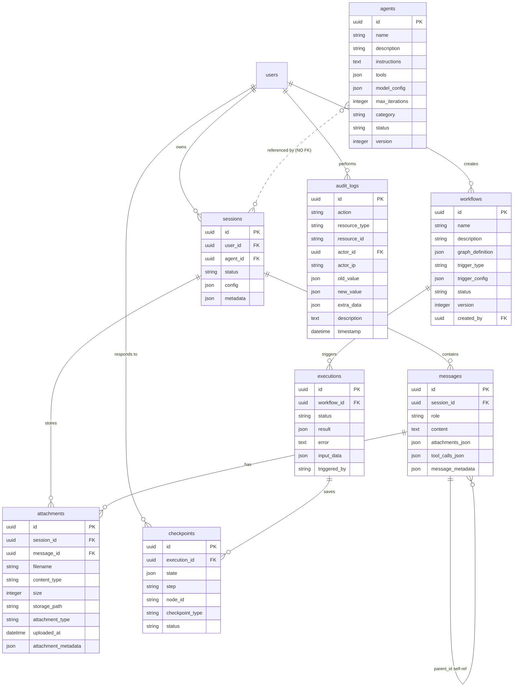

# IPA Platform Data Model Analysis (V9)

> **Generated**: 2026-03-29
> **Scope**: Full-stack data model audit across DB models, Pydantic schemas, TypeScript types, and Zustand stores
> **Files Analyzed**: 9 DB tables across 6 model files, 30 Pydantic schema files (12 read in detail), 4 TypeScript type files, 3 Zustand stores

---

## Table of Contents

1. [Database Models (SQLAlchemy ORM)](#1-database-models-sqlalchemy-orm)
2. [Pydantic Schemas (API Layer)](#2-pydantic-schemas-api-layer)
3. [TypeScript Types (Frontend)](#3-typescript-types-frontend)
4. [Zustand Stores (Frontend State)](#4-zustand-stores-frontend-state)
5. [Data Flow Contract Analysis](#5-data-flow-contract-analysis)
6. [Issues Registry](#6-issues-registry)
7. [Recommendations](#7-recommendations)

---

### 資料模型層堆疊

```
┌─────────────────────────────────────────────────────────────────────────────┐
│                    IPA Platform 全棧資料模型                                 │
├─────────────────────────────────────────────────────────────────────────────┤
│                                                                             │
│  ┌───────────────────── Frontend ────────────────────────────────┐          │
│  │                                                                │          │
│  │  Zustand Stores (3)           TypeScript Types (4 files)       │          │
│  │  ┌──────────────┐            ┌──────────────────┐             │          │
│  │  │ agentStore   │            │ types/agent.ts   │             │          │
│  │  │ sessionStore │            │ types/session.ts │             │          │
│  │  │ workflowStore│            │ types/workflow.ts│             │          │
│  │  └──────┬───────┘            │ types/common.ts  │             │          │
│  │         │ state = TS types   └────────┬─────────┘             │          │
│  │         └────────────────────────────┘                        │          │
│  └────────────────────────────────┬───────────────────────────────┘          │
│                                   │ JSON (Fetch API)                        │
│                                   ↓                                         │
│  ┌───────────────────── API Layer ───────────────────────────────┐          │
│  │                                                                │          │
│  │  Pydantic Schemas (30 files)                                   │          │
│  │  ┌──────────────────────────────────────┐                     │          │
│  │  │ Request:  AgentCreate, SessionCreate │  ← 驗證 + 序列化    │          │
│  │  │ Response: AgentResponse, SessionResp │  → JSON 輸出        │          │
│  │  │ Internal: OrchestratorRequest, etc.  │  ← 管線內部傳遞     │          │
│  │  └──────────────────┬───────────────────┘                     │          │
│  └─────────────────────┼──────────────────────────────────────────┘          │
│                        │ model_validate / model_dump                        │
│                        ↓                                                    │
│  ┌───────────────────── Data Layer ──────────────────────────────┐          │
│  │                                                                │          │
│  │  SQLAlchemy ORM Models (9 tables across 6 model files)         │          │
│  │  ┌──────────────────────────────────────┐                     │          │
│  │  │ User, Agent, Workflow, Session       │                     │          │
│  │  │ Execution, Checkpoint, Message       │                     │          │
│  │  │ Attachment, AuditLog                 │                     │          │
│  │  └──────────────────┬───────────────────┘                     │          │
│  │                     │ async SQLAlchemy                         │          │
│  │                     ↓                                         │          │
│  │  ┌──────────────────────────────────────┐                     │          │
│  │  │        PostgreSQL 16 Database        │                     │          │
│  │  └──────────────────────────────────────┘                     │          │
│  └────────────────────────────────────────────────────────────────┘          │
│                                                                             │
└─────────────────────────────────────────────────────────────────────────────┘
```

### 實體關係圖



---

## 1. Database Models (SQLAlchemy ORM)

**Location**: `backend/src/infrastructure/database/models/`

### 1.1 Base Classes (`base.py`)

| Class | Purpose | Fields |
|-------|---------|--------|
| `Base` | SQLAlchemy `DeclarativeBase` | `type_annotation_map` for timezone-aware datetimes |
| `TimestampMixin` | Auto timestamps | `created_at` (server_default=now), `updated_at` (onupdate=now) |
| `UUIDMixin` | UUID primary key | `id` (UUID, primary_key, default=uuid4) |

### 1.2 User Model (`user.py`)

**Table**: `users`
**Inherits**: `Base`, `TimestampMixin`

| Column | Type | Constraints | Index | Notes |
|--------|------|-------------|-------|-------|
| `id` | `UUID` | PK, default=uuid4 | Yes (PK) | |
| `email` | `String(255)` | unique, not null | Yes | |
| `hashed_password` | `String(255)` | not null | No | Bcrypt |
| `full_name` | `String(255)` | nullable | No | |
| `role` | `String(50)` | not null, default="viewer" | No | admin/operator/viewer |
| `is_active` | `Boolean` | not null, default=True | No | |
| `last_login` | `DateTime(tz)` | nullable | No | |
| `created_at` | `DateTime(tz)` | not null, server_default | No | From mixin |
| `updated_at` | `DateTime(tz)` | not null, onupdate | No | From mixin |

**Relationships**:
- `workflows` -> `Workflow` (back_populates="created_by_user", lazy="noload")
- `executions` -> `Execution` (back_populates="triggered_by_user", lazy="noload")
- `sessions` -> `SessionModel` (back_populates="user", lazy="noload") [Sprint 72]

### 1.3 Agent Model (`agent.py`)

**Table**: `agents`
**Inherits**: `Base`, `TimestampMixin`

| Column | Type | Constraints | Index | Notes |
|--------|------|-------------|-------|-------|
| `id` | `UUID` | PK, default=uuid4 | Yes (PK) | |
| `name` | `String(255)` | unique, not null | Yes | |
| `description` | `Text` | nullable | No | |
| `instructions` | `Text` | not null | No | System prompt |
| `category` | `String(100)` | nullable | Yes | |
| `tools` | `JSONB` | not null, default=list | No | Tool names array |
| `model_config` | `JSONB` | not null, default=dict | No | LLM settings |
| `max_iterations` | `Integer` | not null, default=10 | No | |
| `status` | `String(50)` | not null, default="active" | Yes | active/inactive/deprecated |
| `version` | `Integer` | not null, default=1 | No | |
| `created_at` | `DateTime(tz)` | not null | No | From mixin |
| `updated_at` | `DateTime(tz)` | not null | No | From mixin |

**Relationships**: None (no FK references to/from other tables)

### 1.4 Workflow Model (`workflow.py`)

**Table**: `workflows`
**Inherits**: `Base`, `TimestampMixin`

| Column | Type | Constraints | Index | Notes |
|--------|------|-------------|-------|-------|
| `id` | `UUID` | PK, default=uuid4 | Yes (PK) | |
| `name` | `String(255)` | not null | Yes | Not unique! |
| `description` | `Text` | nullable | No | |
| `trigger_type` | `String(50)` | not null, default="manual" | No | manual/schedule/webhook/event |
| `trigger_config` | `JSONB` | not null, default=dict | No | |
| `graph_definition` | `JSONB` | not null | No | Nodes + edges |
| `status` | `String(50)` | not null, default="draft" | Yes | draft/active/inactive/archived |
| `version` | `Integer` | not null, default=1 | No | |
| `created_by` | `UUID` | FK(users.id), nullable, ondelete=SET NULL | No | |
| `created_at` | `DateTime(tz)` | not null | No | From mixin |
| `updated_at` | `DateTime(tz)` | not null | No | From mixin |

**Relationships**:
- `created_by_user` -> `User` (back_populates="workflows")
- `executions` -> `Execution` (back_populates="workflow", lazy="selectin")

### 1.5 Execution Model (`execution.py`)

**Table**: `executions`
**Inherits**: `Base`, `TimestampMixin`

| Column | Type | Constraints | Index | Notes |
|--------|------|-------------|-------|-------|
| `id` | `UUID` | PK, default=uuid4 | Yes (PK) | |
| `workflow_id` | `UUID` | FK(workflows.id), not null, ondelete=CASCADE | Yes | |
| `status` | `String(50)` | not null, default="pending" | Yes | pending/running/paused/completed/failed/cancelled |
| `started_at` | `DateTime(tz)` | nullable | No | |
| `completed_at` | `DateTime(tz)` | nullable | No | |
| `result` | `JSONB` | nullable | No | |
| `error` | `Text` | nullable | No | |
| `llm_calls` | `Integer` | not null, default=0 | No | |
| `llm_tokens` | `Integer` | not null, default=0 | No | |
| `llm_cost` | `Numeric(10,6)` | not null, default=0.000000 | No | USD |
| `triggered_by` | `UUID` | FK(users.id), nullable, ondelete=SET NULL | No | |
| `input_data` | `JSONB` | nullable | No | |
| `created_at` | `DateTime(tz)` | not null | No | From mixin |
| `updated_at` | `DateTime(tz)` | not null | No | From mixin |

**Relationships**:
- `workflow` -> `Workflow` (back_populates="executions")
- `triggered_by_user` -> `User` (back_populates="executions")
- `checkpoints` -> `Checkpoint` (back_populates="execution", lazy="selectin")

**Properties**: `duration_seconds` (computed from started_at/completed_at)

### 1.6 Checkpoint Model (`checkpoint.py`)

**Table**: `checkpoints`
**Inherits**: `Base`, `TimestampMixin`

| Column | Type | Constraints | Index | Notes |
|--------|------|-------------|-------|-------|
| `id` | `UUID` | PK, default=uuid4 | Yes (PK) | |
| `execution_id` | `UUID` | FK(executions.id), not null, ondelete=CASCADE | Yes | |
| `node_id` | `String(255)` | nullable | No | Workflow node reference |
| `step` | `String(255)` | not null, default="0" | No | Step identifier |
| `checkpoint_type` | `String(50)` | not null, default="approval" | No | approval/review/input |
| `state` | `JSONB` | not null, default=dict | No | Current workflow state |
| `status` | `String(50)` | nullable, default="pending" | Yes | pending/approved/rejected/expired |
| `payload` | `JSONB` | nullable, default=dict | No | Data for review |
| `response` | `JSONB` | nullable | No | Human response |
| `responded_by` | `UUID` | FK(users.id), nullable, ondelete=SET NULL | No | |
| `responded_at` | `DateTime(tz)` | nullable | No | |
| `expires_at` | `DateTime(tz)` | nullable | No | |
| `notes` | `Text` | nullable | No | |
| `created_at` | `DateTime(tz)` | not null | No | From mixin |
| `updated_at` | `DateTime(tz)` | not null | No | From mixin |

**Relationships**:
- `execution` -> `Execution` (back_populates="checkpoints")

**Properties**: `is_expired` (computed, uses `datetime.utcnow()` -- should use timezone-aware)

### 1.7 Session Models (`session.py`)

#### SessionModel

**Table**: `sessions`
**Inherits**: `Base`, `UUIDMixin`, `TimestampMixin`

| Column | Type | Constraints | Index | Notes |
|--------|------|-------------|-------|-------|
| `id` | `UUID` | PK (from UUIDMixin) | Yes (PK) | |
| `user_id` | `UUID` | FK(users.id), nullable, ondelete=SET NULL | Yes | Guest sessions allowed |
| `guest_user_id` | `String(100)` | nullable | Yes | guest-xxx format |
| `agent_id` | `UUID` | not null | Yes | No FK constraint! |
| `status` | `String(20)` | not null, default="created" | Yes | created/active/suspended/ended |
| `config` | `JSONB` | not null, default=dict | No | |
| `expires_at` | `DateTime(tz)` | nullable | Yes | |
| `ended_at` | `DateTime(tz)` | nullable | No | |
| `title` | `String(200)` | nullable | No | |
| `session_metadata` | `JSONB` | not null, default=dict | No | Avoids SA reserved word |
| `created_at` | `DateTime(tz)` | not null | No | From mixin |
| `updated_at` | `DateTime(tz)` | not null | No | From mixin |

**Composite Indexes**:
- `idx_sessions_user_status` (user_id, status)
- `idx_sessions_guest_user` (guest_user_id)
- `idx_sessions_expires` (expires_at, WHERE status != "ended")

**Relationships**:
- `messages` -> `MessageModel` (cascade="all, delete-orphan", order_by=created_at)
- `attachments` -> `AttachmentModel` (cascade="all, delete-orphan")
- `user` -> `User` (back_populates="sessions", lazy="selectin") [Sprint 72]

**ORM Cascade Note**: Both `messages` and `attachments` relationships use `cascade="all, delete-orphan"`, meaning deleting a SessionModel will automatically delete all associated MessageModel and AttachmentModel records at the ORM level (in addition to FK-level ondelete=CASCADE).

#### MessageModel

**Table**: `messages`
**Inherits**: `Base`, `UUIDMixin`

| Column | Type | Constraints | Index | Notes |
|--------|------|-------------|-------|-------|
| `id` | `UUID` | PK (from UUIDMixin) | Yes (PK) | |
| `session_id` | `UUID` | FK(sessions.id), not null, ondelete=CASCADE | Yes | |
| `role` | `String(20)` | not null | No | user/assistant/system/tool |
| `content` | `Text` | not null, default="" | No | |
| `parent_id` | `UUID` | FK(messages.id), nullable, ondelete=SET NULL | No | Branching support |
| `attachments_json` | `JSONB` | not null, default=list | No | |
| `tool_calls_json` | `JSONB` | not null, default=list | No | |
| `created_at` | `DateTime(tz)` | not null, default=utcnow | No | Not using mixin |
| `message_metadata` | `JSONB` | not null, default=dict | No | |

**Composite Indexes**: `idx_messages_session_created` (session_id, created_at)

**Relationships**:
- `session` -> `SessionModel`
- `parent` -> `MessageModel` (self-referential)

#### AttachmentModel

**Table**: `attachments`
**Inherits**: `Base`, `UUIDMixin`

| Column | Type | Constraints | Index | Notes |
|--------|------|-------------|-------|-------|
| `id` | `UUID` | PK (from UUIDMixin) | Yes (PK) | |
| `session_id` | `UUID` | FK(sessions.id), not null, ondelete=CASCADE | Yes | |
| `message_id` | `UUID` | FK(messages.id), nullable, ondelete=SET NULL | No | |
| `filename` | `String(255)` | not null | No | |
| `content_type` | `String(100)` | not null | No | MIME type |
| `size` | `Integer` | not null | No | Bytes |
| `storage_path` | `String(500)` | not null | No | |
| `attachment_type` | `String(50)` | not null | No | |
| `uploaded_at` | `DateTime(tz)` | not null, default=utcnow | No | |
| `attachment_metadata` | `JSONB` | not null, default=dict | No | |

### 1.8 Audit Log Model (`audit.py`)

**Table**: `audit_logs`
**Inherits**: `Base` (no TimestampMixin -- immutable records)

| Column | Type | Constraints | Index | Notes |
|--------|------|-------------|-------|-------|
| `id` | `UUID` | PK, default=uuid4 | Yes (PK) | |
| `action` | `String(50)` | not null | Yes | create/read/update/delete/execute |
| `resource_type` | `String(50)` | not null | Yes | agent/workflow/execution etc. |
| `resource_id` | `String(255)` | nullable | Yes | String, not UUID! |
| `actor_id` | `UUID` | FK(users.id), nullable, ondelete=SET NULL | Yes | |
| `actor_ip` | `String(45)` | nullable | No | IPv6 max length |
| `old_value` | `JSONB` | nullable | No | Previous state |
| `new_value` | `JSONB` | nullable | No | New state |
| `extra_data` | `JSONB` | nullable | No | Additional context |
| `description` | `Text` | nullable | No | |
| `timestamp` | `DateTime(tz)` | not null, server_default=now | Yes | |

### 1.9 Entity-Relationship Summary

```
users (1) ----< (N) workflows       [created_by -> users.id]
users (1) ----< (N) executions      [triggered_by -> users.id]
users (1) ----< (N) sessions        [user_id -> users.id]
users (1) ----< (N) audit_logs      [actor_id -> users.id]
users (1) ----< (N) checkpoints     [responded_by -> users.id]

workflows (1) ----< (N) executions  [workflow_id -> workflows.id]
executions (1) ----< (N) checkpoints [execution_id -> executions.id]

sessions (1) ----< (N) messages     [session_id -> sessions.id]
sessions (1) ----< (N) attachments  [session_id -> sessions.id]
messages (1) ----< (N) attachments  [message_id -> messages.id]
messages (1) ----< (N) messages     [parent_id -> messages.id, self-ref]

agents -- NO FK relationships (referenced by sessions.agent_id but no constraint)
```

---

## 2. Pydantic Schemas (API Layer)

**Location**: `backend/src/api/v1/*/schemas.py` (30 schema files found, 12 analyzed in detail)

### 2.1 Execution Schemas (`api/v1/executions/schemas.py`)

| Class | Type | Key Fields |
|-------|------|------------|
| `ExecutionBase` | Base | `workflow_id: UUID` |
| `ExecutionCreateRequest` | Request | `status: str`, `input_data: Optional[Dict]` |
| `ExecutionDetailResponse` | Response | `id, workflow_id, status, started_at, completed_at, result, error, llm_calls, llm_tokens, llm_cost: float, triggered_by, input_data, duration_seconds, created_at, updated_at` |
| `ExecutionSummaryResponse` | Response | Lighter: `id, workflow_id, status, started_at, completed_at, llm_calls, llm_tokens, llm_cost, created_at` |
| `ExecutionListResponse` | Response | `items: List[Summary], total, page, page_size, pages` |
| `ExecutionStatsResponse` | Response | Aggregates: `total_executions, total_llm_calls, total_llm_tokens, total_llm_cost, avg_duration_seconds` |
| `ResumeRequest` | Request | `user_id: UUID, checkpoint_id: Optional[UUID], response: Optional[Dict]` |
| `ResumeResponse` | Response | `status, execution_id, checkpoint_id, message, resumed_at, next_node_id` |
| `ShutdownRequest` | Request | `reason, cleanup_resources, save_checkpoint` |
| `ShutdownResponse` | Response | `id, status, message, resources_cleaned, checkpoint_saved, shutdown_at` |

### 2.2 Session Schemas (`api/v1/sessions/schemas.py`)

| Class | Type | Key Fields |
|-------|------|------------|
| `SessionConfigSchema` | Nested | `max_messages, max_attachments, max_attachment_size, timeout_minutes, enable_code_interpreter, enable_mcp_tools, enable_file_search, allowed_tools, blocked_tools, system_prompt_override` |
| `CreateSessionRequest` | Request | `agent_id: str, config, system_prompt, metadata` |
| `SendMessageRequest` | Request | `content: str, attachment_ids: List[str], metadata` |
| `UpdateSessionRequest` | Request | `title, metadata` |
| `SessionResponse` | Response | `id, user_id, agent_id, status, title, message_count, created_at, updated_at, expires_at` |
| `SessionDetailResponse` | Response | Extends SessionResponse + `config, metadata, ended_at` |
| `MessageResponse` | Response | `id, session_id, role, content, attachments, tool_calls, parent_id, created_at` |
| `ToolCallResponse` | Response | `id, tool_name, arguments, result, status, requires_approval, approved_by, approved_at, executed_at, error` |

### 2.3 Checkpoint Schemas (`api/v1/checkpoints/schemas.py`)

| Class | Type | Key Fields |
|-------|------|------------|
| `CheckpointResponse` | Response | `id: UUID, execution_id, node_id, status, payload, response, responded_by, responded_at, expires_at, created_at, notes` |
| `CheckpointSummaryResponse` | Response | Lighter: `id, execution_id, node_id, status, created_at, expires_at` |
| `CheckpointCreateRequest` | Request | `execution_id, node_id, step, checkpoint_type, state, payload, timeout_hours, notes` |
| `ApprovalRequest` | Request | `user_id: Optional[UUID], response, feedback` |
| `RejectionRequest` | Request | `user_id: Optional[UUID], reason, response` |
| `CheckpointStatsResponse` | Response | `pending, approved, rejected, expired, total, avg_response_seconds` |

### 2.4 Audit Schemas (`api/v1/audit/schemas.py`)

| Class | Type | Key Fields |
|-------|------|------------|
| `AuditEntryResponse` | Response | `id: UUID, action, resource, resource_id, actor_id, actor_name, timestamp, severity, message, details, metadata, ip_address, user_agent, execution_id, workflow_id` |
| `AuditListResponse` | Response | `items, total, offset, limit` |
| `AuditTrailResponse` | Response | `execution_id, entries, total_entries, start_time, end_time` |
| `AuditStatisticsResponse` | Response | `total_entries, by_action, by_resource, by_severity, period` |

### 2.5 Swarm Schemas (`api/v1/swarm/schemas.py`)

| Class | Type | Key Fields |
|-------|------|------------|
| `ToolCallInfoSchema` | Nested | `tool_id, tool_name, is_mcp, input_params, status, result, error, started_at, completed_at, duration_ms` |
| `ThinkingContentSchema` | Nested | `content, timestamp, token_count` |
| `WorkerSummarySchema` | Response | `worker_id, worker_name, worker_type, role, status, progress, current_task, tool_calls_count, started_at, completed_at` |
| `WorkerDetailResponse` | Response | `worker_id, worker_name, worker_type, role, status, progress, current_task, tool_calls: List[ToolCallInfo], thinking_contents, messages, started_at, completed_at, error` |
| `SwarmStatusResponse` | Response | `swarm_id, mode, status, overall_progress, workers: List[WorkerSummary], total_tool_calls, completed_tool_calls, started_at, completed_at` |

### 2.6 AG-UI Schemas (`api/v1/ag_ui/schemas.py`)

| Class | Type | Key Fields |
|-------|------|------------|
| `RunAgentRequest` | Request | `thread_id, run_id, messages: List[AGUIMessage], tools, attachments, mode: AGUIExecutionMode, max_tokens, timeout, session_id, metadata` |
| `RunAgentResponse` | Response | `thread_id, run_id, status, content, tool_calls, error, metadata, created_at` |
| `ApprovalResponse` | Response | `approval_id, tool_call_id, tool_name, arguments, risk_level, risk_score, reasoning, run_id, session_id, status, created_at, expires_at, resolved_at, user_comment` |
| `ThreadStateResponse` | Response | `thread_id, state, version, last_modified, metadata` |
| `StateDiffSchema` | Nested | `path, op: DiffOperation, old_value, new_value, timestamp` |

### 2.7 Orchestration Schemas (`api/v1/orchestration/schemas.py`)

| Class | Type | Key Fields |
|-------|------|------------|
| `IntentClassifyRequest` | Request | `content, source, context, include_risk_assessment` |
| `RoutingDecisionResponse` | Response | `intent_category, sub_intent, confidence, workflow_type, risk_level, completeness, routing_layer, rule_id, reasoning, processing_time_ms, timestamp` |
| `RiskAssessmentResponse` | Response | `level, score, requires_approval, approval_type, factors, reasoning, policy_id, adjustments_applied` |
| `PolicyResponse` | Response | `id, intent_category, sub_intent, default_risk_level, requires_approval, approval_type, factors, description` |
| `MetricsResponse` | Response | `total_requests, pattern_matches, semantic_matches, llm_fallbacks, avg_latency_ms, p95_latency_ms` |

### 2.8 Additional Schema Files (Summarized)

| File | Key Classes | Domain |
|------|-------------|--------|
| `hybrid/schemas.py` | `HybridContextResponse`, `SyncRequest`, `SyncResultResponse`, `MAFContextResponse`, `ClaudeContextResponse` | MAF+Claude context bridge |
| `claude_sdk/schemas.py` | `QueryRequest`, `QueryResponse`, `CreateSessionRequest`, `SessionQueryRequest`, `SessionHistoryResponse` | Claude SDK integration |
| `memory/schemas.py` | `AddMemoryRequest`, `SearchMemoryRequest`, `MemoryResponse`, `MemorySearchResultSchema` | mem0 memory system |
| `files/schemas.py` | `FileMetadata`, `FileUploadResponse`, `FileListResponse` + MIME type configs | File upload system |
| `mcp/schemas.py` | MCP server management schemas | MCP tool discovery |
| `n8n/schemas.py` | n8n integration schemas | Workflow trigger integration |
| `sandbox/schemas.py` | Sandbox execution schemas | Code sandbox |
| `routing/schemas.py` | Cross-scenario routing schemas | Decision routing |
| `templates/schemas.py` | Template marketplace schemas | Workflow templates |
| `triggers/schemas.py` | Webhook trigger schemas | Event triggers |
| `connectors/schemas.py` | Connector management schemas | Cross-system connectors |
| `learning/schemas.py` | Few-shot learning schemas | Learning mechanism |
| `prompts/schemas.py` | Prompt template schemas | Prompt management |
| `notifications/schemas.py` | Notification schemas | Teams/notification |
| `cache/schemas.py` | LLM cache schemas | Response caching |
| `devtools/schemas.py` | Tracing/debugging schemas | Developer tools |
| `versioning/schemas.py` | Version management schemas | Template versioning |
| `concurrent/schemas.py` | Fork-Join schemas | Concurrent execution |
| `handoff/schemas.py` | Agent handoff schemas | Agent collaboration |
| `groupchat/schemas.py` | GroupChat schemas | Multi-turn conversations |
| `planning/schemas.py` | Dynamic planning schemas | Autonomous decisions |
| `nested/schemas.py` | Nested workflow schemas | Advanced orchestration |
| `code_interpreter/schemas.py` | Code execution schemas | Code interpreter |

---

## 3. TypeScript Types (Frontend)

**Location**: `frontend/src/types/`

### 3.1 Core Types (`index.ts`)

| Type/Interface | Fields | Notes |
|----------------|--------|-------|
| `Status` | `'pending' \| 'running' \| 'completed' \| 'failed' \| 'paused'` | Union type |
| `PaginatedResponse<T>` | `items: T[], total, page, page_size, total_pages` | Generic |
| `Workflow` | `id, name, description, version: string\|number, status, trigger_type, trigger_config, definition?, graph_definition?, created_by, created_at, updated_at, last_execution_at?, execution_count?` | Dual definition/graph_definition |
| `WorkflowDefinition` | `nodes: WorkflowNode[], edges: WorkflowEdge[]` | |
| `WorkflowGraphDefinition` | `nodes: WorkflowGraphNode[], edges: WorkflowGraphEdge[], variables?` | |
| `Execution` | `id, workflow_id, workflow_name, status, started_at, completed_at, duration_ms, current_step, total_steps, error, llm_calls, llm_tokens, llm_cost` | Has `workflow_name` not in DB |
| `ExecutionStep` | `id, execution_id, step_number, node_id, node_name, status, started_at, completed_at, input, output, error` | No DB table for steps! |
| `Agent` | `id, name, description, category, template_id, instructions, tools: string[], model_config?, model_config_data?, max_iterations, version, status, created_at, updated_at, execution_count?, avg_response_time_ms?` | Dual model_config naming |
| `ModelConfig` | `model?, temperature?, max_tokens?` | |
| `Template` | `id, name, description, category, version, author, tags, config_schema, default_config, downloads, rating, created_at` | |
| `Checkpoint` | `id, execution_id, workflow_id, workflow_name, step, step_name, status, content, context, created_at, resolved_at, resolved_by, feedback` | Different fields from DB! |
| `AuditLog` | `id, timestamp, action, resource_type, resource_id, user_id, user_name, details, ip_address` | `user_name` not in DB |
| `DashboardStats` | `total_workflows, active_workflows, total_executions, success_rate, pending_approvals, llm_cost_today, llm_cost_month, avg_execution_time_ms` | |

### 3.2 AG-UI Types (`ag-ui.ts`)

| Type/Interface | Fields | Notes |
|----------------|--------|-------|
| `UIComponentType` | `'form' \| 'chart' \| 'card' \| 'table' \| 'custom'` | Matches backend enum |
| `FormFieldDefinition` | `name, label, fieldType, required, placeholder, defaultValue, options, validation` | camelCase |
| `TableColumnDefinition` | `key, header, sortable, filterable, width, align, format` | |
| `UIComponentDefinition` | `componentId, componentType, props: UIComponentSchema, title, description, createdAt` | camelCase |
| `SharedState` | `sessionId, state, version: StateVersion, lastSync, pendingDiffs, conflicts` | |
| `PredictionResult` | `predictionId, predictionType, status, predictedState, originalState, confidence, expiresAt, confirmedAt, rolledBackAt, conflictReason` | |
| `ChatMessage` | `id, role: MessageRole, content, timestamp, toolCalls?, metadata?, customUI?, files?, orchestrationMetadata?` | Core message type |
| `ToolCallState` | `id, toolCallId, name, arguments, status, result, error, startedAt, completedAt` | |
| `PendingApproval` | `approvalId, toolCallId, toolName, arguments, riskLevel, riskScore, reasoning, runId, sessionId, createdAt, expiresAt, status?, resolvedAt?, rejectReason?` | |
| `OrchestrationMetadata` | `intent, riskLevel, executionMode, routingLayer, confidence, processingTimeMs, taskId, sessionId, frameworkUsed, detail, pipelineToolCalls, requiresApproval, approvalId, knowledgeSources` | Phase 41 |
| `AGUIRunState` | `runId, status: RunStatus, error, startedAt, finishedAt` | |

### 3.3 Unified Chat Types (`unified-chat.ts`)

| Type/Interface | Fields | Notes |
|----------------|--------|-------|
| `ExecutionMode` | `'chat' \| 'workflow'` | |
| `WorkflowStep` | `id, name, description, status, startedAt, completedAt, error, metadata` | |
| `WorkflowState` | `workflowId, steps, currentStepIndex, totalSteps, progress, status, startedAt, completedAt` | |
| `TrackedToolCall` | Extends `ToolCallState` + `duration?, queuedAt?` | |
| `Checkpoint` | `id, timestamp, label, canRestore, stepIndex, metadata` | Different from index.ts Checkpoint! |
| `TokenUsage` | `used, limit, percentage` | |
| `ExecutionMetrics` | `tokens, time, toolCallCount, messageCount, toolStats?, messageStats?` | |
| `UnifiedChatState` | `threadId, sessionId, mode, autoMode, manualOverride, messages, isStreaming, streamingMessageId, workflowState, toolCalls, pendingApprovals, dialogApproval, checkpoints, currentCheckpoint, metrics, connection, error` | Full store shape |
| `UnifiedChatActions` | 16 action methods | setMode, addMessage, etc. |
| `Attachment` | `id, file: File, preview, status, progress, error, serverFileId` | Sprint 75 |

### 3.4 DevTools Types (`devtools.ts`)

| Type/Interface | Fields | Notes |
|----------------|--------|-------|
| `TraceStatus` | `'running' \| 'completed' \| 'failed'` | |
| `EventSeverity` | `'debug' \| 'info' \| 'warning' \| 'error' \| 'critical'` | |
| `Trace` | `id, execution_id, workflow_id, started_at, ended_at, duration_ms, status, event_count, span_count, metadata` | snake_case (API convention) |
| `TraceEvent` | `id, trace_id, event_type, timestamp, data, severity, parent_event_id, executor_id, step_number, duration_ms, tags, metadata` | |
| `PaginatedResponse<T>` | `items, total, limit, offset` | Duplicated from index.ts with different shape! |

---

## 4. Zustand Stores (Frontend State)

### 4.1 Auth Store (`store/authStore.ts`)

**Storage Key**: `ipa-auth-storage` (localStorage)

**State Shape**:
```typescript
{
  user: User | null;           // { id, email, fullName, role, isActive, createdAt, lastLogin }
  token: string | null;
  refreshToken: string | null;
  isAuthenticated: boolean;
  isLoading: boolean;
  error: string | null;
}
```

**Persisted Fields**: `token, refreshToken, user, isAuthenticated`

**Actions**: `login(email, password)`, `register(email, password, fullName?)`, `logout()`, `refreshSession()`, `clearError()`, `setLoading()`

**API Integration**:
- Maps `full_name` (backend) -> `fullName` (frontend) in `apiGetMe()`
- Maps `is_active` -> `isActive`, `created_at` -> `createdAt`, `last_login` -> `lastLogin`

### 4.2 Unified Chat Store (`stores/unifiedChatStore.ts`)

**Storage Key**: `unified-chat-storage` (localStorage)

**State Shape**: Matches `UnifiedChatState` interface from `unified-chat.ts`

**Persisted Fields** (partial, with limits):
- `threadId, sessionId, mode, manualOverride, autoMode`
- `messages` (limited to last 100)
- `workflowState` (for recovery)
- `checkpoints` (limited to last 20)
- `currentCheckpoint`

**Actions**: 16 actions matching `UnifiedChatActions` interface

**Middleware**: `devtools` + `persist` (localStorage with quota error handling)

### 4.3 Swarm Store (`stores/swarmStore.ts`)

**Storage Key**: None (not persisted)

**State Shape**:
```typescript
{
  swarmStatus: UIAgentSwarmStatus | null;
  selectedWorkerId: string | null;
  selectedWorkerDetail: WorkerDetail | null;
  isDrawerOpen: boolean;
  isLoading: boolean;
  error: string | null;
}
```

**Actions**: `setSwarmStatus`, `updateSwarmProgress`, `completeSwarm`, `addWorker`, `updateWorkerProgress`, `updateWorkerThinking`, `updateWorkerToolCall`, `completeWorker`, `selectWorker`, `setWorkerDetail`, `openDrawer`, `closeDrawer`, `setLoading`, `setError`, `reset`

**Selectors**: 10 exported selector functions

**Middleware**: `devtools` + `immer` (immutable updates)

**Types**: Imports from `@/components/unified-chat/agent-swarm/types` (separate type file)

---

## 5. Data Flow Contract Analysis

### 5.1 DB Model <-> Pydantic Schema Mapping

#### User

| DB Column | Pydantic Field | Match | Notes |
|-----------|---------------|-------|-------|
| `id` (UUID) | Not in dedicated user schema | -- | Auth handled separately |
| `email` | Used in auth flow | OK | |
| `full_name` | `full_name` in register request | OK | |
| `role` | `role` in /me response | OK | |
| `is_active` | `is_active` in /me response | OK | |
| `last_login` | `last_login` in /me response | OK | |

#### Execution

| DB Column | Pydantic Field | Match | Notes |
|-----------|---------------|-------|-------|
| `id` (UUID) | `id: UUID` | OK | |
| `workflow_id` | `workflow_id: UUID` | OK | |
| `status` | `status: str` | OK | |
| `llm_cost` (Decimal) | `llm_cost: float` | **TYPE MISMATCH** | DB stores Decimal(10,6), schema uses float |
| `input_data` | `input_data: Optional[Dict]` | OK | |
| `duration_seconds` | `duration_seconds: Optional[float]` | OK | Computed property |

#### Checkpoint

| DB Column | Pydantic Field | Match | Notes |
|-----------|---------------|-------|-------|
| `id` (UUID) | `id: UUID` | OK | |
| `execution_id` | `execution_id: UUID` | OK | |
| `node_id` | `node_id: str` | OK | DB nullable, schema required |
| `step` | `step: str` | OK | |
| `checkpoint_type` | `checkpoint_type: str` | OK | |
| `state` (JSONB) | `state: Dict` | OK | |
| `status` | `status: str` | OK | DB nullable, schema not |
| `payload` | `payload: Dict` | OK | |

#### Audit Log

| DB Column | Schema Field | Match | Notes |
|-----------|-------------|-------|-------|
| `resource_type` | `resource: str` | **NAME MISMATCH** | DB: `resource_type`, Schema: `resource` |
| `actor_ip` | `ip_address: str` | **NAME MISMATCH** | DB: `actor_ip`, Schema: `ip_address` |
| `extra_data` | `metadata: Dict` | **NAME MISMATCH** | DB: `extra_data`, Schema: `metadata` |
| -- | `actor_name: str` | **MISSING IN DB** | Schema has it, DB doesn't |
| -- | `severity: str` | **MISSING IN DB** | Schema has it, DB doesn't |
| -- | `message: str` | **MISSING IN DB** | Schema has it, DB doesn't |
| -- | `user_agent: str` | **MISSING IN DB** | Schema has it, DB doesn't |
| -- | `execution_id: UUID` | **MISSING IN DB** | Schema has it, DB doesn't |
| -- | `workflow_id: UUID` | **MISSING IN DB** | Schema has it, DB doesn't |
| `description` | -- | **MISSING IN SCHEMA** | DB has it, Schema doesn't |
| `old_value` | -- | **MISSING IN SCHEMA** | DB has it, Schema doesn't |
| `new_value` | -- | **MISSING IN SCHEMA** | DB has it, Schema doesn't |

#### Session

| DB Column | Schema Field | Match | Notes |
|-----------|-------------|-------|-------|
| `session_metadata` | `metadata` | **NAME MISMATCH** | DB avoids SA reserved word |
| `guest_user_id` | -- | **MISSING IN SCHEMA** | Not exposed in API |
| `agent_id` (UUID) | `agent_id: str` | **TYPE MISMATCH** | DB UUID, Schema str |

### 5.2 Pydantic Schema <-> TypeScript Type Mapping

#### Execution

| Backend (Pydantic) | Frontend (TS) | Match | Notes |
|-------------------|---------------|-------|-------|
| `id: UUID` | `id: string` | OK | UUID serialized as string |
| `workflow_id: UUID` | `workflow_id: string` | OK | |
| -- | `workflow_name: string` | **MISSING IN BACKEND** | Frontend expects it, not in schema |
| -- | `duration_ms: number` | **MISSING IN BACKEND** | Backend has `duration_seconds` (different unit!) |
| -- | `current_step: number` | **MISSING IN BACKEND** | Not in ExecutionDetailResponse |
| -- | `total_steps: number` | **MISSING IN BACKEND** | Not in ExecutionDetailResponse |
| `llm_cost: float` | `llm_cost: number` | OK | |

#### Agent

| Backend (DB) | Frontend (TS) | Match | Notes |
|-------------|---------------|-------|-------|
| `tools: JSONB` (dict default) | `tools: string[]` | **TYPE MISMATCH** | DB stores dict, TS expects string array |
| `model_config: JSONB` | `model_config?: ModelConfig` | OK-ish | Both optional, different depth |
| -- | `model_config_data?: ModelConfig` | **DUAL NAMING** | Comment says "API returns model_config_data" |
| -- | `template_id?: string` | **MISSING IN DB** | Not in Agent model |
| -- | `execution_count?: number` | **MISSING IN DB** | Computed, not stored |
| -- | `avg_response_time_ms?: number` | **MISSING IN DB** | Computed, not stored |

#### Checkpoint (index.ts vs DB)

| Backend (DB) | Frontend (TS index.ts) | Match | Notes |
|-------------|----------------------|-------|-------|
| `node_id` | -- | **MISSING** | Frontend doesn't have node_id |
| `state` (JSONB) | -- | **MISSING** | Frontend doesn't have state |
| `checkpoint_type` | -- | **MISSING** | Frontend doesn't have type |
| `payload` | -- | **MISSING** | Frontend doesn't have payload |
| `notes` | -- | **MISSING** | Frontend doesn't have notes |
| -- | `workflow_id` | **MISSING IN DB** | Not directly on checkpoint |
| -- | `workflow_name` | **MISSING IN DB** | Not stored |
| -- | `step_name` | **MISSING IN DB** | Not stored |
| -- | `content` | **MISSING IN DB** | Frontend expects content field |
| -- | `context` | **MISSING IN DB** | Frontend expects context dict |
| -- | `feedback` | **MISSING IN DB** | Frontend has it, DB doesn't |
| `responded_at` | `resolved_at` | **NAME MISMATCH** | Different naming convention |
| `responded_by` | `resolved_by` | **NAME MISMATCH** | Different naming convention |

#### AuditLog

| Backend (DB) | Frontend (TS) | Match | Notes |
|-------------|---------------|-------|-------|
| `actor_id` | `user_id` | **NAME MISMATCH** | |
| `actor_ip` | `ip_address` | **NAME MISMATCH** | |
| `extra_data` | `details` | **NAME MISMATCH** | |
| -- | `user_name` | **MISSING IN DB** | Frontend expects displayable name |

### 5.3 Naming Convention Analysis (snake_case vs camelCase)

The frontend TypeScript types use an **inconsistent mix** of naming conventions:

| File | Convention | Examples |
|------|-----------|----------|
| `index.ts` | **snake_case** (API-aligned) | `workflow_id`, `created_at`, `trigger_type`, `page_size` |
| `ag-ui.ts` | **camelCase** (JS-native) | `componentId`, `fieldType`, `sessionId`, `toolCallId` |
| `unified-chat.ts` | **camelCase** | `threadId`, `workflowId`, `stepIndex`, `toolCallCount` |
| `devtools.ts` | **snake_case** | `execution_id`, `workflow_id`, `event_type`, `trace_id` |

**Pattern**: Core entity types (Agent, Workflow, Execution) use snake_case to match API responses directly. AG-UI and chat types use camelCase as they are consumed/produced by React components. This creates a split convention that requires attention during data transformation.

### 5.4 Duplicate Type Definitions

| Type | Location 1 | Location 2 | Difference |
|------|-----------|-----------|------------|
| `PaginatedResponse<T>` | `index.ts` | `devtools.ts` | index: `page, page_size, total_pages`; devtools: `limit, offset` |
| `Checkpoint` | `index.ts` | `unified-chat.ts` | Completely different field sets |
| `ErrorResponse` | 6+ Pydantic schema files | -- | Repeated in ag_ui, orchestration, swarm, sessions; should be shared |

---

## 6. Issues Registry

### 6.1 CRITICAL Issues

| ID | Category | Description | Impact |
|----|----------|-------------|--------|
| DM-C01 | **Missing FK** | `sessions.agent_id` has no FK constraint to `agents.id` | Referential integrity not enforced; orphan sessions possible |
| DM-C02 | **Schema Drift** | `AuditLog` DB model vs Pydantic schema have 9+ field mismatches (missing fields, name changes) | API returns fabricated/computed data not backed by DB columns |
| DM-C03 | **Contract Mismatch** | Frontend `Execution` expects `workflow_name`, `duration_ms`, `current_step`, `total_steps` not in backend response | Frontend must join/compute data not provided by API |
| DM-C04 | **Contract Mismatch** | Frontend `Checkpoint` (index.ts) fields (`workflow_id`, `workflow_name`, `step_name`, `content`, `context`, `feedback`) don't exist in DB or backend schema | Entire checkpoint display may use mock/fabricated data |

### 6.2 HIGH Issues

| ID | Category | Description | Impact |
|----|----------|-------------|--------|
| DM-H01 | **Type Mismatch** | `Agent.tools` DB stores JSONB (dict default), frontend expects `string[]` | Serialization may fail or produce unexpected shape |
| DM-H02 | **Type Mismatch** | `Execution.llm_cost` DB is `Decimal(10,6)`, Pydantic uses `float` | Precision loss during serialization |
| DM-H03 | **Type Mismatch** | `sessions.agent_id` DB is UUID, Pydantic schema is `str` | Inconsistent type handling |
| DM-H04 | **Naming Conflict** | DB `responded_at`/`responded_by` vs Frontend `resolved_at`/`resolved_by` on checkpoints | Requires manual field mapping |
| DM-H05 | **Naming Conflict** | DB `actor_id`/`actor_ip` vs Frontend `user_id`/`ip_address` on audit logs | Requires manual field mapping |
| DM-H06 | **Dual Naming** | Frontend Agent type has both `model_config` and `model_config_data` with comment about API inconsistency | Indicates API has changed field names between versions |
| DM-H07 | **Duplicate Types** | `PaginatedResponse<T>` defined differently in `index.ts` and `devtools.ts` | Two incompatible pagination contracts in same codebase |

### 6.3 MEDIUM Issues

| ID | Category | Description | Impact |
|----|----------|-------------|--------|
| DM-M01 | **Missing Index** | `Execution.triggered_by` FK column not indexed | Slow queries filtering by user |
| DM-M02 | **Missing Index** | `Checkpoint.responded_by` FK column not indexed | Slow queries filtering by responder |
| DM-M03 | **Missing Index** | `Workflow.created_by` FK column not indexed | Slow queries filtering by creator |
| DM-M04 | **Deprecated API** | `MessageModel.created_at` uses `datetime.utcnow` (deprecated) instead of `func.now()` | Will produce naive datetimes, inconsistent with other models |
| DM-M05 | **Deprecated API** | `Checkpoint.is_expired` uses `datetime.utcnow()` for comparison | Should use timezone-aware datetime |
| DM-M06 | **Naming Convention** | Frontend types mix snake_case and camelCase across files | Inconsistent DX, transformation bugs |
| DM-M07 | **Missing Constraint** | `Workflow.name` is not unique (unlike `Agent.name`) | Duplicate workflow names allowed |
| DM-M08 | **Nullable Status** | `Checkpoint.status` is nullable in DB but logically should always have a value | Possible null status in queries |
| DM-M09 | **Missing Relationship** | `Agent` has no FK relationships; `sessions.agent_id` references it without constraint | Cannot cascade delete agents |
| DM-M10 | **Repeated ErrorResponse** | `ErrorResponse` Pydantic model defined in 6+ schema files | Should be a shared base schema |

### 6.4 LOW Issues

| ID | Category | Description | Impact |
|----|----------|-------------|--------|
| DM-L01 | **Documentation** | `Workflow.version` is `Integer` in DB but `string \| number` in frontend | Minor, but indicates uncertainty |
| DM-L02 | **Computed Fields** | Frontend `Agent.execution_count` and `avg_response_time_ms` not stored | Must be aggregated per request or cached |
| DM-L03 | **Redundancy** | `MessageModel` stores `attachments_json` as JSONB while `AttachmentModel` table exists separately | Dual storage: denormalized JSON + normalized table |
| DM-L04 | **Missing updated_at** | `MessageModel` and `AttachmentModel` don't use `TimestampMixin`, missing `updated_at` | Cannot track message edits |
| DM-L05 | **Session Status** | DB uses `String(20)` for session status but `String(50)` for other status fields | Inconsistent column widths |

---

## 7. Recommendations

### 7.1 Immediate Fixes (Sprint-level)

1. **Add FK constraint** for `sessions.agent_id` -> `agents.id` (DM-C01)
2. **Reconcile AuditLog** schema vs DB model - add missing columns (`severity`, `message`, `user_agent`, `execution_id`, `workflow_id`) or remove from schema (DM-C02)
3. **Add missing indexes** on `Execution.triggered_by`, `Checkpoint.responded_by`, `Workflow.created_by` (DM-M01/M02/M03)
4. **Replace `datetime.utcnow`** with `func.now()` or `datetime.now(timezone.utc)` in MessageModel and Checkpoint (DM-M04/M05)

### 7.2 Contract Alignment (Phase-level)

5. **Create shared `ErrorResponse`** in `api/v1/common/schemas.py` and import across all modules (DM-M10)
6. **Standardize Execution response**: Add `workflow_name` (via join), `duration_ms` (convert from seconds), `current_step`/`total_steps` (via checkpoint count) to backend schema, OR update frontend to compute them (DM-C03)
7. **Standardize Checkpoint contract**: Either add missing fields to backend (`workflow_name`, `step_name`, `content`, `context`) or simplify frontend type to match actual API (DM-C04)
8. **Fix Agent.tools type**: Ensure DB stores list (not dict), and align with frontend `string[]` expectation (DM-H01)
9. **Standardize naming**: Choose either `responded_at` or `resolved_at` and use consistently across all layers (DM-H04/H05)

### 7.3 Architecture Improvements (Roadmap-level)

10. **Introduce DTO layer**: Create explicit Data Transfer Objects between DB models and API schemas to handle field mapping, computed fields, and type conversions centrally
11. **Frontend type generation**: Consider generating TypeScript types from OpenAPI spec (`fastapi.openapi()`) to eliminate manual sync
12. **Unify pagination**: Standardize on one pagination contract (`page/page_size` or `limit/offset`) across all endpoints (DM-H07)
13. **Naming convention policy**: Establish explicit rule - snake_case for all API responses, camelCase only for internal React state (DM-M06)

### 7.4 Data Model Evolution Considerations

14. **Execution Steps table**: Frontend `ExecutionStep` type suggests need for a `execution_steps` DB table to track individual step progress
15. **Agent versioning**: Consider separate `agent_versions` table for proper version history instead of integer column
16. **Soft delete**: Most models use hard delete via CASCADE. Consider adding `deleted_at` column for audit compliance
17. **Storage layer**: `messaging/` and `storage/` infrastructure are empty stubs per infrastructure CLAUDE.md -- needed for RabbitMQ and file storage

---

## Appendix A: Complete Model Export Registry

```
backend/src/infrastructure/database/models/__init__.py exports:
  Base, TimestampMixin, UUIDMixin,
  User, Agent, Workflow, Execution, Checkpoint, AuditLog,
  SessionModel, MessageModel, AttachmentModel
```

**Total DB Tables**: 9 tables (`users`, `agents`, `workflows`, `executions`, `checkpoints`, `audit_logs`, `sessions`, `messages`, `attachments`)

**Total Pydantic Schema Files**: 30 files across `api/v1/*/schemas.py`

**Total TypeScript Type Files**: 4 files with ~120 exported types/interfaces

**Total Zustand Stores**: 3 stores (`authStore`, `unifiedChatStore`, `swarmStore`)

---

## Appendix B: Schema File Inventory

| # | Schema File Path | Domain | Classes Count |
|---|-----------------|--------|---------------|
| 1 | `api/v1/executions/schemas.py` | Execution lifecycle | 11 |
| 2 | `api/v1/sessions/schemas.py` | Session management | 12 |
| 3 | `api/v1/checkpoints/schemas.py` | HITL checkpoints | 8 |
| 4 | `api/v1/audit/schemas.py` | Audit logging | 6 |
| 5 | `api/v1/swarm/schemas.py` | Agent swarm | 8 |
| 6 | `api/v1/ag_ui/schemas.py` | AG-UI protocol | 25+ |
| 7 | `api/v1/orchestration/schemas.py` | Intent routing | 15 |
| 8 | `api/v1/hybrid/schemas.py` | MAF+Claude bridge | 14 |
| 9 | `api/v1/claude_sdk/schemas.py` | Claude SDK | 9 |
| 10 | `api/v1/memory/schemas.py` | Memory system | 11 |
| 11 | `api/v1/files/schemas.py` | File upload | 5 + configs |
| 12 | `api/v1/cache/schemas.py` | LLM caching | -- |
| 13 | `api/v1/connectors/schemas.py` | Connectors | -- |
| 14 | `api/v1/devtools/schemas.py` | Developer tools | -- |
| 15 | `api/v1/learning/schemas.py` | Few-shot learning | -- |
| 16 | `api/v1/notifications/schemas.py` | Notifications | -- |
| 17 | `api/v1/prompts/schemas.py` | Prompt templates | -- |
| 18 | `api/v1/routing/schemas.py` | Decision routing | -- |
| 19 | `api/v1/templates/schemas.py` | Workflow templates | -- |
| 20 | `api/v1/triggers/schemas.py` | Event triggers | -- |
| 21 | `api/v1/versioning/schemas.py` | Version management | -- |
| 22 | `api/v1/concurrent/schemas.py` | Fork-Join | -- |
| 23 | `api/v1/nested/schemas.py` | Nested workflows | -- |
| 24 | `api/v1/handoff/schemas.py` | Agent handoff | -- |
| 25 | `api/v1/groupchat/schemas.py` | GroupChat | -- |
| 26 | `api/v1/planning/schemas.py` | Dynamic planning | -- |
| 27 | `api/v1/code_interpreter/schemas.py` | Code interpreter | -- |
| 28 | `api/v1/mcp/schemas.py` | MCP servers | -- |
| 29 | `api/v1/sandbox/schemas.py` | Sandbox execution | -- |
| 30 | `api/v1/n8n/schemas.py` | n8n integration | -- |

> Note: Rows marked `--` in Classes Count were not read in detail for this analysis. Their existence was confirmed via glob.

---

**End of Analysis**
