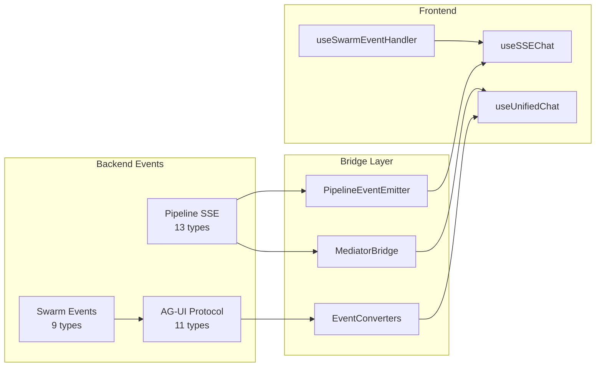

# Event Contracts Analysis — IPA Platform V9

> Comprehensive analysis of all event and message contracts across the IPA Platform.
> Covers Pipeline SSE, AG-UI Protocol, Swarm, Routing, and cross-layer bridge mappings.

**Analysis Date**: 2026-03-29
**Source Scan**: 12 backend source files + 3 frontend type files + 2 bridge modules

---

## Event Flow Overview



---

## Table of Contents

1. [Pipeline SSE Events (13 types)](#1-pipeline-sse-events)
2. [AG-UI Protocol Events (11 types)](#2-ag-ui-protocol-events)
3. [Swarm Events (9 types)](#3-swarm-events)
4. [Routing Contracts](#4-routing-contracts)
5. [Pipeline Contracts](#5-pipeline-contracts)
6. [Event Bridge Maps](#6-event-bridge-maps)
7. [Frontend Event Types](#7-frontend-event-types)
8. [Cross-Reference: End-to-End Event Flow](#8-cross-reference-end-to-end-event-flow)

---

## 1. Pipeline SSE Events

**Source**: `backend/src/integrations/hybrid/orchestrator/sse_events.py`
**Enum**: `SSEEventType(str, Enum)`
**Transport**: Server-Sent Events over HTTP POST `/orchestrator/chat/stream`
**Wire format**: `event: {TYPE}\ndata: {json}\n\n`

### 1.1 Event Type Table

| # | Event Name | Payload Fields | Producer | Consumer | Description |
|---|-----------|---------------|----------|----------|-------------|
| 1 | `PIPELINE_START` | `timestamp` | `PipelineEventEmitter` | Frontend `useSSEChat` | Pipeline execution begins |
| 2 | `ROUTING_COMPLETE` | `timestamp`, routing metadata | `OrchestratorMediator` | Frontend `useSSEChat` | Intent routing finished |
| 3 | `AGENT_THINKING` | `timestamp`, thinking metadata | Agent executor | Frontend `useSSEChat` | Agent is processing/thinking |
| 4 | `TOOL_CALL_START` | `timestamp`, tool metadata | Agent executor | Frontend `useSSEChat` | Tool invocation begins |
| 5 | `TOOL_CALL_END` | `timestamp`, result metadata | Agent executor | Frontend `useSSEChat` | Tool invocation completed |
| 6 | `TEXT_DELTA` | `delta: string`, `timestamp` | `PipelineEventEmitter.emit_text_delta()` | Frontend `useSSEChat` | Streaming text chunk |
| 7 | `TASK_DISPATCHED` | `timestamp`, task metadata | Workflow executor | Frontend `useSSEChat` | Async task dispatched |
| 8 | `SWARM_WORKER_START` | `timestamp`, worker metadata | Swarm coordinator | Frontend `useSSEChat` | Swarm worker begins execution |
| 9 | `SWARM_PROGRESS` | `timestamp`, progress metadata | Swarm coordinator | Frontend `useSSEChat` | Swarm overall progress update |
| 10 | `APPROVAL_REQUIRED` | `timestamp`, approval metadata | HITL controller | Frontend `useSSEChat` | Human approval needed |
| 11 | `CHECKPOINT_RESTORED` | `timestamp`, checkpoint metadata | Checkpoint storage | Frontend `useSSEChat` | State restored from checkpoint |
| 12 | `PIPELINE_COMPLETE` | `content: string`, `timestamp`, metadata | `PipelineEventEmitter.emit_complete()` | Frontend `useSSEChat` | Pipeline finished successfully |
| 13 | `PIPELINE_ERROR` | `error: string`, `timestamp` | `PipelineEventEmitter.emit_error()` | Frontend `useSSEChat` | Pipeline failed with error |

### 1.2 SSEEvent Dataclass

```python
@dataclass
class SSEEvent:
    event_type: SSEEventType
    data: Dict[str, Any]           # Arbitrary payload
    timestamp: datetime             # Auto-populated UTC
```

**Serialization methods**:
- `to_sse_string()` -- Outputs native Pipeline event names
- `to_agui_sse_string()` -- Maps to AG-UI event names, injects `pipeline_type` into payload

### 1.3 PipelineEventEmitter

- `emit(event_type, data)` -- Generic event push
- `emit_text_delta(delta)` -- Convenience for `TEXT_DELTA`
- `emit_complete(content, metadata)` -- Emits `PIPELINE_COMPLETE` and closes stream
- `emit_error(error)` -- Emits `PIPELINE_ERROR` and closes stream
- `stream(agui_format=False)` -- Async generator; yields SSE strings; 120s timeout with keepalive

**Terminal events**: `PIPELINE_COMPLETE` and `PIPELINE_ERROR` both close the stream.

---

## 2. AG-UI Protocol Events

**Source**: `backend/src/integrations/ag_ui/events/` (base, lifecycle, message, tool, state, progress)
**Enum**: `AGUIEventType(str, Enum)` in `base.py`
**Transport**: SSE via `data: {json}\n\n` format
**Base class**: `BaseAGUIEvent(BaseModel)` with `type: AGUIEventType` and `timestamp: datetime`

### 2.1 Event Type Table

| # | Event Type | Pydantic Model | Payload Fields | Category |
|---|-----------|---------------|----------------|----------|
| 1 | `RUN_STARTED` | `RunStartedEvent` | `thread_id: str`, `run_id: str` | Lifecycle |
| 2 | `RUN_FINISHED` | `RunFinishedEvent` | `thread_id: str`, `run_id: str`, `finish_reason: RunFinishReason`, `error?: str`, `usage?: Dict` | Lifecycle |
| 3 | `TEXT_MESSAGE_START` | `TextMessageStartEvent` | `message_id: str`, `role: str` | Text Message |
| 4 | `TEXT_MESSAGE_CONTENT` | `TextMessageContentEvent` | `message_id: str`, `delta: str` | Text Message |
| 5 | `TEXT_MESSAGE_END` | `TextMessageEndEvent` | `message_id: str` | Text Message |
| 6 | `TOOL_CALL_START` | `ToolCallStartEvent` | `tool_call_id: str`, `tool_name: str`, `parent_message_id?: str` | Tool Call |
| 7 | `TOOL_CALL_ARGS` | `ToolCallArgsEvent` | `tool_call_id: str`, `delta: str` (JSON args) | Tool Call |
| 8 | `TOOL_CALL_END` | `ToolCallEndEvent` | `tool_call_id: str`, `status: ToolCallStatus`, `result?: Dict`, `error?: str` | Tool Call |
| 9 | `STATE_SNAPSHOT` | `StateSnapshotEvent` | `snapshot: Dict`, `metadata: Dict` | State |
| 10 | `STATE_DELTA` | `StateDeltaEvent` | `delta: List[{path, operation, value}]` | State |
| 11 | `CUSTOM` | `CustomEvent` | `event_name: str`, `payload: Dict` | Custom |

### 2.2 Supporting Enums

**RunFinishReason**:
| Value | Meaning |
|-------|---------|
| `complete` | Normal completion |
| `error` | Execution error |
| `cancelled` | User cancellation |
| `timeout` | Execution timeout |

**ToolCallStatus**:
| Value | Meaning |
|-------|---------|
| `pending` | Awaiting execution |
| `running` | Currently executing |
| `success` | Completed successfully |
| `error` | Execution failed |

**StateDeltaOperation** (string constants):
| Value | Meaning |
|-------|---------|
| `set` | Set a value at path |
| `delete` | Delete value at path |
| `append` | Append to array at path |
| `increment` | Increment numeric value at path |

### 2.3 Step Progress (Custom Event Extension)

**Source**: `backend/src/integrations/ag_ui/events/progress.py`
**Transport**: Emitted as `CustomEvent` with `event_name="step_progress"`

| Field | Type | Description |
|-------|------|-------------|
| `step_id` | `str` | Unique step identifier |
| `step_name` | `str` | Display name |
| `current` | `int` | Current step number (1-based) |
| `total` | `int` | Total step count |
| `progress` | `int` | Percentage 0-100 |
| `status` | `SubStepStatus` | pending/running/completed/failed/skipped |
| `substeps` | `List[SubStep]` | Nested sub-step progress |
| `metadata` | `Dict` | Optional metadata |

**SubStep fields**: `id`, `name`, `status`, `progress?`, `message?`, `started_at?`, `completed_at?`

---

## 3. Swarm Events

**Source**: `backend/src/integrations/swarm/events/types.py`
**Constants**: `SwarmEventNames` class
**Transport**: Emitted as AG-UI `CustomEvent` payloads via `SwarmEventEmitter`

### 3.1 Event Type Table

| # | Event Name | Payload Dataclass | Payload Fields | Category |
|---|-----------|-------------------|----------------|----------|
| 1 | `swarm_created` | `SwarmCreatedPayload` | `swarm_id`, `session_id`, `mode`, `workers: List[{worker_id, worker_name, worker_type, role}]`, `created_at` | Swarm Lifecycle |
| 2 | `swarm_status_update` | `SwarmStatusUpdatePayload` | `swarm_id`, `session_id`, `mode`, `status`, `total_workers`, `overall_progress: 0-100`, `workers: List[Dict]`, `metadata: Dict` | Swarm Lifecycle |
| 3 | `swarm_completed` | `SwarmCompletedPayload` | `swarm_id`, `status`, `total_duration_ms`, `completed_at`, `summary?` | Swarm Lifecycle |
| 4 | `worker_started` | `WorkerStartedPayload` | `swarm_id`, `worker_id`, `worker_name`, `worker_type`, `role`, `task_description`, `started_at` | Worker Lifecycle |
| 5 | `worker_progress` | `WorkerProgressPayload` | `swarm_id`, `worker_id`, `progress: 0-100`, `status`, `updated_at`, `current_action?` | Worker Lifecycle |
| 6 | `worker_thinking` | `WorkerThinkingPayload` | `swarm_id`, `worker_id`, `thinking_content`, `timestamp`, `token_count?` | Worker Lifecycle |
| 7 | `worker_tool_call` | `WorkerToolCallPayload` | `swarm_id`, `worker_id`, `tool_call_id`, `tool_name`, `status`, `timestamp`, `input_args: Dict`, `output_result?`, `error?`, `duration_ms?` | Worker Lifecycle |
| 8 | `worker_message` | `WorkerMessagePayload` | `swarm_id`, `worker_id`, `role`, `content`, `timestamp`, `tool_call_id?` | Worker Lifecycle |
| 9 | `worker_completed` | `WorkerCompletedPayload` | `swarm_id`, `worker_id`, `status`, `duration_ms`, `completed_at`, `result?`, `error?` | Worker Lifecycle |

### 3.2 Event Priority Classification

**High-priority (sent immediately)**: `swarm_created`, `swarm_completed`, `worker_started`, `worker_completed`, `worker_tool_call`

**Throttled (200ms default interval)**: `swarm_status_update`, `worker_progress`, `worker_thinking`

### 3.3 Swarm Status Values

| Enum | Values |
|------|--------|
| `SwarmMode` | `sequential`, `parallel`, `hierarchical` |
| `SwarmStatus` | `initializing`, `running`, `paused`, `completed`, `failed` |
| `WorkerStatus` | `pending`, `running`, `thinking`, `tool_calling`, `completed`, `failed`, `cancelled` |
| `WorkerType` | `research`, `writer`, `designer`, `reviewer`, `coordinator`, `analyst`, `coder`, `tester`, `custom` |

---

## 4. Routing Contracts

**Source**: `backend/src/integrations/orchestration/contracts.py`
**Sprint**: 116 (L4a <-> L4b interface)

### 4.1 InputSource Enum

| Value | Description |
|-------|-------------|
| `webhook_servicenow` | ServiceNow ticket webhook |
| `webhook_prometheus` | Prometheus alert webhook |
| `http_api` | Direct HTTP API call |
| `sse_stream` | SSE streaming source |
| `user_chat` | User chat input |
| `ritm` | RITM service request |
| `unknown` | Unidentified source |

### 4.2 RoutingRequest (L4a output -> L4b input)

| Field | Type | Default | Description |
|-------|------|---------|-------------|
| `query` | `str` | required | Normalized text for routing |
| `intent_hint` | `str?` | `None` | Pre-classified intent hint |
| `context` | `Dict[str, Any]` | `{}` | Additional source context |
| `source` | `InputSource` | `UNKNOWN` | Origin of request |
| `request_id` | `str?` | `None` | Unique trace ID |
| `timestamp` | `datetime` | `utcnow()` | Creation time |
| `metadata` | `Dict[str, Any]` | `{}` | Source-specific metadata |
| `priority` | `int?` | `None` | 1=highest, 5=lowest |

### 4.3 RoutingResult (L4b output)

| Field | Type | Default | Description |
|-------|------|---------|-------------|
| `intent` | `str` | required | Classified intent category |
| `sub_intent` | `str` | `""` | Specific sub-intent |
| `confidence` | `float` | `0.0` | Score 0.0-1.0 |
| `matched_layer` | `str` | `""` | Which tier matched (pattern/semantic/llm) |
| `workflow_type` | `str` | `""` | Recommended workflow type |
| `risk_level` | `str` | `"LOW"` | LOW/MEDIUM/HIGH/CRITICAL |
| `completeness` | `bool` | `True` | Sufficient info available? |
| `missing_fields` | `List[str]` | `[]` | Required fields not provided |
| `metadata` | `Dict[str, Any]` | `{}` | Additional routing metadata |

### 4.4 Protocol Interfaces

| Interface | Method | Signature | Layer |
|-----------|--------|-----------|-------|
| `InputGatewayProtocol` | `receive()` | `(raw_input: Any) -> RoutingRequest` | L4a |
| `InputGatewayProtocol` | `validate()` | `(raw_input: Any) -> bool` | L4a |
| `RouterProtocol` | `route()` | `(request: RoutingRequest) -> RoutingResult` | L4b |
| `RouterProtocol` | `get_available_layers()` | `() -> List[str]` | L4b |

### 4.5 Adapter Functions

| Function | From | To | Sprint |
|----------|------|----|--------|
| `incoming_request_to_routing_request()` | `IncomingRequest` (S95) | `RoutingRequest` (S116) | Bridge |
| `routing_decision_to_routing_result()` | `RoutingDecision` (S93) | `RoutingResult` (S116) | Bridge |

---

## 5. Pipeline Contracts

**Source**: `backend/src/integrations/contracts/pipeline.py`
**Sprint**: 108 (Phase 35 A0 core hypothesis)

### 5.1 PipelineSource Enum

| Value | Description |
|-------|-------------|
| `user` | User chat input |
| `servicenow` | ServiceNow integration |
| `prometheus` | Prometheus alert |
| `api` | Direct API call |

### 5.2 PipelineRequest (Pydantic BaseModel)

| Field | Type | Default | Description |
|-------|------|---------|-------------|
| `content` | `str` | required | User message or input text |
| `source` | `PipelineSource` | `USER` | Input source |
| `mode` | `str?` | `None` | User-selected mode: chat/workflow/swarm (Sprint 144) |
| `user_id` | `str?` | `None` | User identifier |
| `session_id` | `str?` | `None` | Session identifier |
| `metadata` | `Dict[str, Any]` | `{}` | Additional metadata |
| `timestamp` | `datetime` | `utcnow()` | Request creation time |

### 5.3 PipelineResponse (Pydantic BaseModel)

| Field | Type | Default | Description |
|-------|------|---------|-------------|
| `content` | `str` | required | Response text |
| `intent_category` | `str?` | `None` | Classified intent |
| `confidence` | `float?` | `None` | Routing confidence |
| `risk_level` | `str?` | `None` | Risk assessment |
| `routing_layer` | `str?` | `None` | Which tier matched |
| `execution_mode` | `str?` | `None` | User-selected or auto-detected mode (Sprint 144) |
| `suggested_mode` | `str?` | `None` | Routing suggestion (user can ignore, Sprint 144) |
| `framework_used` | `str` | `"orchestrator_agent"` | Which framework executed |
| `session_id` | `str?` | `None` | Session identifier |
| `is_complete` | `bool` | `True` | Whether response is final |
| `task_id` | `str?` | `None` | Async task ID |
| `tool_calls` | `List[Dict]?` | `None` | Function calling results (Sprint 144) |
| `processing_time_ms` | `float?` | `None` | Execution duration |

---

## 6. Event Bridge Maps

### 6.1 Pipeline SSE -> AG-UI Mapping

**Source**: `backend/src/integrations/hybrid/orchestrator/sse_events.py` (`PIPELINE_TO_AGUI_MAP`)

| Pipeline SSE Event | AG-UI Event | Semantic Mapping |
|-------------------|-------------|------------------|
| `PIPELINE_START` | `RUN_STARTED` | Execution lifecycle start |
| `ROUTING_COMPLETE` | `STEP_FINISHED` | Routing step completed |
| `AGENT_THINKING` | `TEXT_MESSAGE_START` | Begin streaming text |
| `TOOL_CALL_START` | `TOOL_CALL_START` | Direct 1:1 mapping |
| `TOOL_CALL_END` | `TOOL_CALL_END` | Direct 1:1 mapping |
| `TEXT_DELTA` | `TEXT_MESSAGE_CONTENT` | Streaming text chunk |
| `TASK_DISPATCHED` | `STEP_STARTED` | New execution step |
| `SWARM_WORKER_START` | `STEP_STARTED` | Worker as execution step |
| `SWARM_PROGRESS` | `STATE_SNAPSHOT` | Progress as state |
| `APPROVAL_REQUIRED` | `STATE_SNAPSHOT` | Approval state change |
| `CHECKPOINT_RESTORED` | `STATE_SNAPSHOT` | Checkpoint as state |
| `PIPELINE_COMPLETE` | `RUN_FINISHED` | Execution lifecycle end |
| `PIPELINE_ERROR` | `RUN_ERROR` | Error termination |

**Unmapped Pipeline events** default to `STATE_SNAPSHOT` in AG-UI format.

### 6.2 Hybrid Internal -> AG-UI Mapping

**Source**: `backend/src/integrations/ag_ui/converters.py` (`EventConverters.EVENT_MAPPING`)

| Hybrid Event Type | AG-UI Event Type | Converter Method |
|------------------|------------------|------------------|
| `execution_started` | `RUN_STARTED` | `to_run_started()` |
| `execution_completed` | `RUN_FINISHED` | `to_run_finished()` |
| `message_start` | `TEXT_MESSAGE_START` | `to_text_message_start()` |
| `message_chunk` | `TEXT_MESSAGE_CONTENT` | `to_text_message_content()` |
| `message_end` | `TEXT_MESSAGE_END` | `to_text_message_end()` |
| `tool_call_start` | `TOOL_CALL_START` | `to_tool_call_start()` |
| `tool_call_args` | `TOOL_CALL_ARGS` | `to_tool_call_args()` |
| `tool_call_end` | `TOOL_CALL_END` | `to_tool_call_end()` |
| `state_snapshot` | `STATE_SNAPSHOT` | `to_state_snapshot()` |
| `state_delta` | `STATE_DELTA` | `to_state_delta()` |
| `custom` | `CUSTOM` | `to_custom_event()` |

**HITL Enhancement** (Sprint 66): Tools in `HIGH_RISK_TOOLS` (`Write`, `Edit`, `MultiEdit`, `Bash`, `Task`) trigger an additional `CustomEvent` with `event_name="HITL_APPROVAL_REQUIRED"` containing `tool_call_id`, `tool_name`, `risk_level`, `requires_approval`.

### 6.3 Mediator -> AG-UI Mapping

**Source**: `backend/src/integrations/ag_ui/mediator_bridge.py` (`EVENT_MAP`)

| Mediator Event | AG-UI Event | Description |
|---------------|-------------|-------------|
| `pipeline.started` | `RUN_STARTED` | Pipeline begins |
| `pipeline.completed` | `RUN_FINISHED` | Pipeline done |
| `pipeline.error` | `RUN_ERROR` | Pipeline failed |
| `routing.started` | `STEP_STARTED` | Routing step begins |
| `routing.completed` | `STEP_FINISHED` | Routing step done |
| `execution.started` | `STEP_STARTED` | Execution step begins |
| `execution.completed` | `STEP_FINISHED` | Execution step done |
| `execution.failed` | `RUN_ERROR` | Execution failed |
| `approval.pending` | `STATE_SNAPSHOT` | Awaiting approval |
| `approval.completed` | `STEP_FINISHED` | Approval granted |
| `approval.rejected` | `RUN_ERROR` | Approval denied |
| `thinking.token` | `TEXT_MESSAGE_CONTENT` | Streaming thinking |
| `tool_call.progress` | `TOOL_CALL_START` | Tool call update |
| `step.progress` | `STATE_SNAPSHOT` | Step progress update |

**MediatorEventBridge** produces SSE with `id:` field for reconnection support, format:
```
id: {counter}\nevent: {AG-UI type}\ndata: {json with type field}\n\n
```

### 6.4 Frontend SSE Event Handling

**Source**: `frontend/src/hooks/useSSEChat.ts`
**Endpoint**: `POST /api/v1/orchestrator/chat/stream`
**Request body**: `SSEChatRequest { content, mode?, source?, user_id?, session_id?, metadata? }`

| Pipeline Event | Handler Callback | Extracted Data |
|---------------|------------------|----------------|
| `PIPELINE_START` | `onPipelineStart(data)` | Full data object |
| `ROUTING_COMPLETE` | `onRoutingComplete(data)` | Full data object |
| `AGENT_THINKING` | `onAgentThinking(data)` | Full data object |
| `TOOL_CALL_START` | `onToolCallStart(data)` | Full data object |
| `TOOL_CALL_END` | `onToolCallEnd(data)` | Full data object |
| `TEXT_DELTA` | `onTextDelta(delta)` | `data.delta as string` |
| `TASK_DISPATCHED` | `onTaskDispatched(data)` | Full data object |
| `SWARM_WORKER_START` | `onSwarmWorkerStart(data)` | Full data object |
| `SWARM_PROGRESS` | `onSwarmProgress(data)` | Full data object |
| `APPROVAL_REQUIRED` | `onApprovalRequired(data)` | Full data object |
| `PIPELINE_COMPLETE` | `onPipelineComplete(data)` | Full data object |
| `PIPELINE_ERROR` | `onPipelineError(error)` | `data.error as string` |

**Parser**: Manual SSE parser using `ReadableStream` + `TextDecoder`. Splits on `\n`, accumulates `event:` and `data:` lines, dispatches on empty line boundary.

---

## 7. Frontend Event Types

### 7.1 AG-UI Event Types (TypeScript)

**Source**: `frontend/src/types/ag-ui.ts`

```typescript
export type AGUIEventType =
  | 'TEXT_MESSAGE_START' | 'TEXT_MESSAGE_CONTENT' | 'TEXT_MESSAGE_END'
  | 'TOOL_CALL_START'    | 'TOOL_CALL_ARGS'      | 'TOOL_CALL_END'
  | 'STATE_SNAPSHOT'     | 'STATE_DELTA'
  | 'MESSAGES_SNAPSHOT'  | 'RAW'                  | 'CUSTOM'
  | 'RUN_STARTED'        | 'RUN_FINISHED'         | 'RUN_ERROR'
  | 'STEP_STARTED'       | 'STEP_FINISHED';
```

**Note**: Frontend defines 16 AG-UI event types. The additional types beyond the backend 11 are:
- `RUN_ERROR` -- Error-specific termination (backend uses `RUN_FINISHED` with `finish_reason=error`)
- `STEP_STARTED` / `STEP_FINISHED` -- Pipeline step boundaries (used by MediatorEventBridge)
- `MESSAGES_SNAPSHOT` -- Bulk message state sync
- `RAW` -- Unprocessed/passthrough events

### 7.2 Pipeline SSE Event Types (TypeScript)

**Source**: `frontend/src/hooks/useSSEChat.ts`

```typescript
export type PipelineSSEEventType =
  | 'PIPELINE_START'     | 'ROUTING_COMPLETE'    | 'AGENT_THINKING'
  | 'TOOL_CALL_START'    | 'TOOL_CALL_END'       | 'TEXT_DELTA'
  | 'TASK_DISPATCHED'    | 'SWARM_WORKER_START'  | 'SWARM_PROGRESS'
  | 'APPROVAL_REQUIRED'  | 'PIPELINE_COMPLETE'   | 'PIPELINE_ERROR';
```

**Note**: Frontend defines 12 Pipeline events (matches backend minus `CHECKPOINT_RESTORED`).

### 7.3 Swarm Event Types (TypeScript)

**Source**: `frontend/src/components/unified-chat/agent-swarm/types/events.ts`

**Event Names** (mirroring backend `SwarmEventNames`):

| Constant | Value | Payload Interface |
|----------|-------|-------------------|
| `SWARM_CREATED` | `"swarm_created"` | `SwarmCreatedPayload` |
| `SWARM_STATUS_UPDATE` | `"swarm_status_update"` | `SwarmStatusUpdatePayload` |
| `SWARM_COMPLETED` | `"swarm_completed"` | `SwarmCompletedPayload` |
| `WORKER_STARTED` | `"worker_started"` | `WorkerStartedPayload` |
| `WORKER_PROGRESS` | `"worker_progress"` | `WorkerProgressPayload` |
| `WORKER_THINKING` | `"worker_thinking"` | `WorkerThinkingPayload` |
| `WORKER_TOOL_CALL` | `"worker_tool_call"` | `WorkerToolCallPayload` |
| `WORKER_MESSAGE` | `"worker_message"` | `WorkerMessagePayload` |
| `WORKER_COMPLETED` | `"worker_completed"` | `WorkerCompletedPayload` |

**Wrapping structure**: All swarm events arrive as AG-UI `CustomEvent`:
```typescript
interface SwarmSSEEvent {
  type: 'CUSTOM';
  event_name: SwarmEventName;
  payload: SwarmEventPayload;
  timestamp: string;
}
```

### 7.4 Key Frontend Data Contracts

**OrchestrationMetadata** (attached to pipeline-routed messages):

| Field | Type | Description |
|-------|------|-------------|
| `intent` | `string?` | Classified intent |
| `riskLevel` | `'LOW' \| 'MEDIUM' \| 'HIGH' \| 'CRITICAL'` | Risk level |
| `executionMode` | `string?` | Execution mode |
| `routingLayer` | `string?` | Matched routing tier |
| `confidence` | `number?` | Routing confidence |
| `processingTimeMs` | `number?` | Duration |
| `frameworkUsed` | `string?` | Executing framework |
| `pipelineToolCalls` | `PipelineToolCall[]?` | Tool call results |
| `requiresApproval` | `boolean?` | HITL flag |
| `approvalId` | `string?` | Approval reference |
| `knowledgeSources` | `Array<{title?, score?, snippet?}>?` | RAG results (Sprint 147) |

**PipelineToolCall**:

| Field | Type | Description |
|-------|------|-------------|
| `id` | `string` | Tool call ID |
| `toolName` | `string` | Tool name |
| `status` | `'pending' \| 'running' \| 'completed' \| 'failed'` | Status |
| `args` | `string?` | Arguments |
| `result` | `string?` | Result |
| `durationMs` | `number?` | Duration |

---

## 8. Cross-Reference: End-to-End Event Flow

### 8.1 Chat Message Flow (Happy Path)

```
User Input
    |
    v
[Frontend] useSSEChat.sendSSE()
    | POST /orchestrator/chat/stream
    v
[Backend] PipelineEventEmitter
    |
    +-- emit(PIPELINE_START)        --> SSE --> onPipelineStart()
    +-- emit(ROUTING_COMPLETE)      --> SSE --> onRoutingComplete()
    +-- emit(AGENT_THINKING)        --> SSE --> onAgentThinking()
    +-- emit_text_delta("Hello ")   --> SSE --> onTextDelta("Hello ")
    +-- emit_text_delta("world")    --> SSE --> onTextDelta("world")
    +-- emit_complete("Hello world")--> SSE --> onPipelineComplete()
    |
    v
[Frontend] setIsStreaming(false)
```

### 8.2 Tool Call Flow

```
[Backend] PipelineEventEmitter
    |
    +-- emit(TOOL_CALL_START, {tool_name, tool_call_id})
    |       --> SSE --> onToolCallStart()
    |
    +-- emit(TEXT_DELTA, {delta: "Executing search..."})
    |       --> SSE --> onTextDelta()
    |
    +-- emit(TOOL_CALL_END, {result, success})
    |       --> SSE --> onToolCallEnd()
    |
    +-- [If high-risk] emit(APPROVAL_REQUIRED, {tool_call_id, risk_level})
            --> SSE --> onApprovalRequired()
```

### 8.3 Swarm Execution Flow

```
[Backend] SwarmEventEmitter (via AG-UI CustomEvent)
    |
    +-- emit_swarm_created()        --> CustomEvent{swarm_created}
    +-- emit_worker_started()       --> CustomEvent{worker_started}
    +-- emit_worker_thinking()      --> CustomEvent{worker_thinking}  [throttled]
    +-- emit_worker_tool_call()     --> CustomEvent{worker_tool_call}
    +-- emit_worker_progress()      --> CustomEvent{worker_progress}  [throttled]
    +-- emit_worker_completed()     --> CustomEvent{worker_completed}
    +-- emit_swarm_completed()      --> CustomEvent{swarm_completed}
```

### 8.4 Three Bridge Pathways

The system has **three distinct bridge pathways** for converting internal events to frontend-consumable SSE:

| Bridge | Source | Target | Used When |
|--------|--------|--------|-----------|
| **PipelineEventEmitter** | Pipeline handlers | Raw SSE or AG-UI SSE | Primary chat streaming (Sprint 145) |
| **EventConverters** | `HybridResultV2` | AG-UI events | Hybrid orchestrator results (Sprint 58) |
| **MediatorEventBridge** | OrchestratorMediator | AG-UI SSE with `id:` field | Mediator pipeline (Sprint 135) |

### 8.5 Event System Metrics

| Metric | Count |
|--------|-------|
| Pipeline SSE event types | 13 |
| AG-UI protocol event types (backend) | 11 |
| AG-UI event types (frontend, extended) | 16 |
| Swarm event types | 9 |
| Hybrid internal event types | 11 |
| Mediator event mappings | 14 |
| Total unique event contracts | **42** |
| Bridge mapping tables | 3 |
| Frontend handler callbacks | 12 (Pipeline) + 9 (Swarm) |

---

## Appendix A: File Reference

| File | Purpose |
|------|---------|
| `backend/src/integrations/hybrid/orchestrator/sse_events.py` | Pipeline SSE types + emitter + AG-UI map |
| `backend/src/integrations/ag_ui/events/base.py` | `AGUIEventType` enum + `BaseAGUIEvent` |
| `backend/src/integrations/ag_ui/events/lifecycle.py` | `RunStartedEvent`, `RunFinishedEvent` |
| `backend/src/integrations/ag_ui/events/message.py` | `TextMessageStart/Content/End` events |
| `backend/src/integrations/ag_ui/events/tool.py` | `ToolCallStart/Args/End` events |
| `backend/src/integrations/ag_ui/events/state.py` | `StateSnapshot`, `StateDelta`, `CustomEvent` |
| `backend/src/integrations/ag_ui/events/progress.py` | `StepProgressPayload`, `StepProgressTracker` |
| `backend/src/integrations/ag_ui/converters.py` | `EventConverters` (Hybrid -> AG-UI) |
| `backend/src/integrations/ag_ui/mediator_bridge.py` | `MediatorEventBridge` (Mediator -> AG-UI SSE) |
| `backend/src/integrations/swarm/events/types.py` | Swarm event payloads + `SwarmEventNames` |
| `backend/src/integrations/orchestration/contracts.py` | `RoutingRequest`, `RoutingResult`, `InputSource` |
| `backend/src/integrations/contracts/pipeline.py` | `PipelineRequest`, `PipelineResponse` |
| `frontend/src/hooks/useSSEChat.ts` | SSE streaming hook + event dispatch |
| `frontend/src/types/ag-ui.ts` | Frontend AG-UI type definitions |
| `frontend/src/components/unified-chat/agent-swarm/types/events.ts` | Frontend swarm event types (V9 baseline) |
| `frontend/src/components/unified-chat/agent-team/types/events.ts` | **NEW (Phase 45-47)** — Frontend agent-team event types (renamed from agent-swarm, adds `TeamCreatedPayload`, `AgentStartedPayload`, `AgentThinkingPayload`, `AgentToolCallPayload`, `AgentMessagePayload`, `TeamMessagePayload`, `InboxReceivedPayload`, `AgentApprovalRequiredPayload`) |

---

## Phase 45-47 Event Contract Additions (2026-04-19 sync)

### 1. PipelineEventType — Unified Pipeline Events (Phase 45)

**Source**: `backend/src/integrations/orchestration/pipeline/service.py:27-61` (enum)
**Format**: Emitted via `asyncio.Queue` + SSE generator at `backend/src/api/v1/orchestration/chat_routes.py:63-99`
**Transport**: HTTP SSE stream on `POST /orchestration/chat` (+ `/resume`, `/dialog-respond`)

**27 event types** organized into 6 groups:

| Group | Events | Purpose |
|-------|--------|---------|
| Pipeline lifecycle | `PIPELINE_START`, `PIPELINE_COMPLETE`, `PIPELINE_ERROR` | Session open/close/fail |
| Per-step tracking | `STEP_START`, `STEP_COMPLETE`, `STEP_ERROR` | Fired for each of 7 steps |
| Pause signals | `DIALOG_REQUIRED`, `HITL_REQUIRED` | Triggered when pipeline hits missing-field or high-risk gate (saves checkpoint) |
| Routing | `LLM_ROUTE_DECISION`, `ROUTING_COMPLETE`, `DISPATCH_START` | LLM route selection + dispatch start |
| Agent team coordination | `AGENT_TEAM_CREATED`, `AGENT_MEMBER_STARTED`, `AGENT_MEMBER_THINKING`, `AGENT_MEMBER_TOOL_CALL`, `AGENT_MEMBER_COMPLETED`, `AGENT_TEAM_COMPLETED`, `AGENT_TEAM_MESSAGE`, `AGENT_INBOX_RECEIVED`, `AGENT_TASK_CLAIMED`, `AGENT_TASK_REASSIGNED`, `AGENT_APPROVAL_REQUIRED` | Real-time team execution state |
| Single-agent fields | `AGENT_THINKING`, `AGENT_TOOL_CALL`, `AGENT_COMPLETE`, `TEXT_DELTA` | Used by SubagentExecutor + DirectAnswerExecutor |
| Previews | `EXPERT_ROSTER_PREVIEW` | Sprint 165 — preview of expert roster before team execution |

**Event serialization**: `PipelineEvent.to_sse() -> Dict[str, Any]` (`service.py` around line 92-129).

### 2. Inter-Agent Communication Events (PoC V4)

**Source**: `backend/src/integrations/poc/shared_task_list.py` + `redis_task_list.py`
**Transport**: In-memory (dev) or Redis Streams (prod)

| Channel | Event Type | Purpose |
|---------|-----------|---------|
| `messages` stream | `TEAM_MESSAGE` | Global broadcast between team agents |
| `inbox:{agent_name}` stream | `INBOX_RECEIVED` | Directed message to specific agent |
| `tasks` hash | `TASK_DISPATCHED`, `TASK_CLAIMED`, `TASK_COMPLETED`, `TASK_FAILED`, `ALL_TASKS_DONE` | Task lifecycle |
| (SSE bridge) | `SWARM_PROGRESS` | Progress aggregation (includes task_claimed, agent_retry, agent_idle, task_reassigned, phase0_complete, shutdown_request, team_complete) |

**Bridge**: `integrations/orchestration/dispatch/executors/pipeline_emitter_bridge.py` maps PoC `SWARM_*` events → pipeline `AGENT_*` events for consumption by frontend.

### 3. Updated Event Totals

| Metric | V9 Baseline | Post-Phase 47 |
|--------|-------------|---------------|
| Pipeline SSE events | 13 (old hybrid orchestrator) | **27** (new `PipelineEventType`) |
| AG-UI Protocol events | 11 | 11 (unchanged) |
| Swarm events | 9 | 9 + now bridged via pipeline emitter |
| Agent-team events (frontend-consumed) | — | **8** (TeamCreated, AgentStarted, AgentThinking, AgentToolCall, AgentMessage, TeamMessage, InboxReceived, AgentApprovalRequired) |
| **Total Event Surface** | 40+ | **60+** |

---

*Phase 45-47 event additions appended 2026-04-19 from source reading of `pipeline/service.py`, `poc/shared_task_list.py`, and frontend `agent-team/types/events.ts`.*
