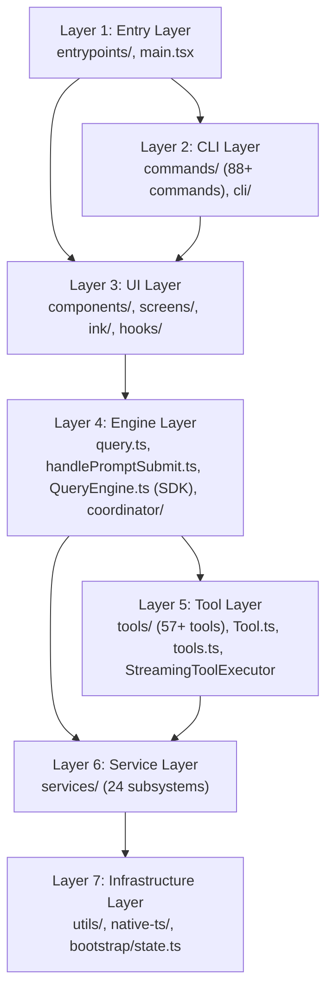

# Claude Code CLI — Layer Model

> **Wave 21-22 Corrected** — Updated with verified data from Wave 4 (data flow), Wave 6 (permissions), Wave 11 (consistency report), and Wave 16 (data-flow rewrite).
> All numbers, function names, and architectural claims cross-checked against source-verified ground truth.
> Original: 2026-04-01 | Corrected: 2026-04-01 | Verifier: Claude Opus 4.6 (1M context)

---

## Overview

Claude Code has 7 distinct architectural layers, from user-facing entry to data persistence.



---

## Layer 1: Entry Layer

**Files**: `src/entrypoints/`, `src/main.tsx`, `src/replLauncher.ts`

**Responsibility**: Process startup, CLI argument parsing, session initialization.

| File | Role |
|------|------|
| `entrypoints/cli.tsx` | True binary entry; env setup, fast-path `--version` |
| `entrypoints/init.ts` | One-time initialization (memoized): certs, MDM, telemetry, graceful shutdown |
| `entrypoints/mcp.ts` | MCP server mode |
| `entrypoints/agentSdkTypes.ts` | SDK type surface for external consumers |
| `entrypoints/sdk/` | SDK control/core schemas for programmatic use |
| `main.tsx` | Commander.js CLI; registers all 88+ commands; launches REPL |
| `replLauncher.ts` | Orchestrates REPL screen mount; processes startup hooks |

**Key Patterns**:
- Parallel side-effect imports at module load: MDM raw read, keychain prefetch, startup profiler
- Feature-gated module loading (`coordinatorMode`, `assistantModule`)
- 8 model name migration scripts run at startup
- `filterCommandsForRemoteMode()` for cloud/remote session mode

---

## Layer 2: CLI Layer

**Files**: `src/commands/` (189 files, **88+ commands**), `src/cli/` (19 files)

**Responsibility**: Slash command handling, non-interactive I/O, transport protocols.

> **Correction**: Previous analysis stated 65+ commands. Verified count is 88+ after including all feature-gated and remote-mode commands.

### Command Sub-Layer (`src/commands/`)

Each command follows the pattern:
```
commands/<name>/
  index.ts          <- Commander.js registration, arg parsing
  <name>.ts/.tsx    <- Implementation (may render React/Ink components)
```

Command categories:
| Category | Examples |
|----------|---------|
| Auth | login, logout, passes |
| Config | config, hooks, permissions, keybindings |
| Session | clear, compact, resume, export, rename, tag |
| AI | model, effort, fast, plan, review |
| Files | diff, files |
| Integrations | ide, mcp, install-github-app, install-slack-app |
| System | doctor, stats, cost, upgrade |
| Remote | bridge, remote-setup, remote-env, mobile |

### Transport Sub-Layer (`src/cli/transports/`)

Handles non-interactive output modes:
| Transport | File | Description |
|-----------|------|-------------|
| SSE | `SSETransport.ts` | Server-Sent Events for web clients |
| WebSocket | `WebSocketTransport.ts` | WebSocket transport |
| Hybrid | `HybridTransport.ts` | Auto-selects SSE or WebSocket |
| CCR | `ccrClient.ts` | Claude Code Remote client |

---

## Layer 3: UI Layer

**Files**: `src/components/` (389 files), `src/screens/` (3 files), `src/ink/` (96 files), `src/hooks/` (104 files), `src/context/` (9 files)

**Responsibility**: Terminal rendering via Ink/React, keyboard handling, visual feedback.

### Screen Components (`src/screens/`)

| Screen | File | Description |
|--------|------|-------------|
| REPL | `REPL.tsx` | Main interactive screen; conversation, input, status bar |
| Doctor | `Doctor.tsx` | System diagnostics display |
| ResumeConversation | `ResumeConversation.tsx` | Session resume chooser UI |

### Component Library (`src/components/`)

Major component groups:
| Group | Files | Description |
|-------|-------|-------------|
| `design-system/` | ~14 | Base primitives: Dialog, Pane, ProgressBar, Tabs, ThemedText |
| `agents/` | ~26 | Agent management wizard, agent list, editor |
| `permissions/` | ~20 | Permission request dialogs per tool type |
| `messages/` | ~10 | Message rendering components |
| `diff/` | 3 | Diff detail/dialog/file list |
| `tasks/` | ~8 | Task management UI |
| `teams/` | ~5 | Team collaboration UI |

### Hooks (`src/hooks/`)

React hooks organized by function:
| Category | Examples |
|----------|---------|
| Notifications (`notifs/`) | useRateLimitWarning, useMcpConnectivityStatus, useDeprecationWarning |
| Tool permission | useCanUseTool, handlers for coordinator/interactive/swarm |
| Input | useTextInput, useVimInput, usePasteHandler, useArrowKeyHistory |
| Session | useCommandQueue, useQueueProcessor, useSessionBackgrounding |
| IDE | useIDEIntegration, useIdeSelection, useIdeLogging |
| Swarm | useSwarmInitialization, useSwarmPermissionPoller |

### React Contexts (`src/context/`)

| Context | File | Data |
|---------|------|------|
| Stats | `stats.tsx` | FPS metrics, performance counters |
| Mailbox | `mailbox.tsx` | Inter-component message passing |
| Notifications | `notifications.tsx` | Toast-style notification queue |
| Modal | `modalContext.tsx` | Modal dialog state |
| Overlay | `overlayContext.tsx` | Overlay layer state |
| Voice | `voice.tsx` | Voice input state |
| FpsMetrics | `fpsMetrics.tsx` | Frame rate tracking |

---

## Layer 4: Engine Layer

**Files**: `src/query.ts`, `src/handlePromptSubmit.ts`, `src/QueryEngine.ts`, `src/context.ts`, `src/coordinator/`, `src/state/`

**Responsibility**: AI conversation management, system prompt assembly, multi-agent coordination.

> **Critical correction**: Two distinct execution paths exist. The interactive REPL uses `handlePromptSubmit.ts -> query.ts`. The SDK/headless path uses `QueryEngine.ts -> query.ts`. Previous analysis incorrectly showed QueryEngine.ts in the REPL path.

### REPL Path: handlePromptSubmit Orchestration

The interactive REPL path flows through 7 layers before reaching `query()`:

```
REPL.tsx onSubmit
  -> handlePromptSubmit.ts (exit commands, queuing, reference expansion)
  -> executeUserInput (AbortController, queryGuard, runWithWorkload)
  -> processUserInput (route: bash/slash/ultraplan/text)
  -> onQuery (queryGuard.tryStart, message append, streaming state reset)
  -> onQueryImpl (buildEffectiveSystemPrompt, context loading, title generation)
  -> query() loop (the agentic while(true) loop)
```

**handlePromptSubmit** is the missing orchestration layer that was absent from the original analysis. It handles:
- Exit commands (exit/quit/:q/:wq) redirected to `/exit`
- `[Pasted text #N]` reference expansion via `expandPastedTextRefs()`
- Command queuing when engine is busy
- Local-jsx commands during loading state

### SDK/Headless Path: QueryEngine

```
QueryEngine.submitMessage()
  -> processUserInput()
  -> fetchSystemPromptParts() (called inside QueryEngine, NOT query.ts)
  -> query()
  -> same API call chain as REPL path
```

`QueryEngine.ts` is **NOT** used in the interactive REPL path. It exists exclusively for the programmatic SDK API.

### Query Loop (`src/query.ts`)

Single-turn execution (shared by both paths):
1. Receive system prompt as parameter (does NOT build it)
2. Assemble message array from conversation history
3. Run microcompact + autocompact if needed
4. Call `deps.callModel()` — dependency injection to `queryModelWithStreaming` (claude.ts)
5. Actual API call: `anthropic.beta.messages.create({...params, stream: true}).withResponse()`
6. Process stream: accumulate text, detect `tool_use` blocks
7. For each tool_use: `findToolByName()` -> 3-stage validation -> permission check -> `tool.call()`
8. Append tool results as `tool_result` messages
9. Continue until no more tool_use blocks
10. Check auto-compact trigger

### App State (`src/state/`)

Per-session reactive state:
| File | Contents |
|------|---------|
| `AppStateStore.ts` | `AppState` type: messages, tools, settings, permissions, tasks, swarm |
| `store.ts` | Zustand-like store factory with subscription |
| `selectors.ts` | Derived state selectors |
| `onChangeAppState.ts` | Side-effect handlers on state changes |

### Coordinator Mode (`src/coordinator/coordinatorMode.ts`)

Feature-gated multi-agent coordinator:
- Orchestrates multiple sub-agents
- Only loaded when `feature('COORDINATOR_MODE')` is true

---

## Layer 5: Tool Layer

**Files**: `src/tools/` (184 files), `src/Tool.ts`, `src/tools.ts`, `src/StreamingToolExecutor.ts`

**Responsibility**: All tool implementations; the actual capabilities Claude can invoke. **57+ tools** across built-in and feature-gated categories.

> **Correction**: Previous analysis stated 52 tools. Verified count is 57+ including feature-gated tools (REPL, Cron, Worktree, etc.).

### Tool Interface (`src/Tool.ts`)

Every tool must implement:
```typescript
interface Tool {
  name: string
  description: string
  inputSchema: ZodSchema              // Zod schema (NOT raw JSON Schema)
  call(input, context): Promise<result>
  checkPermissions(input, context): PermissionResult   // NOT "userPermissionResult()"
  validateInput(input, context): ValidationResult
  isConcurrencySafe(input): boolean   // Default: false (fail-closed)
  isEnabled(context): boolean
  renderProgressInCompact?(...): ReactElement
  backfillObservableInput?(input): void  // Add derived fields for hooks/SDK
}
```

> **Correction**: Previous analysis listed `userPermissionResult()` as the Tool interface method. The correct method is `checkPermissions()`. `inputSchema` uses Zod (JSON Schema is generated from Zod for the API, not used directly).

### StreamingToolExecutor

`StreamingToolExecutor.ts` enables parallel tool execution during streaming:
```typescript
canExecuteTool(isConcurrencySafe: boolean): boolean {
  const executingTools = this.tools.filter(t => t.status === 'executing')
  return (
    executingTools.length === 0 ||
    (isConcurrencySafe && executingTools.every(t => t.isConcurrencySafe))
  )
}
```
- Concurrent-safe tools (e.g., Read, Grep, Glob) run in parallel with each other
- Non-concurrent tools get exclusive access (no other tools running)
- Results yielded in arrival order

### 3-Stage Validation Pipeline

Before any permission check or execution, every tool call passes through:
1. **Zod schema validation**: `inputSchema.safeParse(input)` -> typed ParsedInput
2. **Tool-specific validation**: `tool.validateInput(parsedInput, context)` -> ValidationResult
3. **PreToolUse hooks**: `runPreToolUseHooks()` -> possible input modification, stop, or permission decision

### Tool Categories

| Category | Tools | Notes |
|----------|-------|-------|
| **File Operations** | FileRead, FileWrite, FileEdit, Glob, Grep, NotebookEdit | Core coding tools |
| **Shell Execution** | Bash, PowerShell | Security-sensitive; sandboxing |
| **Agent/Swarm** | Agent, TeamCreate, TeamDelete, SendMessage | Multi-agent coordination |
| **MCP Bridge** | MCPTool, McpAuth, ListMcpResources, ReadMcpResource | MCP integration |
| **Tasks** | TaskCreate, TaskGet, TaskList, TaskUpdate, TaskStop, TaskOutput | Background tasks |
| **Planning** | EnterPlanMode, ExitPlanMode, EnterWorktree, ExitWorktree | Mode switching |
| **Web** | WebFetch, WebSearch | Internet access |
| **Scheduling** | CronCreate, CronDelete, CronList | Cron jobs (feature-gated) |
| **Misc** | Sleep, ToolSearch, TodoWrite, AskUserQuestion, ReviewArtifact | Utility tools |

---

## Layer 6: Service Layer

**Files**: `src/services/` (130 files, 24 subsystems)

**Responsibility**: Infrastructure services that tools and the engine depend on.

| Subsystem | Key Responsibility |
|-----------|-------------------|
| `api/` | Anthropic API client, retry, usage tracking |
| `mcp/` | MCP server lifecycle, config, auth |
| `compact/` | Context window compaction strategies |
| `lsp/` | Language Server Protocol client |
| `analytics/` | Event logging, GrowthBook A/B, DataDog |
| `oauth/` | OAuth 2.0 PKCE flow |
| `policyLimits/` | Enterprise policy enforcement |
| `plugins/` | Plugin lifecycle management |
| `autoDream/` | Background memory consolidation |
| `extractMemories/` | AI-powered memory extraction |

---

## Layer 7: Infrastructure Layer

**Files**: `src/utils/` (564 files), `src/native-ts/`, `src/bootstrap/state.ts`

**Responsibility**: Foundation utilities, platform abstraction, global state.

### Utils Sub-Groups

| Sub-group | Description |
|-----------|-------------|
| `utils/model/` | Model selection, normalization |
| `utils/settings/` | Layered settings system |
| `utils/permissions/` | Permission rule engine (7 modes, 8 sources, 5-way concurrent resolver) |
| `utils/plugins/` | Plugin loading |
| `utils/swarm/` | Swarm reconnection logic |
| `utils/git/` | Git integration |
| `utils/secureStorage/` | Keychain access |
| `utils/hooks/` | Lifecycle hooks (27 hook event types) |
| `utils/bash/` | Shell command utilities |
| `utils/sandbox/` | Sandbox enforcement |
| `utils/telemetry/` | Telemetry utilities |

### Bootstrap State (`src/bootstrap/state.ts`)

The single global state module. Strictly isolated:
- Cannot import from `utils/` (risk of circular deps)
- Holds: session ID, CWD, cost totals, model settings, telemetry providers
- Accessed via exported getter/setter functions

---

## Cross-Layer Concerns

### Permission Flow (L1 -> L7 -> L5 -> L3)

```
CLI flags (L1)
  -> permissionsLoader.ts (L7) loads from 8 sources:
     policySettings, flagSettings, userSettings, projectSettings,
     localSettings, cliArg, command, session
  -> hasPermissionsToUseToolInner (L7) — 3-step cascade:
     Step 1: Deny rules -> Ask rules -> tool.checkPermissions() -> safety checks
     Step 2: Mode checks (bypass/allow rules) — AFTER step 1, not before
     Step 3: Passthrough -> ask conversion
  -> hasPermissionsToUseTool outer wrapper (L7) — mode transforms:
     dontAsk -> deny | auto -> classifier pipeline | headless -> hooks -> deny
  -> Interactive handler (L3) — 5-way concurrent resolver:
     User interaction | Permission hooks | Bash classifier | Bridge | Channel relay
     First to claim() wins via atomic ResolveOnce guard
```

**7 Permission Modes**: `default`, `acceptEdits`, `plan`, `bypassPermissions`, `dontAsk` (external 5) + `auto`, `bubble` (internal 2)

**Bypass-immune checks** (always prompt, even in bypassPermissions):
- Protected paths (.git/, .claude/, .vscode/, shell configs)
- Tools requiring user interaction (ExitPlanMode, AskUserQuestion, ReviewArtifact)
- Content-specific ask rules (explicit user-configured rules)
- Tool-level deny rules

> **Correction**: Previous analysis showed a simplified 4-step flow with `permissionSetup.ts` initializing from CLI flags only. The actual system loads from 8 sources via `permissionsLoader.ts`, uses a 3-step inner cascade where deny rules are checked BEFORE mode, and resolves via a 5-way concurrent race.

### Settings Flow (L1 -> L7)
```
~/.claude/settings.json + project .claude/settings.json + MDM + env vars
  -> getInitialSettings() (L7) -> AppState.settings (L4) -> tool.isEnabled() (L5)
```

### Telemetry Flow (all layers -> L7)
```
logEvent() throughout all layers -> analytics (L6) -> GrowthBook + DataDog + OpenTelemetry (L7)
```

### Hook Event Flow (27 event types)

Hooks fire at specific lifecycle points and are registered in `bootstrap/state.ts`:
- PreToolUse / PostToolUse — tool execution lifecycle
- PermissionRequest — participates in 5-way concurrent permission resolver
- SubagentStart / SubagentEnd — agent lifecycle
- PreCompact / PostCompact — context window management
- SessionStart / SessionEnd — session lifecycle
- And more across the 27 event types
