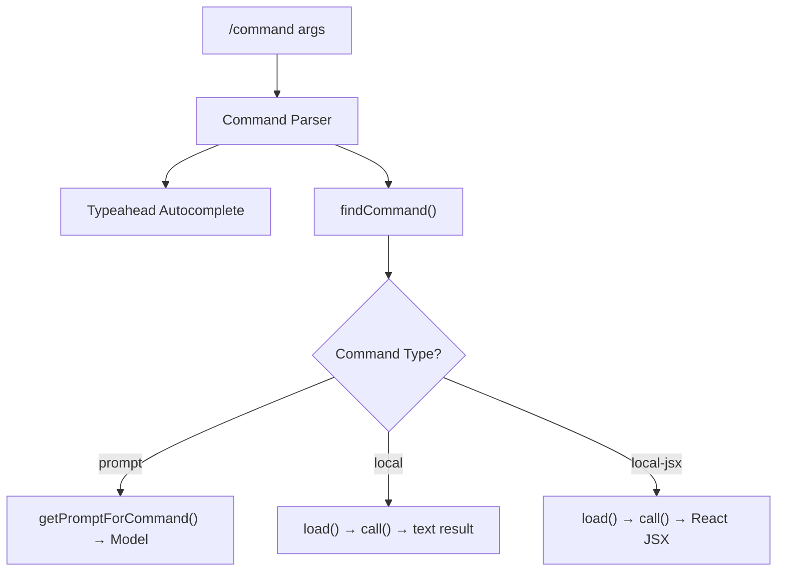

# Command System

> **Wave 36 Corrected** — L-01 (`output-style` marked deprecated/hidden), L-02 (`pr_comments` → `pr-comments` registered name).

> Slash command interface, registration pattern, and catalog of all 86+ commands in Claude Code CLI.

## Architecture Overview

Commands are user-invocable actions triggered by typing `/command-name` in the REPL. Unlike tools (which the model calls), commands are initiated by the user and may produce UI, modify state, or expand into prompts for the model.



## Command Interface (`src/types/command.ts`)

Commands are a discriminated union of three types:

```typescript
type Command = CommandBase & (PromptCommand | LocalCommand | LocalJSXCommand)
```

### CommandBase (shared properties)

```typescript
type CommandBase = {
  name: string
  description: string
  aliases?: string[]
  availability?: CommandAvailability[]   // 'claude-ai' | 'console'
  isEnabled?: () => boolean              // Feature-flag gating
  isHidden?: boolean                     // Hide from typeahead/help
  whenToUse?: string                     // Model-facing usage hint
  loadedFrom?: 'commands_DEPRECATED' | 'skills' | 'plugin' | 'managed' | 'bundled' | 'mcp'
  kind?: 'workflow'                      // Badge in autocomplete
  immediate?: boolean                    // Execute without queue
  isSensitive?: boolean                  // Redact args from history
}
```

### Three Command Types

| Type | Behavior | Return |
|------|----------|--------|
| `prompt` | Expands to prompt content sent to model | `ContentBlockParam[]` |
| `local` | Executes locally, returns text | `LocalCommandResult` |
| `local-jsx` | Executes locally, returns Ink JSX | `React.ReactNode` |

#### PromptCommand

```typescript
type PromptCommand = {
  type: 'prompt'
  progressMessage: string
  contentLength: number              // Token estimation
  source: SettingSource | 'builtin' | 'mcp' | 'plugin' | 'bundled'
  hooks?: HooksSettings              // Register hooks when invoked
  context?: 'inline' | 'fork'       // Fork runs as sub-agent
  agent?: string                     // Agent type when forked
  effort?: EffortValue
  paths?: string[]                   // Glob patterns for auto-discovery
  getPromptForCommand(args, context): Promise<ContentBlockParam[]>
}
```

#### LocalCommand (lazy-loaded)

```typescript
type LocalCommand = {
  type: 'local'
  supportsNonInteractive: boolean
  load: () => Promise<{ call: LocalCommandCall }>
}
```

#### LocalJSXCommand (lazy-loaded)

```typescript
type LocalJSXCommand = {
  type: 'local-jsx'
  load: () => Promise<{ call: LocalJSXCommandCall }>
}
```

### Lazy Loading Pattern

Both `local` and `local-jsx` commands use `load()` to defer heavy imports until invocation. This keeps startup fast — commands like `/insights` (113KB, 3200 lines) are loaded on demand.

## Registration (`src/commands.ts`)

### Static Command List

The `COMMANDS()` function returns all built-in commands, memoized for performance:

```typescript
const COMMANDS = memoize((): Command[] => [
  addDir, advisor, agents, branch, btw, chrome, clear, color,
  compact, config, copy, desktop, context, cost, diff, doctor,
  effort, exit, fast, files, heapDump, help, ide, init,
  keybindings, mcp, memory, mobile, model, outputStyle /* registered as 'output-style', isHidden: true */, plugin,
  pr_comments /* registered as 'pr-comments' */, releaseNotes, rename, resume, session, skills,
  stats, status, theme, feedback, review, rewind, securityReview,
  terminalSetup, upgrade, usage, vim, thinkback, permissions,
  plan, privacySettings, hooks, exportCommand, sandboxToggle,
  // ... conditional commands via feature flags
])
```

### Dynamic Command Sources

`getCommands(cwd)` assembles commands from multiple sources in priority order:

```
1. Bundled skills          (getBundledSkills())
2. Built-in plugin skills  (getBuiltinPluginSkillCommands())
3. Skill directory commands (getSkillDirCommands(cwd))
4. Workflow commands        (getWorkflowCommands(cwd))
5. Plugin commands          (getPluginCommands())
6. Plugin skills            (getPluginSkills())
7. Built-in commands        (COMMANDS())
```

### Availability Filtering

`meetsAvailabilityRequirement()` filters commands by auth context:

| Availability | Who Sees It |
|-------------|-------------|
| `'claude-ai'` | Claude.ai OAuth subscribers (Pro/Max/Team/Enterprise) |
| `'console'` | Direct Console API key users (api.anthropic.com) |
| (none) | Everyone |

### Cache Invalidation

```typescript
clearCommandsCache()          // Full reset (skills + plugins + memoization)
clearCommandMemoizationCaches() // Only memoization (for dynamic skill addition)
```

## Command Catalog

### Navigation & UI (12 commands)

| Command | Type | Description |
|---------|------|-------------|
| `/clear` | local | Clear terminal screen |
| `/color` | local-jsx | Change agent color |
| `/compact` | local | Shrink context window |
| `/copy` | local | Copy last message to clipboard |
| `/diff` | local-jsx | Show file changes |
| `/files` | local | List tracked files |
| `/help` | local-jsx | Show help screen |
| `/status` | local | Show session status |
| `/theme` | local-jsx | Change terminal theme |
| `/vim` | local-jsx | Toggle vim mode |
| `/exit` | local | Exit the CLI |
| `/stickers` | local-jsx | Sticker panel |

### Configuration (10 commands)

| Command | Type | Description |
|---------|------|-------------|
| `/config` | local-jsx | Edit configuration |
| `/effort` | local | Set reasoning effort level |
| `/fast` | local | Toggle fast mode |
| `/hooks` | local-jsx | Manage hook scripts |
| `/keybindings` | local-jsx | Manage keyboard shortcuts |
| `/model` | local-jsx | Change model |
| `/output-style` | local-jsx | Change output style (**deprecated, hidden** — `isHidden: true` in source) |
| `/permissions` | local-jsx | Manage permission rules |
| `/plan` | local | Toggle plan mode |
| `/privacySettings` | local-jsx | Privacy settings |

### Session & History (8 commands)

| Command | Type | Description |
|---------|------|-------------|
| `/resume` | local-jsx | Resume previous session |
| `/session` | local-jsx | Session management |
| `/rewind` | local | Rewind conversation |
| `/export` | local | Export conversation |
| `/thinkback` | local-jsx | Browse thinking history |
| `/thinkback-play` | local | Replay thinking |
| `/rename` | local | Rename session |
| `/tag` | local | Tag current session |

### Git & Development (8 commands)

| Command | Type | Description |
|---------|------|-------------|
| `/branch` | local-jsx | Git branch operations |
| `/add-dir` | local-jsx | Add working directory |
| `/init` | prompt | Initialize project CLAUDE.md |
| `/review` | prompt | Code review |
| `/securityReview` | prompt | Security review |
| `/pr-comments` | prompt | PR comment handling |
| `/commit` | prompt | Generate commit (ant-only) |
| `/commit-push-pr` | prompt | Commit + push + PR (ant-only) |

### Agents & Tasks (5 commands)

| Command | Type | Description |
|---------|------|-------------|
| `/agents` | local-jsx | Manage agent definitions |
| `/tasks` | local-jsx | View background tasks |
| `/desktop` | local-jsx | Desktop handoff |
| `/chrome` | local-jsx | Chrome extension |
| `/mobile` | local-jsx | Mobile QR code |

### MCP & Plugins (5 commands)

| Command | Type | Description |
|---------|------|-------------|
| `/mcp` | local-jsx | Manage MCP servers |
| `/plugin` | local-jsx | Manage plugins |
| `/reload-plugins` | local | Reload plugin commands |
| `/skills` | local-jsx | Browse skills |
| `/context` | local-jsx | Context management |

### Account & Auth (5 commands)

| Command | Type | Description |
|---------|------|-------------|
| `/login` | local-jsx | OAuth login |
| `/logout` | local | OAuth logout |
| `/cost` | local | Show session cost |
| `/usage` | local | Show usage info |
| `/passes` | local | Show pass usage |

### Feature-Gated Commands

| Command | Gate | Description |
|---------|------|-------------|
| `/voice` | `VOICE_MODE` | Voice input mode |
| `/bridge` | `BRIDGE_MODE` | Remote control |
| `/proactive` | `PROACTIVE/KAIROS` | Proactive mode |
| `/brief` | `KAIROS/KAIROS_BRIEF` | Brief generation |
| `/assistant` | `KAIROS` | Assistant mode |
| `/workflows` | `WORKFLOW_SCRIPTS` | Workflow management |
| `/fork` | `FORK_SUBAGENT` | Fork sub-agent |
| `/buddy` | `BUDDY` | Companion buddy |
| `/peers` | `UDS_INBOX` | Peer agent list |
| `/ultraplan` | `ULTRAPLAN` | Ultra planning (ant-only) |

### Internal-Only Commands (ant-only)

These are eliminated from external builds:

`/backfill-sessions`, `/break-cache`, `/bughunter`, `/commit`, `/ctx_viz`, `/good-claude`, `/issue`, `/init-verifiers`, `/mock-limits`, `/bridge-kick`, `/version`, `/reset-limits`, `/onboarding`, `/share`, `/summary`, `/teleport`, `/ant-trace`, `/perf-issue`, `/env`, `/oauth-refresh`, `/debug-tool-call`, `/agents-platform`, `/autofix-pr`

## Bridge & Remote Safety

### Remote-Safe Commands

`REMOTE_SAFE_COMMANDS` defines commands safe for `--remote` mode (no local filesystem dependency):

```typescript
const REMOTE_SAFE_COMMANDS = new Set([
  session, exit, clear, help, theme, color, vim, cost,
  usage, copy, btw, feedback, plan, keybindings, statusline,
  stickers, mobile,
])
```

### Bridge-Safe Commands

`BRIDGE_SAFE_COMMANDS` gates which `local` commands can execute over the Remote Control bridge:

- `prompt` commands: always safe (expand to text)
- `local` commands: explicit allowlist only (`compact`, `clear`, `cost`, `summary`, `releaseNotes`, `files`)
- `local-jsx` commands: always blocked (render Ink UI)

## Key Source Files

| File | Purpose |
|------|---------|
| `src/commands.ts` | Registration, `getCommands()`, filtering, caching |
| `src/types/command.ts` | `Command` type definitions |
| `src/commands/*/index.ts` | Individual command implementations |
| `src/skills/loadSkillsDir.ts` | Skill discovery and loading |
| `src/skills/bundledSkills.ts` | Bundled skill registration |
