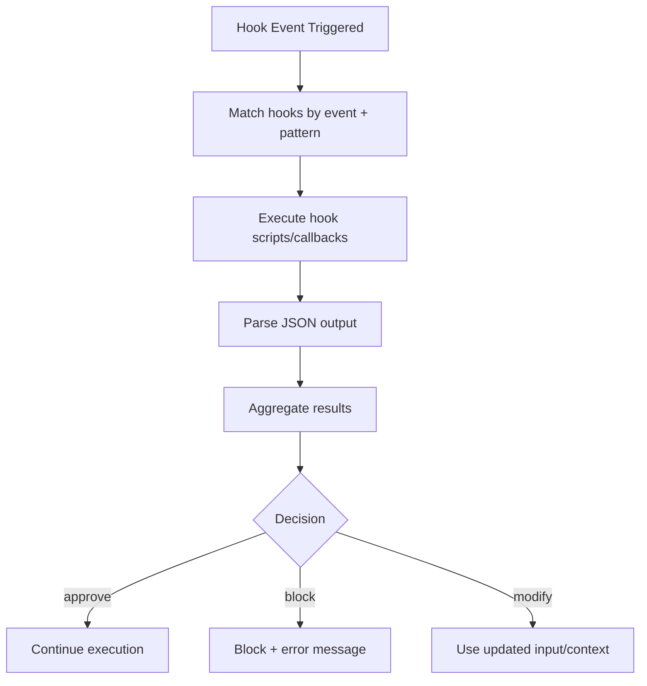

# Hook System

> **Consolidated from complete hooks audit** — Full 104-hook inventory from `src/hooks/` (87 root-level + 17 in subdirectories), plus deep analysis of top 15 hooks. Source-verified corrections applied (hook event count 16->27, hookSpecificOutput 13->16 variants, HookInput schema, HookResult/AggregatedHookResult missing fields).

> Hook types, lifecycle events, pre/post tool hooks, notification hooks, hook aggregation, and complete React hooks inventory.

## Architecture Overview

The hook system enables external scripts and callbacks to intercept and modify Claude Code's behavior at key lifecycle points. Hooks can approve/block tool calls, inject context, modify inputs, and trigger side effects.



## Hook Events (27 events)

> Source: `src/entrypoints/sdk/coreTypes.ts` — `HOOK_EVENTS` const array.

The system supports **27** hook event types:

| Event | When Fired | Can Block? |
|-------|-----------|------------|
| `Setup` | Initial setup phase | Yes |
| `SessionStart` | Session begins | Yes |
| `SessionEnd` | Session ends | No |
| `UserPromptSubmit` | User submits a message | Yes |
| `PreToolUse` | Before tool execution | Yes (approve/block) |
| `PostToolUse` | After tool execution | No (observe only) |
| `PostToolUseFailure` | After tool fails | No |
| `PermissionDenied` | User denies permission | No |
| `PermissionRequest` | Permission dialog shown | Yes (allow/deny) |
| `Notification` | Notification fired | No |
| `SubagentStart` | Sub-agent spawns | Yes |
| `SubagentStop` | Sub-agent terminates | No |
| `Stop` | Agent stop requested | No |
| `StopFailure` | Agent stop failed | No |
| `PreCompact` | Before context compaction | No |
| `PostCompact` | After context compaction | No |
| `TeammateIdle` | Teammate agent becomes idle | No |
| `TaskCreated` | New task created | No |
| `TaskCompleted` | Task completed | No |
| `Elicitation` | MCP elicitation request | Yes (accept/decline/cancel) |
| `ElicitationResult` | After elicitation completes | No |
| `ConfigChange` | Configuration changed | No |
| `CwdChanged` | Working directory changes | No |
| `FileChanged` | Watched file changes | No |
| `WorktreeCreate` | Git worktree created | No |
| `WorktreeRemove` | Git worktree removed | No |
| `InstructionsLoaded` | CLAUDE.md / instructions loaded | No |

```typescript
// From src/entrypoints/sdk/coreTypes.ts
const HOOK_EVENTS = [
  'PreToolUse', 'PostToolUse', 'PostToolUseFailure', 'Notification',
  'UserPromptSubmit', 'SessionStart', 'SessionEnd', 'Stop', 'StopFailure',
  'SubagentStart', 'SubagentStop', 'PreCompact', 'PostCompact',
  'PermissionRequest', 'PermissionDenied', 'Setup', 'TeammateIdle',
  'TaskCreated', 'TaskCompleted', 'Elicitation', 'ElicitationResult',
  'ConfigChange', 'WorktreeCreate', 'WorktreeRemove', 'InstructionsLoaded',
  'CwdChanged', 'FileChanged',
] as const

type HookEvent = (typeof HOOK_EVENTS)[number]
```

## HookInput Schema (`src/entrypoints/sdk/coreSchemas.ts`)

HookInput is a **27-variant discriminated union** on `hook_event_name`, built from a base schema extended with `.and()` per event type.

### Base Fields (all events)

```typescript
// BaseHookInputSchema fields:
{
  session_id: string
  transcript_path: string
  cwd: string
  permission_mode?: string
  agent_id?: string    // present only in subagent context
  agent_type?: string  // present in subagent or --agent sessions
}
```

Each event adds event-specific fields (e.g., `PreToolUse` adds `tool_name`, `tool_input`; `SessionStart` adds session config fields).

## Hook Definition

### HookCallback Type

```typescript
type HookCallback = {
  type: 'callback'
  callback: (
    input: HookInput,
    toolUseID: string | null,
    abort: AbortSignal | undefined,
    hookIndex?: number,
    context?: HookCallbackContext,
  ) => Promise<HookJSONOutput>
  timeout?: number           // Seconds
  internal?: boolean         // Exclude from metrics
}
```

### HookCallbackContext

```typescript
type HookCallbackContext = {
  getAppState: () => AppState
  updateAttributionState: (updater: (prev: AttributionState) => AttributionState) => void
}
```

### HookCallbackMatcher

Hooks are registered with optional pattern matching:

```typescript
type HookCallbackMatcher = {
  matcher?: string           // Pattern to match (e.g., "Bash(git *)")
  hooks: HookCallback[]
  pluginName?: string
}
```

## Hook JSON Output Protocol

Hooks communicate via JSON on stdout. There are two response types:

### Sync Response

```typescript
type SyncHookJSONOutput = {
  continue?: boolean              // Whether to continue (default: true)
  suppressOutput?: boolean        // Hide stdout from transcript
  stopReason?: string             // Message when continue=false
  decision?: 'approve' | 'block' // PreToolUse permission decision
  reason?: string                 // Explanation for decision
  systemMessage?: string          // Warning shown to user
  hookSpecificOutput?: {
    hookEventName: string         // Discriminator (16 variants)
    // Event-specific fields...
  }
}
```

### Async Response

```typescript
type AsyncHookJSONOutput = {
  async: true
  asyncTimeout?: number
}
```

### Compile-Time Assertion

```typescript
type _assertSDKTypesMatch = Assert<IsEqual<SchemaHookJSONOutput, HookJSONOutput>>
```

## hookSpecificOutput — 16 Variants

> Source: `src/types/hooks.ts` local Zod schema. The `hookEventName` discriminator selects one of 16 event-specific output shapes.

| Variant | Key Fields |
|---------|------------|
| `PreToolUse` | `permissionDecision`, `permissionDecisionReason`, `updatedInput`, `additionalContext` |
| `PostToolUse` | `additionalContext`, `updatedMCPToolOutput` |
| `PostToolUseFailure` | `additionalContext` |
| `UserPromptSubmit` | `additionalContext` |
| `SessionStart` | `additionalContext`, `initialUserMessage`, `watchPaths` |
| `Setup` | `additionalContext` |
| `SubagentStart` | `additionalContext` |
| `PermissionDenied` | `additionalContext` |
| `Notification` | `additionalContext` |
| `PermissionRequest` | `decision: { behavior: 'allow' | 'deny', ... }` |
| `Elicitation` | `action: 'accept' | 'decline' | 'cancel'`, `content` |
| `ElicitationResult` | (observe only) |
| `CwdChanged` | (observe only) |
| `FileChanged` | (observe only) |
| `WorktreeCreate` | (observe only) |

Note: Not all 27 hook events have a hookSpecificOutput variant. Events without specific output shapes (e.g., `SessionEnd`, `Stop`, `PreCompact`) use only the base SyncHookJSONOutput fields.

### PreToolUse Hooks

Can modify permission decisions and tool input:

```typescript
hookSpecificOutput: {
  hookEventName: 'PreToolUse'
  permissionDecision?: 'allow' | 'deny' | 'ask'
  permissionDecisionReason?: string
  updatedInput?: Record<string, unknown>
  additionalContext?: string
}
```

### SessionStart Hooks

Can set up file watchers and modify initial messages:

```typescript
hookSpecificOutput: {
  hookEventName: 'SessionStart'
  additionalContext?: string
  initialUserMessage?: string
  watchPaths?: string[]        // Absolute paths for FileChanged hooks
}
```

### PermissionRequest Hooks

Can programmatically allow or deny permissions:

```typescript
hookSpecificOutput: {
  hookEventName: 'PermissionRequest'
  decision: {
    behavior: 'allow'
    updatedInput?: Record<string, unknown>
    updatedPermissions?: PermissionUpdate[]
  } | {
    behavior: 'deny'
    message?: string
    interrupt?: boolean
  }
}
```

### PostToolUse Hooks

Can modify MCP tool output:

```typescript
hookSpecificOutput: {
  hookEventName: 'PostToolUse'
  additionalContext?: string
  updatedMCPToolOutput?: unknown
}
```

### Elicitation Hooks

Can respond to MCP elicitation requests:

```typescript
hookSpecificOutput: {
  hookEventName: 'Elicitation'
  action?: 'accept' | 'decline' | 'cancel'
  content?: Record<string, unknown>
}
```

## Hook Result Aggregation

### Individual HookResult (15 fields)

```typescript
type HookResult = {
  message?: Message
  systemMessage?: Message
  blockingError?: HookBlockingError
  outcome: 'success' | 'blocking' | 'non_blocking_error' | 'cancelled'
  preventContinuation?: boolean
  stopReason?: string
  permissionBehavior?: 'ask' | 'deny' | 'allow' | 'passthrough'
  hookPermissionDecisionReason?: string
  additionalContext?: string
  initialUserMessage?: string
  updatedInput?: Record<string, unknown>
  updatedMCPToolOutput?: unknown
  permissionRequestResult?: PermissionRequestResult
  retry?: boolean
}
```

### PermissionRequestResult (from hooks)

```typescript
type PermissionRequestResult =
  | { behavior: 'allow'; updatedInput?: Record<string, unknown>; updatedPermissions?: PermissionUpdate[] }
  | { behavior: 'deny'; message?: string; interrupt?: boolean }
```

### AggregatedHookResult (12 fields)

Multiple hooks for the same event are aggregated:

```typescript
type AggregatedHookResult = {
  message?: Message
  blockingErrors?: HookBlockingError[]
  preventContinuation?: boolean
  stopReason?: string
  hookPermissionDecisionReason?: string
  permissionBehavior?: PermissionResult['behavior']  // NOTE: uses PermissionResult from utils/permissions/
  additionalContexts?: string[]
  initialUserMessage?: string
  updatedInput?: Record<string, unknown>
  updatedMCPToolOutput?: unknown
  permissionRequestResult?: PermissionRequestResult
  retry?: boolean
}
```

### Aggregation Rules

- **Blocking errors**: Collected from all hooks; any blocking error stops execution
- **Permission decisions**: Most restrictive wins (deny > ask > allow)
- **Context**: All `additionalContext` strings collected into array
- **Input updates**: Last hook's `updatedInput` takes precedence
- **Continuation**: Any `preventContinuation: true` stops the pipeline

## Hook Registration

### Settings-Based Hooks

Hooks are configured in `settings.json` under the `hooks` key:

```json
{
  "hooks": {
    "PreToolUse": [
      {
        "matcher": "Bash",
        "command": "python validate_command.py"
      }
    ],
    "PostToolUse": [
      {
        "command": "node track_changes.js"
      }
    ]
  }
}
```

### Skill-Registered Hooks

Skills can register hooks via frontmatter:

```yaml
---
hooks:
  PreToolUse:
    - matcher: "FileEdit"
      command: "validate-edit.sh"
---
```

### Plugin-Registered Hooks

Plugins register hooks through their manifest, with `pluginName` tracking.

## Prompt Elicitation Protocol

Hooks can request interactive prompts from users:

```typescript
type PromptRequest = {
  prompt: string                  // Request ID (discriminator)
  message: string                 // Display message
  options: Array<{
    key: string
    label: string
    description?: string
  }>
}

type PromptResponse = {
  prompt_response: string         // Request ID
  selected: string                // Selected option key
}
```

## Hook Progress Tracking

Hooks report progress via `HookProgress`:

```typescript
type HookProgress = {
  type: 'hook_progress'
  hookEvent: HookEvent
  hookName: string
  command: string
  promptText?: string
  statusMessage?: string
}

type HookBlockingError = {
  blockingError: string
  command: string
}
```

---

## Complete React Hook Inventory (104 Files)

> **Scope**: `src/hooks/` — 104 files (85 root-level + 17 in notifs/ + 5 in toolPermission/), with deep analysis of 15 most architecturally significant hooks.

### Command Queue & Processing (3 files)
| File | Purpose | Pattern |
|------|---------|---------|
| `useCommandQueue.ts` | Subscribe to unified command queue via `useSyncExternalStore` | External store subscription |
| `useQueueProcessor.ts` | Process queued commands when idle (no active query, no JSX UI) | Effect + external store |
| `useMergedCommands.ts` | Merge built-in commands with plugin commands | Memoized merge |

### Tool Permission & Security (2 files + subdirectory)
| File | Purpose | Pattern |
|------|---------|---------|
| `useCanUseTool.tsx` | **Core permission gate** — decides allow/deny/ask for every tool use | Promise-based with React state callbacks |
| `useMergedTools.ts` | Assemble full tool pool: built-in + MCP, apply deny rules + dedup | useMemo composition |

### IDE & Editor Integration (7 files)
| File | Purpose | Pattern |
|------|---------|---------|
| `useIDEIntegration.tsx` | Auto-connect to IDE (VS Code, etc.) via SSE/WS MCP config | useEffect + env detection |
| `useIdeConnectionStatus.ts` | Track IDE connection state | State subscription |
| `useIdeAtMentioned.ts` | Handle IDE @ mentions | Event listener |
| `useIdeSelection.ts` | Track IDE text selection | State sync |
| `useIdeLogging.ts` | IDE-specific logging | Effect |
| `useDiffInIDE.ts` | Open diffs in IDE | Callback |
| `useDiffData.ts` | Compute diff data for display | Memoized computation |

### Input Handling & Text (10 files)
| File | Purpose | Pattern |
|------|---------|---------|
| `useTextInput.ts` | **Core text input engine** — keymap, cursor, kill-ring, submit | Complex state machine |
| `usePasteHandler.ts` | Detect paste (bracketed paste mode), handle image paste, chunk assembly | Debounced effect + state |
| `useArrowKeyHistory.tsx` | Arrow key history navigation with lazy chunk loading | Async state + refs |
| `useHistorySearch.ts` | Ctrl+R history search | State machine |
| `useInputBuffer.ts` | Buffer input during processing | Ref-based buffer |
| `useSearchInput.ts` | Search input handling | State |
| `useVimInput.ts` | Vim-mode key bindings | Key mapper |
| `useCopyOnSelect.ts` | Copy-on-select behavior | Effect |
| `useDoublePress.ts` | Double-press detection (800ms timeout) | Ref timer pattern |
| `useTypeahead.tsx` | Typeahead/autocomplete UI | State + suggestions |

### Prompt Suggestions & File Suggestions (4 files)
| File | Purpose | Pattern |
|------|---------|---------|
| `usePromptSuggestion.ts` | Prompt suggestion display, accept (Tab), telemetry logging | AppState + analytics |
| `fileSuggestions.ts` | **Non-hook module** — file index (git ls-files / ripgrep), fuzzy search, FileIndex singleton | Singleton + async |
| `unifiedSuggestions.ts` | Unified suggestion pipeline (files + commands) | Aggregator |
| `renderPlaceholder.ts` | Render placeholder text in input | Pure function |

### Session & Background Tasks (6 files)
| File | Purpose | Pattern |
|------|---------|---------|
| `useSessionBackgrounding.ts` | Ctrl+B to background/foreground sessions, sync task messages | AppState + callbacks |
| `useBackgroundTaskNavigation.ts` | Navigate between background tasks | State navigation |
| `useScheduledTasks.ts` | Scheduled task management | Timer + state |
| `useTaskListWatcher.ts` | Watch task list for changes | File watcher |
| `useTasksV2.ts` | Task state management v2 | AppState slice |
| `useRemoteSession.ts` | Remote session management | Connection state |

### Swarm / Agent Team (3 files)
| File | Purpose | Pattern |
|------|---------|---------|
| `useSwarmInitialization.ts` | Initialize swarm: teammate hooks, context (fresh + resumed) | useEffect with conditional init |
| `useSwarmPermissionPoller.ts` | Poll for leader permission responses (500ms interval), callback registry | useInterval + module-level Map registry |
| `useTeammateViewAutoExit.ts` | Auto-exit teammate view | Effect |

### Model & API (4 files)
| File | Purpose | Pattern |
|------|---------|---------|
| `useMainLoopModel.ts` | Resolve current model name (session > global > default), re-render on GrowthBook refresh | AppState + forceRerender |
| `useApiKeyVerification.ts` | Verify API key (loading/valid/invalid/missing/error states) | Async state machine |
| `useDirectConnect.ts` | Direct API connection mode | State |
| `useMergedClients.ts` | Merge API clients | Memoized merge |

### Voice Input (3 files)
| File | Purpose | Pattern |
|------|---------|---------|
| `useVoice.ts` | Hold-to-talk voice input via Anthropic voice_stream STT (Deepgram backend) | Complex state: recording, WebSocket, language detection |
| `useVoiceEnabled.ts` | Check if voice feature is enabled | Feature flag |
| `useVoiceIntegration.tsx` | Wire voice into REPL UI | Integration hook |

### Terminal & Display (6 files)
| File | Purpose | Pattern |
|------|---------|---------|
| `useTerminalSize.ts` | Get terminal dimensions from TerminalSizeContext | useContext (throws if missing) |
| `useVirtualScroll.ts` | **Virtual scrolling engine** — overscan, scroll quantization, slide-step mounting | useSyncExternalStore + layout measurement |
| `useBlink.ts` | Cursor blink animation | Timer |
| `useElapsedTime.ts` | Elapsed time display | Timer |
| `useMinDisplayTime.ts` | Minimum display time for UI elements | Timer |
| `useTurnDiffs.ts` | Compute turn-level diffs | Memoized |

### Settings & Configuration (5 files)
| File | Purpose | Pattern |
|------|---------|---------|
| `useSettings.ts` | Read settings | State |
| `useSettingsChange.ts` | React to settings file changes | File watcher |
| `useSkillsChange.ts` | React to skills configuration changes | File watcher |
| `useDynamicConfig.ts` | GrowthBook dynamic config values | Async state |
| `useManagePlugins.ts` | Plugin management | State |

### Keybindings & Navigation (4 files)
| File | Purpose | Pattern |
|------|---------|---------|
| `useCommandKeybindings.tsx` | Command keybinding registration | Effect |
| `useGlobalKeybindings.tsx` | Global keybinding handler | Effect |
| `useExitOnCtrlCD.ts` | Ctrl+C/D exit handling | Double-press |
| `useExitOnCtrlCDWithKeybindings.ts` | Exit with configurable keybindings | Keybinding integration |

### Bridge & Communication (4 files)
| File | Purpose | Pattern |
|------|---------|---------|
| `useReplBridge.tsx` | REPL bridge connection (OAuth, WebSocket, permission forwarding) | Complex lifecycle |
| `useMailboxBridge.ts` | Mailbox message polling — submit messages when idle | useSyncExternalStore + effect |
| `useInboxPoller.ts` | Poll inbox for incoming messages | Interval |
| `useSSHSession.ts` | SSH session management | Connection state |

### Notifications & Status (7 files)
| File | Purpose | Pattern |
|------|---------|---------|
| `useLogMessages.ts` | Log message display | State |
| `useNotifyAfterTimeout.ts` | Notify after timeout | Timer |
| `usePrStatus.ts` | PR status tracking | Polling |
| `useCancelRequest.ts` | Cancel ongoing request | AbortController |
| `useIssueFlagBanner.ts` | Issue flag banner display | State |
| `useUpdateNotification.ts` | Update available notification | Version check |
| `useDeferredHookMessages.ts` | Deferred hook message handling | Queue |

### Analytics & Memory (2 files)
| File | Purpose | Pattern |
|------|---------|---------|
| `useMemoryUsage.ts` | Memory usage monitoring | Polling |
| `useSkillImprovementSurvey.ts` | Skill improvement survey | State |

### Miscellaneous (13 files)
| File | Purpose | Pattern |
|------|---------|---------|
| `useAfterFirstRender.ts` | Execute callback after first render | Ref flag |
| `useTimeout.ts` | Generic timeout hook | Timer |
| `useAssistantHistory.ts` | Assistant conversation history | State |
| `useAwaySummary.ts` | Away summary generation | Async |
| `useTeleportResume.tsx` | Teleport resume handling | State |
| `useClipboardImageHint.ts` | Clipboard image hint | State |
| `useFileHistorySnapshotInit.ts` | File history snapshot initialization | Effect |
| `useChromeExtensionNotification.tsx` | Chrome extension notification | Feature flag |
| `useClaudeCodeHintRecommendation.tsx` | Claude Code hint recommendations | Feature flag |
| `useLspPluginRecommendation.tsx` | LSP plugin recommendation | Feature flag |
| `useOfficialMarketplaceNotification.tsx` | Official marketplace notification | Feature flag |
| `usePluginRecommendationBase.tsx` | Base plugin recommendation logic | Shared base |
| `usePromptsFromClaudeInChrome.tsx` | Chrome extension prompt integration | Bridge |

### Notification Hooks Subdirectory (`notifs/`, 17 files)

| File | Purpose | Trigger |
|------|---------|---------|
| `useStartupNotification.ts` | **Base hook** — fire notification(s) once on mount with remote-mode gate | Mount |
| `useAutoModeUnavailableNotification.ts` | Auto-mode unavailable warning | Feature gate |
| `useCanSwitchToExistingSubscription.tsx` | Subscription switch prompt | Auth check |
| `useDeprecationWarningNotification.tsx` | Deprecation warnings | Version check |
| `useFastModeNotification.tsx` | Fast mode activation notice | Mode change |
| `useIDEStatusIndicator.tsx` | IDE connection status indicator | Connection state |
| `useInstallMessages.tsx` | Install/setup messages | First run |
| `useLspInitializationNotification.tsx` | LSP initialization progress | Async init |
| `useMcpConnectivityStatus.tsx` | MCP server connectivity status | Connection polling |
| `useModelMigrationNotifications.tsx` | Model migration notices | Config change |
| `useNpmDeprecationNotification.tsx` | npm deprecation warning | Version check |
| `usePluginAutoupdateNotification.tsx` | Plugin auto-update notice | Update check |
| `usePluginInstallationStatus.tsx` | Plugin installation progress | Async install |
| `useRateLimitWarningNotification.tsx` | Rate limit / overage warnings | API limits |
| `useSettingsErrors.tsx` | Settings validation errors | Settings change |
| `useTeammateShutdownNotification.ts` | Teammate agent shutdown notice | Swarm event |

### Tool Permission Subdirectory (`toolPermission/`, 5 files)

| File | Purpose | Role |
|------|---------|------|
| `PermissionContext.ts` | **Core context factory** — `createPermissionContext()` with resolve-once guard, hook runner, classifier, queue ops | Factory + types |
| `permissionLogging.ts` | Centralized analytics/OTel logging for all permission decisions | Telemetry fan-out |
| `handlers/coordinatorHandler.ts` | Coordinator worker flow: hooks then classifier, fall through to dialog | Sequential async |
| `handlers/interactiveHandler.ts` | Interactive (main agent) flow: push to confirm queue, race hooks/classifier vs user | Callback + race |
| `handlers/swarmWorkerHandler.ts` | Swarm worker flow: classifier then forward to leader via mailbox | Async + IPC |

---

## Deep Analysis: Key Hooks

### useCanUseTool (~700 lines) — The Security Boundary

The central permission gate for every tool invocation in the system.

**Signature**:
```typescript
function useCanUseTool(
  setToolUseConfirmQueue: Dispatch<SetStateAction<ToolUseConfirm[]>>,
  setToolPermissionContext: (context: ToolPermissionContext) => void,
): CanUseToolFn
```

**Key Behavior**:
1. Creates a `PermissionContext` via `createPermissionContext()` for each tool use
2. Checks abort signal first (resolves immediately if aborted)
3. If `forceDecision` provided, uses it directly; otherwise calls `hasPermissionsToUseTool()`
4. **Allow path**: logs decision, resolves with `buildAllow()`
5. **Deny path**: logs rejection, records auto-mode denial if classifier-based, shows notification
6. **Ask path**: Routes to one of three handlers based on context:
   - `handleCoordinatorPermission()` — coordinator workers (hooks then classifier)
   - `handleSwarmWorkerPermission()` — swarm workers (classifier then leader mailbox)
   - `handleInteractivePermission()` — main agent (dialog with race against hooks/classifier)
7. Uses speculative classifier checks for bash commands (`BASH_CLASSIFIER` feature flag)
8. Compiled with React Compiler (`_c` memoization cache)

### useSwarmPermissionPoller (~330 lines) — Worker Permission Polling

**Module-level exports** (not just hook):
- `registerPermissionCallback()` / `unregisterPermissionCallback()`
- `processMailboxPermissionResponse()` — process from inbox
- `processSandboxPermissionResponse()` — process sandbox permission
- `clearAllPendingCallbacks()` — cleanup on `/clear`

Polls every 500ms when `isSwarmWorker()` is true. Module-level `Map<string, PermissionResponseCallback>` registry persists across renders. Validates permission updates with Zod schema.

### useVirtualScroll — Virtual Scrolling Engine

Virtual scrolling with overscan, scroll quantization, and slide-step mounting via `useSyncExternalStore` + layout measurement.

### usePasteHandler (~285 lines) — Paste Detection

Detects paste via `event.keypress.isPasted` (bracketed paste mode). Chunks large pastes with 100ms completion timeout. Image detection: checks file paths for image extensions. macOS clipboard image: empty paste triggers `getImageFromClipboard()`. Uses `pastePendingRef` for synchronous paste state.

### useVoice (~400 lines) — Voice Input

Hold-to-talk voice input via Anthropic voice_stream STT (Deepgram backend). Records audio via native module (macOS) or SoX. Streams to Anthropic's `voice_stream` endpoint. Supported languages: en, es, fr, ja, de, pt, it, ko.

---

## Hook Registration in REPL

The hooks are primarily consumed in the main REPL component tree:

```
App.tsx (Ink root)
  └── REPL.tsx (main REPL component)
       ├── useCanUseTool         → permission gate
       ├── useCommandQueue       → command queue subscription
       ├── useQueueProcessor     → command processing
       ├── useTextInput          → input handling
       ├── usePasteHandler       → paste detection
       ├── useArrowKeyHistory    → history navigation
       ├── usePromptSuggestion   → prompt suggestions
       ├── useSessionBackgrounding → Ctrl+B backgrounding
       ├── useSwarmInitialization → swarm setup
       ├── useSwarmPermissionPoller → worker permission polling
       ├── useIDEIntegration     → IDE auto-connect
       ├── useMainLoopModel      → model resolution
       ├── useMergedTools        → tool pool assembly
       ├── useReplBridge         → bridge connection
       ├── useMailboxBridge      → mailbox polling
       ├── useVoice              → voice input
       ├── useVirtualScroll      → message list virtualization
       └── notifs/*              → all notification hooks
```

## Hook Composition Patterns

| Pattern | Count | Examples |
|---------|-------|---------|
| `useSyncExternalStore` | 5+ | useCommandQueue, useQueueProcessor, useMailboxBridge, useVirtualScroll |
| `useAppState` selector | 10+ | usePromptSuggestion, useSessionBackgrounding, useMainLoopModel |
| React Compiler (`_c`) | 4+ | useCanUseTool, useIDEIntegration, useRateLimitWarning, useSettingsErrors |
| `useStartupNotification` base | 16 | All notifs/ hooks |
| Module-level singleton | 3 | fileSuggestions (FileIndex), useSwarmPermissionPoller (Map), useArrowKeyHistory (pendingLoad) |
| Timer/interval | 6+ | useDoublePress, useElapsedTime, useSwarmPermissionPoller, useBlink |
| File watcher | 3 | useSettingsChange, useSkillsChange, useTaskListWatcher |

## Session Lifecycle Integration

```
Session Start:
  useApiKeyVerification → verify key
  useSwarmInitialization → init swarm context
  useIDEIntegration → auto-connect IDE
  notifs/useStartupNotification → all startup notifications
  fileSuggestions → start background file index

Session Active:
  useQueueProcessor → process commands
  useCanUseTool → gate every tool use
  useSessionBackgrounding → background/foreground tasks
  useSwarmPermissionPoller → poll leader (if worker)
  useMainLoopModel → track model changes
  useVirtualScroll → virtualize message list

Session End:
  clearAllPendingCallbacks() → clean swarm state
  clearFileSuggestionCaches() → clean file index
```

## Feature Flag Dependencies

| Feature Flag | Hooks Affected |
|-------------|----------------|
| `BASH_CLASSIFIER` | useCanUseTool, coordinatorHandler, interactiveHandler, swarmWorkerHandler |
| `TRANSCRIPT_CLASSIFIER` | useCanUseTool, permissionLogging |
| `ENABLE_AGENT_SWARMS` | useSwarmInitialization, useSwarmPermissionPoller, swarmWorkerHandler |

## Statistics

| Metric | Value |
|--------|-------|
| Total files | 104 |
| Root-level hooks | 85 |
| Notification hooks (notifs/) | 17 |
| Tool permission files (toolPermission/) | 5 |
| Non-hook modules in hooks/ | 3 (fileSuggestions, renderPlaceholder, unifiedSuggestions) |
| React Compiler compiled | 4+ hooks |
| Lines of code (estimated) | ~8,000-10,000 |
| External dependencies | usehooks-ts (useInterval, useDebounceCallback), strip-ansi, ignore |

## Key Source Files

| File | Purpose |
|------|---------|
| `src/types/hooks.ts` | Hook type definitions (13 types + 4 Zod schemas + 3 type guards), result aggregation |
| `src/entrypoints/sdk/coreSchemas.ts` | 27 HookInput schemas (BaseHookInput + per-event extensions) |
| `src/entrypoints/sdk/coreTypes.ts` | HOOK_EVENTS (27 events), HookEvent type, re-exports |
| `src/hooks/useDeferredHookMessages.ts` | Deferred hook message rendering |
| `src/hooks/useCanUseTool.tsx` | Core permission gate (~700 lines) |
| `src/hooks/toolPermission/` | Permission dialog hooks and handlers |
| `src/utils/settings/types.ts` | HooksSettings schema |

---

*Analysis based on source files verified 2026-04-01. Complete inventory of all 104 hook files with deep analysis of the 15 most architecturally significant hooks.*
