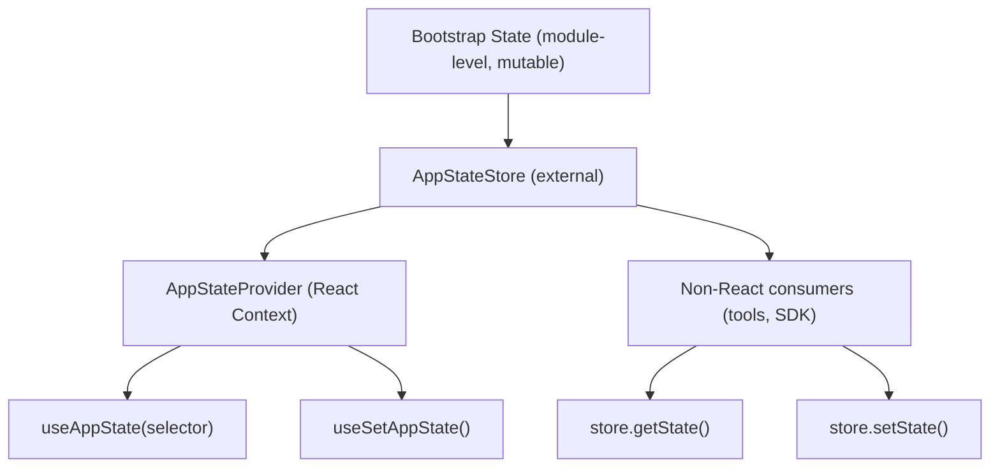

# State Management

> **Wave 36 Corrected** — L-14 (pluginReconnectKey detail added), L-15 (getIsNonInteractiveSession() getter verified).
> **Wave 18 Corrected** — Applied Wave 5 Batch 3 source-verified corrections (2026-04-01).
> Corrections: removed fabricated fields (conversationId, backgroundTasks, theme, costTracker), fixed AppState as ~105-field DeepImmutable hybrid (not flat object), fixed bootstrap State as mutable (not immutable after init), added Entry union (19 variants).

> AppState store, React context providers, bootstrap state, and persistence patterns.

## Architecture Overview

Claude Code uses a custom external store pattern with React 19's `useSyncExternalStore` for state management. This enables both React components and non-React code (tools, hooks, SDK) to read and write state consistently.



## AppState Store (`src/state/`)

### Store Architecture

The store is a minimal external store created via `createStore()` in `src/state/store.ts`:

```typescript
type Listener = () => void
type OnChange<T> = (args: { newState: T; oldState: T }) => void

type Store<T> = {
  getState: () => T
  setState: (updater: (prev: T) => T) => void
  subscribe: (listener: Listener) => () => void
}

type AppStateStore = Store<AppState>
```

**Implementation**: `createStore<T>(initialState, onChange?)` — minimal pub/sub with `Object.is` equality check to skip no-op updates. Listeners stored in a `Set<Listener>`.

### AppState Shape (`src/state/AppStateStore.ts`)

`AppState` is a **~105-field hybrid type**: `DeepImmutable<{...}> & {...mutable sections}`. The `DeepImmutable` wrapper covers ~37 scalar/config fields; the mutable `&` section contains ~68 fields with function types, Maps, Sets, and complex nested objects that `DeepImmutable` cannot handle.

> **W18 Note**: Previous analysis incorrectly described AppState as a "large flat object" with fabricated fields (`conversationId`, `backgroundTasks`, `theme`, `costTracker`). None of these exist in AppState. `sessionId` is in bootstrap State, not AppState. Cost tracking (`totalCostUSD`) is in bootstrap State.

#### DeepImmutable Section (~37 fields)

| Category | Key Fields |
|----------|------------|
| **Settings** | `settings` (SettingsJson), `verbose`, `isBriefOnly` |
| **Model** | `mainLoopModel`, `mainLoopModelForSession` |
| **View** | `expandedView` ('none'\|'tasks'\|'teammates'), `viewSelectionMode`, `footerSelection`, `selectedIPAgentIndex`, `coordinatorTaskIndex` |
| **Permissions** | `toolPermissionContext` (ToolPermissionContext — uses direct `readonly` fields + `ReadonlyMap`, NOT DeepImmutable wrapper) |
| **Agent** | `agent` (string\|undefined), `kairosEnabled` |
| **Remote** | `remoteSessionUrl`, `remoteConnectionStatus`, `remoteBackgroundTaskCount`, `showRemoteCallout` |
| **REPL Bridge** | 12 `replBridge*` fields (Enabled, Explicit, OutboundOnly, Connected, SessionActive, Reconnecting, ConnectUrl, SessionUrl, EnvironmentId, SessionId, Error, InitialName) |

#### Mutable Section (~68 fields)

| Category | Key Fields |
|----------|------------|
| **Tasks** | `tasks: { [taskId: string]: TaskState }` (plain object, NOT Map) |
| **Agents** | `agentNameRegistry` (Map), `agentDefinitions` (AgentDefinitionsResult with `.activeAgents`, `.allAgents`) |
| **MCP** | `mcp: { clients, tools, commands, resources, pluginReconnectKey }` — `pluginReconnectKey: number` is incremented by `/reload-plugins` to trigger MCP effects to re-run and pick up newly-enabled plugin MCP servers |
| **Plugins** | `plugins: { enabled, disabled, commands, errors, installationStatus, needsRefresh }` |
| **UI State** | `todos` (keyed by agentId), `notifications`, `activeOverlays` (ReadonlySet), `promptSuggestion` |
| **Speculation** | `speculation` (SpeculationState: 'idle' \| 'active' with abort, boundary, pipelining) |
| **Team** | `teamContext`, `standaloneAgentContext`, `inbox`, `workerSandboxPermissions` |
| **Tungsten** | `tungstenActiveSession`, `tungstenPanelVisible`, etc. |
| **Bagel** | `bagelActive`, `bagelUrl`, `bagelPanelVisible` |
| **Ultraplan** | `ultraplanLaunching`, `ultraplanSessionUrl`, `ultraplanPendingChoice`, `isUltraplanMode` |
| **Other** | `fileHistory`, `attribution`, `sessionHooks`, `elicitation`, `thinkingEnabled`, `fastMode`, `effortValue`, `denialTracking` |

### Helper Types

```typescript
type CompletionBoundary =
  | { type: 'complete'; completedAt: number; outputTokens: number }
  | { type: 'bash'; command: string; completedAt: number }
  | { type: 'edit'; toolName: string; filePath: string; completedAt: number }
  | { type: 'denied_tool'; toolName: string; detail: string; completedAt: number }

type SpeculationState =
  | { status: 'idle' }
  | { status: 'active'; id: string; abort: () => void; startTime: number;
      messagesRef: { current: Message[] }; writtenPathsRef: { current: Set<string> };
      boundary: CompletionBoundary | null; suggestionLength: number;
      toolUseCount: number; isPipelined: boolean;
      contextRef: { current: REPLHookContext };
      pipelinedSuggestion?: { text: string; promptId: 'user_intent' | 'stated_intent'; generationRequestId: string | null } | null }

type FooterItem = 'tasks' | 'tmux' | 'bagel' | 'teams' | 'bridge' | 'companion'
```

### Default State

`getDefaultAppState()` provides a sensible initial state with empty maps/objects, default permission context, and null optionals.

## React Provider (`src/state/AppState.tsx`)

### AppStateProvider

Wraps the application in state context with nesting protection:

```typescript
function AppStateProvider({ children, initialState, onChangeAppState }) {
  // Prevent nesting
  if (hasAppStateContext) {
    throw new Error("AppStateProvider can not be nested")
  }
  
  const [store] = useState(() => createStore(
    initialState ?? getDefaultAppState(),
    onChangeAppState
  ))
  
  // Disable bypass permissions if remote settings loaded before mount
  useEffect(() => { /* check isBypassPermissionsModeDisabled */ }, [])
  
  // React to settings changes
  useSettingsChange(onSettingsChange)
  
  return (
    <HasAppStateContext.Provider value={true}>
      <AppStoreContext.Provider value={store}>
        <MailboxProvider>
          <VoiceProvider>{children}</VoiceProvider>
        </MailboxProvider>
      </AppStoreContext.Provider>
    </HasAppStateContext.Provider>
  )
}
```

### Context Providers

The provider wraps children in additional context layers:
1. **MailboxProvider** — Inter-agent mailbox context
2. **VoiceProvider** — Voice mode context (ant-only, DCE'd in external builds)

### Selector Hook

`useAppState(selector)` subscribes to state slices with `useSyncExternalStore`:

```typescript
function useAppState<T>(selector: (state: AppState) => T): T {
  const store = useAppStore()
  return useSyncExternalStore(
    store.subscribe,
    () => selector(store.getState())
  )
}
```

**Usage guidelines** (from source comments):
- Call multiple times for independent fields (each subscribes separately)
- Do NOT return new objects from selector (Object.is comparison)
- Select existing sub-object references instead

### Setter Hook

`useSetAppState()` returns the store's `setState` function for updater-pattern state changes.

## Bootstrap State (`src/bootstrap/state.ts`)

Module-level singleton state (`const STATE: State = getInitialState()`) that exists before React mounts, accessed via getter/setter functions. Bootstrap State is **NOT reactive** — React components cannot subscribe to it.

> **W18 Note**: Previous analysis incorrectly described bootstrap state as "Immutable after init". Many fields are mutated throughout the session (totalCostUSD, modelUsage, cwd, registeredHooks, etc.).

### State Fields (~90 fields)

| Category | Count | Key Fields |
|----------|-------|------------|
| **Session** | 11 | `originalCwd`, `projectRoot`, `cwd`, `sessionId`, `parentSessionId`, `isInteractive`, `kairosActive`, `clientType`, `sessionSource`, `isRemoteMode`, `sessionProjectDir` |
| **Cost/Timing** | 12 | `totalCostUSD`, `totalAPIDuration`, `totalAPIDurationWithoutRetries`, `totalToolDuration`, `startTime`, `lastInteractionTime`, `turnHookDurationMs`, `turnToolDurationMs`, `turnClassifierDurationMs`, `turnToolCount`, `turnHookCount`, `turnClassifierCount` |
| **Code Metrics** | 3 | `totalLinesAdded`, `totalLinesRemoved`, `hasUnknownModelCost` |
| **Model** | 4 | `modelUsage`, `mainLoopModelOverride`, `initialMainLoopModel`, `modelStrings` |
| **Telemetry** | 11 | `meter`, `sessionCounter`, `locCounter`, `prCounter`, `commitCounter`, `costCounter`, `tokenCounter`, `codeEditToolDecisionCounter`, `activeTimeCounter`, `statsStore`, `meterProvider` |
| **Logger/Tracer** | 3 | `loggerProvider`, `eventLogger`, `tracerProvider` |
| **Session Flags** | 12 | `sessionBypassPermissionsMode`, `scheduledTasksEnabled`, `sessionTrustAccepted`, `sessionPersistenceDisabled`, `hasExitedPlanMode`, `needsPlanModeExitAttachment`, `needsAutoModeExitAttachment`, etc. |
| **Skills/Hooks** | 4 | `invokedSkills`, `registeredHooks`, `initJsonSchema`, `planSlugCache` |
| **Cache Latches** | 7 | `promptCache1hAllowlist`, `promptCache1hEligible`, `afkModeHeaderLatched`, `fastModeHeaderLatched`, `cacheEditingHeaderLatched`, `thinkingClearLatched`, `pendingPostCompaction` |
| **Channels** | 3 | `allowedChannels`, `hasDevChannels`, `additionalDirectoriesForClaudeMd` |
| **Other** | ~7 | `inMemoryErrorLog`, `inlinePlugins`, `slowOperations`, `sdkBetas`, `mainThreadAgentType`, `teleportedSessionInfo`, `sessionCronTasks` |

### Getter Functions (confirmed)

| Function | Field | Notes |
|----------|-------|-------|
| `getSessionId()` | `sessionId` | |
| `getOriginalCwd()` | `originalCwd` | |
| `getIsNonInteractiveSession()` | `!isInteractive` | Returns negation of `STATE.isInteractive` (W36 L-15 verified) |
| `getAdditionalDirectoriesForClaudeMd()` | `additionalDirectoriesForClaudeMd` | |
| `getCachedClaudeMdContent()` | `cachedClaudeMdContent` | |
| `getKairosActive()` | `kairosActive` | |

### Bootstrap Helper Types

```typescript
type ChannelEntry =
  | { kind: 'plugin'; name: string; marketplace: string; dev?: boolean }
  | { kind: 'server'; name: string; dev?: boolean }

type AttributedCounter = {
  add(value: number, additionalAttributes?: Attributes): void
}

type SessionCronTask = { ... }  // Scheduled recurring tasks
```

### Bootstrap vs AppState

| | Bootstrap State | AppState |
|-|----------------|----------|
| **Location** | `src/bootstrap/state.ts` | `src/state/AppStateStore.ts` |
| **Pattern** | Module-level singleton (`const STATE`) | External store with pub/sub |
| **Reactivity** | NOT reactive — no React subscription | Reactive via `useSyncExternalStore` |
| **Mutability** | **Mutable** — fields change throughout session | Mutable via `setState(updater)` |
| **Access** | Getter/setter functions | Context or store reference |
| **Availability** | Available everywhere, before React mounts | Available after store creation |
| **Fields** | ~90 (session, cost, telemetry, flags) | ~105 (UI, tasks, MCP, plugins) |
| **Cost tracking** | `totalCostUSD` lives here | NOT in AppState |
| **Session ID** | `sessionId` lives here | NOT in AppState |

## Entry Union (`src/types/logs.ts`)

> **W18 Addition**: The `Entry` type is a 19-variant discriminated union central to the message/log pipeline. It was not covered in previous analysis.

### Entry — 19 Variants

```typescript
type Entry =
  | TranscriptMessage            // discriminated by `role` (from Message base), NOT `type`
  | SummaryMessage               // type: 'summary'
  | CustomTitleMessage           // type: 'custom-title'
  | AiTitleMessage               // type: 'ai-title'
  | LastPromptMessage            // type: 'last-prompt'
  | TaskSummaryMessage           // type: 'task-summary'
  | TagMessage                   // type: 'tag'
  | AgentNameMessage             // type: 'agent-name'
  | AgentColorMessage            // type: 'agent-color'
  | AgentSettingMessage          // type: 'agent-setting'
  | PRLinkMessage                // type: 'pr-link'
  | FileHistorySnapshotMessage   // type: 'file-history-snapshot'
  | AttributionSnapshotMessage   // type: 'attribution-snapshot'
  | QueueOperationMessage        // imported from messageQueueTypes.ts
  | SpeculationAcceptMessage     // type: 'speculation-accept'
  | ModeEntry                    // type: 'mode'
  | WorktreeStateEntry           // type: 'worktree-state'
  | ContentReplacementEntry      // type: 'content-replacement'
  | ContextCollapseCommitEntry   // type: 'marble-origami-commit' (obfuscated)
  | ContextCollapseSnapshotEntry // type: 'marble-origami-snapshot' (obfuscated)
```

**Discriminator note**: `TranscriptMessage` discriminates via its `Message` base (`role` field), while all other 18 variants use a `type` field. This is an imperfect discriminated union — callers must check `'type' in entry` first.

### Obfuscated Entry Types

Two context-collapse entries use obfuscated discriminators:
- `ContextCollapseCommitEntry`: `type: 'marble-origami-commit'`
- `ContextCollapseSnapshotEntry`: `type: 'marble-origami-snapshot'`

Source comment: "Discriminator is obfuscated to match the gate name... a descriptive string here would leak into external builds."

### SerializedMessage

```typescript
type SerializedMessage = Message & {
  cwd: string
  userType: string
  entrypoint?: string    // CLAUDE_CODE_ENTRYPOINT
  sessionId: string
  timestamp: string
  version: string
  gitBranch?: string
  slug?: string          // Session slug for plans (resume)
}
```

### TranscriptMessage

```typescript
type TranscriptMessage = SerializedMessage & {
  parentUuid: UUID | null
  logicalParentUuid?: UUID | null
  isSidechain: boolean
  gitBranch?: string
  agentId?: string
  teamName?: string
  agentName?: string
  agentColor?: string
  promptId?: string
}
```

## Context System (`src/context.ts`)

### System Context

`getSystemContext()` (memoized) provides system-level context prepended to conversations:

```typescript
async function getSystemContext(): Promise<{ [k: string]: string }> {
  return {
    ...(gitStatus && { gitStatus }),
    ...(injection && { cacheBreaker: `[CACHE_BREAKER: ${injection}]` }),
  }
}
```

Includes:
- **Git status**: Branch, recent commits, file status (truncated at 2000 chars)
- **Cache breaker**: Injection for debugging (ant-only)

### User Context

`getUserContext()` (memoized) provides user-specific context:

```typescript
async function getUserContext(): Promise<{ [k: string]: string }> {
  return {
    ...(claudeMd && { claudeMd }),
    currentDate: `Today's date is ${getLocalISODate()}.`,
  }
}
```

Includes:
- **CLAUDE.md content**: Merged from all discovered CLAUDE.md files
- **Current date**: For temporal awareness

### Context Caching

Both contexts are memoized for the session duration. Cache is cleared when:
- System prompt injection changes (`setSystemPromptInjection()`)
- Manual cache clear

### Git Status Collection

`getGitStatus()` runs five git commands in parallel:

```typescript
const [branch, mainBranch, status, log, userName] = await Promise.all([
  getBranch(),
  getDefaultBranch(),
  execFileNoThrow(gitExe(), ['status', '--short']),
  execFileNoThrow(gitExe(), ['log', '--oneline', '-n', '5']),
  execFileNoThrow(gitExe(), ['config', 'user.name']),
])
```

Status output is truncated at 2000 characters with a guidance message to use BashTool for more detail.

## Additional Context Providers

### Notification Context (`src/context/notifications.ts`)

Manages notification queue for OS-level and UI notifications.

### Mailbox Context (`src/context/mailbox.ts`)

Provides inter-agent mailbox communication for the team system.

### Voice Context (`src/context/voice.ts`)

Voice mode state, gated by `VOICE_MODE` feature flag.

## ToolUseContext

The `ToolUseContext` type (`src/Tool.ts:158`) is the primary context object passed to every tool call:

```typescript
type ToolUseContext = {
  options: {
    commands: Command[]
    tools: Tools
    mcpClients: MCPServerConnection[]
    mainLoopModel: string
    thinkingConfig: ThinkingConfig
    maxBudgetUsd?: number
    // ...
  }
  abortController: AbortController
  readFileState: FileStateCache
  getAppState(): AppState
  setAppState(f: (prev: AppState) => AppState): void
  setAppStateForTasks?: (f: (prev: AppState) => AppState): void  // Root store for tasks
  messages: Message[]
  // ... 30+ additional fields
}
```

### Subagent Context Isolation

`createSubagentContext()` creates a derived context where:
- `setAppState` becomes a no-op (isolation)
- `setAppStateForTasks` still reaches root store (for task registration)
- `localDenialTracking` accumulates locally

## Settings Change Reactivity

`useSettingsChange()` hook watches for configuration file changes and applies them via `applySettingsChange()`:

```typescript
const onSettingsChange = useEffectEvent(
  (source: SettingSource) => applySettingsChange(source, store.setState)
)
```

This enables hot-reload of:
- Permission rules
- MCP server configurations
- Hook configurations

## Key Source Files

| File | Purpose |
|------|---------|
| `src/state/AppState.tsx` | AppStateProvider, useAppState, useSetAppState |
| `src/state/AppStateStore.ts` | AppState type (~105 fields), getDefaultAppState |
| `src/state/store.ts` | createStore external store factory |
| `src/bootstrap/state.ts` | Module-level bootstrap state (~90 mutable fields) |
| `src/types/logs.ts` | Entry union (19 variants), SerializedMessage, TranscriptMessage |
| `src/context.ts` | System/user context, git status |
| `src/context/` | Notification, mailbox, voice contexts |
| `src/Tool.ts` | ToolUseContext type definition |
