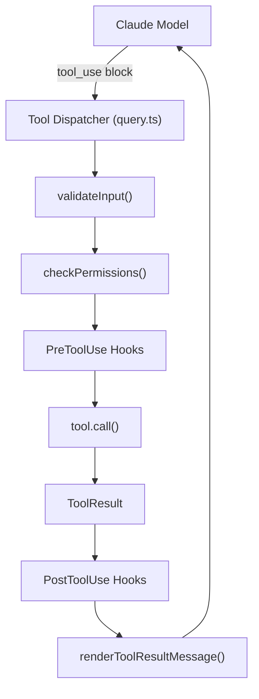

# Tool System

> **Wave 35 Corrected** — M-16 (TOOL_DEFAULTS.userFacingName), L-10 (QueryChainTracking), L-11 (utility functions) fixed against `src/Tool.ts`.

> Core tool abstraction, registration, execution lifecycle, and catalog for Claude Code CLI.

## Architecture Overview

The tool system is the primary mechanism through which the AI model interacts with the local environment. Every file read, shell command, web search, and agent spawn flows through a unified `Tool` interface defined in `src/Tool.ts`.



## Core Interface (`src/Tool.ts`)

The `Tool` type is a generic interface parameterized by `Input`, `Output`, and `Progress`:

```typescript
type Tool<Input extends AnyObject, Output, P extends ToolProgressData> = {
  name: string
  aliases?: string[]
  searchHint?: string
  inputSchema: Input                    // Zod schema
  call(args, context, canUseTool, parentMessage, onProgress?): Promise<ToolResult<Output>>
  description(input, options): Promise<string>
  checkPermissions(input, context): Promise<PermissionResult>
  validateInput?(input, context): Promise<ValidationResult>
  isEnabled(): boolean
  isReadOnly(input): boolean
  isConcurrencySafe(input): boolean
  isDestructive?(input): boolean
  prompt(options): Promise<string>
  // ... 20+ rendering methods
}
```

### Key Design Decisions

| Decision | Rationale |
|----------|-----------|
| Zod input schemas | Runtime validation + type inference; enables JSON Schema generation for API |
| `buildTool()` factory | Fills safe defaults so tools only implement what they need |
| `ToolDef` partial type | `DefaultableToolKeys` are optional in definitions; `buildTool` fills them |
| `maxResultSizeChars` | Large outputs auto-persist to disk; model gets preview + file path |
| `shouldDefer` flag | Enables ToolSearch lazy loading; tool schema sent only when needed |

### The `buildTool()` Factory (`src/Tool.ts:783`)

All tools are constructed via `buildTool()`, which applies fail-closed defaults.

**`TOOL_DEFAULTS` raw values** (line 757):

```typescript
const TOOL_DEFAULTS = {
  isEnabled: () => true,
  isConcurrencySafe: (_input?) => false,   // assume not safe
  isReadOnly: (_input?) => false,           // assume writes
  isDestructive: (_input?) => false,
  checkPermissions: (input, _ctx?) => Promise.resolve({ behavior: 'allow', updatedInput: input }),
  toAutoClassifierInput: (_input?) => '',   // skip classifier
  userFacingName: (_input?) => '',          // raw default is empty string
}
```

**`buildTool()` override** (line 783): The factory applies a two-layer spread that overrides `userFacingName` to return the tool's `name`:

```typescript
export function buildTool<D extends AnyToolDef>(def: D): BuiltTool<D> {
  return {
    ...TOOL_DEFAULTS,              // layer 1: raw defaults (userFacingName → '')
    userFacingName: () => def.name, // layer 2: override to return tool name
    ...def,                         // layer 3: tool definition wins if provided
  } as BuiltTool<D>
}
```

So the effective default for `userFacingName` is `() => def.name` (not the raw `() => ''`), unless the tool definition provides its own implementation.

### QueryChainTracking Type (`src/Tool.ts:90`)

Tracks query chain context for nested/chained tool invocations:

```typescript
type QueryChainTracking = {
  chainId: string   // Unique identifier for the query chain
  depth: number     // Current nesting depth within the chain
}
```

Used in `ToolUseContext.queryTracking` (line 266) to track how deeply nested the current tool call is within a chain of queries.

### Utility Functions (`src/Tool.ts`)

Three utility functions are exported for tool lookup and progress filtering:

#### `toolMatchesName()` (line 348)

Checks if a tool matches a given name by primary name or alias:

```typescript
function toolMatchesName(
  tool: { name: string; aliases?: string[] },
  name: string,
): boolean {
  return tool.name === name || (tool.aliases?.includes(name) ?? false)
}
```

#### `findToolByName()` (line 358)

Finds a tool by name or alias from a `Tools` array:

```typescript
function findToolByName(tools: Tools, name: string): Tool | undefined {
  return tools.find(t => toolMatchesName(t, name))
}
```

#### `filterToolProgressMessages()` (line 312)

Filters a list of `ProgressMessage[]` to only tool progress (excludes hook progress):

```typescript
function filterToolProgressMessages(
  progressMessagesForMessage: ProgressMessage[],
): ProgressMessage<ToolProgressData>[] {
  return progressMessagesForMessage.filter(
    (msg): msg is ProgressMessage<ToolProgressData> =>
      msg.data?.type !== 'hook_progress',
  )
}
```

This is a type-narrowing filter: it takes mixed `Progress` messages (which include both `ToolProgressData` and `HookProgress`) and returns only the tool-related ones, using a type guard to narrow the return type.

## Tool Registration (`src/tools.ts`)

### Static Registration

`getAllBaseTools()` returns the complete ordered list of built-in tools. This is the **single source of truth** for all tools:

```typescript
function getAllBaseTools(): Tools {
  return [
    AgentTool, TaskOutputTool, BashTool,
    ...(hasEmbeddedSearchTools() ? [] : [GlobTool, GrepTool]),
    ExitPlanModeV2Tool, FileReadTool, FileEditTool, FileWriteTool,
    NotebookEditTool, WebFetchTool, TodoWriteTool, WebSearchTool,
    TaskStopTool, AskUserQuestionTool, SkillTool, EnterPlanModeTool,
    // ... conditionally included tools via feature flags
    ListMcpResourcesTool, ReadMcpResourceTool,
    ...(isToolSearchEnabledOptimistic() ? [ToolSearchTool] : []),
  ]
}
```

### Conditional Tool Loading

Tools are conditionally included via multiple mechanisms:

| Mechanism | Example |
|-----------|---------|
| `feature()` flags (dead code elimination) | `SleepTool`, `MonitorTool`, `WorkflowTool` |
| `process.env.USER_TYPE === 'ant'` | `REPLTool`, `ConfigTool`, `TungstenTool` |
| Runtime feature checks | `isAgentSwarmsEnabled()`, `isWorktreeModeEnabled()` |
| Lazy `require()` for circular deps | `TeamCreateTool`, `TeamDeleteTool`, `SendMessageTool` |

### Tool Pool Assembly

The `assembleToolPool()` function (`src/tools.ts:345`) is the single source of truth for combining built-in tools with MCP tools:

1. Get built-in tools via `getTools()` (respects permission filtering)
2. Filter MCP tools by deny rules
3. Sort each partition independently (prompt-cache stability)
4. Deduplicate by name (built-ins take precedence)

### Deny-Rule Filtering

`filterToolsByDenyRules()` removes tools blanket-denied by the permission context before the model ever sees them. MCP server-prefix rules like `mcp__server` strip all tools from that server.

## Complete Tool Catalog

### Core File Operations (5 tools)

| Tool | File | Description |
|------|------|-------------|
| `FileReadTool` | `src/tools/FileReadTool/` | Read files with line ranges, images, PDFs, notebooks |
| `FileEditTool` | `src/tools/FileEditTool/` | Exact string replacement edits with line-ending preservation |
| `FileWriteTool` | `src/tools/FileWriteTool/` | Create or overwrite files |
| `GlobTool` | `src/tools/GlobTool/` | Fast file pattern matching |
| `GrepTool` | `src/tools/GrepTool/` | Ripgrep-powered content search |

### Shell & Execution (3 tools)

| Tool | File | Description |
|------|------|-------------|
| `BashTool` | `src/tools/BashTool/` | Shell execution with 23 security checks, sandbox support |
| `PowerShellTool` | `src/tools/PowerShellTool/` | Windows PowerShell (conditional) |
| `REPLTool` | `src/tools/REPLTool/` | VM-based REPL wrapping Bash/Read/Edit (ant-only) |

### Agent & Task Management (10 tools)

| Tool | File | Description |
|------|------|-------------|
| `AgentTool` | `src/tools/AgentTool/` | Spawn subagents (foreground, background, remote) |
| `SendMessageTool` | `src/tools/SendMessageTool/` | Route messages between agents/teammates |
| `TeamCreateTool` | `src/tools/TeamCreateTool/` | Create agent teams with file-based mailbox |
| `TeamDeleteTool` | `src/tools/TeamDeleteTool/` | Tear down agent teams |
| `TaskCreateTool` | `src/tools/TaskCreateTool/` | Create tasks (TodoV2) |
| `TaskGetTool` | `src/tools/TaskGetTool/` | Get task details |
| `TaskUpdateTool` | `src/tools/TaskUpdateTool/` | Update task status |
| `TaskListTool` | `src/tools/TaskListTool/` | List all tasks |
| `TaskOutputTool` | `src/tools/TaskOutputTool/` | Read background task output |
| `TaskStopTool` | `src/tools/TaskStopTool/` | Kill running tasks |

### Planning & Mode (3 tools)

| Tool | File | Description |
|------|------|-------------|
| `EnterPlanModeTool` | `src/tools/EnterPlanModeTool/` | Enter plan mode (read-only) |
| `ExitPlanModeV2Tool` | `src/tools/ExitPlanModeTool/` | Exit plan mode |
| `TodoWriteTool` | `src/tools/TodoWriteTool/` | Write to todo panel |

### Web & Search (3 tools)

| Tool | File | Description |
|------|------|-------------|
| `WebFetchTool` | `src/tools/WebFetchTool/` | Fetch and parse web pages |
| `WebSearchTool` | `src/tools/WebSearchTool/` | Web search via API |
| `ToolSearchTool` | `src/tools/ToolSearchTool/` | Search deferred tool schemas by keyword |

### MCP Integration (4 tools)

| Tool | File | Description |
|------|------|-------------|
| `MCPTool` | `src/tools/MCPTool/` | Dynamic wrapper for MCP server tools |
| `McpAuthTool` | `src/tools/McpAuthTool/` | OAuth authentication for MCP servers |
| `ListMcpResourcesTool` | `src/tools/ListMcpResourcesTool/` | List MCP server resources |
| `ReadMcpResourceTool` | `src/tools/ReadMcpResourceTool/` | Read MCP server resources |

### Specialized (10+ tools)

| Tool | File | Description |
|------|------|-------------|
| `SkillTool` | `src/tools/SkillTool/` | Invoke skills (markdown-based commands) |
| `AskUserQuestionTool` | `src/tools/AskUserQuestionTool/` | Ask user a question |
| `BriefTool` | `src/tools/BriefTool/` | Generate session briefs |
| `NotebookEditTool` | `src/tools/NotebookEditTool/` | Edit Jupyter notebooks |
| `ConfigTool` | `src/tools/ConfigTool/` | Modify configuration (ant-only) |
| `LSPTool` | `src/tools/LSPTool/` | Language Server Protocol operations |
| `EnterWorktreeTool` | `src/tools/EnterWorktreeTool/` | Enter git worktree isolation |
| `ExitWorktreeTool` | `src/tools/ExitWorktreeTool/` | Exit git worktree |
| `RemoteTriggerTool` | `src/tools/RemoteTriggerTool/` | Launch remote CCR agents |
| `ScheduleCronTool` | `src/tools/ScheduleCronTool/` | Cron scheduling (Create/Delete/List) |
| `SleepTool` | `src/tools/SleepTool/` | Sleep for proactive agents |
| `MonitorTool` | `src/tools/MonitorTool/` | MCP server monitoring |

## Execution Lifecycle

### 1. Input Validation

Each tool may implement `validateInput()` for pre-permission checks. Returns `ValidationResult` — either `{ result: true }` or `{ result: false, message, errorCode }`.

### 2. Permission Check

`checkPermissions()` returns a `PermissionResult`:
- `allow` — proceed with optional `updatedInput`
- `deny` — block with message
- `ask` — prompt user for confirmation
- `passthrough` — defer to general permission system

### 3. Hook Execution

PreToolUse/PostToolUse hooks run around tool execution (see Hook System).

### 4. Concurrency Control

`isConcurrencySafe(input)` determines if multiple instances can run in parallel. Most tools default to `false` (conservative). File reads and searches are typically safe.

### 5. Result Handling

`ToolResult<T>` includes:
- `data: T` — the tool output
- `newMessages?` — additional messages to inject
- `contextModifier?` — modify context for non-concurrent tools
- `mcpMeta?` — MCP protocol metadata passthrough

### 6. Large Result Storage

When `data` exceeds `maxResultSizeChars`, results auto-persist to disk. The model receives a preview with a file path reference. `FileReadTool` sets `maxResultSizeChars = Infinity` to avoid circular read loops.

## ToolSearch / Deferred Loading

When many tools are registered (e.g., with MCP servers), ToolSearch enables lazy loading:

1. Tools with `shouldDefer: true` send only name + `searchHint` to the model
2. Model calls `ToolSearch` with keywords to discover full schemas
3. Tools with `alwaysLoad: true` bypass deferral (via MCP `_meta['anthropic/alwaysLoad']`)

## Key Source Files

| File | Purpose |
|------|---------|
| `src/Tool.ts` | Core `Tool` type, `buildTool()`, `ToolUseContext`, utility functions |
| `src/tools.ts` | Registration, `getAllBaseTools()`, `assembleToolPool()` |
| `src/tools/*/index.ts` | Individual tool implementations |
| `src/tools/shared/` | Shared utilities across tools |
| `src/tools/utils.ts` | Common tool utilities |
