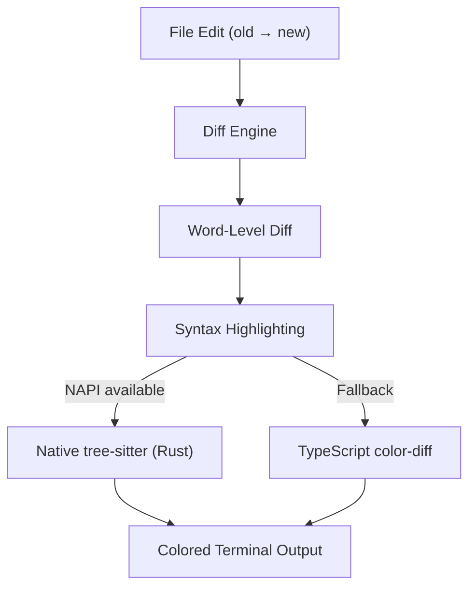

# Diff Rendering

> Word-level diff, syntax highlighting (NAPI + TypeScript fallback), and color coding system.

## Architecture Overview

Claude Code provides rich diff rendering for file edits. The system computes word-level diffs and applies syntax highlighting through a dual-backend approach: native NAPI bindings for performance, with a pure TypeScript fallback.



## Diff Components

### StructuredDiff (`src/components/StructuredDiff/`)

The primary diff rendering component for file edits:

| Component | Purpose |
|-----------|---------|
| `StructuredDiff` | Main diff container with header |
| `DiffHunk` | Individual change hunk |
| `DiffLine` | Single diff line with +/- markers |
| `DiffHeader` | File path, line range, change count |
| `InlineDiff` | Word-level inline highlighting |

### Word-Level Diff (`src/components/diff/`)

Computes differences at word granularity rather than line-level:

- **Added words**: Green background highlighting
- **Removed words**: Red background highlighting (strikethrough)
- **Unchanged words**: Default terminal color
- **Modified words**: Red-to-green transition

### Diff Data Hook (`src/hooks/useDiffData.ts`)

React hook that computes diff data from file edit inputs:

```typescript
function useDiffData(oldContent: string, newContent: string): DiffData {
  // Compute line-level diff
  // Refine to word-level within changed lines
  // Cache results for re-render efficiency
}
```

## Syntax Highlighting

### Dual-Backend Architecture

The syntax highlighting system uses a native-first strategy with graceful degradation:

#### 1. Native NAPI Backend (`src/native-ts/`)

- Uses tree-sitter parsers compiled as Rust NAPI modules
- Supports 50+ languages via grammar definitions
- Extremely fast parsing (milliseconds for large files)
- Loaded at startup if the native binary is available

#### 2. TypeScript Fallback (`src/native-ts/color-diff/`)

- Pure TypeScript implementation for environments without native bindings
- Regex-based syntax highlighting
- Covers common patterns: keywords, strings, comments, numbers
- Slower but universally available

### Language Detection

File extension mapping determines the language for highlighting:

```
.ts/.tsx → TypeScript
.py → Python
.rs → Rust
.go → Go
.js/.jsx → JavaScript
.md → Markdown
... (50+ languages)
```

## Color Coding System

### Diff Colors

| Element | Color | Terminal Code |
|---------|-------|---------------|
| Added line | Green foreground | `\e[32m` |
| Removed line | Red foreground | `\e[31m` |
| Added word (inline) | Green background | `\e[42m` |
| Removed word (inline) | Red background | `\e[41m` |
| Line number | Dim/gray | `\e[2m` |
| File path | Bold cyan | `\e[1;36m` |
| Hunk header | Magenta | `\e[35m` |

### Theme Integration

Colors adapt to the active theme:
- **Dark theme**: Bright colors on dark background
- **Light theme**: Darker colors on light background
- **High contrast**: Maximum contrast variants

### Colorize Utility (`src/ink/colorize.ts`)

General-purpose ANSI colorization:

```typescript
function colorize(text: string, style: Style): string
```

Supports:
- 16 basic colors
- 256 extended colors
- 24-bit true color (RGB)
- Bold, italic, underline, strikethrough, dim
- Background colors

## Diff in IDE (`src/hooks/useDiffInIDE.ts`)

Integration with IDE extensions for diff viewing:

- Sends diff data to connected IDE (VS Code, JetBrains)
- IDE renders diff with native syntax highlighting
- Falls back to terminal rendering when no IDE connected

## Edit Rendering Flow

### FileEditTool Rendering

When `FileEditTool` completes:

1. **Tool Use Message**: Shows file path and operation type
2. **Progress**: Streaming edit application status
3. **Result**: Full diff with syntax highlighting

### Rejected Edit Rendering

When a file edit is permission-denied:
- Shows the proposed diff in red/yellow
- Displays rejection reason
- Allows user to approve via permission update

### Condensed vs Verbose

- **Condensed**: Shows file path + summary ("Changed 3 lines in src/foo.ts")
- **Verbose**: Full diff with word-level highlighting
- **Click-to-expand**: `isResultTruncated()` gates expand affordance

## Turn Diffs (`src/hooks/useTurnDiffs.ts`)

Tracks file changes across an entire conversation turn:

- Records file state before each tool call
- Computes aggregate diff at turn end
- Available via `/diff` command

## Performance Optimizations

### Lazy NAPI Loading

Native syntax highlighting modules are loaded lazily:
- Only loaded when first diff is rendered
- Graceful fallback if loading fails
- No startup cost for sessions without file edits

### Diff Caching

Computed diffs are cached by content hash:
- Avoid recomputation on re-render
- LRU eviction for memory management

### Streaming Diff

For large edits, diffs render progressively:
- Header and first hunk render immediately
- Remaining hunks render as computed

## Key Source Files

| File | Purpose |
|------|---------|
| `src/components/diff/` | Core diff components |
| `src/components/StructuredDiff/` | Enhanced structured diff |
| `src/native-ts/color-diff/` | TypeScript syntax highlighting fallback |
| `src/native-ts/` | Native NAPI bindings (tree-sitter) |
| `src/hooks/useDiffData.ts` | Diff computation hook |
| `src/hooks/useDiffInIDE.ts` | IDE diff integration |
| `src/hooks/useTurnDiffs.ts` | Turn-level diff tracking |
| `src/ink/colorize.ts` | ANSI color utilities |
