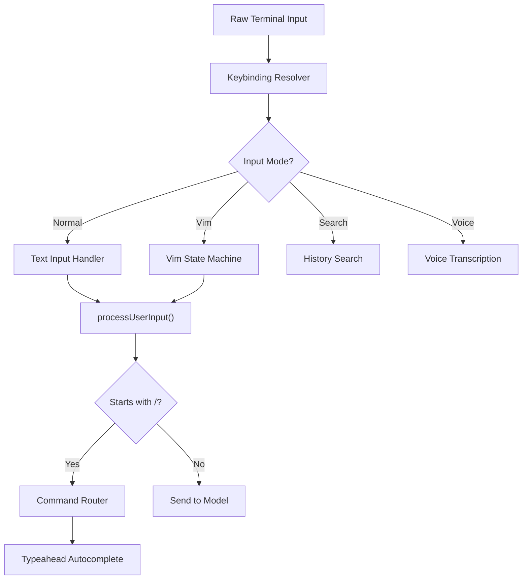

# Prompt Input System — Claude Code CLI

> Consolidated from base analysis + deep verification (2026-04-01, 9.5/10 quality).
> Source: `src/utils/processUserInput/`, `src/utils/suggestions/`, `src/utils/messages/`, `src/utils/ultraplan/`, `src/hooks/` (13 files, ~3,848 LOC, 51 exports)

---

## 1. Architecture Overview

The prompt input system handles all user input in the REPL, from simple text entry to complex multi-modal interactions. It routes through multiple processing stages based on the current input mode.



---

## 2. Input Processing Pipeline (`src/utils/processUserInput/`)

### 2.1 Master Router — processUserInput.ts (606 lines)

**Exported types:**
- `ProcessUserInputContext` — intersection of `ToolUseContext & LocalJSXCommandContext`
- `ProcessUserInputBaseResult` — `{ messages[], shouldQuery, allowedTools?, model?, effort?, resultText?, nextInput?, submitNextInput? }`

**8-Stage Routing Pipeline:**

1. **Early display** — If `mode === 'prompt'` and input is string and not `isMeta`, immediately shows user input via `setUserInputOnProcessing`.

2. **Input normalization** (lines 300-345):
   - String input: extracted directly.
   - Array input (ContentBlockParam[]): each image block resized via `maybeResizeAndDownsampleImageBlock()`, last text block extracted as `inputString`, preceding blocks kept separately.
   - Image metadata texts collected for later `isMeta` message.

3. **Bridge-safe slash command override** (lines 428-453):
   - When `bridgeOrigin` is true and input starts with `/`, parses via `parseSlashCommand()`.
   - If command passes `isBridgeSafeCommand()`, clears the skip flag.
   - If command is known but unsafe, returns error message: "isn't available over Remote Control."
   - Unknown `/foo` falls through to plain text (prevents "Unknown skill" for mobile `/shrug`).

4. **Ultraplan keyword detection** (lines 467-493):
   - Gated on: `feature('ULTRAPLAN')`, `mode === 'prompt'`, interactive session, non-slash input, no existing ultraplan session/launch.
   - Runs `hasUltraplanKeyword()` on `preExpansionInput ?? inputString` (pasted content cannot trigger).
   - Rewrites input via `replaceUltraplanKeyword()`, routes to `/ultraplan <rewritten>` via `processSlashCommand()`.

5. **Attachment extraction** (lines 496-514):
   - Skipped if `skipAttachments`, or if slash command (attachments handled inside slash command processor).
   - Calls `getAttachmentMessages()` for `@file`, IDE selection, etc.

6. **Bash mode** (lines 517-529):
   - If `mode === 'bash'`: dynamic import of `processBashCommand`, delegates.

7. **Slash command** (lines 533-551):
   - If input starts with `/` and not `effectiveSkipSlash`: dynamic import of `processSlashCommand`, delegates.

8. **Regular text prompt** (lines 577-588):
   - Falls through to `processTextPrompt()` with normalized input, image blocks, attachments.

**Post-dispatch hook execution** (lines 178-264):
- After base processing, if `shouldQuery` is true, runs `executeUserPromptSubmitHooks()`.
- Handles: `blockingError` (aborts query), `preventContinuation` (stops with reason), `additionalContexts` (appended as attachment messages), `hook_success` messages.
- Hook output truncated at `MAX_HOOK_OUTPUT_LENGTH = 10000` chars.

### 2.2 Slash Command Processor — processSlashCommand.tsx (921 lines)

**Exported functions:**
- `processSlashCommand()` — main entry, parses `/command args`, validates, dispatches
- `looksLikeCommand(commandName)` — regex check: only `[a-zA-Z0-9:\-_]`
- `formatSkillLoadingMetadata(skillName, progressMessage?)` — XML metadata for skill loading UI
- `processPromptSlashCommand(commandName, args, commands, context, imageContentBlocks?)` — public API for SkillTool

**Dispatch flow:**
1. Parse input via `parseSlashCommand()` — extracts `commandName`, `args`, `isMcp`.
2. If parse fails -> error message "Commands are in the form `/command [args]`".
3. If command not found:
   - If `looksLikeCommand()` and not a file path -> "Unknown skill: X".
   - Otherwise -> treat as regular prompt (user typed `/var/log` etc.).
4. If found -> delegates to `getMessagesForSlashCommand()`.

**Command type dispatch:**

| Command type | Handling |
|---|---|
| `local-jsx` | Loads module, calls `mod.call(onDone, context, args)`, renders JSX. Handles fullscreen dismiss, early-exit guard, dead-promise guard. |
| `local` | Loads module, calls `mod.call(args, context)`. Handles `skip`, `compact` (full context compaction), and `text` result types. |
| `prompt` | If `context === 'fork'` -> `executeForkedSlashCommand()`. Otherwise -> `getMessagesForPromptSlashCommand()`. |

**Forked slash command** (Kairos background mode):
- Creates sub-agent with `runAgent()`, shows progress UI.
- If `feature('KAIROS')` and `kairosEnabled`, runs fire-and-forget — launches sub-agent in background, returns immediately, re-enqueues result as `isMeta` prompt via `enqueuePendingNotification`.
- Waits for MCP servers to settle (polls `pending` clients, 200ms interval, 10s timeout).
- Result wrapped in `<scheduled-task-result>` XML.

### 2.3 Bash Mode Processor — processBashCommand.tsx (139 lines)

**Key behaviors:**
1. **Shell routing**: Checks `isPowerShellToolEnabled()` + `resolveDefaultShell()` — uses PowerShell on Windows if configured, otherwise BashTool.
2. **Sandbox bypass**: User `!` commands run with `dangerouslyDisableSandbox: true`.
3. **Progress UI**: `BashModeProgress` React component shows real-time shell output.
4. **PowerShell lazy-loading**: `require()` only when actually needed (~300KB chunk).
5. **Output processing**: Uses `processToolResultBlock()` for formatting.
6. **Result format**: `<bash-stdout>` and `<bash-stderr>` XML tags wrapping output.

### 2.4 Regular Prompt Handler — processTextPrompt.ts (100 lines)

**Key behaviors:**
1. Generates `promptId` via `randomUUID()`, stores via `setPromptId()`.
2. Starts interaction span for telemetry via `startInteractionSpan()`.
3. Emits `user_prompt` OTel event.
4. Detects negative keywords (`matchesNegativeKeyword`) and keep-going keywords (`matchesKeepGoingKeyword`) — logs analytics.
5. If pasted images present: combines text + image content blocks into single user message.
6. Otherwise: creates simple user message with `permissionMode` and `isMeta` flags.
7. Always returns `shouldQuery: true` — regular prompts always query the model.

---

## 3. Suggestions & Autocomplete System (`src/utils/suggestions/`)

### 3.1 Command Suggestions — commandSuggestions.ts (568 lines)

**Fuse.js fuzzy search configuration:**
- Threshold: 0.3 (strict), location: 0 (prefer start), distance: 100.
- Key weights: `commandName` (3), `partKey` (2, command segments), `aliasKey` (2), `descriptionKey` (0.5).
- Fuse index cached by commands array identity — only rebuilds when commands change.

**Suggestion ranking (when query is empty `/`):**
1. Top 5 recently used skills (by `getSkillUsageScore()`).
2. Built-in commands (local, local-jsx).
3. User settings commands.
4. Project settings commands.
5. Policy settings commands.
6. Other commands.
Each category sorted alphabetically.

**Suggestion ranking (with query):**
Priority: exact name > exact alias > prefix name (shorter wins) > prefix alias (shorter wins) > Fuse score (with usage tiebreaker at 0.1 threshold).

**Hidden command handling:** If a hidden command's exact name is typed, it is prepended to results (handles OAuth expiry, GrowthBook kill-switch edge cases).

**Mid-input slash command detection:** Regex `\s\/([a-zA-Z0-9_:-]*)$` finds `/cmd` after whitespace. Avoids lookbehind for JSC YARR JIT performance.

### 3.2 Directory Completion — directoryCompletion.ts (264 lines)

**Caching:** Two LRU caches (`lru-cache`), each max 500 entries, 5-minute TTL. Separate caches for directory-only and file+directory scans. Results capped at 100 entries per scan, 10 per suggestion list.

**Path handling:** Uses `expandPath()` for `~` expansion. Handles both forward slash and platform `sep` for Windows compatibility. Strips leading `./` from display.

### 3.3 Shell History Completion — shellHistoryCompletion.ts (119 lines)

- Reads from `getHistory()` iterator, filters entries starting with `!` prefix.
- Caches up to 50 most recent unique commands, 60-second TTL.
- Returns first exact prefix match as `{ fullCommand, suffix }` for ghost text.
- Minimum input length: 2 characters.

### 3.4 Skill Usage Tracking — skillUsageTracking.ts (55 lines)

**Scoring algorithm:**
```
score = usageCount * max(0.5^(daysSinceUse / 7), 0.1)
```
- Half-life: 7 days (usage from 7 days ago = half value of today).
- Floor factor: 0.1 (heavily used old skills never fully disappear).
- Debounce: 60s per skill to avoid lock + file I/O on rapid invocations.
- Persisted in global config via `saveGlobalConfig()`.

### 3.5 Slack Channel Suggestions — slackChannelSuggestions.ts (210 lines)

- Calls `slack_search_channels` MCP tool with 5-second timeout.
- Slack tokenizes on hyphens — `mcpQueryFor()` strips trailing partial segment to avoid 0-result queries.
- **Cache strategy:** Plain Map (not LRU) — needs prefix iteration for reuse. Max 50 entries.
- `knownChannels` Set tracks all ever-seen channels for highlighting gating.
- In-flight dedup: single `inflightPromise` per `mcpQuery`.

---

## 4. Text Input (`src/hooks/useTextInput.ts`)

### 4.1 Multi-line Editing

Supports full multi-line text editing:
- Enter with Shift creates newline
- Enter without Shift submits
- Arrow keys navigate within text
- Home/End for line start/end

### 4.2 Input Buffer (`src/hooks/useInputBuffer.ts`)

Manages the mutable input state:
- Cursor position tracking
- Selection state
- Undo/redo stack
- Text manipulation methods (insert, delete, replace)

### 4.3 Clipboard Integration

- **Copy**: Selected text to system clipboard
- **Paste**: System clipboard content insertion
- **Image paste**: Base64-encoded images via `ctrl+v` / `alt+v` (Windows)
- **Paste handler** (`src/hooks/usePasteHandler.ts`): Detects and handles multi-line pastes

---

## 5. Vim Mode (`src/hooks/useVimInput.ts`)

Full vim emulation using the state machine defined in `src/vim/types.ts`:

### 5.1 State Machine

```
INSERT mode -> tracks insertedText for dot-repeat
NORMAL mode -> CommandState machine:
  idle -> [d/c/y] -> operator
       -> [1-9] -> count
       -> [fFtT] -> find
       -> [g] -> g-prefix
       -> [r] -> replace
       -> [><] -> indent
```

### 5.2 Operators

| Operator | Key | Action |
|----------|-----|--------|
| delete | `d` | Delete with motion |
| change | `c` | Delete and enter insert |
| yank | `y` | Copy with motion |

### 5.3 Motions (`src/vim/motions.ts`)

Word motions (`w`, `b`, `e`, `W`, `B`, `E`), line motions (`0`, `$`, `^`), find motions (`f`, `F`, `t`, `T`), and more.

### 5.4 Text Objects (`src/vim/textObjects.ts`)

`iw`, `aw`, `i"`, `a"`, `i(`, `a(`, etc. — inner and around variants for words, quotes, brackets.

### 5.5 Dot Repeat

Tracks the last change command (operator + motion + inserted text) for `.` repeat.

---

## 6. History System

### 6.1 Arrow Key History (`src/hooks/useArrowKeyHistory.tsx`)

Up/Down arrow navigation through previous inputs:
- Prefix-filtered (typing "git" then Up shows only git commands)
- Session-scoped and persistent history

### 6.2 History Search (`src/hooks/useHistorySearch.ts`)

Reverse incremental search (`Ctrl+R`):
- Fuzzy matching against history entries
- Real-time results as user types
- Enter to select, Escape to cancel

---

## 7. Autocomplete System (Hooks)

### 7.1 Typeahead (`src/hooks/useTypeahead.tsx`)

Multi-source autocomplete:

| Source | Trigger | Example |
|--------|---------|---------|
| Slash commands | `/` prefix | `/compact`, `/help` |
| File paths | `@` prefix or tab | `@src/Tool.ts` |
| Agent names | In agent context | `researcher`, `coder` |
| Skill names | `/` with skill prefix | `/commit`, `/review` |

### 7.2 File Suggestions (`src/hooks/fileSuggestions.ts`)

Intelligent file path completion:
- Git-aware (respects .gitignore)
- Fuzzy matching
- Most-recently-used ordering
- Directory traversal

### 7.3 Unified Suggestions (`src/hooks/unifiedSuggestions.ts`)

Merges suggestions from multiple sources into a ranked list.

### 7.4 Prompt Suggestions (`src/hooks/usePromptSuggestion.ts`)

AI-generated prompt suggestions:
- Context-aware recommendations
- Displayed below input area
- Tab to accept suggestion

---

## 8. Message Mapping Utilities (`src/utils/messages/`)

### 8.1 SDK/Internal Message Conversion — mappers.ts (291 lines)

| Function | Purpose |
|---|---|
| `toInternalMessages(sdkMessages)` | SDK -> internal `Message[]` |
| `toSDKMessages(messages)` | Internal -> `SDKMessage[]` |
| `toSDKCompactMetadata(meta)` | Internal -> SDK compact metadata |
| `fromSDKCompactMetadata(meta)` | SDK -> internal compact metadata |
| `localCommandOutputToSDKAssistantMessage(rawContent, uuid)` | Converts local command output for SDK consumers |
| `toSDKRateLimitInfo(limits)` | Internal -> SDK rate limit info |

**Key conversions:**
- **SDK -> Internal**: `assistant` maps directly; `user` gets `isMeta` from `isSynthetic`; `system/compact_boundary` maps compact metadata (camelCase <-> snake_case); other system types dropped.
- **Internal -> SDK**: Adds `session_id` to all messages. `user` messages carry `tool_use_result` in protobuf catchall for web viewers.
- **Local command output**: Strips ANSI codes (chalk.dim), unwraps XML tags, creates synthetic assistant message.
- **Rate limit mapping**: Strips internal-only fields like `unifiedRateLimitFallbackAvailable`.

### 8.2 System Init Message Builder — systemInit.ts (97 lines)

`buildSystemInitMessage(inputs)` builds `system/init` SDKMessage containing: `cwd`, `session_id`, `tools`, `mcp_servers`, `model`, `permissionMode`, `slash_commands`, `apiKeySource`, `betas`, `claude_code_version`, `output_style`, `agents`, `skills`, `plugins`, `fast_mode_state`.

Called from two paths: QueryEngine (spawn-bridge/print-mode/SDK) and useReplBridge (REPL Remote Control on connect).

---

## 9. Ultraplan Utilities (`src/utils/ultraplan/`)

### 9.1 Keyword Detection — keyword.ts (128 lines)

**Detection algorithm:**
1. **Fast exit**: regex test for keyword, return empty if absent or input starts with `/`.
2. **Quoted range exclusion** — builds `quotedRanges[]` scanning for paired delimiters (backticks, double quotes, angle brackets, curly braces, square brackets, parentheses, smart single quotes with apostrophe exclusion).
3. **Word boundary matching** — `\b{keyword}\b` global regex, then filters out: positions inside quoted ranges, path/identifier context (`/`, `\`, `-`), file extension context (`.` + word char), question context (`?`).
4. **Result**: Array of `{ word, start, end }`.

**Replacement**: `replaceUltraplanKeyword()` replaces first trigger with `word.slice('ultra'.length)` — e.g., "ultraplan" -> "plan", "UltraPlan" -> "Plan".

### 9.2 CCR Session Polling — ccrSession.ts (350 lines)

- `ExitPlanModeScanner` — pure stateful classifier for CCR event stream. Tracks `exitPlanCalls[]`, `results` Map, `rejectedIds` Set. Precedence: approved > terminated > rejected > pending > unchanged.
- `pollForApprovedExitPlanMode()` — 3-second interval, configurable timeout, max 5 consecutive network failures.
- Phase transitions: `running` -> `needs_input` (idle session) -> `plan_ready` (pending ExitPlanMode).
- Plan extraction: scrapes after `## Approved Plan:` or `## Approved Plan (edited by user):` marker.

---

## 10. Special Input Handling

### 10.1 Image Paste (`src/hooks/useClipboardImageHint.ts`)

Detects and handles image paste events:
- Converts clipboard images to Base64
- Attaches as image content blocks
- Platform-specific key binding (Alt+V on Windows, Ctrl+V elsewhere)

### 10.2 IDE At-Mentions (`src/hooks/useIdeAtMentioned.ts`)

When connected to an IDE extension:
- IDE sends file/selection references
- Appear as `@file:line` mentions in input
- Auto-expanded to file content

### 10.3 Chrome Extension (`src/hooks/usePromptsFromClaudeInChrome.tsx`)

Receives prompts from the Chrome extension for desktop handoff scenarios.

---

## 11. Dynamic Import Pattern

All three sub-processors use dynamic `import()` for lazy loading:
- `processBashCommand` — only in bash mode
- `processSlashCommand` — only when input starts with `/` or ultraplan triggers
- PowerShellTool — `require()` only when PowerShell is default shell (~300KB savings)

---

## 12. Feature Flags

| Flag | Controls |
|---|---|
| `ULTRAPLAN` | Ultraplan keyword detection and routing |
| `KAIROS` | Background fire-and-forget mode for forked slash commands |
| `UDS_INBOX` | UDS messaging socket path in system init |

---

## 13. Analytics Events

| Event | Location | Purpose |
|---|---|---|
| `tengu_ultraplan_keyword` | processUserInput.ts | Ultraplan keyword detected |
| `tengu_input_prompt` | processTextPrompt.ts | Regular prompt submitted |
| `tengu_input_bash` | processBashCommand.tsx | Bash command executed |
| `tengu_input_command` | processSlashCommand.tsx | Valid slash command executed |
| `tengu_input_slash_invalid` | processSlashCommand.tsx | Unknown slash command |
| `tengu_input_slash_missing` | processSlashCommand.tsx | Malformed slash syntax |
| `tengu_slash_command_forked` | processSlashCommand.tsx | Forked sub-agent launched |
| `tengu_subagent_at_mention` | processUserInput.ts | @agent-X mention used |
| `tengu_pasted_image_resize_attempt` | processUserInput.ts | Image resize attempt |

---

## 14. Key Source Files

| File | Lines | Purpose |
|------|-------|---------|
| `src/utils/processUserInput/processUserInput.ts` | 606 | Master input router |
| `src/utils/processUserInput/processSlashCommand.tsx` | 921 | Slash command processor |
| `src/utils/processUserInput/processBashCommand.tsx` | 139 | Bash mode processor |
| `src/utils/processUserInput/processTextPrompt.ts` | 100 | Regular prompt handler |
| `src/utils/suggestions/commandSuggestions.ts` | 568 | Fuse.js slash command search |
| `src/utils/suggestions/directoryCompletion.ts` | 264 | Path autocomplete |
| `src/utils/suggestions/shellHistoryCompletion.ts` | 119 | Shell history ghost text |
| `src/utils/suggestions/skillUsageTracking.ts` | 55 | Skill ranking by recency/frequency |
| `src/utils/suggestions/slackChannelSuggestions.ts` | 210 | Slack channel autocomplete |
| `src/utils/messages/mappers.ts` | 291 | SDK/Internal message conversion |
| `src/utils/messages/systemInit.ts` | 97 | System init message builder |
| `src/utils/ultraplan/keyword.ts` | 128 | Ultraplan keyword detection |
| `src/utils/ultraplan/ccrSession.ts` | 350 | CCR session polling |
| `src/hooks/useTextInput.ts` | - | Core text input handling |
| `src/hooks/useVimInput.ts` | - | Vim mode integration |
| `src/hooks/useTypeahead.tsx` | - | Autocomplete system |
| `src/vim/` | - | Vim state machine |
