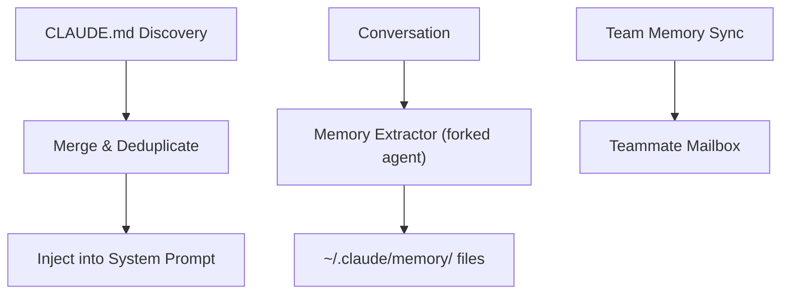

# Memory System

> CLAUDE.md files, auto-extraction via forked agent, session memory, and team memory sync.

## Architecture Overview

The memory system provides persistent context across sessions through CLAUDE.md files and automatic memory extraction. It operates at multiple levels: global, project, directory, and session.



## CLAUDE.md Discovery (`src/utils/claudemd.ts`)

### Discovery Hierarchy

CLAUDE.md files are discovered from multiple locations in priority order:

| Level | Path | Scope |
|-------|------|-------|
| Global (user) | `~/.claude/CLAUDE.md` | All projects |
| Project | `.claude/CLAUDE.md` (at repo root) | Current project |
| Project (alt) | `CLAUDE.md` (at repo root) | Current project |
| Directory | `CLAUDE.md` in parent directories | Directory-specific |
| Additional dirs | `--add-dir` specified paths | Explicit additions |

### Discovery Process

1. Walk up from cwd to home directory
2. Check each directory for `CLAUDE.md` and `.claude/CLAUDE.md`
3. Respect `.gitignore` patterns
4. Filter by `filterInjectedMemoryFiles()` for deduplication
5. Merge into single context string via `getClaudeMds()`

### Caching

- `getUserContext()` in `src/context.ts` memoizes CLAUDE.md content
- `setCachedClaudeMdContent()` caches for the auto-mode classifier
- `--bare` mode skips auto-discovery (but honors `--add-dir`)
- `CLAUDE_CODE_DISABLE_CLAUDE_MDS` env var disables completely

## Memory Directory (`src/memdir/`)

### Structure

```
~/.claude/memory/
├── project_v8_analysis.md
├── feedback_windows_process_management.md
├── project_git_worktrees.md
└── ... (auto-extracted memories)
```

### Memory File Format

Each memory file is a markdown document with metadata:

```markdown
# Topic Name

Content about what was learned...
```

### MEMORY.md Index

`~/.claude/memory/MEMORY.md` serves as an index:

```markdown
# Memory Index

## Project
- [project_v8_analysis.md](project_v8_analysis.md) — V8 codebase analysis

## Feedback
- [feedback_debugging_approach.md](feedback_debugging_approach.md) — Verify process first
```

## Auto-Extraction (`src/services/extractMemories/`)

### Forked Agent Extraction

Memory extraction runs as a forked sub-agent at session end:

1. Session conversation is analyzed
2. Key learnings, preferences, and corrections are identified
3. New memory files are created or existing ones updated
4. MEMORY.md index is updated

### Extraction Triggers

| Trigger | When |
|---------|------|
| Session end | Automatic extraction on graceful session close |
| `/memory` command | Manual trigger by user |
| Significant correction | When user corrects Claude's behavior |

### Extraction Categories

| Category | What's Extracted |
|----------|-----------------|
| Project knowledge | Architecture, conventions, patterns |
| User preferences | Communication style, workflow choices |
| Feedback | Corrections, "don't do X" instructions |
| Technical facts | Environment details, dependencies |

## Memory Utilities (`src/utils/memory/`)

### Memory File Operations

- **Read**: Load memory files for injection
- **Write**: Create/update memory files atomically
- **Delete**: Remove outdated memories
- **Search**: Find relevant memories by topic

### Memory Injection

Memory files are injected into the system prompt as attachments:

```typescript
type AttachmentMessage = {
  type: 'nested_memory'
  path: string
  content: string
}
```

### Deduplication

`loadedNestedMemoryPaths` tracks already-injected paths to prevent duplicate injection. This is separate from `readFileState` (which is an LRU that can evict entries).

## Session Memory

### Session-Scoped State

Within a session, memory is maintained through:

1. **Message history**: Full conversation transcript
2. **File state cache** (`FileStateCache`): Read file contents cache
3. **Tool decisions**: Previous permission decisions
4. **Denial tracking**: Consecutive denial counter

### Session Persistence

Sessions can be resumed, preserving:
- Conversation messages
- Session ID and metadata
- Cost tracking state
- Active task state

### Automatic Session Notes (`services/SessionMemory/`)

The `SessionMemory` service automatically maintains a structured markdown file (`session-memory.md`) with notes about the current conversation. Runs periodically in the background using a forked subagent.

**Source**: `src/services/SessionMemory/` (3 files: `sessionMemory.ts` ~496 LOC, `prompts.ts` ~325 LOC, `sessionMemoryUtils.ts` ~208 LOC)

**9 Structured Sections**:
1. Session Title (5-10 word descriptive)
2. Current State (active work, pending tasks)
3. Task specification (what user asked)
4. Files and Functions (important files)
5. Workflow (bash commands, order)
6. Errors & Corrections (fixes, failed approaches)
7. Codebase and System Documentation (system components)
8. Learnings (what worked/didn't)
9. Key results (exact output)
10. Worklog (step-by-step terse summary)

**Trigger Thresholds** (dual-threshold logic):
- **Token threshold** (`minimumTokensBetweenUpdate`, default 5000): Measures context window growth since last extraction. Always required.
- **Tool calls threshold** (`toolCallsBetweenUpdates`, default 3): Counts tool calls since last extraction.
- **Initialization threshold** (`minimumMessageTokensToInit`, default 10000): Must be met before first extraction.
- Extraction triggers when: (both thresholds met) OR (token threshold met AND no tool calls in last turn — natural conversation break).

**Execution Model**:
- Wrapped in `sequential()` to prevent concurrent runs
- Only fires on `repl_main_thread`
- Uses `runForkedAgent()` with isolated context (`createSubagentContext`)
- Only allows `FILE_EDIT_TOOL_NAME` on the exact memory path
- `/summary` command bypasses threshold checks for manual extraction

**Key Design Decisions**:
- **Token-gated, not time-gated**: Extraction frequency tied to context window growth, not wall clock
- **Compaction integration**: Session memory feeds into auto-compact. If auto-compact disabled, session memory is also disabled
- **Remote-configurable**: Thresholds configurable via GrowthBook `tengu_sm_config` dynamic config
- **Structure preservation**: Prompt instructs subagent to never modify section headers or italic descriptions
- **Customizable**: Template, prompt, and config all loadable from `~/.claude/session-memory/config/`

**Integration Points**:
- `isAutoCompactEnabled()` gates initialization
- GrowthBook `tengu_session_memory` gate + `tengu_sm_config` dynamic config
- `waitForSessionMemoryExtraction()` — polls with 1s interval, 15s timeout for compaction to wait

## Team Memory Sync

### Mailbox-Based Sharing

In multi-agent teams, memory is shared via the mailbox system:

```
Agent A → writes to shared memory → Mailbox
Agent B → reads from mailbox → incorporates into context
```

### Nested Memory Triggers

`nestedMemoryAttachmentTriggers` in `ToolUseContext` tracks which memory files should be attached based on:
- File patterns matching active work
- Explicit memory references in conversation
- Team-shared memory paths

### Dynamic Skill Discovery

`dynamicSkillDirTriggers` discovers new skills during file operations, making them available mid-session.

## Memory Commands

### `/memory` Command

User-facing command for memory management:

- View current memory files
- Manually trigger extraction
- Edit memory entries
- Clear specific memories

### `/init` Command

Creates initial CLAUDE.md for a project:
- Analyzes project structure
- Generates recommended instructions
- Creates `.claude/CLAUDE.md`

## Context Budget Management

### Content Replacement State

`ContentReplacementState` in `ToolUseContext` manages the aggregate tool result budget:

- Tracks total content size across all tool results
- Replaces old results with file references when budget exceeded
- Main thread provisions once (never resets)
- Subagents clone parent state

### Memory Token Budget

CLAUDE.md content counts against the system prompt token budget:
- Large CLAUDE.md files are truncated with guidance
- Token estimation via `roughTokenCountEstimation()`
- Skill frontmatter tokens estimated separately

## Key Source Files

| File | Purpose |
|------|---------|
| `src/utils/claudemd.ts` | CLAUDE.md discovery and merging |
| `src/memdir/` | Memory directory management |
| `src/services/extractMemories/` | Auto-extraction service |
| `src/utils/memory/` | Memory file utilities |
| `src/context.ts` | Context injection (getUserContext) |
| `src/commands/memory/` | Memory management command |
| `src/commands/init.ts` | Project CLAUDE.md initialization |
