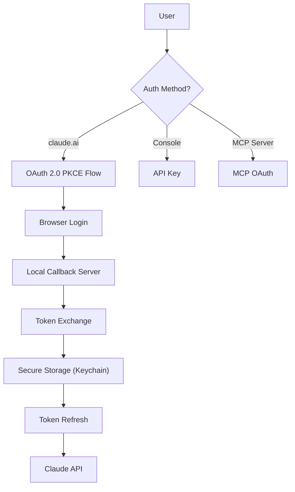

# OAuth & Authentication

> OAuth 2.0 PKCE flow, token management, secure storage, and provider authentication.

## Architecture Overview

Claude Code supports multiple authentication methods: OAuth 2.0 with PKCE for claude.ai subscribers, API keys for Console users, and OAuth for MCP servers. Token management uses platform-native secure storage.



## OAuth 2.0 PKCE Flow (`src/services/oauth/`)

### Flow Implementation

1. **Crypto Setup** (`crypto.ts`): Generate PKCE code verifier and challenge
2. **Auth URL**: Construct authorization URL with PKCE challenge
3. **Local Server** (`auth-code-listener.ts`): Start local HTTP server for callback
4. **Browser Launch**: Open authorization URL in user's browser
5. **Code Capture**: Receive authorization code on callback
6. **Token Exchange**: Exchange code for access + refresh tokens
7. **Storage**: Store tokens in secure storage

### OAuth Client (`src/services/oauth/client.ts`)

Core OAuth operations:

```typescript
// Token management
populateOAuthAccountInfoIfNeeded()
checkAndRefreshOAuthTokenIfNeeded()
getClaudeAIOAuthTokens()
handleOAuth401Error()
```

### Auth Code Listener (`src/services/oauth/auth-code-listener.ts`)

Local HTTP server on configurable port that:
- Listens for OAuth callback redirects
- Extracts authorization code from URL params
- Returns success page to browser
- Shuts down after receiving code

### Profile Retrieval (`src/services/oauth/getOauthProfile.ts`)

After authentication, retrieves user profile:
- Account type (Pro/Max/Team/Enterprise)
- Organization info
- Subscription status

## Secure Storage (`src/utils/secureStorage/`)

### Platform-Native Storage

| Platform | Backend |
|----------|---------|
| macOS | Keychain (via `security` CLI) |
| Linux | Secret Service API / `pass` |
| Windows | Credential Manager |

### Stored Secrets

| Key | Content |
|-----|---------|
| OAuth access token | Short-lived API token |
| OAuth refresh token | Long-lived refresh token |
| MCP OAuth tokens | Per-server OAuth tokens |
| API keys | User-provided API keys |

### Security Properties

- Tokens never written to disk in plaintext
- Keychain/credential manager provides OS-level encryption
- Automatic token rotation on refresh
- Secure deletion on logout

## Token Management

### Refresh Flow

```typescript
async function checkAndRefreshOAuthTokenIfNeeded(): Promise<void> {
  // 1. Check token expiry
  // 2. If expired, use refresh token
  // 3. Store new tokens
  // 4. Handle refresh failure (re-login)
}
```

### 401 Error Handling

```typescript
async function handleOAuth401Error(): Promise<void> {
  // 1. Attempt token refresh
  // 2. If refresh fails, prompt re-login
  // 3. Clear invalid tokens
}
```

## Authentication Modes

### Claude.ai OAuth

For Pro/Max/Team/Enterprise subscribers:
- OAuth 2.0 PKCE flow
- Managed by Anthropic's auth service
- Includes rate limits and usage tracking
- Supports organization-level features

### Console API Key

For direct API users:
- User provides `ANTHROPIC_API_KEY`
- Key stored in environment or config
- No OAuth flow needed
- Direct API access

### Third-Party Providers

For Bedrock/Vertex/Foundry users:
- Provider-specific authentication
- `isUsing3PServices()` detection
- Different base URLs and auth headers

## Auth Utilities (`src/utils/auth.ts`)

### Auth State Detection

```typescript
isUsing3PServices()              // Bedrock/Vertex/Foundry
isClaudeAISubscriber()           // Claude.ai OAuth user
isFirstPartyAnthropicBaseUrl()   // Direct Anthropic API
```

### Provider Detection

```typescript
// Provider hierarchy (from src/utils/model/providers.ts)
isFirstPartyAnthropicBaseUrl()   // api.anthropic.com
// vs third-party (Bedrock, Vertex, Foundry)
```

## MCP OAuth (`src/services/mcp/auth.ts`)

### Per-Server OAuth

Each MCP server can require its own OAuth flow:

```json
{
  "mcpServers": {
    "my-server": {
      "type": "sse",
      "url": "https://server.example.com",
      "oauth": {
        "clientId": "...",
        "callbackPort": 8765,
        "authServerMetadataUrl": "https://auth.example.com/.well-known/..."
      }
    }
  }
}
```

### McpAuthTool

Dynamically created per MCP server:
- Triggers when server returns auth error
- Opens OAuth flow for that specific server
- Stores tokens per-server in secure storage

### Cross-App Access (XAA)

`src/services/mcp/xaa.ts`:
- SEP-990 implementation
- Identity Provider (IdP) login flow
- Shared IdP config across XAA-enabled servers

## OAuth Configuration (`src/constants/oauth.ts`)

```typescript
function getOauthConfig(): OAuthConfig {
  // Client ID, redirect URI, auth endpoints
  // Environment-specific overrides
}
```

## Login/Logout Commands

### `/login`

1. Detect current auth state
2. Start OAuth PKCE flow
3. Wait for browser callback
4. Store tokens
5. Verify access

### `/logout`

1. Clear stored tokens
2. Revoke tokens at server (best effort)
3. Reset auth state
4. Clear cached contexts

## Session Ingress Auth

For remote/bridge sessions:
- `getSessionIngressAuthToken()` provides session-level auth
- JWT-based session tokens (`src/bridge/jwtUtils.ts`)
- Trusted device validation (`src/bridge/trustedDevice.ts`)

## Key Source Files

| File | Purpose |
|------|---------|
| `src/services/oauth/client.ts` | Core OAuth client |
| `src/services/oauth/crypto.ts` | PKCE crypto utilities |
| `src/services/oauth/auth-code-listener.ts` | Local callback server |
| `src/services/oauth/index.ts` | OAuth orchestration |
| `src/utils/secureStorage/` | Platform-native secure storage |
| `src/utils/auth.ts` | Auth state detection |
| `src/services/mcp/auth.ts` | MCP server OAuth |
| `src/services/mcp/xaa.ts` | Cross-App Access |
| `src/commands/login/` | Login command |
| `src/commands/logout/` | Logout command |
