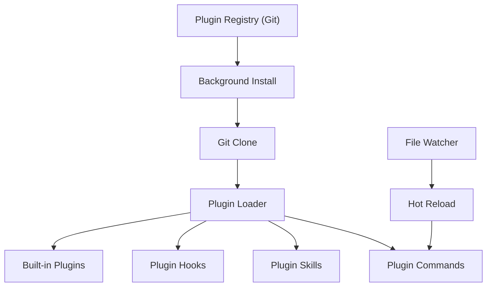

# Plugin System

> Git-based marketplaces, background installation, plugin loading, and hot reload.

## Architecture Overview

The plugin system extends Claude Code with third-party capabilities via git-based packages. Plugins provide commands, skills, hooks, and tools that integrate seamlessly with the core system.



## Plugin Architecture

### Plugin Manifest (`src/types/plugin.ts`)

Each plugin declares its capabilities via a manifest:

```typescript
type PluginManifest = {
  name: string
  description: string
  version?: string
  // ... additional metadata
}
```

### Plugin Sources

| Source | Description |
|--------|-------------|
| Git repository | Third-party plugins from GitHub/GitLab |
| Built-in | Bundled with Claude Code (`src/plugins/bundled/`) |
| Official marketplace | Curated plugin registry |

## Installation

### Background Installation

Plugins install in the background without blocking the session:

1. **Git clone**: Repository cloned to plugin cache directory
2. **Dependency resolution**: `npm install` if needed
3. **Manifest validation**: Plugin manifest parsed and verified
4. **Registration**: Commands/skills registered in AppState

### Plugin Storage

```
~/.claude/plugins/
├── plugin-name/
│   ├── manifest.json
│   ├── skills/
│   ├── hooks/
│   └── ...
```

### `/plugin` Command

User-facing plugin management:

```
/plugin install <repo-url>    # Install from git
/plugin remove <name>         # Remove plugin
/plugin list                  # List installed plugins
/plugin enable/disable        # Toggle plugins
```

## Plugin Loading (`src/utils/plugins/loadPluginCommands.ts`)

### Command Loading

`getPluginCommands()` discovers and loads plugin-provided commands:

- Scans plugin directories for command definitions
- Wraps in `Command` interface with `source: 'plugin'`
- Includes `pluginInfo` metadata for attribution
- Caches results (cleared via `clearPluginCommandCache()`)

### Skill Loading

`getPluginSkills()` discovers plugin-provided skills:

- Scans for markdown files with skill frontmatter
- Maps to `PromptCommand` type with `loadedFrom: 'plugin'`
- Cached separately (cleared via `clearPluginSkillsCache()`)

### Hot Reload

`/reload-plugins` command or automatic file watching:

1. Clear all plugin caches
2. Re-scan plugin directories
3. Re-register commands and skills
4. Clear memoized command lists

## Built-in Plugins (`src/plugins/builtinPlugins.ts`)

### Architecture

Built-in plugins are bundled with Claude Code and always available:

```typescript
function getBuiltinPluginSkillCommands(): Command[] {
  // Returns skills from enabled built-in plugins
}
```

### Bundled Plugins (`src/plugins/bundled/`)

Pre-packaged plugin content that ships with the CLI binary.

## Plugin Integration Points

### Commands

Plugins can provide any `Command` type:
- `prompt`: Expand to model prompts
- `local`: Execute locally
- `local-jsx`: Render Ink UI

### Skills

Plugin skills are markdown files with frontmatter:

```yaml
---
description: "What this skill does"
whenToUse: "When to invoke this skill"
hooks:
  PreToolUse:
    - matcher: "Bash"
      command: "validate.sh"
---

# Skill Content

Instructions for the model...
```

### Hooks

Plugins register hooks via their skill frontmatter:
- `PreToolUse`: Intercept tool calls
- `PostToolUse`: React to tool results
- `SessionStart`: Initialize on session start
- Other hook events

### Recommendation System

`src/hooks/usePluginRecommendationBase.tsx` recommends plugins:
- Based on detected project type
- Based on tool usage patterns
- Via `maybeRecordPluginHint()` in tool execution

## Official Marketplace

### Marketplace Notification (`src/hooks/useOfficialMarketplaceNotification.tsx`)

Notifies users of available official marketplace plugins.

### Managed Plugins

Enterprise-managed plugins can be deployed via:
- `policySettings` source
- Managed settings infrastructure
- `isRestrictedToPluginOnly()` for policy enforcement

## Plugin Telemetry (`src/utils/telemetry/pluginTelemetry.ts`)

Tracks plugin-related events:
- Installation/removal
- Command invocations
- Error rates
- Usage patterns

## Plugin Security

### Isolation

Plugins run within the existing permission system:
- Plugin hooks go through the same approval flow
- Plugin commands respect permission mode
- No additional privileges beyond what the user grants

### Source Verification

- Git-based distribution with commit hashes
- Manifest validation on install
- Version tracking for updates

## Key Source Files

| File | Purpose |
|------|---------|
| `src/plugins/builtinPlugins.ts` | Built-in plugin management |
| `src/plugins/bundled/` | Bundled plugin content |
| `src/utils/plugins/loadPluginCommands.ts` | Plugin command/skill loading |
| `src/hooks/useManagePlugins.ts` | Plugin management hook |
| `src/commands/plugin/` | Plugin management command |
| `src/commands/reload-plugins/` | Reload command |
| `src/utils/telemetry/pluginTelemetry.ts` | Plugin analytics |
| `src/hooks/usePluginRecommendationBase.tsx` | Recommendation engine |
