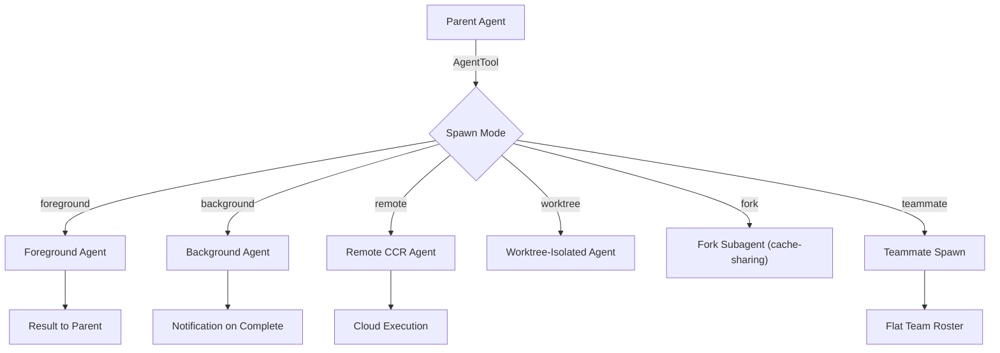

# Agent Delegation

> **Consolidated from lifecycle deep analysis** — Includes complete 6-way routing decision tree, runAgent cleanup checklist, foreground-background race mechanics, and InProcessTeammate isolation model. Verified against AgentTool.tsx, runAgent.ts, LocalAgentTask.tsx, InProcessTeammateTask/, DreamTask.ts.

> AgentTool spawning, 6-way routing, built-in agent types, fork subagent, SendMessage routing, runAgent lifecycle, and agent cleanup.

## Architecture Overview

The agent delegation system allows Claude to spawn sub-agents that run independently with their own conversation context, tools, and permission boundaries.



## AgentTool (`src/tools/AgentTool/AgentTool.tsx`)

### Input Schema

Base schema (always available):

```typescript
const baseInputSchema = z.object({
  description: z.string(),          // 3-5 word task summary
  prompt: z.string(),               // Full task prompt
  subagent_type: z.string().optional(),
  model: z.enum(['sonnet', 'opus', 'haiku']).optional(),
  run_in_background: z.boolean().optional(),
})
```

Extended with multi-agent fields when swarms enabled:

```typescript
fullInputSchema = baseInputSchema.merge(z.object({
  name: z.string().optional(),       // Addressable via SendMessage
  team_name: z.string().optional(),
  mode: permissionModeSchema().optional(),
  isolation: z.enum(['worktree', 'remote']).optional(),
  cwd: z.string().optional(),
}))
```

---

## 6-Way Routing Decision Tree

When `AgentTool.call()` is invoked, the following decision tree determines how the agent is launched:

```
AgentTool.call(prompt, subagent_type, run_in_background, name, team_name, isolation, cwd, model)
|
+--[1] TEAMMATE SPAWN (teamName && name)
|     Condition: team_name resolves to a team AND name is provided
|     Guard: teammates cannot spawn nested teammates (flat roster)
|     Guard: in-process teammates cannot spawn background agents
|     Action: spawnTeammate() -> returns {status: 'teammate_spawned'}
|
+--[2] FORK SUBAGENT (isForkSubagentEnabled() && subagent_type omitted)
|     Condition: fork gate ON, no explicit subagent_type
|     Guard: recursive fork rejected (querySource check + message scan)
|     Action: selectedAgent = FORK_AGENT, inherits parent system prompt
|     Messages: buildForkedMessages() clones parent's full assistant msg
|
+--[3] REMOTE ISOLATION (effectiveIsolation === 'remote', ant-only)
|     Condition: isolation='remote' OR agent def has isolation='remote'
|     Guard: dead-code-eliminated for external builds ("external" === 'ant')
|     Action: teleportToRemote() -> registerRemoteAgentTask()
|     Returns: {status: 'remote_launched', sessionUrl, taskId}
|
+--[4] ASYNC BACKGROUND AGENT (shouldRunAsync === true)
|     Condition: run_in_background=true OR agent.background=true
|              OR isCoordinator OR forceAsync(fork gate)
|              OR assistantForceAsync(KAIROS) OR proactiveActive
|              AND NOT isBackgroundTasksDisabled
|     Action: registerAsyncAgent() -> void runAsyncAgentLifecycle()
|     Returns: {status: 'async_launched', agentId, outputFile}
|     Fire-and-forget: async closure detached with `void`
|
+--[5] SYNC FOREGROUND AGENT (default path, !shouldRunAsync)
|     Action: registerAgentForeground() -> race loop (message vs background signal)
|     Can transition to [6] mid-execution
|     Returns: {status: 'completed', result content}
|
+--[6] FOREGROUND-TO-BACKGROUND TRANSITION (race won by backgroundSignal)
      Trigger: user Ctrl+B OR autoBackgroundMs timer (120s default)
      Action: agentIterator.return() -> re-spawn via runAgent(isAsync=true)
      Progress: existing messages replayed into new tracker
      Returns: {status: 'async_launched'} to unblock parent
```

### Routing Priority
- Teammate spawn is checked FIRST (before any agent resolution)
- Fork path is checked SECOND (before normal agent lookup)
- Remote isolation is checked THIRD (ant-only gate)
- Async/sync decision is made LAST after agent is fully resolved

### Key Guards
| Guard | Location | Effect |
|-------|----------|--------|
| Nested teammate prevention | call() L273 | Error if isTeammate() && name provided |
| In-process background ban | call() L278 | Error if isInProcessTeammate() && background |
| Recursive fork guard | call() L332 | Error if already inside fork child |
| MCP server requirement | call() L371-408 | Waits up to 30s for pending MCP, then errors |
| Permission deny rules | call() L342-353 | Filters agents by permission context |

---

## runAgent() Async Generator Lifecycle

### Startup Phase
```
runAgent() called
|
+-- Resolve model: getAgentModel(agentDef.model, mainLoopModel, override, permissionMode)
+-- Assign agentId (override.agentId or createAgentId())
+-- Register in Perfetto trace (if enabled)
+-- Build context messages:
|   +-- Fork path: filterIncompleteToolCalls(parent messages) + promptMessages
|   +-- Normal path: just promptMessages
+-- Clone/create file state cache
+-- Resolve user/system context:
|   +-- Omit claudeMd for omitClaudeMd agents (saves ~5-15 Gtok/week)
|   +-- Omit gitStatus for Explore/Plan agents
+-- Configure permission mode overrides (agent def -> appState)
+-- Resolve tools (useExactTools -> pass through, else resolveAgentTools())
+-- Build system prompt (override or getAgentSystemPrompt())
+-- Determine AbortController:
|   +-- override.abortController (background agents)
|   +-- new AbortController() (async agents, unlinked from parent)
|   +-- toolUseContext.abortController (sync agents, shared with parent)
+-- Execute SubagentStart hooks -> collect additionalContexts
+-- Register frontmatter hooks (scoped to agent lifecycle)
+-- Preload skills from agent definition
+-- Initialize agent-specific MCP servers (additive to parent)
+-- Create subagent ToolUseContext via createSubagentContext()
+-- Fire onCacheSafeParams callback (for background summarization)
+-- Record initial messages to sidechain transcript (fire-and-forget)
+-- Write agent metadata to disk (fire-and-forget)
```

### Execution Loop
```
for await (message of query({messages, systemPrompt, ...}))
|
+-- stream_event (message_start): forward TTFT metrics -> continue
+-- attachment (max_turns_reached): log + break
+-- attachment (other): yield without recording
+-- recordable (assistant|user|progress|compact_boundary):
|   +-- Record to sidechain transcript (O(1) per message)
|   +-- Update lastRecordedUuid for parent chain
|   +-- yield message to caller
+-- (other): skip
```

### Cleanup Phase (finally block, ALWAYS runs)
```
finally {
  1. await mcpCleanup()                    // Disconnect agent-specific MCP servers
  2. clearSessionHooks(agentId)            // Remove agent's frontmatter hooks
  3. cleanupAgentTracking(agentId)         // Prompt cache break detection
  4. readFileState.clear()                 // Release cloned file state cache
  5. initialMessages.length = 0            // Release fork context messages
  6. unregisterPerfettoAgent(agentId)      // Release perfetto trace entry
  7. clearAgentTranscriptSubdir(agentId)   // Release transcript subdir mapping
  8. Remove agentId from AppState.todos    // Prevent orphaned TodoWrite keys
  9. killShellTasksForAgent(agentId)       // Kill spawned background bash tasks
  10. killMonitorMcpTasksForAgent(agentId) // Kill monitor MCP tasks (if MONITOR_TOOL)
}
```

---

## Execution Modes

| Mode | Trigger | Behavior |
|------|---------|----------|
| Foreground | Default | Blocks parent, returns result inline |
| Background | `run_in_background: true` | Non-blocking, notifies on complete |
| Remote | `isolation: 'remote'` | Runs in CCR cloud environment |
| Worktree | `isolation: 'worktree'` | Git worktree isolation |
| Fork | `FORK_SUBAGENT` feature | Shares parent's prompt cache |
| Teammate | `team_name + name` | Flat roster, same process |

### Auto-Background Threshold

Long foreground agents auto-background after configurable timeout:
- Default: 120 seconds when enabled via `CLAUDE_AUTO_BACKGROUND_TASKS` or GrowthBook `tengu_auto_background_agents`
- Progress hint shown after `PROGRESS_THRESHOLD_MS` (2 seconds)

## Built-in Agent Types

### General Purpose Agent (`src/tools/AgentTool/built-in/generalPurposeAgent.ts`)

`GENERAL_PURPOSE_AGENT` -- the default when no `subagent_type` specified:
- Full tool access
- Inherits parent's model unless overridden

### One-Shot Built-in Types

`ONE_SHOT_BUILTIN_AGENT_TYPES` -- agents that run a single task and return (no multi-turn).

### Custom Agent Definitions

Users define agents in `.claude/agents/` as markdown with YAML frontmatter:

```yaml
---
name: researcher
description: Research agent focused on code analysis
model: sonnet
tools: [Bash, FileRead, GrepTool]
---
You are a research agent. Focus on...
```

### Agent Discovery (`src/tools/AgentTool/loadAgentsDir.ts`)

```typescript
type AgentDefinition = {
  name: string
  description: string
  model?: string
  tools?: string[]
  // ... frontmatter config
}
```

Filtering: `filterAgentsByMcpRequirements()`, `filterDeniedAgents()`, `isBuiltInAgent()`.

---

## InProcessTeammate Isolation Model

### AsyncLocalStorage-Based Isolation
In-process teammates run in the **same Node.js process** as the leader but use `AsyncLocalStorage` for context isolation:

```
Leader Process
+-- AsyncLocalStorage Context A (leader)
|   +-- getTeammateContext() -> leader identity
|   +-- getCwd() -> leader's working directory
|
+-- AsyncLocalStorage Context B (teammate "researcher@my-team")
|   +-- getTeammateContext() -> {agentId, agentName, teamName, color, ...}
|   +-- getCwd() -> potentially different cwd
|
+-- AsyncLocalStorage Context C (teammate "coder@my-team")
    +-- ...
```

### State Shape
```typescript
InProcessTeammateTaskState = {
  identity: {agentId, agentName, teamName, color, planModeRequired, parentSessionId}
  prompt: string
  permissionMode: PermissionMode        // cycled independently via Shift+Tab
  awaitingPlanApproval: boolean         // plan mode gate
  shutdownRequested: boolean            // graceful shutdown flag
  isIdle: boolean                       // waiting for work vs actively processing
  pendingUserMessages: string[]         // user-injected messages queue
  messages?: Message[]                  // UI transcript (capped at 50 entries)
  currentWorkAbortController?: AbortController  // aborts current turn only
  abortController?: AbortController     // kills whole teammate
  onIdleCallbacks?: Array<() => void>   // leader notification hooks
}
```

### Plan Approval Flow
1. Teammate generates a plan (when `planModeRequired=true`)
2. Sets `awaitingPlanApproval=true`
3. UI shows approval prompt to user
4. User approves/rejects
5. `awaitingPlanApproval=false`, execution continues or aborts

### Shutdown Protocol
1. `requestTeammateShutdown(taskId)` sets `shutdownRequested=true`
2. Teammate checks flag between turns (not mid-tool-execution)
3. Completes current work, then transitions to terminal state
4. Hard kill via `killInProcessTeammate()` aborts immediately

### Memory Cap
`TEAMMATE_MESSAGES_UI_CAP = 50` -- the `task.messages` array (for UI transcript display) is capped at 50 entries via `appendCappedMessage()`. The full conversation lives in a local `allMessages` array inside the runner and on disk at the sidechain transcript path.

---

## Subagent Context Isolation

`createSubagentContext()`:
- `setAppState` -> no-op (prevents state cross-contamination)
- `setAppStateForTasks` -> reaches root store (for task/hook registration)
- `localDenialTracking` -> accumulates independently
- `contentReplacementState` -> cloned from parent for cache-sharing forks

## Fork Subagent (`src/tools/AgentTool/forkSubagent.ts`)

### Prompt Cache Sharing

Fork subagents share the parent's exact system prompt bytes:

```typescript
type CacheSafeParams = {
  renderedSystemPrompt: SystemPrompt   // Parent's frozen prompt
  contentReplacementState: ContentReplacementState
}
```

- Parent's prompt frozen at turn start (avoids GrowthBook divergence)
- Fork uses identical bytes -> prompt cache hit
- `buildForkedMessages()`: Constructs initial messages from parent context
- `buildWorktreeNotice()`: Adds worktree isolation context

### Fork Detection

`isInForkChild()`: Detects whether current execution is inside a fork.

## Agent Tool Utilities (`src/tools/AgentTool/agentToolUtils.ts`)

| Function | Purpose |
|----------|---------|
| `extractPartialResult()` | Get useful output from interrupted agents |
| `classifyHandoffIfNeeded()` | Detect agent-to-agent handoff |
| `emitTaskProgress()` | Send progress updates for UI |
| `getLastToolUseName()` | Activity description for spinner |
| `finalizeAgentTool()` | Complete agent lifecycle |
| `runAsyncAgentLifecycle()` | Background agent management |

### Result Schema

```typescript
const agentToolResultSchema = z.object({
  result: z.string(),
  // ... additional fields
})
```

## Agent Color Management (`src/tools/AgentTool/agentColorManager.ts`)

Assigns distinct colors to agents for UI differentiation via `setAgentColor()`.

## Agent Permissions

### Tool Restrictions (`src/constants/tools.ts`)

| Constant | Purpose |
|----------|---------|
| `ALL_AGENT_DISALLOWED_TOOLS` | Blocked for all agents |
| `CUSTOM_AGENT_DISALLOWED_TOOLS` | Blocked for custom agents |
| `ASYNC_AGENT_ALLOWED_TOOLS` | Whitelist for background agents |
| `COORDINATOR_MODE_ALLOWED_TOOLS` | Coordinator mode tools |

## Key Source Files

| File | Purpose |
|------|---------|
| `src/tools/AgentTool/AgentTool.tsx` | Main AgentTool (300+ lines), 6-way routing |
| `src/tools/AgentTool/runAgent.ts` | Agent execution loop, 10-step cleanup |
| `src/tools/AgentTool/forkSubagent.ts` | Fork with cache sharing |
| `src/tools/AgentTool/loadAgentsDir.ts` | Agent definition discovery |
| `src/tools/AgentTool/agentToolUtils.ts` | Result handling, progress |
| `src/tools/AgentTool/built-in/` | Built-in agent types |
| `src/tools/AgentTool/constants.ts` | `AGENT_TOOL_NAME`, tool lists |
| `src/tools/AgentTool/prompt.ts` | Agent prompt generation |
| `src/tools/AgentTool/UI.tsx` | Rendering methods |
| `src/tasks/LocalAgentTask/` | Agent task state machine |
| `src/tasks/InProcessTeammateTask/` | Teammate isolation and lifecycle |

---

*Analysis based on source files verified 2026-04-01. All routing paths, cleanup steps, and isolation mechanics verified against actual source code.*
