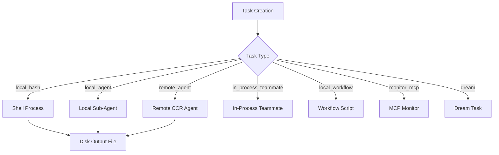

# Task Framework

> **Consolidated from lifecycle deep analysis** — Includes complete task type state machines, eviction logic, DreamTask lock mechanics, notification delivery, and foreground-to-background transition. L-12 (TaskHandle type), L-13 (createTaskStateBase factory) verified against `src/Task.ts`.

> 7 task types, lifecycle states, disk output, task management infrastructure, and detailed state machine behavior.

## Architecture Overview

The task framework manages background and foreground work units. Each task type represents a different execution model, from local shell commands to remote cloud agents.



## Task Types (`src/Task.ts`)

Seven task types are defined:

| Type | ID Prefix | Description |
|------|-----------|-------------|
| `local_bash` | `b` | Shell command execution |
| `local_agent` | `a` | Local Claude sub-agent |
| `remote_agent` | `r` | Remote CCR cloud agent |
| `in_process_teammate` | `t` | In-process team member |
| `local_workflow` | `w` | Workflow script execution |
| `monitor_mcp` | `m` | MCP server monitoring |
| `dream` | `d` | Dream/background thinking task |

## Task State Machine

### TaskStatus

```
pending → running → completed
                  → failed
                  → killed
```

Terminal states (no further transitions): `completed`, `failed`, `killed`.

```typescript
function isTerminalTaskStatus(status: TaskStatus): boolean {
  return status === 'completed' || status === 'failed' || status === 'killed'
}
```

### TaskStateBase (`src/Task.ts:44`)

Every task shares a common state structure:

```typescript
type TaskStateBase = {
  id: string              // Prefixed ID (e.g., "b1a2b3c4d5")
  type: TaskType
  status: TaskStatus
  description: string
  toolUseId?: string      // Triggering tool use
  startTime: number
  endTime?: number
  totalPausedMs?: number
  outputFile: string      // Disk output path
  outputOffset: number    // Read cursor position
  notified: boolean       // User notified of completion
}
```

### `createTaskStateBase()` Factory (`src/Task.ts:108`)

Factory function that creates a properly initialized `TaskStateBase` with default values:

```typescript
function createTaskStateBase(
  id: string,
  type: TaskType,
  description: string,
  toolUseId?: string,
): TaskStateBase {
  return {
    id,
    type,
    status: 'pending',           // always starts pending
    description,
    toolUseId,
    startTime: Date.now(),       // timestamp at creation
    outputFile: getTaskOutputPath(id),  // disk path via diskOutput.ts
    outputOffset: 0,             // read cursor starts at 0
    notified: false,             // not yet notified
  }
}
```

This is the canonical way to create task state. It ensures:
- Status always starts as `'pending'`
- `startTime` is set to current timestamp
- `outputFile` is derived from the task ID via `getTaskOutputPath()`
- `outputOffset` and `notified` are zero-initialized

### TaskHandle Type (`src/Task.ts:31`)

Lightweight handle returned after task creation, used for cleanup tracking:

```typescript
type TaskHandle = {
  taskId: string        // The generated task ID
  cleanup?: () => void  // Optional cleanup callback
}
```

`TaskHandle` provides a minimal reference to a spawned task. The optional `cleanup` callback allows callers to register teardown logic (e.g., closing file handles, removing listeners) that runs when the task is disposed. This separates task identity from task lifecycle management — callers hold a handle without needing the full `TaskStateBase`.

### Task ID Generation (`src/Task.ts:98`)

IDs use a type prefix + 8 random alphanumeric characters:

```typescript
function generateTaskId(type: TaskType): string {
  const prefix = getTaskIdPrefix(type) // 'b', 'a', 'r', 't', 'w', 'm', 'd'
  const bytes = randomBytes(8)
  let id = prefix
  for (let i = 0; i < 8; i++) {
    id += TASK_ID_ALPHABET[bytes[i] % TASK_ID_ALPHABET.length]
  }
  return id
}
```

The `TASK_ID_ALPHABET` uses digits + lowercase (`0-9a-z`) — 36^8 = 2.8 trillion combinations, sufficient to resist brute-force symlink attacks.

## Task Interface (`src/Task.ts:72`)

```typescript
type Task = {
  name: string
  type: TaskType
  kill(taskId: string, setAppState: SetAppState): Promise<void>
}
```

Only `kill()` is dispatched polymorphically. Spawn and render were removed in PR #22546 — each task type handles its own creation.

## Task Registry (`src/tasks.ts`)

```typescript
function getAllTasks(): Task[] {
  return [
    LocalShellTask,
    LocalAgentTask,
    RemoteAgentTask,
    DreamTask,
    ...(LocalWorkflowTask ? [LocalWorkflowTask] : []),
    ...(MonitorMcpTask ? [MonitorMcpTask] : []),
  ]
}

function getTaskByType(type: TaskType): Task | undefined {
  return getAllTasks().find(t => t.type === type)
}
```

Feature-gated tasks: `LocalWorkflowTask` (`WORKFLOW_SCRIPTS`), `MonitorMcpTask` (`MONITOR_TOOL`).

---

## Detailed Task Type State Machines

### LocalAgentTask (Background Agent)

```
                    +----------------+
                    |   RUNNING      | <-- registerAsyncAgent() or registerAgentForeground()
                    |                |     isBackgrounded: true|false
                    +-------+--------+
                            |
               +------------+------------+
               |            |            |
               v            v            v
      +------------+ +-----------+ +---------+
      | COMPLETED  | |  FAILED   | | KILLED  |
      +------------+ +-----------+ +---------+

Transitions:
  running -> completed: completeAgentTask(result) -- sets endTime, evictAfter=now+30s
  running -> failed:    failAgentTask(error) -- sets endTime, evictAfter=now+30s
  running -> killed:    killAsyncAgent() -- abortController.abort(), evictAfter=now+30s
  
All terminal transitions:
  - unregisterCleanup() called
  - selectedAgent cleared (GC eligibility)
  - abortController cleared
  - evictTaskOutput(taskId) called (async, fire-and-forget)
  - evictAfter: undefined if task.retain=true, else Date.now() + PANEL_GRACE_MS (30s)
```

### LocalShellTask (Background Bash)

```
                    +----------------+
                    |   RUNNING      | <-- spawnShellTask() or registerForeground()
                    |                |     isBackgrounded: true|false
                    +-------+--------+
                            |
               +------------+------------+
               |            |            |
               v            v            v
      +------------+ +-----------+ +---------+
      | COMPLETED  | |  FAILED   | | KILLED  |
      | code === 0 | | code != 0 | |         |
      +------------+ +-----------+ +---------+

Transitions:
  running -> completed: shellCommand.result resolves with code=0
  running -> failed:    shellCommand.result resolves with code!=0
  running -> killed:    killTask() -- sends SIGTERM, marks killed in state
  
Key difference from agent: shell status derived from exit code, not explicit call.
```

### InProcessTeammateTask

```
                    +----------------+
                    |   RUNNING      | <-- registerInProcessTeammate()
                    |   isIdle:      |
                    |   true/false   |
                    +-------+--------+
                            |
               +------------+------------+
               |            |            |
               v            v            v
      +------------+ +-----------+ +---------+
      | COMPLETED  | |  FAILED   | | KILLED  |
      +------------+ +-----------+ +---------+

Sub-states while RUNNING:
  isIdle=true:  waiting for work (leader assigns via pendingUserMessages)
  isIdle=false: actively processing a turn
  awaitingPlanApproval=true: plan submitted, waiting for user approval
  shutdownRequested=true: graceful shutdown requested, will complete current work

Kill: killInProcessTeammate() -- invokes abort on both:
  - abortController (kills WHOLE teammate permanently)
  - currentWorkAbortController (aborts current turn only)
```

### DreamTask (Memory Consolidation)

```
                    +----------------+
                    |   RUNNING      | <-- registerDreamTask()
                    | phase:         |
                    |  'starting'    |
                    |  'updating'    |
                    +-------+--------+
                            |
               +------------+------------+
               |            |            |
               v            v            v
      +------------+ +-----------+ +---------+
      | COMPLETED  | |  FAILED   | | KILLED  |
      | notified:  | | notified: | | notified|
      | true       | | true      | | true    |
      +------------+ +-----------+ +---------+

Phase transitions:
  'starting' -> 'updating': first Edit/Write tool_use detected via addDreamTurn()

Kill special behavior:
  - Captures priorMtime from task state
  - Calls rollbackConsolidationLock(priorMtime) to rewind lock
  - This allows the next session to retry consolidation

All terminal states set notified=true immediately (dream has no model-facing
notification path -- the inline appendSystemMessage IS the user surface).
```

---

## DreamTask Consolidation Lock and Rollback

### Lock Mechanism
The consolidation lock is a **file-based lock** at `<autoMemPath>/.consolidate-lock`:
- **Body**: holder's PID (for liveness check)
- **mtime**: timestamp of last consolidation (`lastConsolidatedAt`)
- **Stale threshold**: 60 minutes (`HOLDER_STALE_MS`)

### Acquire Protocol
```
tryAcquireConsolidationLock()
|
+-- stat + readFile the lock (parallel)
+-- If lock exists AND mtime < 60min ago:
|   +-- If holder PID is alive -> return null (blocked)
|   +-- If holder PID is dead -> reclaim (fall through)
+-- mkdir -p autoMemPath (may not exist yet)
+-- writeFile(lock, process.pid)
+-- Re-read and verify PID matches (race guard)
|   +-- Match -> return priorMtime (success)
|   +-- Mismatch -> return null (lost race)
+-- No prior lock -> return 0
```

### Rollback Protocol
```
rollbackConsolidationLock(priorMtime)
|
+-- priorMtime === 0 -> unlink lock file (restore no-file state)
+-- priorMtime > 0:
    +-- writeFile(lock, '') -- clear PID body
    +-- utimes(lock, priorMtime) -- rewind mtime to pre-acquire
```

### DreamTask Integration
```
registerDreamTask(priorMtime, abortController)
  +-- stores priorMtime in task state

DreamTask.kill(taskId):
  1. abortController.abort()
  2. status -> 'killed'
  3. rollbackConsolidationLock(priorMtime) -- next session can retry

completeDreamTask(taskId):
  - Lock mtime stays at current (consolidation succeeded)
  - No rollback needed

failDreamTask(taskId):
  - Note: NO automatic rollback on failure
  - The autoDream.ts caller handles rollback in its catch block
```

---

## Foreground-to-Background Transition

The transition is implemented as a **Promise.race** pattern in the sync agent execution loop:

### Registration
```typescript
const registration = registerAgentForeground({
  agentId, description, prompt, selectedAgent, setAppState,
  autoBackgroundMs: 120_000  // from getAutoBackgroundMs()
});
// Returns: { taskId, backgroundSignal: Promise<void>, cancelAutoBackground }
```

### Race Loop
```typescript
while (true) {
  const nextMessagePromise = agentIterator.next();
  const raceResult = await Promise.race([
    nextMessagePromise.then(r => ({type: 'message', result: r})),
    backgroundPromise  // resolves to {type: 'background'}
  ]);
  
  if (raceResult.type === 'background') {
    // 1. Stop foreground summarization
    // 2. agentIterator.return() with 1s timeout (triggers cleanup)
    // 3. Re-create progress tracker from existing agentMessages
    // 4. Spawn NEW runAgent(isAsync=true) with same params
    // 5. Return {status: 'async_launched'} to unblock parent
  }
}
```

### Background Signal Sources
| Source | Mechanism |
|--------|-----------|
| User Ctrl+B | `backgroundAll()` -> `backgroundAgentTask()` -> resolves signal |
| Auto-timer | `setTimeout(autoBackgroundMs)` -> sets `isBackgrounded=true` -> resolves signal |

### Critical Detail
The transition re-spawns the agent via a **new** `runAgent()` call. The old iterator is `.return()`-ed (triggers the finally cleanup block), and a fresh query loop begins with `isAsync=true`. Existing `agentMessages` are replayed into a new progress tracker to maintain continuity.

---

## Notification and Eviction Logic

### Notification Delivery
```
Agent/Shell completes/fails/killed
|
+-- Atomically check-and-set task.notified flag (prevents duplicates)
+-- Abort any active speculation (stale speculated results)
+-- Build XML notification message:
|   <task_notification>
|     <task_id>...</task_id>
|     <tool_use_id>...</tool_use_id>     (optional)
|     <output_file>...</output_file>
|     <status>completed|failed|killed</status>
|     <summary>Agent "desc" completed</summary>
|     <result>...</result>               (optional, agent only)
|     <usage>...</usage>                 (optional, agent only)
|     <worktree>...</worktree>           (optional)
|   </task_notification>
|
+-- enqueuePendingNotification({value, mode: 'task-notification', priority})
    - Agent notifications: priority = default (undefined)
    - Shell notifications: priority = 'next' (for monitors) or 'later'
```

### Eviction Pipeline
```
Terminal transition fires
|
+-- Set evictAfter:
|   +-- task.retain === true -> undefined (never auto-evict)
|   +-- task.retain === false -> Date.now() + PANEL_GRACE_MS (30,000ms)
|
+-- Fire-and-forget: evictTaskOutput(taskId)
|   (cleans up disk output symlink)
|
+-- Eviction sweep (periodic):
    Task is GC-eligible when:
    - status is terminal (completed|failed|killed)
    - notified === true
    - evictAfter !== undefined AND Date.now() > evictAfter
    - retain === false
```

### The `retain` Flag
- Set by `enterTeammateView()` when user zooms into a task panel
- Blocks eviction and enables stream-append + disk bootstrap
- Separate from `viewingAgentTaskId` ("what am I looking at") -- retain is "what am I holding"
- Cleared on unselect, which sets `evictAfter` to allow GC

---

## Inter-Agent Message Delivery Timing

### SendMessage Queue (LocalAgentTask)
```typescript
// Enqueue
queuePendingMessage(taskId, msg, setAppState)
  // pushes to task.pendingMessages[]

// Drain -- called at tool-round boundaries in the query loop
drainPendingMessages(taskId, getAppState, setAppState)
  // atomically reads and clears task.pendingMessages[]
  // returns string[] to be injected as user messages in next turn
```

**Timing**: Messages queued via `SendMessage` are NOT delivered mid-tool-execution. They are drained at **tool-round boundaries** -- the gap between one assistant response being fully processed and the next API call being made.

### InProcessTeammate Message Queue
```typescript
// Inject from UI or leader
injectUserMessageToTeammate(taskId, message, setAppState)
  // pushes to task.pendingUserMessages[]
  // also appends to task.messages[] (immediate UI display)
  
// Allowed states: running OR idle (not terminal)
```

**Timing**: User-injected messages are delivered when the teammate finishes its current turn and checks its `pendingUserMessages` queue. If the teammate is idle, the message triggers a new processing turn.

---

## Task Type Details

### LocalShellTask (`src/tasks/LocalShellTask/`)

Shell command execution in background:
- `spawnShellTask()`: Spawn child process with output capture
- `registerForeground()` / `unregisterForeground()`: UI integration
- `backgroundExistingForegroundTask()`: Move foreground task to background
- `markTaskNotified()`: Track user notification state

### LocalAgentTask (`src/tasks/LocalAgentTask/`)

Local Claude sub-agent execution -- the most complex task type:
- `registerAsyncAgent()` / `registerAgentForeground()`: Registration
- `completeAgentTask()` / `failAgentTask()` / `killAsyncAgent()`: Terminal states
- `enqueueAgentNotification()`: Notify on completion
- `createProgressTracker()`: Token and message tracking
- `updateProgressFromMessage()`: Live progress updates
- `getProgressUpdate()` / `getTokenCountFromTracker()`: Progress queries
- `createActivityDescriptionResolver()`: Activity descriptions for UI spinners
- `queuePendingMessage()`: Queue messages for async agents

### RemoteAgentTask (`src/tasks/RemoteAgentTask/`)

Remote CCR (Claude Code Remote) execution:
- `checkRemoteAgentEligibility()`: Verify cloud capability
- `registerRemoteAgentTask()`: Register with CCR service
- `getRemoteTaskSessionUrl()`: Get monitoring URL
- `formatPreconditionError()`: Human-readable eligibility errors

### DreamTask (`src/tasks/DreamTask/`)

Background memory consolidation:
- File-based PID lock with mtime-as-timestamp
- Rollback on kill (allows next session retry)
- Phase transitions: `starting` -> `updating` (first Edit/Write detected)
- No automatic rollback on failure (caller handles)

### InProcessTeammateTask

In-process team member running in same Node.js process:
- AsyncLocalStorage-based context isolation
- 50-message UI transcript cap (`TEAMMATE_MESSAGES_UI_CAP`)
- Shutdown protocol: graceful (flag between turns) or hard kill (immediate abort)
- Plan approval flow with `awaitingPlanApproval` gate

### LocalWorkflowTask (feature-gated: `WORKFLOW_SCRIPTS`)

Script-based workflow execution with step-by-step progress tracking.

### MonitorMcpTask (feature-gated: `MONITOR_TOOL`)

MCP server health monitoring with status change reporting.

## Disk Output (`src/utils/task/`)

### Output Path (`diskOutput.ts`)

```typescript
function getTaskOutputPath(taskId: string): string
// Returns path in session's task output directory
```

### TaskOutput Class (`TaskOutput.ts`)

Manages streaming output to disk:
- Append-only writes for crash safety
- Offset tracking for incremental reads
- Automatic directory creation via `ensureTasksDir()`

### Output Reading via TaskOutputTool

The `TaskOutputTool` reads task output for the model:
- Reads from `outputOffset` for new content only
- Updates offset after read
- Handles both completed and in-progress tasks

## Task Management Tools

| Tool | Purpose |
|------|---------|
| `TaskCreateTool` | Create structured tasks (TodoV2) |
| `TaskGetTool` | Get task details and output |
| `TaskUpdateTool` | Update task status |
| `TaskListTool` | List all tasks with filtering |
| `TaskStopTool` | Kill running tasks |
| `TaskOutputTool` | Read background task output |

## Task Context

```typescript
type TaskContext = {
  abortController: AbortController
  getAppState: () => AppState
  setAppState: SetAppState
}

type LocalShellSpawnInput = {
  command: string
  description: string
  timeout?: number
  toolUseId?: string
  agentId?: AgentId
  kind?: 'bash' | 'monitor'  // UI display variant
}
```

## Key Source Files

| File | Purpose |
|------|---------|
| `src/Task.ts` | Task types, state, ID generation, `TaskHandle`, `createTaskStateBase()` |
| `src/tasks.ts` | Task registry (`getAllTasks`, `getTaskByType`) |
| `src/tasks/LocalShellTask/` | Shell task implementation |
| `src/tasks/LocalAgentTask/` | Agent task (most complex) |
| `src/tasks/RemoteAgentTask/` | Remote CCR execution |
| `src/tasks/DreamTask/` | Dream task with consolidation lock |
| `src/tasks/InProcessTeammateTask/` | In-process teammate with AsyncLocalStorage isolation |
| `src/utils/task/diskOutput.ts` | Output path management |
| `src/utils/task/TaskOutput.ts` | Streaming output class |
| `src/utils/tasks.ts` | Task directory and list utilities |

---

*Analysis based on source files verified 2026-04-01. All state machines, eviction logic, and lock mechanics verified against actual source code.*
