# Wave 14: Service Dependency Graph

> **Date**: 2026-04-01
> **Scope**: `src/services/` — 20 service directories + 15 standalone service files
> **Method**: Static import analysis of all `import ... from` statements identifying inter-service references

## Service Inventory

### 20 Service Directories
| # | Service | Path |
|---|---------|------|
| 1 | AgentSummary | `services/AgentSummary/` |
| 2 | analytics | `services/analytics/` |
| 3 | api | `services/api/` |
| 4 | autoDream | `services/autoDream/` |
| 5 | compact | `services/compact/` |
| 6 | extractMemories | `services/extractMemories/` |
| 7 | lsp | `services/lsp/` |
| 8 | MagicDocs | `services/MagicDocs/` |
| 9 | mcp | `services/mcp/` |
| 10 | oauth | `services/oauth/` |
| 11 | plugins | `services/plugins/` |
| 12 | policyLimits | `services/policyLimits/` |
| 13 | PromptSuggestion | `services/PromptSuggestion/` |
| 14 | remoteManagedSettings | `services/remoteManagedSettings/` |
| 15 | SessionMemory | `services/SessionMemory/` |
| 16 | settingsSync | `services/settingsSync/` |
| 17 | teamMemorySync | `services/teamMemorySync/` |
| 18 | tips | `services/tips/` |
| 19 | tools | `services/tools/` |
| 20 | toolUseSummary | `services/toolUseSummary/` |

### 15 Standalone Service Files
| # | File | Logical Group |
|---|------|---------------|
| 21 | `claudeAiLimits.ts` | Rate limiting core |
| 22 | `claudeAiLimitsHook.ts` | Rate limiting hook |
| 23 | `diagnosticTracking.ts` | Diagnostics |
| 24 | `internalLogging.ts` | Internal logging |
| 25 | `mockRateLimits.ts` | Rate limit mocking |
| 26 | `rateLimitMessages.ts` | Rate limit messages |
| 27 | `rateLimitMocking.ts` | Rate limit mock control |
| 28 | `tokenEstimation.ts` | Token counting |
| 29 | `vcr.ts` | API recording/playback |
| 30 | `awaySummary.ts` | Away summary |
| 31 | `voice.ts` | Voice input |
| 32 | `voiceKeyterms.ts` | Voice key terms |
| 33 | `voiceStreamSTT.ts` | Voice STT streaming |
| 34 | `notifier.ts` | Notifications |
| 35 | `preventSleep.ts` | Sleep prevention |

---

## Dependency Matrix

### Inter-Service Dependencies (Service → Depends On)

| Source Service | Depends On (other services) |
|---|---|
| **AgentSummary** | *(none)* |
| **analytics** | mcp (officialRegistry), oauth (client) |
| **api** | analytics (growthbook, index, metadata), claudeAiLimits, compact (apiMicrocompact, microCompact), lsp (manager), mcp (utils), oauth (types, client), rateLimitMocking, vcr |
| **autoDream** | analytics (growthbook, index), extractMemories |
| **compact** | analytics (growthbook, index), api (claude, errors, promptCacheBreakDetection, withRetry), internalLogging, SessionMemory (prompts, sessionMemoryUtils), tokenEstimation |
| **extractMemories** | analytics (growthbook, index, metadata) |
| **lsp** | diagnosticTracking |
| **MagicDocs** | *(none)* |
| **mcp** | analytics (growthbook, index) |
| **oauth** | analytics (index) |
| **plugins** | analytics (index) |
| **policyLimits** | api (withRetry) |
| **PromptSuggestion** | analytics (growthbook, index), claudeAiLimits |
| **remoteManagedSettings** | analytics (index), api (withRetry) |
| **SessionMemory** | analytics (growthbook, index), compact (autoCompact), tokenEstimation |
| **settingsSync** | analytics (growthbook, index), api (withRetry) |
| **teamMemorySync** | analytics (index, metadata), api (withRetry) |
| **tips** | analytics (growthbook), api (overageCreditGrant, referral) |
| **tools** | analytics (index, metadata), mcp (client, mcpStringUtils, normalization, types, utils) |
| **toolUseSummary** | api (claude) |
| **claudeAiLimits** | analytics (index), api (claude, client), rateLimitMocking, rateLimitMessages |
| **claudeAiLimitsHook** | claudeAiLimits |
| **diagnosticTracking** | mcp (client, types) |
| **internalLogging** | analytics (index) |
| **mockRateLimits** | oauth (types) |
| **rateLimitMessages** | claudeAiLimits |
| **rateLimitMocking** | mockRateLimits |
| **tokenEstimation** | api (claude, client), vcr |
| **vcr** | *(none — only external/utils deps)* |
| **awaySummary** | api (claude), SessionMemory (sessionMemoryUtils) |
| **voice** | *(none — only utils deps)* |
| **voiceKeyterms** | *(none — only utils/bootstrap deps)* |
| **voiceStreamSTT** | *(none — only utils deps)* |
| **notifier** | *(none — only utils deps)* |
| **preventSleep** | *(none — only utils deps)* |

### Reverse Dependencies (Service → Depended By)

| Service | Depended By |
|---|---|
| **analytics** | api, autoDream, compact, extractMemories, internalLogging, mcp, oauth, plugins, policyLimits (indirect via api), PromptSuggestion, remoteManagedSettings, SessionMemory, settingsSync, teamMemorySync, tips, tools, claudeAiLimits |
| **api** | claudeAiLimits, compact, policyLimits, remoteManagedSettings, settingsSync, teamMemorySync, tips, tokenEstimation, toolUseSummary, awaySummary |
| **mcp** | analytics, diagnosticTracking, tools |
| **oauth** | analytics, api, mockRateLimits |
| **compact** | api, SessionMemory |
| **SessionMemory** | compact, awaySummary |
| **claudeAiLimits** | api, claudeAiLimitsHook, PromptSuggestion, rateLimitMessages |
| **tokenEstimation** | compact, SessionMemory |
| **extractMemories** | autoDream |
| **lsp** | api |
| **diagnosticTracking** | lsp |
| **rateLimitMocking** | api, claudeAiLimits |
| **mockRateLimits** | rateLimitMocking |
| **rateLimitMessages** | claudeAiLimits |
| **vcr** | api, tokenEstimation |
| **internalLogging** | compact |

---

## External Dependency Summary (non-service)

| External Dependency | Used By (count) |
|---|---|
| `utils/` | ALL services (35/35) |
| `bootstrap/state.ts` | api, autoDream, compact, extractMemories, mcp, plugins, PromptSuggestion, remoteManagedSettings, SessionMemory, settingsSync, tools, claudeAiLimits, voiceKeyterms |
| `tools/` (tool definitions) | autoDream, compact, extractMemories, MagicDocs, mcp, PromptSuggestion, SessionMemory, tips, tools |
| `constants/` | api, mcp, oauth, policyLimits, remoteManagedSettings, settingsSync, teamMemorySync, compact, tips, toolUseSummary |
| `types/` | Most services |

---

## Mermaid Dependency Diagram

```mermaid
graph TD
    subgraph "Core Infrastructure Services"
        analytics["analytics<br/>(17 dependents)"]
        api["api<br/>(10 dependents)"]
        mcp["mcp<br/>(3 dependents)"]
        oauth["oauth<br/>(3 dependents)"]
    end

    subgraph "Rate Limiting Cluster"
        claudeAiLimits["claudeAiLimits"]
        claudeAiLimitsHook["claudeAiLimitsHook"]
        rateLimitMocking["rateLimitMocking"]
        rateLimitMessages["rateLimitMessages"]
        mockRateLimits["mockRateLimits"]
    end

    subgraph "Context Management"
        compact["compact"]
        SessionMemory["SessionMemory"]
        tokenEstimation["tokenEstimation"]
    end

    subgraph "Memory & Learning"
        extractMemories["extractMemories"]
        autoDream["autoDream"]
        MagicDocs["MagicDocs"]
    end

    subgraph "Sync Services"
        settingsSync["settingsSync"]
        remoteManagedSettings["remoteManagedSettings"]
        teamMemorySync["teamMemorySync"]
    end

    subgraph "Tool Orchestration"
        tools["tools"]
        toolUseSummary["toolUseSummary"]
    end

    subgraph "Standalone Services"
        lsp["lsp"]
        plugins["plugins"]
        policyLimits["policyLimits"]
        PromptSuggestion["PromptSuggestion"]
        tips["tips"]
        AgentSummary["AgentSummary"]
        diagnosticTracking["diagnosticTracking"]
        internalLogging["internalLogging"]
        vcr["vcr"]
        awaySummary["awaySummary"]
    end

    %% Core dependencies
    api --> analytics
    api --> claudeAiLimits
    api --> compact
    api --> lsp
    api --> mcp
    api --> oauth
    api --> rateLimitMocking
    api --> vcr

    %% Rate limiting cluster
    claudeAiLimits --> analytics
    claudeAiLimits --> api
    claudeAiLimits --> rateLimitMocking
    claudeAiLimits --> rateLimitMessages
    claudeAiLimitsHook --> claudeAiLimits
    rateLimitMocking --> mockRateLimits
    mockRateLimits --> oauth
    rateLimitMessages --> claudeAiLimits

    %% Context management
    compact --> analytics
    compact --> api
    compact --> internalLogging
    compact --> SessionMemory
    compact --> tokenEstimation
    SessionMemory --> analytics
    SessionMemory --> compact
    SessionMemory --> tokenEstimation
    tokenEstimation --> api
    tokenEstimation --> vcr

    %% Memory & learning
    autoDream --> analytics
    autoDream --> extractMemories
    extractMemories --> analytics

    %% Tool orchestration
    tools --> analytics
    tools --> mcp
    toolUseSummary --> api

    %% Sync services
    settingsSync --> analytics
    settingsSync --> api
    remoteManagedSettings --> analytics
    remoteManagedSettings --> api
    teamMemorySync --> analytics
    teamMemorySync --> api

    %% Other services
    mcp --> analytics
    oauth --> analytics
    plugins --> analytics
    policyLimits --> api
    PromptSuggestion --> analytics
    PromptSuggestion --> claudeAiLimits
    tips --> analytics
    tips --> api
    lsp --> diagnosticTracking
    diagnosticTracking --> mcp
    internalLogging --> analytics
    awaySummary --> api
    awaySummary --> SessionMemory

    %% Style
    classDef core fill:#ff9999,stroke:#333
    classDef rateLimit fill:#ffcc99,stroke:#333
    classDef context fill:#99ccff,stroke:#333
    classDef memory fill:#99ff99,stroke:#333
    classDef sync fill:#cc99ff,stroke:#333
    classDef toolOrch fill:#ffff99,stroke:#333

    class analytics,api,mcp,oauth core
    class claudeAiLimits,claudeAiLimitsHook,rateLimitMocking,rateLimitMessages,mockRateLimits rateLimit
    class compact,SessionMemory,tokenEstimation context
    class extractMemories,autoDream,MagicDocs memory
    class settingsSync,remoteManagedSettings,teamMemorySync sync
    class tools,toolUseSummary toolOrch
```

---

## Circular Dependencies

### Direct Circular Dependencies Found

1. **api ↔ claudeAiLimits**
   - `api/claude.ts` → `claudeAiLimits` (imports `getAPIMetadata`)
   - `claudeAiLimits.ts` → `api/claude.ts`, `api/client.ts` (imports `getAPIMetadata`, `getAnthropicClient`)
   - **Severity**: HIGH — mutual dependency between core API and rate limiting

2. **api ↔ rateLimitMocking**
   - `api/errors.ts` → `rateLimitMocking` (imports `shouldProcessRateLimits`)
   - `api/withRetry.ts` → `rateLimitMocking` (imports rate limit mock functions)
   - `rateLimitMocking.ts` → `mockRateLimits.ts` → `oauth/types.js`
   - **Note**: Indirect circular since rateLimitMocking does not import api directly, but forms a tight coupling

3. **compact ↔ SessionMemory**
   - `compact/sessionMemoryCompact.ts` → `SessionMemory/prompts.js`, `SessionMemory/sessionMemoryUtils.js`
   - `compact/autoCompact.ts` → `SessionMemory/sessionMemoryUtils.js`
   - `SessionMemory/sessionMemory.ts` → `compact/autoCompact.js` (imports `isAutoCompactEnabled`)
   - **Severity**: MEDIUM — bidirectional dependency between compaction and session memory

4. **claudeAiLimits ↔ rateLimitMessages**
   - `claudeAiLimits.ts` → `rateLimitMessages.js` (imports limit message functions)
   - `rateLimitMessages.ts` → `claudeAiLimits.js` (imports `ClaudeAILimits` type)
   - **Severity**: LOW — type-level circular, likely resolved at runtime by JS module system

5. **lsp → diagnosticTracking → mcp** (chain, not circular)
   - This is a one-way chain but notable for its depth

### Indirect Circular Chains

6. **api → compact → api**
   - `api/claude.ts` → `compact/apiMicrocompact.js`, `compact/microCompact.js`
   - `compact/*.ts` → `api/claude.js`, `api/errors.js`, `api/promptCacheBreakDetection.js`, `api/withRetry.js`
   - **Severity**: HIGH — deep bidirectional coupling

7. **analytics → oauth → analytics** (potential)
   - `analytics/firstPartyEventLoggingExporter.ts` → `oauth/client.js` (imports `isOAuthTokenExpired`)
   - `oauth/index.ts` → `analytics/index.js` (imports `logEvent`)
   - `oauth/client.ts` → `analytics/index.js` (imports `logEvent`)
   - **Severity**: MEDIUM — analytics and auth are mutually dependent

8. **analytics → mcp → analytics**
   - `analytics/metadata.ts` → `mcp/officialRegistry.js` (imports `isOfficialMcpUrl`)
   - `mcp/client.ts`, `mcp/config.ts` → `analytics/index.js`
   - **Severity**: LOW — limited to metadata enrichment

---

## Key Observations

### Most Depended-On Services (by unique dependents)

| Rank | Service | Unique Dependents | Role |
|------|---------|------------------|------|
| 1 | **analytics** | 17 | Universal telemetry/feature-flagging hub |
| 2 | **api** | 10 | Central API client layer |
| 3 | **mcp** | 3 | MCP protocol client |
| 4 | **oauth** | 3 | Authentication provider |
| 5 | **claudeAiLimits** | 4 | Rate limit state management |
| 6 | **compact** | 2 | Context window management |
| 7 | **SessionMemory** | 2 | Session memory persistence |

### Most Dependent Services (highest outgoing dependency count)

| Rank | Service | Dependencies | Scope |
|------|---------|-------------|-------|
| 1 | **api** | 9 services | analytics, claudeAiLimits, compact, lsp, mcp, oauth, rateLimitMocking, vcr |
| 2 | **compact** | 5 services | analytics, api, internalLogging, SessionMemory, tokenEstimation |
| 3 | **claudeAiLimits** | 4 services | analytics, api, rateLimitMocking, rateLimitMessages |
| 4 | **tools** | 2 services | analytics, mcp |
| 5 | **tips** | 2 services | analytics, api |

### Isolated Services (no inter-service dependencies)

These services depend only on external modules (`utils/`, `tools/`, `bootstrap/`, `types/`):

- **AgentSummary** — only depends on utils, tools/AgentTool, types
- **MagicDocs** — only depends on utils, tools/AgentTool, tools/FileEditTool, tools/FileReadTool
- **vcr** — only depends on utils, types
- **voice** — only depends on utils
- **voiceKeyterms** — only depends on utils, bootstrap
- **voiceStreamSTT** — only depends on utils
- **notifier** — only depends on utils
- **preventSleep** — only depends on utils

### Architectural Patterns

1. **Hub-and-Spoke**: `analytics` is the universal hub — 17 of 35 service units depend on it. This makes sense as telemetry/feature-flagging is cross-cutting.

2. **Layered API Access**: Most services access the Anthropic API through `api/` service, which itself depends on `analytics` for logging and `compact` for context management.

3. **Rate Limiting Cluster**: Five tightly-coupled files form the rate limiting subsystem (`claudeAiLimits`, `claudeAiLimitsHook`, `rateLimitMessages`, `rateLimitMocking`, `mockRateLimits`), with multiple circular dependencies. Consider refactoring into a single `rateLimiting/` directory.

4. **Context Window Trio**: `compact`, `SessionMemory`, and `tokenEstimation` form a circular dependency cluster managing the context window lifecycle.

5. **Sync Service Pattern**: `settingsSync`, `remoteManagedSettings`, and `teamMemorySync` share identical dependency patterns (analytics + api/withRetry), suggesting a common sync abstraction could be extracted.

6. **Tool Integration Boundary**: `tools/` service bridges between the service layer and the `tools/` directory (tool definitions), importing both `analytics` and `mcp` services.

### Risk Assessment

| Risk | Services | Impact |
|------|----------|--------|
| **Circular dependency breakage** | api ↔ claudeAiLimits, compact ↔ SessionMemory | Module initialization order issues, potential runtime errors |
| **analytics as SPOF** | All 17 dependents | Analytics failure could cascade if not properly guarded |
| **Tight coupling in rate limiting** | 5 rate-limit files | Difficult to modify rate limiting behavior in isolation |
| **api service overload** | 9 dependencies | api is both highly depended-on AND highly dependent — a coupling bottleneck |

---

## Verification Notes

- **Method**: Grep-based static import analysis across all `.ts`/`.tsx` files in `src/services/`
- **Scope**: Only inter-service dependencies counted (imports from one service to another within `services/`)
- **Excluded**: External library imports, `utils/`, `types/`, `constants/`, `tools/` (tool definitions), `bootstrap/`, `hooks/`, `state/`, `components/`
- **Confidence**: HIGH — static import analysis is deterministic; runtime dynamic imports not captured
- **Wave**: 14 of Claude Code Source Study
